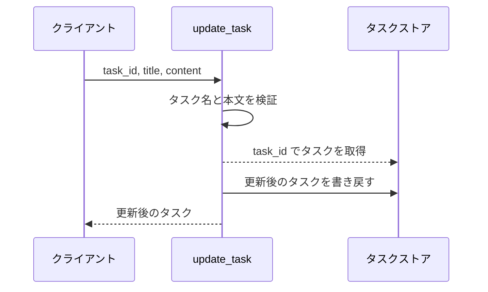
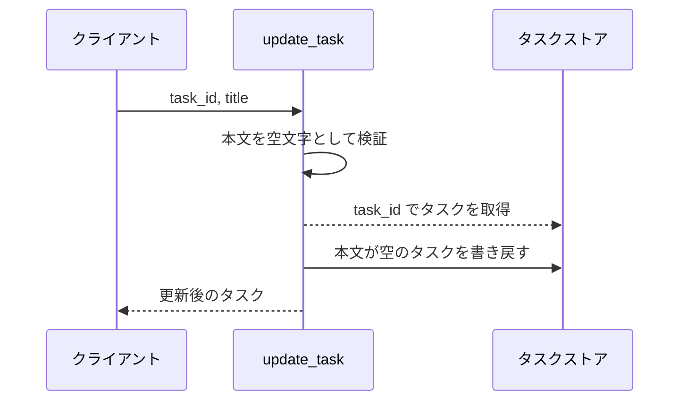
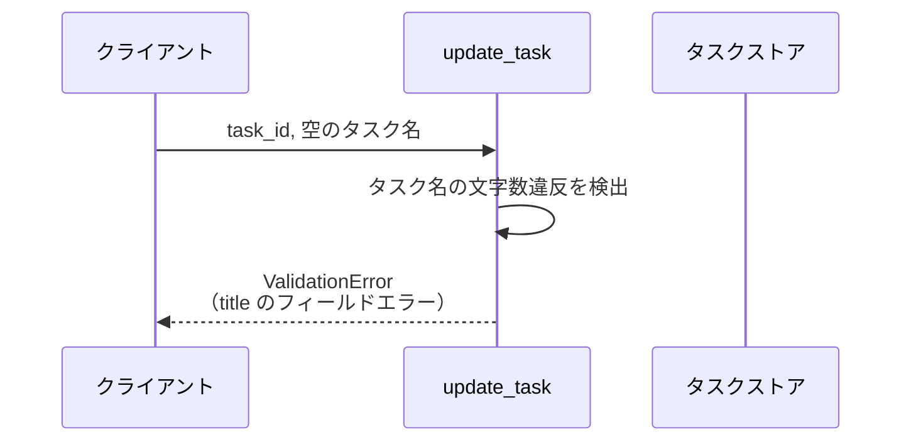
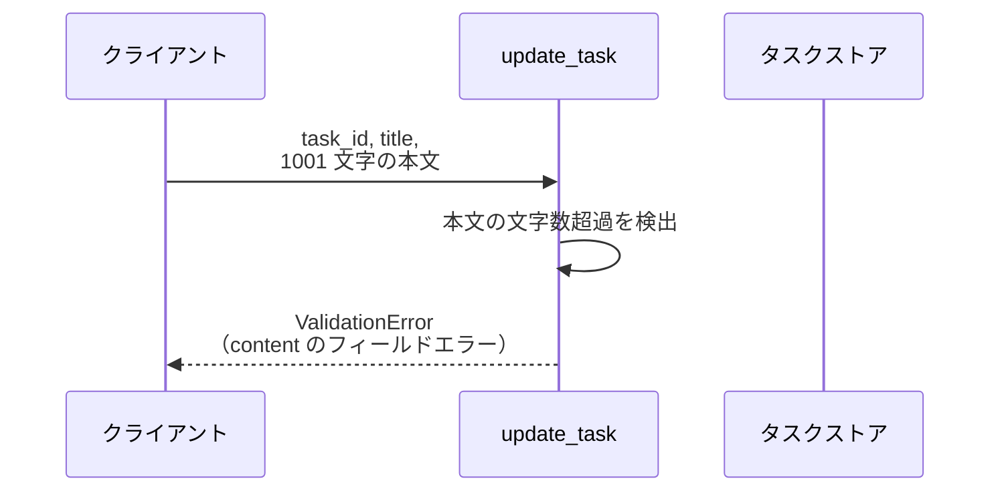
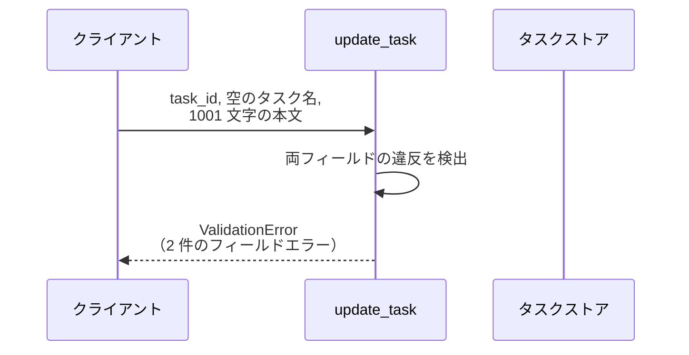
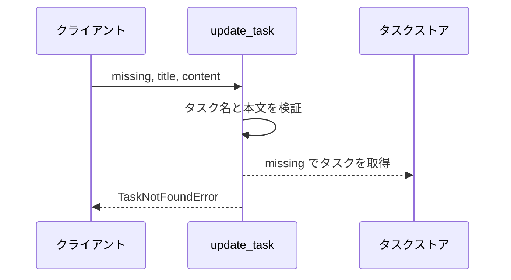

# タスク更新

操作: `update_task`（サービス層の公開関数）

登録済みタスクのタスク名と本文を検証し、ストアの内容を差し替えて更新後のタスクを返す。

- 対応テストファイル: 未記入

## インターフェース

### リクエスト

| パラメータ | 型 | 必須 | デフォルト | 説明 | 制限 | 補足 |
| --- | --- | --- | --- | --- | --- | --- |
| `store` | `dict[str, Task]` | ✅ | - | 更新対象を保持するタスクストア | - | プロセス内の dict をそのまま渡す |
| `task_id` | `str` | ✅ | - | 更新対象のタスク ID | - | ストアのキーと一致すること |
| `title` | `str` | ✅ | - | 更新後のタスク名 | 1 文字以上 100 文字以内 | - |
| `content` | `str` | - | `""` | 更新後の本文 | 1000 文字以内 | 省略すると本文が空になる |

リクエスト例:

```python
update_task(store, "t1", "新タイトル", "新本文")
```

### レスポンス

| フィールド | 型 | 説明 | 制限 | 補足 |
| --- | --- | --- | --- | --- |
| `id` | `str` | タスク ID | - | リクエストの `task_id` と同じ |
| `title` | `str` | 更新後のタスク名 | - | - |
| `content` | `str` | 更新後の本文 | - | 省略時は `""` |

レスポンス例:

```python
Task(id="t1", title="新タイトル", content="新本文")
```

### エラー

| エラー | 発生条件 | 補足 |
| --- | --- | --- |
| なし（正常終了） | 更新成功 | 戻り値はレスポンス表のとおり |
| `ValidationError` | タスク名が 1 文字未満 or 100 文字超 | `errors` に `title` のフィールドエラーが入る |
| `ValidationError` | 本文が 1000 文字超 | `errors` に `content` のフィールドエラーが入る |
| `ValidationError` | タスク名と本文の両方が制限に違反 | `errors` に 2 件のフィールドエラーが入る |
| `TaskNotFoundError` | 指定 ID のタスクがストアに未登録 | ストアは変更されない |

## 制約

| 項目 | 制約 | 補足 |
| --- | --- | --- |
| 応答時間 | 1 秒以内 | 親サブシステムの非機能要件 |
| 認可 | 制限なし | 認証機構が未導入のため呼び出し元を問わない |
| レート制限 | 制限なし | プロセス内の dict 操作のみで外部依存がないため |
| 検証の打ち切り | 打ち切らない（全フィールドを検証してから送出） | 違反を 1 回の呼び出しで全件返すため |
| 検証と存在確認の順序 | 入力値の検証 → タスクの存在確認 | 未登録 ID と入力違反が同時に起きた場合は `ValidationError` が優先される |

## フロー一覧

| 分類 | フロー名 | 概要 | 補足 |
| --- | --- | --- | --- |
| 正常 | 正常系 | タスク名と本文を検証して更新 | - |
| 正常 | 正常系（本文の省略時） | 本文を省略して空文字で更新 | - |
| 異常 | 異常系（タスク名の文字数違反・ValidationError） | タスク名が空 or 100 文字超で更新を拒否 | 単一 UC シナリオの異常シナリオに対応 |
| 異常 | 異常系（本文の文字数超過・ValidationError） | 本文が 1000 文字超で更新を拒否 | - |
| 異常 | 異常系（タスク名と本文の同時違反・ValidationError） | 違反したフィールドを全件まとめて返す | - |
| 異常 | 異常系（タスク未登録・TaskNotFoundError） | 未登録 ID の更新を拒否 | - |

## 正常系

### セットアップ

| セットアップ | 説明 | 補足 |
| --- | --- | --- |
| Mock | なし（プロセス内 dict のタスクストアを実操作） | 外部依存がないため差し替え対象がない |
| タスク | `t1` のタスクをストアに登録済み | タスク名 `旧タイトル` / 本文 `旧本文` |

### フロー



### 期待値

- 更新後のタスク名と本文を持つタスクが返る
- ストアの `t1` が更新後の内容に差し替わっている

## 正常系（本文の省略時）

### セットアップ

| セットアップ | 説明 | 補足 |
| --- | --- | --- |
| Mock | なし（プロセス内 dict のタスクストアを実操作） | - |
| タスク | `t1` のタスクをストアに登録済み | 本文 `旧本文` が入っている |
| 入力 | 本文を渡さずにタスク名だけを送る | デフォルト値の適用を決定的に誘発 |

### フロー



### 期待値

- 返るタスクの本文が `""` になっている
- ストアの `t1` の本文も `""` に差し替わっている

## 異常系（タスク名の文字数違反・ValidationError）

### セットアップ

| セットアップ | 説明 | 補足 |
| --- | --- | --- |
| Mock | なし（プロセス内 dict のタスクストアを実操作） | - |
| タスク | `t1` のタスクをストアに登録済み | - |
| 入力 | タスク名を空文字にして送る | 検証失敗を決定的に誘発 |

### フロー



### 期待値

- `ValidationError` が送出され、`errors` に `title` のフィールドエラーが 1 件入っている
- ストアの `t1` は更新前の内容のまま変わっていない

## 異常系（本文の文字数超過・ValidationError）

### セットアップ

| セットアップ | 説明 | 補足 |
| --- | --- | --- |
| Mock | なし（プロセス内 dict のタスクストアを実操作） | - |
| タスク | `t1` のタスクをストアに登録済み | - |
| 入力 | 有効なタスク名 + 1001 文字の本文を送る | 検証失敗を決定的に誘発 |

### フロー



### 期待値

- `ValidationError` が送出され、`errors` に `content` のフィールドエラーが 1 件入っている
- ストアの `t1` は更新前の内容のまま変わっていない

## 異常系（タスク名と本文の同時違反・ValidationError）

### セットアップ

| セットアップ | 説明 | 補足 |
| --- | --- | --- |
| Mock | なし（プロセス内 dict のタスクストアを実操作） | - |
| タスク | `t1` のタスクをストアに登録済み | - |
| 入力 | 空のタスク名 + 1001 文字の本文を送る | 2 フィールド同時の検証失敗を決定的に誘発 |

### フロー



### 期待値

- `ValidationError` が送出され、`errors` に `title` と `content` のフィールドエラーが 2 件入っている
- ストアの `t1` は更新前の内容のまま変わっていない

## 異常系（タスク未登録・TaskNotFoundError）

### セットアップ

| セットアップ | 説明 | 補足 |
| --- | --- | --- |
| Mock | なし（プロセス内 dict のタスクストアを実操作） | - |
| タスク | `t1` のタスクをストアに登録済み | - |
| 入力 | ストアに存在しない `missing` を task_id に指定 | 存在確認の失敗を決定的に誘発 |

### フロー



### 期待値

- `TaskNotFoundError` が送出される
- ストアに `missing` のタスクは追加されず、`t1` も変わっていない
