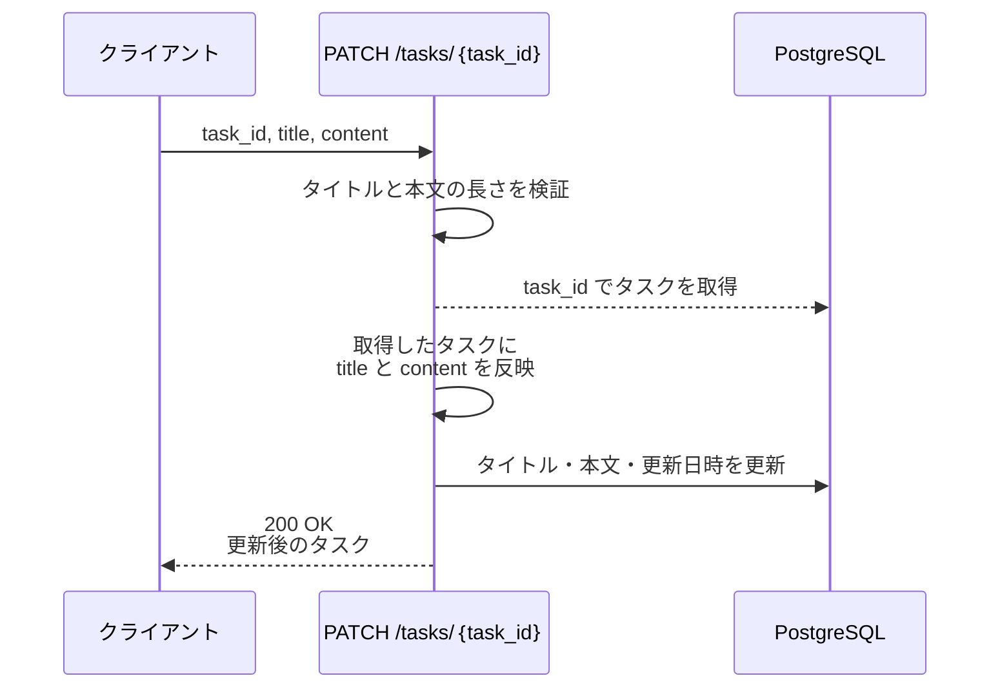
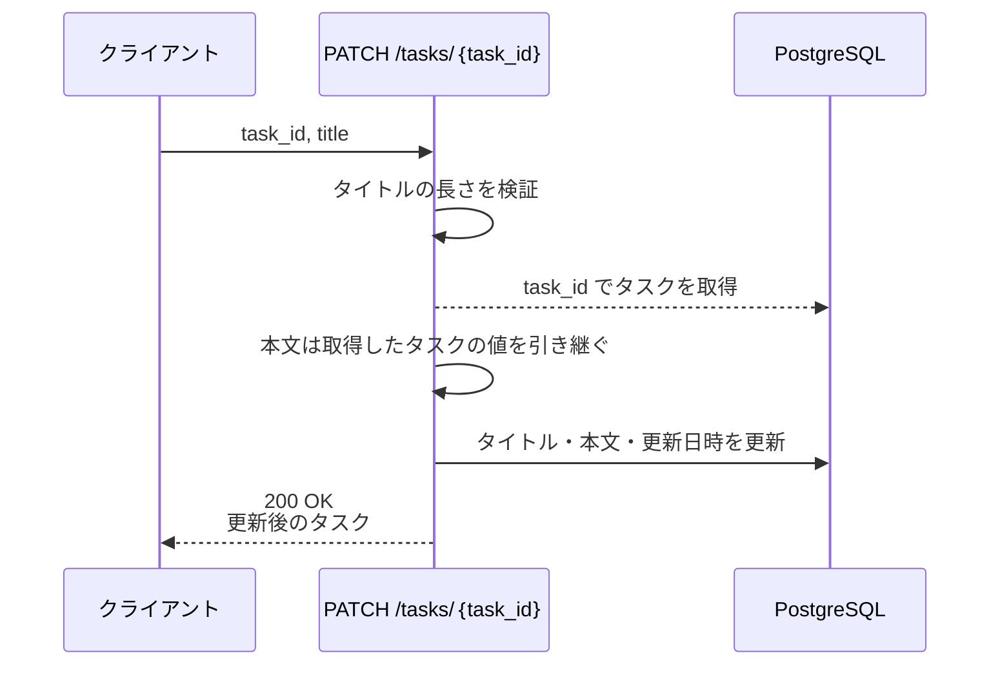
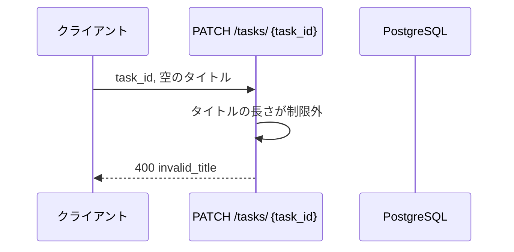
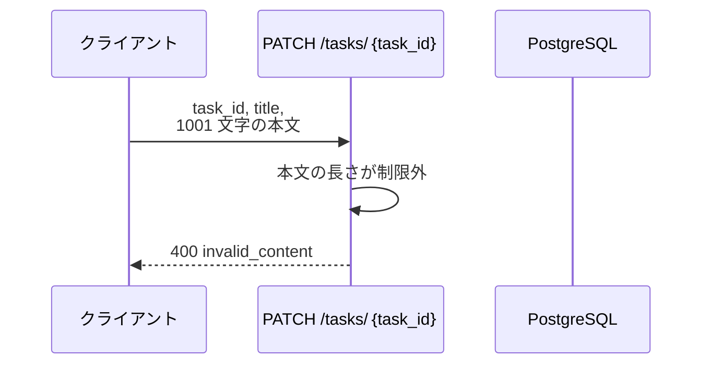
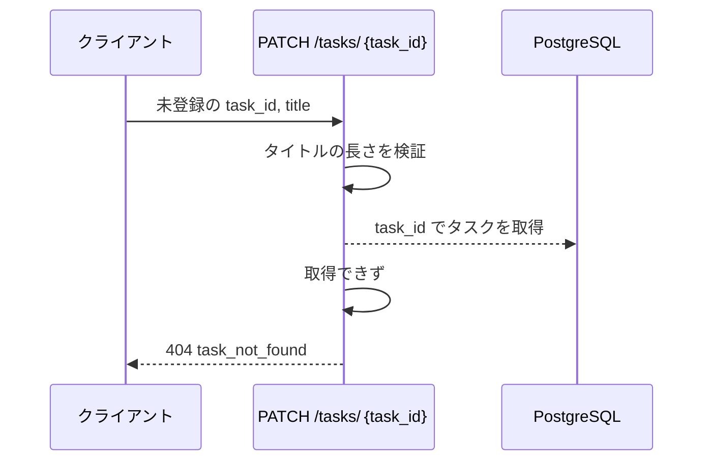

# タスク更新

エンドポイント: PATCH /tasks/{task_id}

登録済みタスクのタイトルと本文を更新し、更新後のタスクを返す。

- 対応テストファイル: -

## インターフェース

### リクエスト

| パラメータ | 型 | 必須 | デフォルト | 説明 | 制限 | 補足 |
| --- | --- | --- | --- | --- | --- | --- |
| `task_id` | str | ✅ | - | 更新対象のタスク ID | - | パスパラメータ。`tasks.id` の UUID |
| `title` | str | ✅ | - | 更新後のタイトル | 1 文字以上 100 文字以内 | 空白のみの文字列も文字数で数える |
| `content` | str | - | なし（更新前の本文を維持） | 更新後の本文 | 1000 文字以内 | 空文字を明示指定すると本文を消せる |

リクエスト例:

```json
{
  "title": "決算資料の作成",
  "content": "四半期の売上を集計する"
}
```

### レスポンス

| フィールド | 型 | 説明 | 制限 | 補足 |
| --- | --- | --- | --- | --- |
| `task` | object | 更新後のタスク | - | - |
| `task.id` | str | タスク ID | - | リクエストの `task_id` と一致する |
| `task.title` | str | 更新後のタイトル | - | - |
| `task.content` | str | 更新後の本文 | - | `content` 省略時は更新前の値 |
| `task.updated_at` | str | 更新日時（ISO 8601・UTC） | - | 今回の更新で詰め直した値 |

レスポンス例:

```json
{
  "task": {
    "id": "018f8a3c-1c2f-7a10-9f3d-2b6c9a51e0a4",
    "title": "決算資料の作成",
    "content": "四半期の売上を集計する",
    "updated_at": "2026-08-05T06:30:00Z"
  }
}
```

**補足:**
- 同じリクエストを繰り返しても `task.updated_at` 以外の結果は変わらない

### ステータスコード

| ステータスコード | 発生条件 | 補足 |
| --- | --- | --- |
| `200` | 更新成功 | - |
| `400` | リクエストのバリデーション失敗 | `title` / `content` が制限違反 |
| `404` | `task_id` のタスクが存在しない | - |

## 制約

| 項目 | 制約 | 補足 |
| --- | --- | --- |
| タイムアウト | 制限なし | 単一行の SELECT / UPDATE のみで長時間待ちが発生しない |
| 認可 | 制限なし | 認証機構を持たないため誰でも更新できる |
| レート制限 | 制限なし | - |
| 応答時間 | 1 秒以内 | Issue #1637 の非機能要件 |
| 更新対象カラム | `title` / `content` / `updated_at` のみ | `id` / `created_at` は更新しない |

## フロー一覧

| 分類 | フロー名 | 概要 | 補足 |
| --- | --- | --- | --- |
| 正常 | 正常系 | タイトルと本文を更新して更新後のタスクを返す | - |
| 正常 | 正常系（本文の省略時） | 更新前の本文を維持してタイトルだけ更新する | - |
| 異常 | 異常系（タイトルが制限外・400） | 空 or 100 文字超を検証で弾いて 400 を返す | - |
| 異常 | 異常系（本文が制限外・400） | 1000 文字超を検証で弾いて 400 を返す | - |
| 異常 | 異常系（タスクが存在しない・404） | 未登録の `task_id` で 404 を返す | - |

## 正常系

### セットアップ

| セットアップ | 説明 | 補足 |
| --- | --- | --- |
| Mock | `PostgreSQL` を DB stub に差し替え | - |
| タスク | `tasks` にタイトル・本文とも設定済みのタスクを 1 件登録 | 更新前後の差分を見るため |

### フロー



### 期待値

- `200` + 更新後のタスクが返る
- `tasks` の対象行がリクエストのタイトルと本文で置き換わり、`updated_at` が更新前より後の時刻になっている

## 正常系（本文の省略時）

### セットアップ

| セットアップ | 説明 | 補足 |
| --- | --- | --- |
| Mock | `PostgreSQL` を DB stub に差し替え | - |
| タスク | `tasks` に本文ありのタスクを 1 件登録 | 維持されることを確認するため |
| 入力 | `content` を省略して送信 | 本文維持の分岐を決定的に誘発 |

### フロー



### 期待値

- `200` + `task.content` が更新前の本文のまま返る
- `tasks` の対象行はタイトルと `updated_at` だけが置き換わっている

## 異常系（タイトルが制限外・400）

### セットアップ

| セットアップ | 説明 | 補足 |
| --- | --- | --- |
| Mock | `PostgreSQL` を DB stub に差し替え | - |
| タスク | `tasks` にタスクを 1 件登録済み | - |
| 入力 | `title` を空文字にして送信 | 検証失敗を決定的に誘発 |

### フロー



### 期待値

- `400` + `invalid_title` が返る
- `tasks` の対象行は更新されていない

## 異常系（本文が制限外・400）

### セットアップ

| セットアップ | 説明 | 補足 |
| --- | --- | --- |
| Mock | `PostgreSQL` を DB stub に差し替え | - |
| タスク | `tasks` にタスクを 1 件登録済み | - |
| 入力 | `content` に 1001 文字を入れて送信 | 検証失敗を決定的に誘発 |

### フロー



### 期待値

- `400` + `invalid_content` が返る
- `tasks` の対象行は更新されていない

## 異常系（タスクが存在しない・404）

### セットアップ

| セットアップ | 説明 | 補足 |
| --- | --- | --- |
| Mock | `PostgreSQL` を DB stub に差し替え | - |
| タスク | 登録なし | 取得失敗を決定的に誘発 |
| 入力 | 未登録の `task_id` で送信 | - |

### フロー



### 期待値

- `404` + `task_not_found` が返る
- `tasks` に新しい行は作られていない
