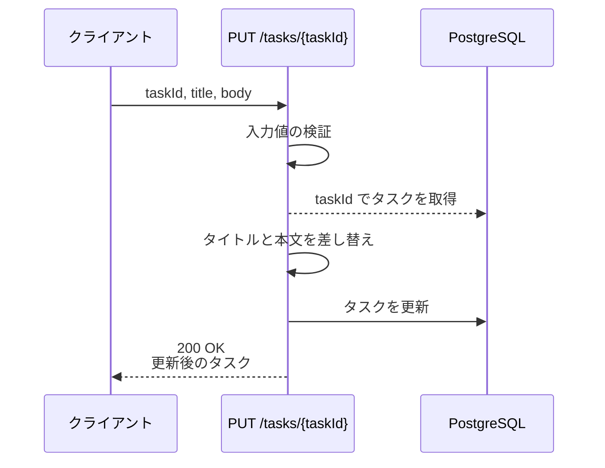
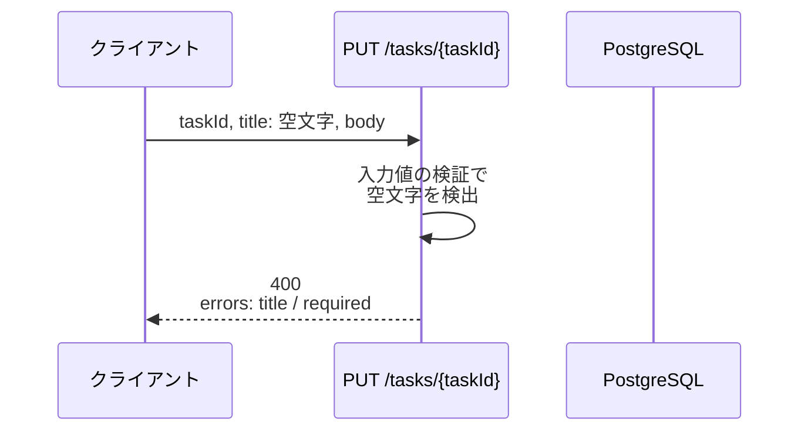
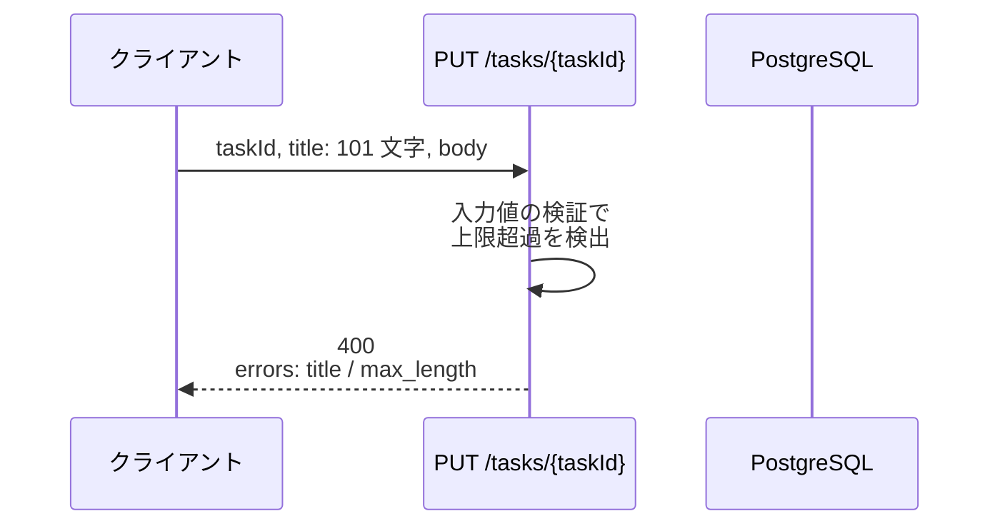
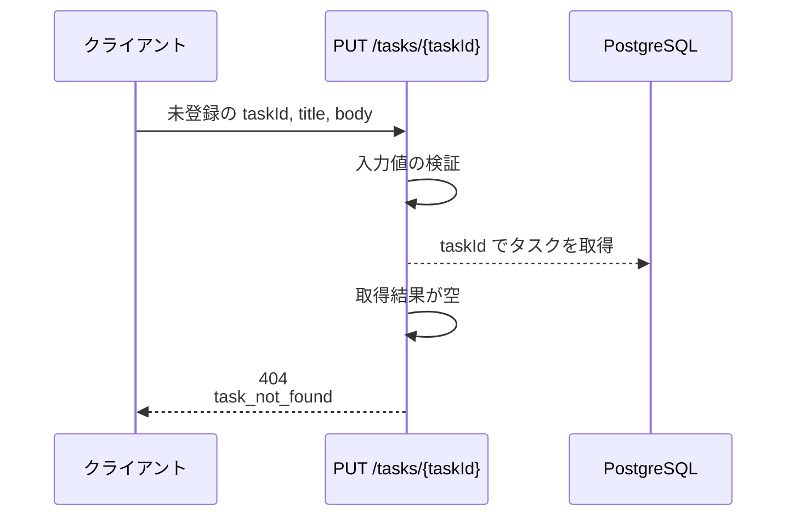
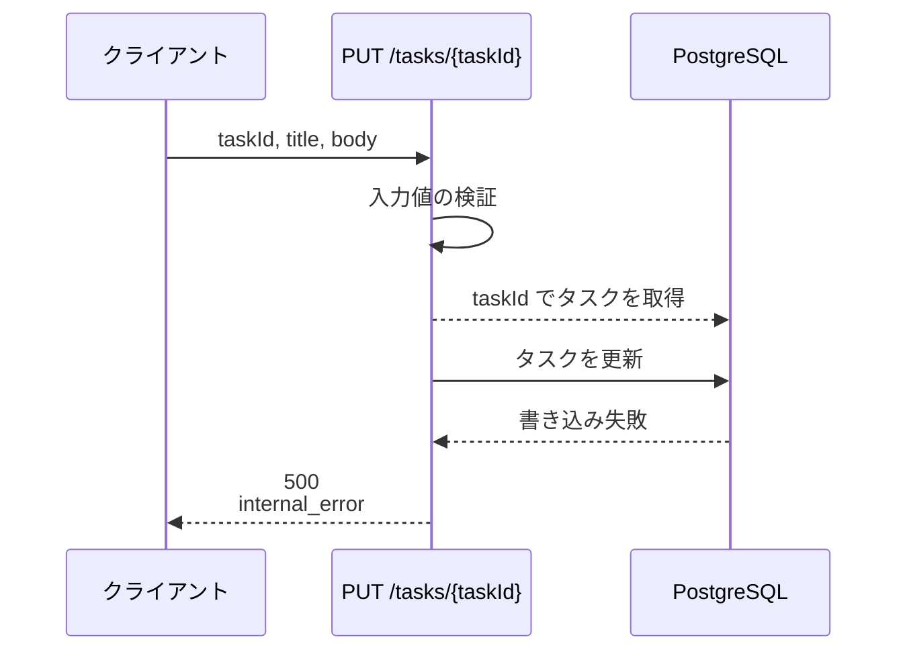

# タスク更新

エンドポイント: PUT /tasks/{taskId}

一覧から選択したタスクのタイトル・本文を更新し、更新後のタスクを返す。

- 対応テストファイル: `tests/integration/api/test_update_task.py`

## インターフェース

### リクエスト

| パラメータ | 型 | 必須 | デフォルト | 説明 | 制限 | 補足 |
| --- | --- | --- | --- | --- | --- | --- |
| `taskId` | `str` | ✅ | - | 更新対象のタスク ID | - | パスパラメータ |
| `title` | `str` | ✅ | - | タスク名 | 1 文字以上 100 文字以内 | 空文字・空白のみは不可 |
| `body` | `str` | - | `""` | タスク本文 | 10000 文字以内 | 省略時は空文字で上書きする |

リクエスト例:

```json
{
  "title": "決算資料の作成",
  "body": "Q2 の売上集計をまとめる"
}
```

### レスポンス

| フィールド | 型 | 説明 | 制限 | 補足 |
| --- | --- | --- | --- | --- |
| `task` | object | 更新後のタスク | - | `200` のときのみ返る |
| `task.id` | `str` | タスク ID | - | UUID |
| `task.title` | `str` | 更新後のタスク名 | - | - |
| `task.body` | `str` | 更新後のタスク本文 | - | - |
| `task.updatedAt` | `str` | 更新日時（ISO 8601） | - | UTC で返す |
| `errors` | object[] | フィールド単位の検証エラー | - | `400` のときのみ返る |
| `errors[].field` | `"title"` \| `"body"` | エラーが発生したフィールド名 | - | リクエストのパラメータ名と一致 |
| `errors[].code` | `"required"` \| `"max_length"` | エラーの種別 | - | 画面のメッセージ切り替えに使う |
| `errors[].message` | `str` | 表示用のエラーメッセージ | - | 日本語 |

レスポンス例:

```json
{
  "task": {
    "id": "3f2b1c88-5f4a-4d1b-9a2e-77c0d1b3e001",
    "title": "決算資料の作成",
    "body": "Q2 の売上集計をまとめる",
    "updatedAt": "2026-08-06T02:15:30+00:00"
  }
}
```

補足:

- 同じリクエストを繰り返し送っても結果は同じになる（`updatedAt` のみ進む）。
- 検証は全フィールドを通してから返すため、`errors` には失敗した全フィールド分が入る。

### ステータスコード

| ステータスコード | 発生条件 | 補足 |
| --- | --- | --- |
| `200` | 更新成功 | - |
| `400` | リクエストのバリデーション失敗 | `errors` を返す |
| `404` | `taskId` に一致するタスクが存在しない | - |
| `500` | DB 書き込み失敗 | - |

## 制約

| 項目 | 制約 | 補足 |
| --- | --- | --- |
| タイムアウト | 1 秒以内に応答する | Issue #1613 の非機能要件 |
| 認可 | 制限なし（呼び出し元を問わず更新できる） | 認証基盤が未導入のため今回は設けない |
| 同時更新 | 制限なし（後から到着した更新が勝つ） | 楽観ロック用のバージョン列を持たない |
| 更新対象の項目 | `title` と `body` のみ | 状態・期限などの他項目は本エンドポイントでは変更しない |

## フロー一覧

| 分類 | フロー名 | 概要 | 補足 |
| --- | --- | --- | --- |
| 正常 | 正常系 | 検証を通過して DB を更新し、更新後のタスクを返す | - |
| 異常 | 異常系（タスク名が空・400） | 空文字の `title` を検出して 400 を返す | - |
| 異常 | 異常系（タスク名が上限超過・400） | 100 文字を超える `title` を検出して 400 を返す | - |
| 異常 | 異常系（タスク不存在・404） | `taskId` に一致するタスクがなく 404 を返す | - |
| 異常 | 異常系（DB 書き込み失敗・500） | 更新時に DB 例外が発生して 500 を返す | 監視対象 |

## 正常系

### セットアップ

| セットアップ | 説明 | 補足 |
| --- | --- | --- |
| Mock | `PostgreSQL` を DB stub に差し替え | - |
| タスク | `taskId` に一致するタスクを 1 件登録済み | タイトル `旧タイトル` / 本文 `旧本文` |

### フロー



### 期待値

- `200 OK` と更新後のタスクが返る
- レスポンスの `task.title` / `task.body` が送信値と一致する
- tasks テーブルの該当行の `title` / `body` が送信値になっている
- tasks テーブルの該当行の `updated_at` が更新時刻に進んでいる

## 異常系（タスク名が空・400）

### セットアップ

| セットアップ | 説明 | 補足 |
| --- | --- | --- |
| Mock | `PostgreSQL` を DB stub に差し替え | - |
| タスク | `taskId` に一致するタスクを 1 件登録済み | - |
| 入力 | `title` を空文字にして送信 | 検証失敗を決定的に誘発 |

### フロー



### 期待値

- `400` が返る
- `errors` に `field` が `title`・`code` が `required` の要素が 1 件含まれる
- tasks テーブルの該当行は更新されていない（`title` / `body` / `updated_at` が変わらない）

## 異常系（タスク名が上限超過・400）

### セットアップ

| セットアップ | 説明 | 補足 |
| --- | --- | --- |
| Mock | `PostgreSQL` を DB stub に差し替え | - |
| タスク | `taskId` に一致するタスクを 1 件登録済み | - |
| 入力 | 101 文字の `title` を送信 | 上限超過を決定的に誘発 |

### フロー



### 期待値

- `400` が返る
- `errors` に `field` が `title`・`code` が `max_length` の要素が 1 件含まれる
- tasks テーブルの該当行は更新されていない

## 異常系（タスク不存在・404）

### セットアップ

| セットアップ | 説明 | 補足 |
| --- | --- | --- |
| Mock | `PostgreSQL` を DB stub に差し替え | - |
| タスク | tasks テーブルを空にしておく | 取得失敗を決定的に誘発 |
| 入力 | 登録されていない `taskId` を指定して送信 | `title` / `body` は検証を通る値 |

### フロー



### 期待値

- `404` と `task_not_found` が返る
- tasks テーブルに新しい行が作成されていない

## 異常系（DB 書き込み失敗・500）

### セットアップ

| セットアップ | 説明 | 補足 |
| --- | --- | --- |
| Mock | `PostgreSQL` を DB stub に差し替え、更新時に例外を投げる | 書き込み失敗を決定的に誘発 |
| タスク | `taskId` に一致するタスクを 1 件登録済み | - |

### フロー



### 期待値

- `500` と `internal_error` が返る
- tasks テーブルの該当行は更新されていない
