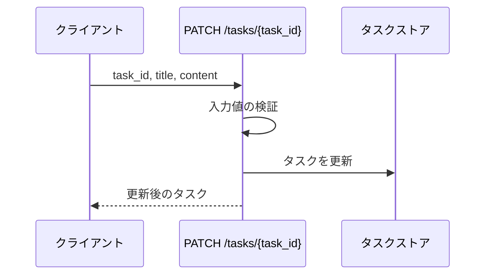
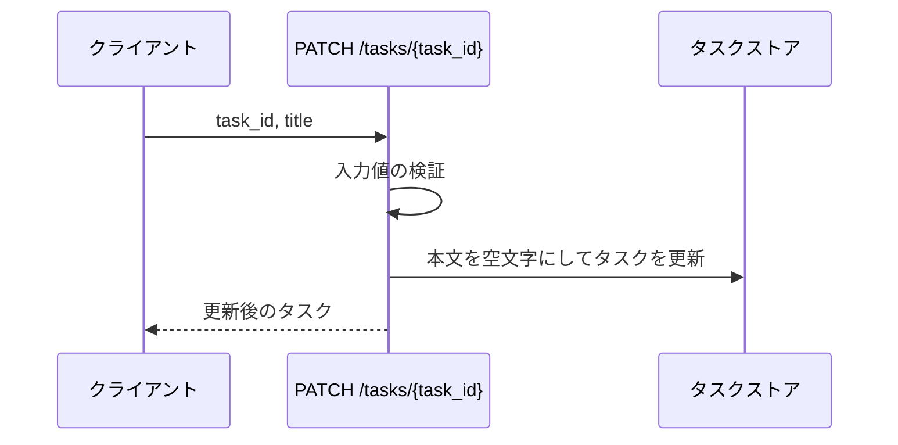
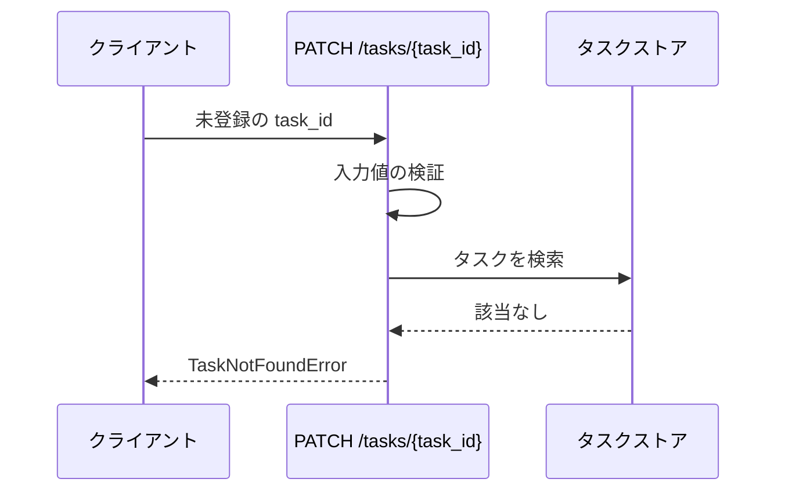
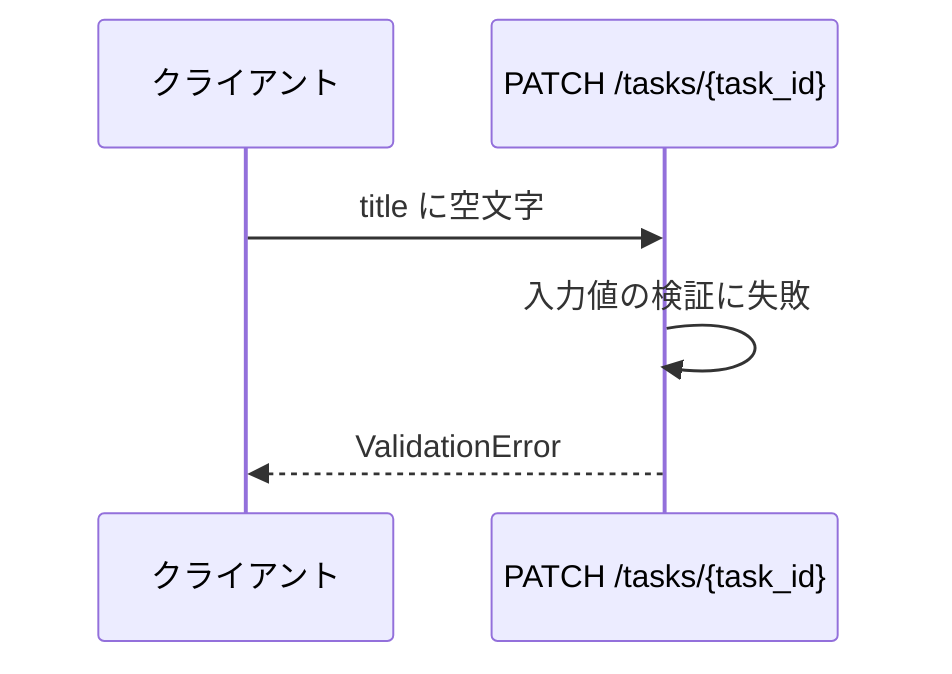
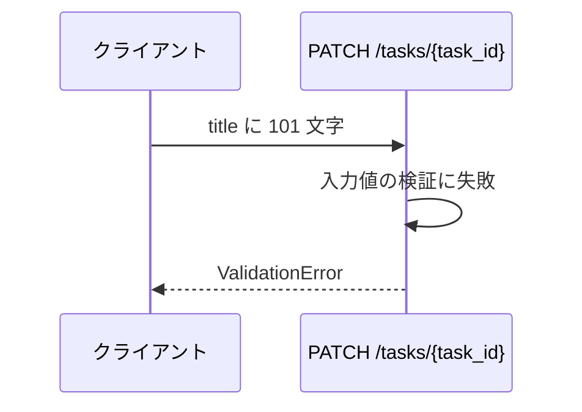
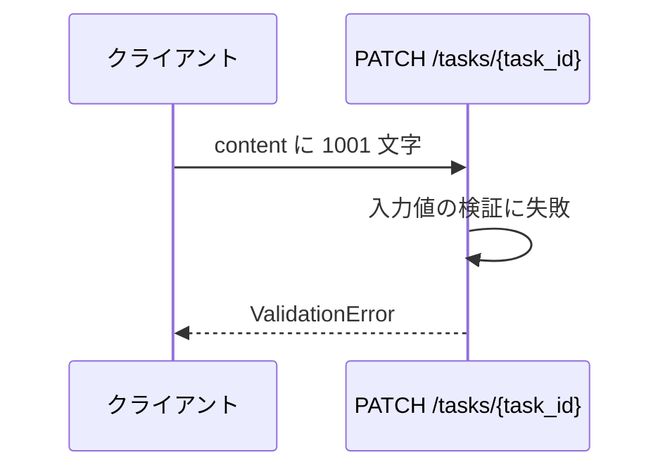

# タスク更新

エンドポイント: PATCH /tasks/{task_id}

登録済みタスクのタイトルと本文を更新する。

## インターフェース

### リクエスト

| パラメータ | 型 | 必須 | デフォルト | 説明 | 制限 | 補足 |
| --- | --- | --- | --- | --- | --- | --- |
| `task_id` | str | ✅ | - | 更新対象のタスク ID | - | パスパラメータ |
| `title` | str | ✅ | - | タスク名 | 1 文字以上 100 文字以内 | - |
| `content` | str | - | `""` | 本文 | 1000 文字以内 | 省略時は空文字で上書きする（更新前の値は残らない） |

### レスポンス

| フィールド | 型 | 説明 | 制限 | 補足 |
| --- | --- | --- | --- | --- |
| `id` | str | タスク ID | - | - |
| `title` | str | 更新後のタスク名 | - | - |
| `content` | str | 更新後の本文 | - | - |

## 制約

| 項目 | 制約 | 補足 |
| --- | --- | --- |
| タイムアウト | 制限なし | - |
| 認可 | なし | sandbox 用の最小実装 |
| 検証順序 | タイトル → 本文 → タスクの存在 | 先に失敗した検証の結果を返す |
| エラーの表現 | 例外名で返す | HTTP ステータスへの変換は行わない |

## フロー一覧

| 分類 | フロー名 | 概要 | 補足 |
| --- | --- | --- | --- |
| 正常 | 正常系 | 対象タスクのタイトルと本文を更新して返す | - |
| 正常 | 正常系（本文の省略） | `content` を省略して更新する | 本文は空文字に上書きされる |
| 異常 | 異常系（タスク不明） | 未登録の ID を指定 | - |
| 異常 | 異常系（タイトルが空） | タイトルの検証失敗 | 制限の下限側 |
| 異常 | 異常系（タイトルが長すぎる） | タイトルの検証失敗 | 制限の上限側 |
| 異常 | 異常系（本文が長すぎる） | 本文の検証失敗 | - |

## 正常系

### セットアップ

| セットアップ | 説明 | 補足 |
| --- | --- | --- |
| Mock | なし（インメモリのストアを実物のまま使う） | - |
| タスク | `t1` のタスクを登録済み | - |

### フロー

### 期待値

- 更新後のタイトルと本文を持つタスクが返る
- ストアの該当タスクが更新後の値になっている

## 正常系（本文の省略）

### セットアップ

| セットアップ | 説明 | 補足 |
| --- | --- | --- |
| Mock | なし（インメモリのストアを実物のまま使う） | - |
| タスク | `t1` のタスクを本文付きで登録済み | 上書きされたことを確認するため |
| 入力 | `content` を指定しない | デフォルト値の分岐を通す |

### フロー

### 期待値

- 返るタスクの本文が空文字になっている
- ストアの該当タスクの本文が空文字になっている

## 異常系（タスク不明）

### セットアップ

| セットアップ | 説明 | 補足 |
| --- | --- | --- |
| Mock | なし（インメモリのストアを実物のまま使う） | - |
| 入力 | 未登録の `task_id` を指定 | 検索失敗を決定的に誘発 |

### フロー

### 期待値

- `TaskNotFoundError` が送出される
- ストアが変更されていない

## 異常系（タイトルが空）

### セットアップ

| セットアップ | 説明 | 補足 |
| --- | --- | --- |
| Mock | なし（インメモリのストアを実物のまま使う） | - |
| 入力 | `title` に空文字を指定 | 検証失敗を決定的に誘発 |

### フロー

### 期待値

- `ValidationError` が送出される
- ストアが変更されていない

## 異常系（タイトルが長すぎる）

### セットアップ

| セットアップ | 説明 | 補足 |
| --- | --- | --- |
| Mock | なし（インメモリのストアを実物のまま使う） | - |
| 入力 | `title` に 101 文字を指定 | 検証失敗を決定的に誘発 |

### フロー

### 期待値

- `ValidationError` が送出される
- ストアが変更されていない

## 異常系（本文が長すぎる）

### セットアップ

| セットアップ | 説明 | 補足 |
| --- | --- | --- |
| Mock | なし（インメモリのストアを実物のまま使う） | - |
| 入力 | `content` に 1001 文字を指定 | 検証失敗を決定的に誘発 |

### フロー

### 期待値

- `ValidationError` が送出される
- ストアが変更されていない
