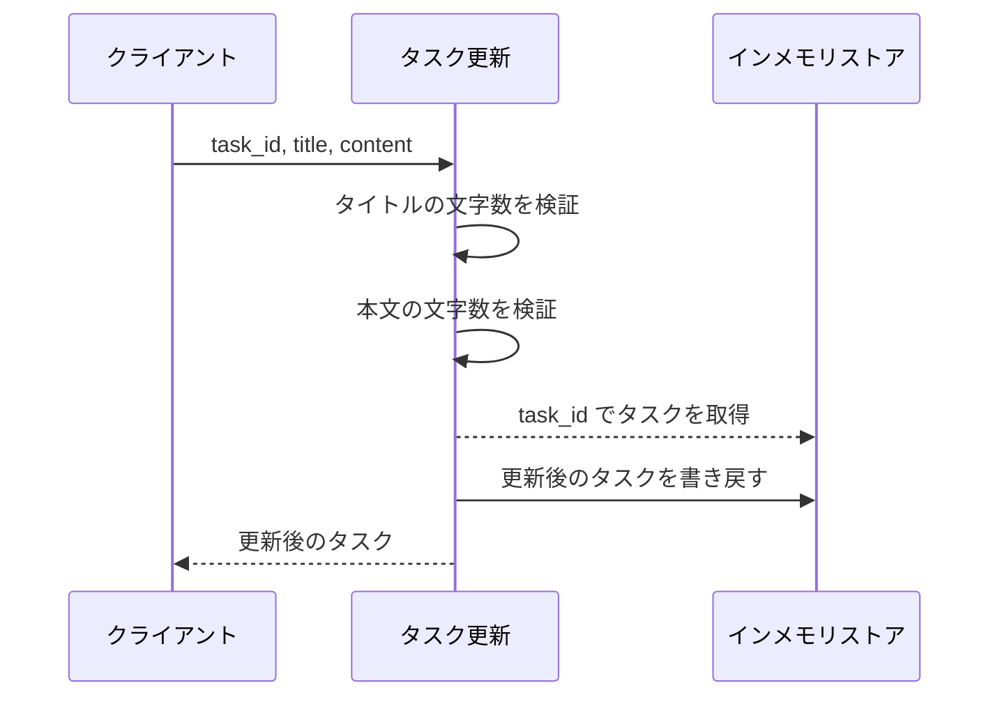
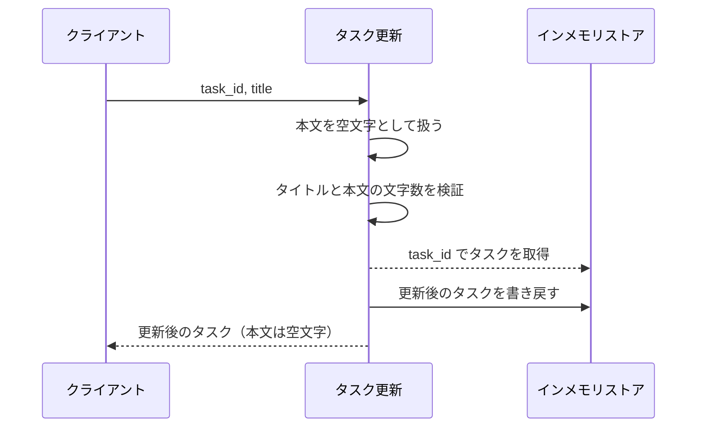
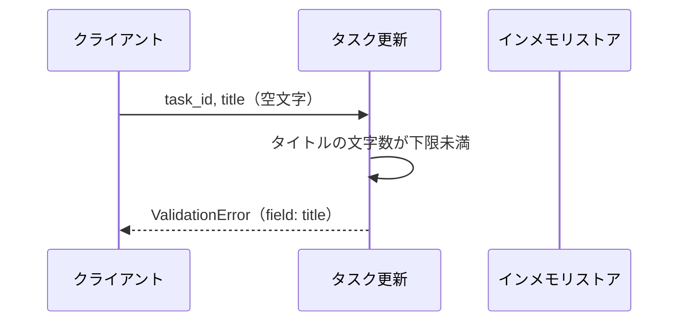
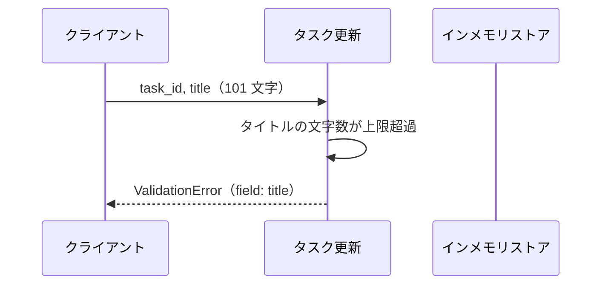
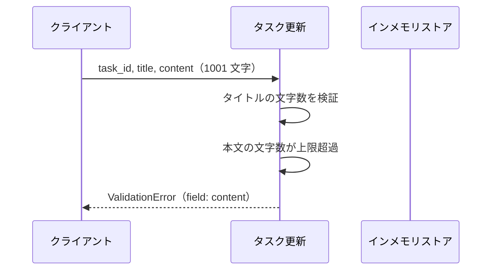
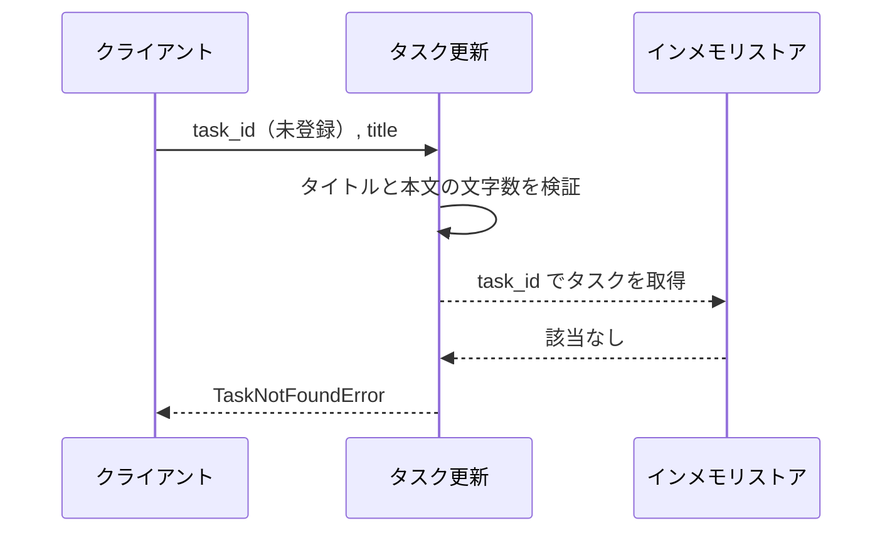

# タスク更新

操作: `update_task`（サービス層の公開関数）

登録済みタスクのタイトルと本文を検証したうえで更新し、更新後のタスクを返す。

- 対応テストファイル: `tests/integration/tasks/test_タスク更新.py`

## インターフェース

### リクエスト

| パラメータ | 型 | 必須 | デフォルト | 説明 | 制限 | 補足 |
| --- | --- | --- | --- | --- | --- | --- |
| `task_id` | str | ✅ | - | 更新対象のタスク ID | ストアに登録済みの ID | - |
| `title` | str | ✅ | - | タスク名 | 1 文字以上 100 文字以内 | 空文字は不可 |
| `content` | str | - | `""` | タスクの本文 | 1000 文字以内 | 省略すると空文字で上書きする |

リクエスト例:

```json
{
  "task_id": "t1",
  "title": "決算資料の作成",
  "content": "四半期の売上を集計する"
}
```

### レスポンス

| フィールド | 型 | 説明 | 制限 | 補足 |
| --- | --- | --- | --- | --- |
| `task` | Task | 更新後のタスク | - | - |
| `task.id` | str | タスク ID | - | リクエストの `task_id` と同じ値 |
| `task.title` | str | 更新後のタスク名 | - | - |
| `task.content` | str | 更新後の本文 | - | `content` を省略した場合は空文字 |

レスポンス例:

```json
{
  "task": {
    "id": "t1",
    "title": "決算資料の作成",
    "content": "四半期の売上を集計する"
  }
}
```

補足:

- 同じ入力で複数回呼び出しても結果は変わらない（冪等）

### 例外

| 例外 | 発生条件 | 補足 |
| --- | --- | --- |
| なし（正常終了） | 更新成功 | 戻り値はレスポンス表のとおり |
| `ValidationError` | タイトルが空 | 失敗フィールドを `field="title"` で持つ |
| `ValidationError` | タイトルが 100 文字を超える | 失敗フィールドを `field="title"` で持つ |
| `ValidationError` | 本文が 1000 文字を超える | 失敗フィールドを `field="content"` で持つ |
| `TaskNotFoundError` | 指定 ID のタスクがストアに無い | ストアは変更しない |

## 制約

| 項目 | 制約 | 補足 |
| --- | --- | --- |
| タイムアウト | 制限なし | インメモリストアのみを触るため外部 I/O の待ちが発生しない |
| 認可 | 制限なし | 認証機構が未導入のため呼び出し元を限定しない |
| 同時更新 | 制限なし（後から書いた内容が残る） | 排他制御・更新競合の検出は行わない |
| 更新できるフィールド | タイトルと本文のみ | `task_id` は更新対象に含めない |

## フロー一覧

| 分類 | フロー名 | 概要 | 補足 |
| --- | --- | --- | --- |
| 正常 | 正常系 | タイトルと本文を更新して更新後のタスクを返す | - |
| 正常 | 正常系（本文を省略） | 本文を空文字で上書きして返す | - |
| 異常 | 異常系（タイトルが空・ValidationError） | 検証で弾いてストアを変更しない | - |
| 異常 | 異常系（タイトルが 100 文字超・ValidationError） | 検証で弾いてストアを変更しない | - |
| 異常 | 異常系（本文が 1000 文字超・ValidationError） | 検証で弾いてストアを変更しない | - |
| 異常 | 異常系（タスクが未登録・TaskNotFoundError） | 検証を通過した後に対象が見つからない | - |

## 正常系

### セットアップ

| セットアップ | 説明 | 補足 |
| --- | --- | --- |
| Mock | なし（テスト用に用意したインメモリストアで実行） | 外部 I/O が無いため差し替える依存が無い |
| タスク | `t1` のタスクを登録済み | タイトル・本文とも更新前の値が入っている |

### フロー



### 期待値

- 戻り値のタイトルと本文が、リクエストで渡した値と一致している
- ストアの `t1` が更新後の値に置き換わっている
- 戻り値の `id` がリクエストの `task_id` と一致している

## 正常系（本文を省略）

### セットアップ

| セットアップ | 説明 | 補足 |
| --- | --- | --- |
| Mock | なし（テスト用に用意したインメモリストアで実行） | - |
| タスク | `t1` のタスクを本文ありで登録済み | 上書きされたことを確認できる状態にする |
| 入力 | `content` を渡さずに呼び出す | デフォルト値の適用を決定的に誘発 |

### フロー



### 期待値

- 戻り値の本文が空文字になっている
- ストアの `t1` の本文も空文字に置き換わっている

## 異常系（タイトルが空・ValidationError）

### セットアップ

| セットアップ | 説明 | 補足 |
| --- | --- | --- |
| Mock | なし（テスト用に用意したインメモリストアで実行） | - |
| タスク | `t1` のタスクを登録済み | - |
| 入力 | `title` に空文字を渡す | 検証失敗を決定的に誘発 |

### フロー



### 期待値

- `ValidationError` が送出され、`field` が `title` になっている
- ストアの `t1` が更新前のまま変わっていない

## 異常系（タイトルが 100 文字超・ValidationError）

### セットアップ

| セットアップ | 説明 | 補足 |
| --- | --- | --- |
| Mock | なし（テスト用に用意したインメモリストアで実行） | - |
| タスク | `t1` のタスクを登録済み | - |
| 入力 | `title` に 101 文字を渡す | 上限超過を決定的に誘発 |

### フロー



### 期待値

- `ValidationError` が送出され、`field` が `title` になっている
- ストアの `t1` が更新前のまま変わっていない

## 異常系（本文が 1000 文字超・ValidationError）

### セットアップ

| セットアップ | 説明 | 補足 |
| --- | --- | --- |
| Mock | なし（テスト用に用意したインメモリストアで実行） | - |
| タスク | `t1` のタスクを登録済み | - |
| 入力 | `title` は正常値、`content` に 1001 文字を渡す | 本文だけの検証失敗を切り分ける |

### フロー



### 期待値

- `ValidationError` が送出され、`field` が `content` になっている
- ストアの `t1` が更新前のまま変わっていない

## 異常系（タスクが未登録・TaskNotFoundError）

### セットアップ

| セットアップ | 説明 | 補足 |
| --- | --- | --- |
| Mock | なし（テスト用に用意したインメモリストアで実行） | - |
| タスク | `t1` のタスクを登録済み | 他のタスクが巻き込まれないことを確認する |
| 入力 | ストアに無い `task_id` を渡す | 取得失敗を決定的に誘発 |

### フロー



### 期待値

- `TaskNotFoundError` が送出される
- ストアにタスクが追加されていない
- ストアの `t1` が更新前のまま変わっていない
