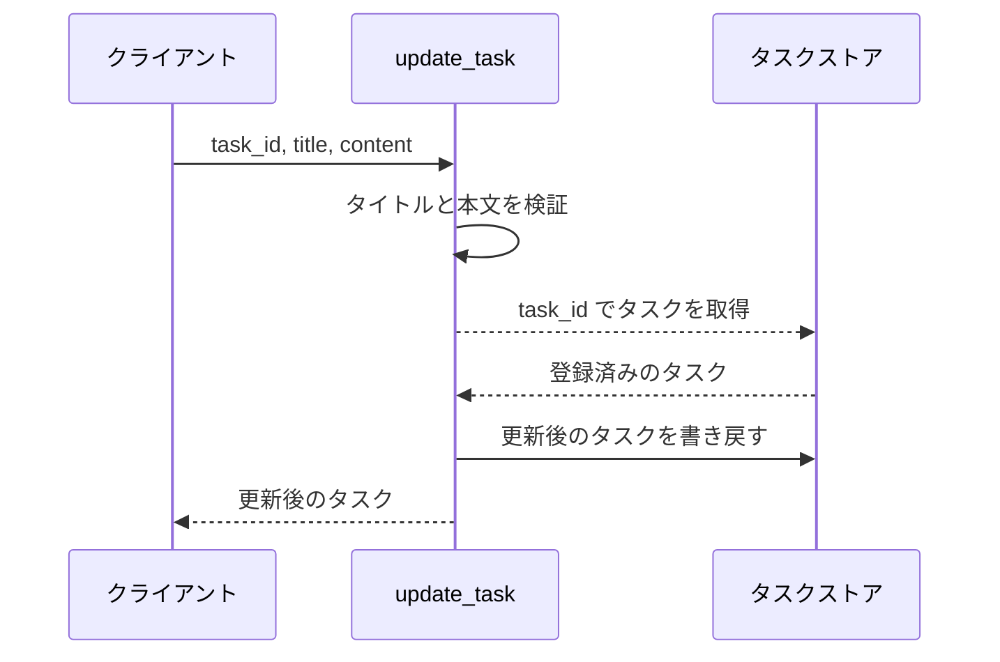
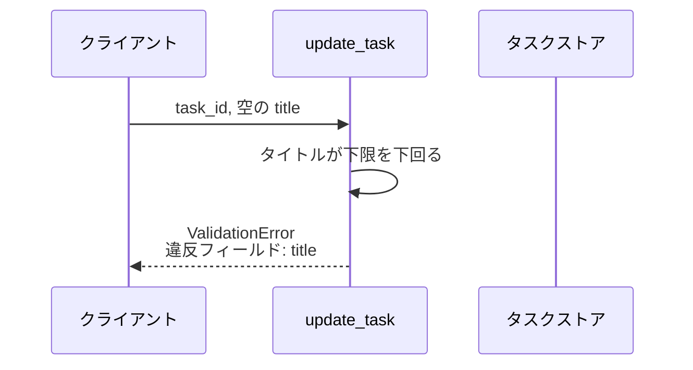
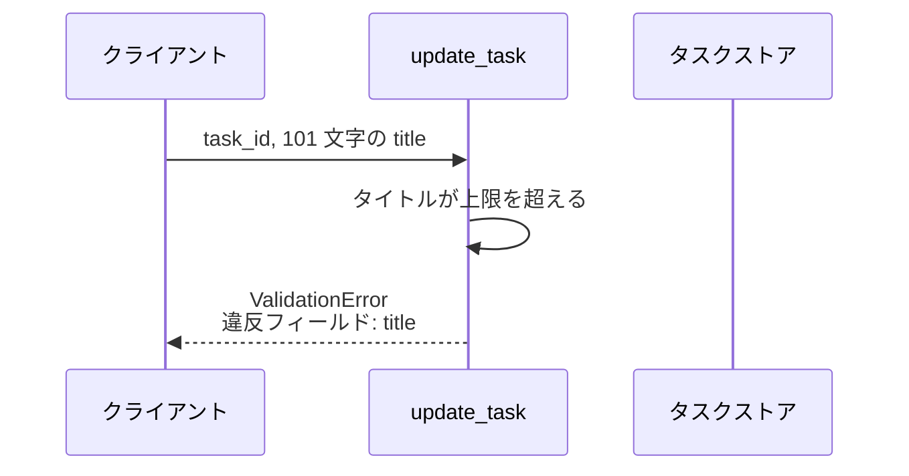
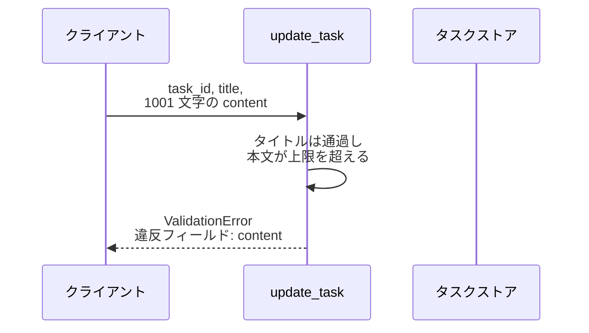
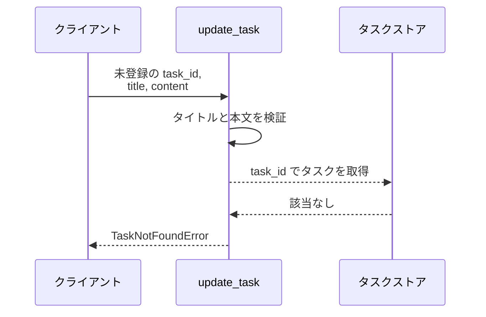

# タスク更新

操作: `update_task`（サービス層の公開関数）

登録済みタスクのタイトルと本文を差し替えて、更新後のタスクを返す。

- 対応テストファイル: `tests/integration/バックエンド/test_タスク更新.py`

## インターフェース

### リクエスト

| パラメータ | 型 | 必須 | デフォルト | 説明 | 制限 | 補足 |
| --- | --- | --- | --- | --- | --- | --- |
| `task_id` | string | ✅ | - | 更新対象のタスク ID | - | タスクストアのキー |
| `title` | string | ✅ | - | 更新後のタスク名 | 1〜100 文字 | 空文字は不可 |
| `content` | string | - | `""` | 更新後の本文 | 1000 文字以内 | 省略すると空文字で上書きする |

リクエスト例:

```json
{
  "task_id": "t1",
  "title": "新タイトル",
  "content": "新本文"
}
```

### レスポンス

| フィールド | 型 | 説明 | 制限 | 補足 |
| --- | --- | --- | --- | --- |
| `id` | string | タスク ID | - | 入力の `task_id` と同じ値 |
| `title` | string | 更新後のタスク名 | - | - |
| `content` | string | 更新後の本文 | - | - |

レスポンス例:

```json
{
  "id": "t1",
  "title": "新タイトル",
  "content": "新本文"
}
```

**補足:**

- 同じ引数で繰り返し呼んでも結果が変わらない（冪等）

### 例外

| 例外 | 発生条件 | 補足 |
| --- | --- | --- |
| なし（正常終了） | 更新成功 | 戻り値は レスポンス表のとおり |
| `ValidationError` | タイトルが空 | 違反フィールド名 `title` を保持する |
| `ValidationError` | タイトルが 100 文字を超える | 違反フィールド名 `title` を保持する |
| `ValidationError` | 本文が 1000 文字を超える | 違反フィールド名 `content` を保持する |
| `TaskNotFoundError` | 指定 ID のタスクが存在しない | - |

## 制約

| 項目 | 制約 | 補足 |
| --- | --- | --- |
| 応答時間 | 1 秒以内 | - |
| タイムアウト | 制限なし | - |
| 認可 | 制限なし（呼び出し元の権限は判定しない） | - |
| 同時更新 | 制限なし（後勝ちで上書き） | タスクは更新日時を持たないため楽観ロックはかけない |
| 検証の順序 | タイトル、本文、対象タスクの存在 の順に見て、最初の違反で打ち切る | 1 回の呼び出しで返る違反フィールドは 1 件 |

## フロー一覧

| 分類 | フロー名 | 概要 | 補足 |
| --- | --- | --- | --- |
| 正常 | 正常系 | タイトルと本文を差し替えて更新後のタスクを返す | - |
| 異常 | 異常系（タイトルが空・ValidationError） | 空文字を弾いてストアを変更しない | - |
| 異常 | 異常系（タイトルが上限超過・ValidationError） | 101 文字を弾いてストアを変更しない | - |
| 異常 | 異常系（本文が上限超過・ValidationError） | 1001 文字を弾いてストアを変更しない | - |
| 異常 | 異常系（対象タスクが不在・TaskNotFoundError） | 未登録の ID を弾いてストアを変更しない | - |

## 正常系

### セットアップ

| セットアップ | 説明 | 補足 |
| --- | --- | --- |
| Mock | なし（タスクストアはインメモリ辞書をそのまま使う） | - |
| タスク | `t1` のタスクを登録済み | タイトル `旧タイトル` / 本文 `旧本文` |

### フロー



### 期待値

- `title` / `content` が入力値に置き換わったタスクが返る
- タスクストアの `t1` が返却値と同じ内容になっている

## 異常系（タイトルが空・ValidationError）

### セットアップ

| セットアップ | 説明 | 補足 |
| --- | --- | --- |
| Mock | なし（タスクストアはインメモリ辞書をそのまま使う） | - |
| タスク | `t1` のタスクを登録済み | タイトル `旧タイトル` / 本文 `旧本文` |
| 入力 | `title` に空文字を渡す | 検証失敗を決定的に誘発 |

### フロー



### 期待値

- `ValidationError` が送出され、違反フィールド名が `title` になっている
- タスクストアの `t1` は `旧タイトル` / `旧本文` のまま

## 異常系（タイトルが上限超過・ValidationError）

### セットアップ

| セットアップ | 説明 | 補足 |
| --- | --- | --- |
| Mock | なし（タスクストアはインメモリ辞書をそのまま使う） | - |
| タスク | `t1` のタスクを登録済み | タイトル `旧タイトル` / 本文 `旧本文` |
| 入力 | `title` に 101 文字を渡す | 検証失敗を決定的に誘発 |

### フロー



### 期待値

- `ValidationError` が送出され、違反フィールド名が `title` になっている
- タスクストアの `t1` は `旧タイトル` / `旧本文` のまま

## 異常系（本文が上限超過・ValidationError）

### セットアップ

| セットアップ | 説明 | 補足 |
| --- | --- | --- |
| Mock | なし（タスクストアはインメモリ辞書をそのまま使う） | - |
| タスク | `t1` のタスクを登録済み | タイトル `旧タイトル` / 本文 `旧本文` |
| 入力 | `title` は正常値、`content` に 1001 文字を渡す | 本文だけで検証失敗を誘発 |

### フロー



### 期待値

- `ValidationError` が送出され、違反フィールド名が `content` になっている
- タスクストアの `t1` は `旧タイトル` / `旧本文` のまま

## 異常系（対象タスクが不在・TaskNotFoundError）

### セットアップ

| セットアップ | 説明 | 補足 |
| --- | --- | --- |
| Mock | なし（タスクストアはインメモリ辞書をそのまま使う） | - |
| タスク | `t1` のタスクを登録済み | タイトル `旧タイトル` / 本文 `旧本文` |
| 入力 | 未登録の `task_id`（`t999`）を渡す | 取得失敗を決定的に誘発 |

### フロー



### 期待値

- `TaskNotFoundError` が送出される
- タスクストアに `t999` は追加されず、`t1` も変わっていない
