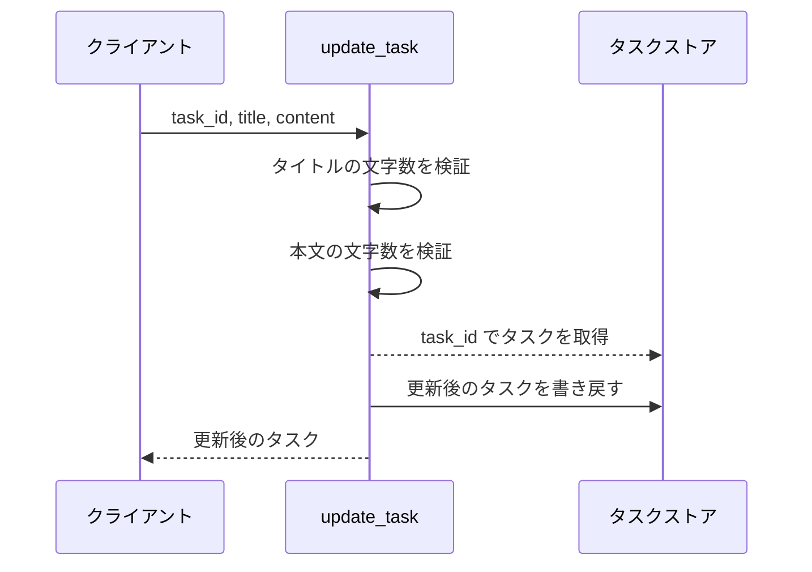
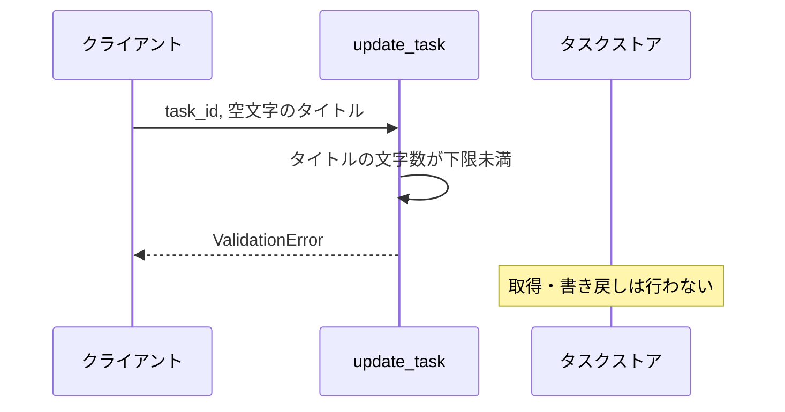
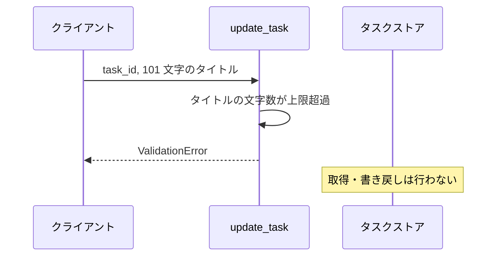
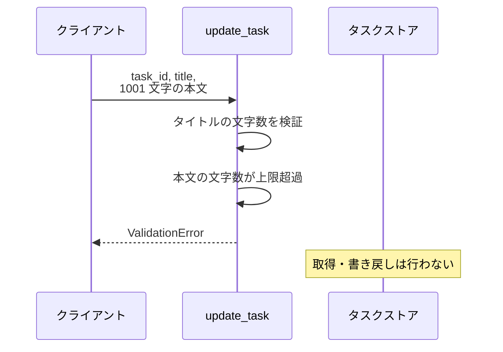
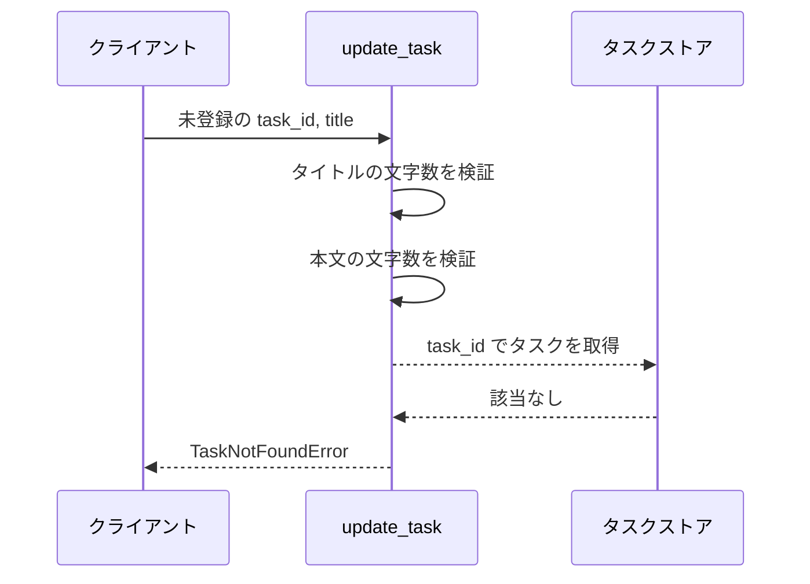

# タスク更新

操作: `update_task`（サービス層の公開関数）

登録済みタスクのタイトルと本文を検証して置き換え、更新後のタスクを返す。

- 対応テストファイル: 未記入（テスト作成時に記入）

## インターフェース

### リクエスト

| パラメータ | 型 | 必須 | デフォルト | 説明 | 制限 | 補足 |
| --- | --- | --- | --- | --- | --- | --- |
| `store` | `dict[str, Task]` | ✅ | - | タスク ID をキーにしたタスクの保管先 | - | 呼び出し元が保持する辞書をそのまま渡す |
| `task_id` | `str` | ✅ | - | 更新対象のタスク ID | - | - |
| `title` | `str` | ✅ | - | 更新後のタイトル | 1 文字以上 100 文字以内 | - |
| `content` | `str` | - | `""`（本文を空にする） | 更新後の本文 | 1000 文字以内 | - |

リクエスト例:

```python
update_task(store, "t1", "新タイトル", "新本文")
```

### レスポンス

| フィールド | 型 | 説明 | 制限 | 補足 |
| --- | --- | --- | --- | --- |
| `id` | `str` | タスク ID | - | 更新前と同じ値 |
| `title` | `str` | 更新後のタイトル | 1 文字以上 100 文字以内 | - |
| `content` | `str` | 更新後の本文 | 1000 文字以内 | - |

レスポンス例:

```python
Task(id="t1", title="新タイトル", content="新本文")
```

補足:

- 同じ引数で 2 回呼んでも同じ結果になる（冪等）

### 例外

| 例外 | 発生条件 | 補足 |
| --- | --- | --- |
| なし（正常終了） | 更新成功 | 戻り値はレスポンス表のとおり |
| `ValidationError` | タイトルが 1 文字未満 | ストアは変更されない |
| `ValidationError` | タイトルが 100 文字超過 | ストアは変更されない |
| `ValidationError` | 本文が 1000 文字超過 | ストアは変更されない |
| `TaskNotFoundError` | 指定 ID のタスクが未登録 | ストアは変更されない |

## 制約

| 項目 | 制約 | 補足 |
| --- | --- | --- |
| タイムアウト | 制限なし | 同一プロセス内の辞書操作のみ |
| 認可 | 制限なし | 呼び出し元の権限は判定しない |
| 更新できる項目 | タイトルと本文のみ | `id` は更新前の値を引き継ぐ |
| 部分更新 | 未対応 | 渡した値で全項目を置き換える |

## フロー一覧

| 分類 | フロー名 | 概要 | 補足 |
| --- | --- | --- | --- |
| 正常 | 正常系 | タイトルと本文を置き換えて更新後のタスクを返す | - |
| 正常 | 正常系（本文の省略） | 本文を空文字にして更新後のタスクを返す | - |
| 異常 | 異常系（タイトルが空・ValidationError） | 文字数検証で弾いて更新しない | - |
| 異常 | 異常系（タイトルが 100 文字超過・ValidationError） | 文字数検証で弾いて更新しない | - |
| 異常 | 異常系（本文が 1000 文字超過・ValidationError） | 文字数検証で弾いて更新しない | - |
| 異常 | 異常系（タスク未登録・TaskNotFoundError） | 取得時に弾いて更新しない | - |

## 正常系

### セットアップ

| セットアップ | 説明 | 補足 |
| --- | --- | --- |
| Mock | なし（引数で渡す辞書をそのまま使う） | - |
| タスク | `t1` のタスクを登録済み | タイトル・本文とも更新前の値 |
| 入力 | タイトルと本文の両方を指定 | - |

### フロー



### 期待値

- 指定したタイトルと本文を持つタスクが返る
- ストアの `t1` が更新後のタスクに置き換わっている

## 正常系（本文の省略）

### セットアップ

| セットアップ | 説明 | 補足 |
| --- | --- | --- |
| Mock | なし（引数で渡す辞書をそのまま使う） | - |
| タスク | `t1` のタスクを登録済み | 本文に更新前の値が入っている |
| 入力 | 本文を指定せずに呼び出す | デフォルト値の適用を決定的に誘発 |

### フロー


### 期待値

- 本文が空文字のタスクが返る
- ストアの `t1` の本文が空文字になっている

## 異常系（タイトルが空・ValidationError）

### セットアップ

| セットアップ | 説明 | 補足 |
| --- | --- | --- |
| Mock | なし（引数で渡す辞書をそのまま使う） | - |
| タスク | `t1` のタスクを登録済み | - |
| 入力 | タイトルに空文字を指定 | 検証失敗を決定的に誘発 |

### フロー



### 期待値

- `ValidationError` が送出される
- ストアの `t1` が更新前のまま

## 異常系（タイトルが 100 文字超過・ValidationError）

### セットアップ

| セットアップ | 説明 | 補足 |
| --- | --- | --- |
| Mock | なし（引数で渡す辞書をそのまま使う） | - |
| タスク | `t1` のタスクを登録済み | - |
| 入力 | タイトルに 101 文字を指定 | 検証失敗を決定的に誘発 |

### フロー



### 期待値

- `ValidationError` が送出される
- ストアの `t1` が更新前のまま

## 異常系（本文が 1000 文字超過・ValidationError）

### セットアップ

| セットアップ | 説明 | 補足 |
| --- | --- | --- |
| Mock | なし（引数で渡す辞書をそのまま使う） | - |
| タスク | `t1` のタスクを登録済み | - |
| 入力 | タイトルは有効・本文に 1001 文字を指定 | 検証失敗を決定的に誘発 |

### フロー



### 期待値

- `ValidationError` が送出される
- ストアの `t1` が更新前のまま

## 異常系（タスク未登録・TaskNotFoundError）

### セットアップ

| セットアップ | 説明 | 補足 |
| --- | --- | --- |
| Mock | なし（引数で渡す辞書をそのまま使う） | - |
| タスク | `t1` のタスクだけを登録済み | - |
| 入力 | ストアに無い ID を指定 | 取得失敗を決定的に誘発 |

### フロー



### 期待値

- `TaskNotFoundError` が送出される
- ストアの `t1` が更新前のまま
