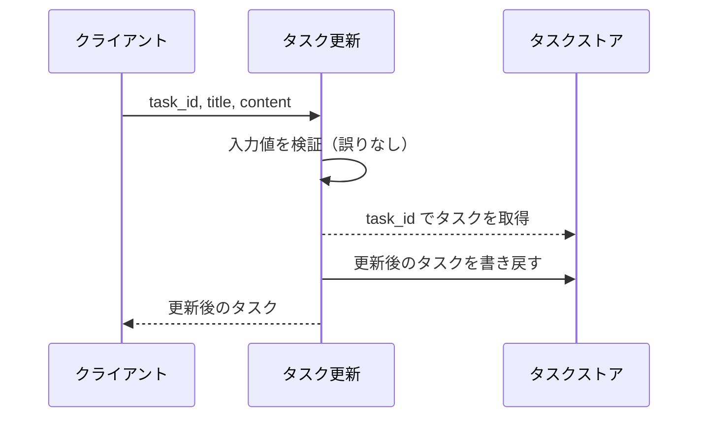
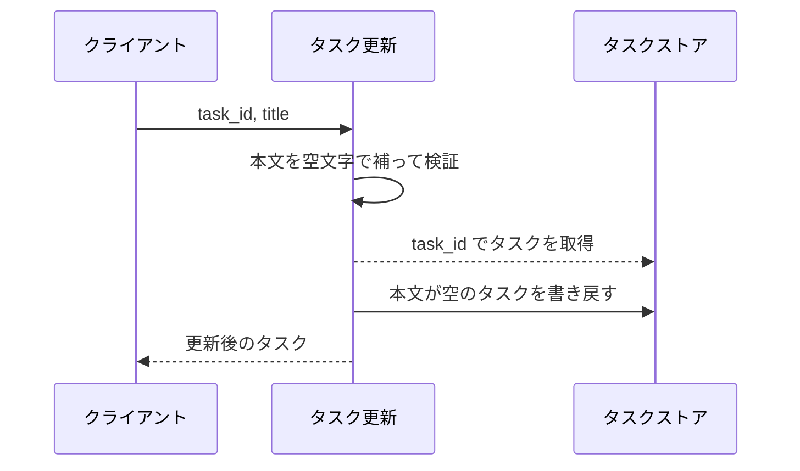
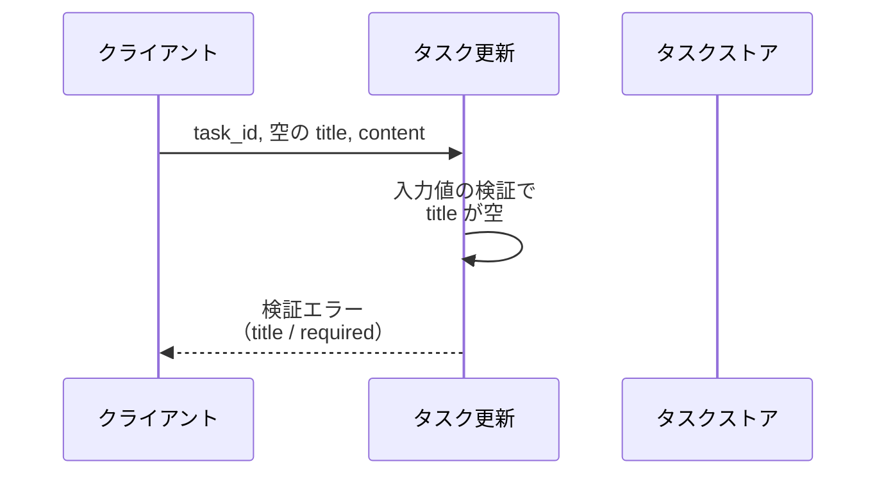
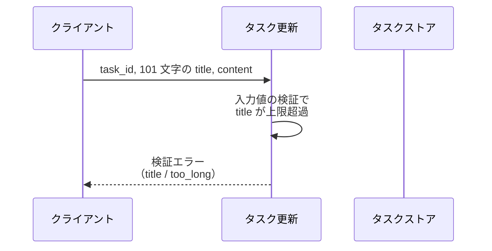
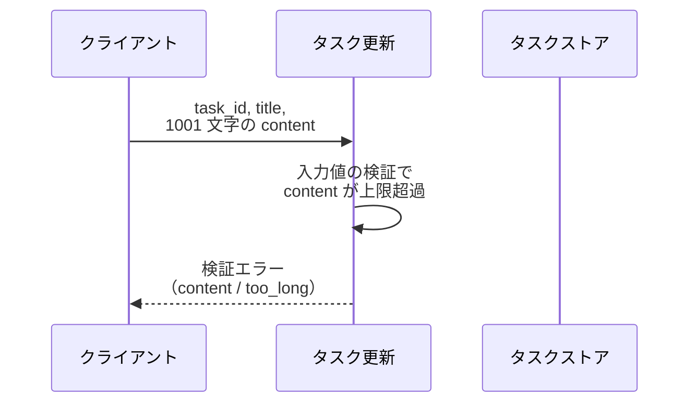
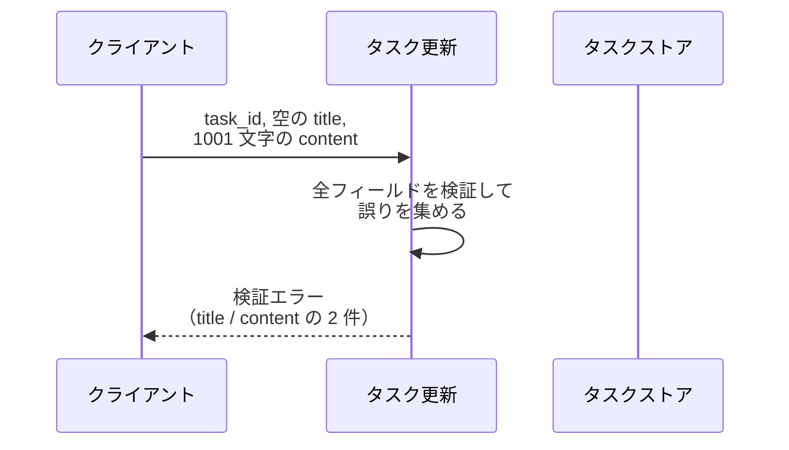
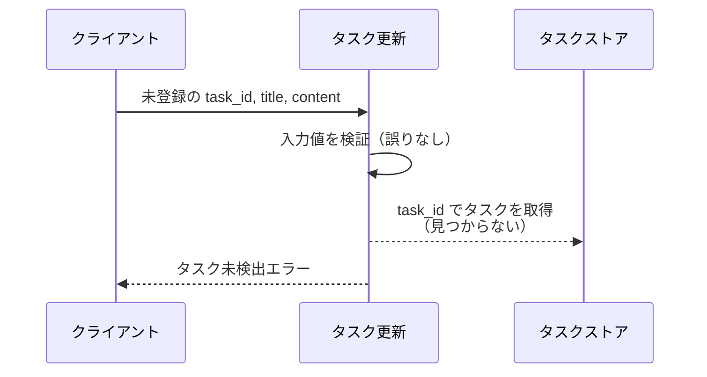

# タスク更新

サービス関数: `tasks.service.update_task`

登録済みタスクのタスク名と本文を検証したうえで更新し、更新後のタスクを返す操作。

- 対応テストファイル: `tests/integration/tasks/test_タスク更新.py`

## インターフェース

### リクエスト

| パラメータ | 型 | 必須 | デフォルト | 説明 | 制限 | 補足 |
| --- | --- | --- | --- | --- | --- | --- |
| `task_id` | str | ✅ | - | 更新対象のタスク ID | - | タスクストアのキーと一致すること |
| `title` | str | ✅ | - | 更新後のタスク名 | 1 文字以上 100 文字以内 | 空文字は不可 |
| `content` | str | - | `""` | 更新後の本文 | 1000 文字以内 | 省略すると本文が空文字で上書きされる |

リクエスト例:

```json
{
  "task_id": "t1",
  "title": "新タイトル",
  "content": "新本文"
}
```

### レスポンス

| フィールド | 型 | 説明 | 制限 | 補足 |
| --- | --- | --- | --- | --- |
| `task` | object | 更新後のタスク | - | - |
| `task.id` | str | タスク ID | - | 入力の `task_id` と一致する |
| `task.title` | str | 更新後のタスク名 | - | - |
| `task.content` | str | 更新後の本文 | - | `content` を省略した場合は空文字 |

レスポンス例:

```json
{
  "task": {
    "id": "t1",
    "title": "新タイトル",
    "content": "新本文"
  }
}
```

**補足:**

- 更新はタスクストアの該当エントリを丸ごと差し替える（部分更新ではないため、`content` を省略すると既存の本文は残らない）
- 検証に失敗した場合はレスポンスを返さず検証エラーを送出する。
  検証エラーは失敗したフィールド 1 件 = `field` / `code` / `message` の 3 項目とし、その配列を運ぶ
- 検証エラーの例:

```json
{
  "errors": [
    { "field": "title", "code": "required", "message": "タスク名を入力してください" }
  ]
}
```

## 制約

| 項目 | 制約 | 補足 |
| --- | --- | --- |
| 応答時間 | 1 秒以内 | 親サブシステムの非機能要件 |
| 認可 | 制限なし | 認証機構が未導入のため呼び出し元を問わない |
| 検証の打ち切り | 打ち切らない（全フィールドを検証してから 1 度に送出する） | 1 件目で止めると他フィールドの誤りが呼び出し元へ届かない |
| フィールド名の許可値 | `title` / `content` | リクエストのパラメータ名と一致させる |
| エラーコードの許可値 | `required` / `too_long` | `required` は必須欄が空・`too_long` は文字数超過 |
| 検証と存在確認の順序 | 入力検証を通してから更新対象の存在を確認する | 入力の誤りを先に返す |
| 部分更新 | 対応しない（`title` / `content` を毎回まとめて受け取る） | - |
| 同時更新の制御 | 制限なし | 楽観ロック・バージョン番号は持たない |

## フロー一覧

| 分類 | フロー名 | 概要 | 補足 |
| --- | --- | --- | --- |
| 正常 | 正常系 | タスク名と本文を更新して更新後タスクを返す | - |
| 正常 | 正常系（本文を省略） | 本文を空文字で上書きして更新する | - |
| 異常 | 異常系（タスク名が空・検証エラー） | `title` が空 → `required` を 1 件返す | - |
| 異常 | 異常系（タスク名が長すぎる・検証エラー） | `title` が 101 文字 → `too_long` を 1 件返す | - |
| 異常 | 異常系（本文が長すぎる・検証エラー） | `content` が 1001 文字 → `too_long` を 1 件返す | - |
| 異常 | 異常系（複数フィールドが不正・検証エラー） | `title` と `content` の両方が不正 → 2 件まとめて返す | 打ち切らないことの確認 |
| 異常 | 異常系（対象タスクが存在しない） | 未登録の `task_id` → タスク未検出エラー | - |

## 正常系

### セットアップ

| セットアップ | 説明 | 補足 |
| --- | --- | --- |
| Mock | なし（テスト用に組み立てたタスクストアを実物として渡す） | 外部 DB / 外部 API への依存を持たない |
| タスク | `t1` のタスクを 1 件登録済み | タスク名 `旧タイトル` / 本文 `旧本文` |

### フロー



### 期待値

- `task.title` / `task.content` が入力値と一致する更新後のタスクが返る
- `task.id` が入力の `task_id` と一致する
- タスクストアの該当タスクが更新後の内容になっている

## 正常系（本文を省略）

### セットアップ

| セットアップ | 説明 | 補足 |
| --- | --- | --- |
| Mock | なし（テスト用に組み立てたタスクストアを実物として渡す） | - |
| タスク | `t1` のタスクを本文ありで 1 件登録済み | 本文 `旧本文` |
| 入力 | `content` を省略して呼び出す | デフォルト値の分岐を決定的に誘発 |

### フロー



### 期待値

- 返るタスクの `content` が空文字になっている
- タスクストアの該当タスクの本文も空文字になっている（登録時の本文が残らない）

## 異常系（タスク名が空・検証エラー）

### セットアップ

| セットアップ | 説明 | 補足 |
| --- | --- | --- |
| Mock | なし（テスト用に組み立てたタスクストアを実物として渡す） | - |
| タスク | `t1` のタスクを 1 件登録済み | - |
| 入力 | `title` を空文字にして送信 | 検証失敗を決定的に誘発 |

### フロー



### 期待値

- 検証エラーが送出され、`errors` が `field` = `title` / `code` = `required` の 1 件だけを持つ
- タスクストアの該当タスクが編集前のまま変わっていない

## 異常系（タスク名が長すぎる・検証エラー）

### セットアップ

| セットアップ | 説明 | 補足 |
| --- | --- | --- |
| Mock | なし（テスト用に組み立てたタスクストアを実物として渡す） | - |
| タスク | `t1` のタスクを 1 件登録済み | - |
| 入力 | `title` を 101 文字にして送信 | 上限超過を決定的に誘発 |

### フロー



### 期待値

- 検証エラーが送出され、`errors` が `field` = `title` / `code` = `too_long` の 1 件だけを持つ
- タスクストアの該当タスクが編集前のまま変わっていない

## 異常系（本文が長すぎる・検証エラー）

### セットアップ

| セットアップ | 説明 | 補足 |
| --- | --- | --- |
| Mock | なし（テスト用に組み立てたタスクストアを実物として渡す） | - |
| タスク | `t1` のタスクを 1 件登録済み | - |
| 入力 | `content` を 1001 文字にして送信 | 上限超過を決定的に誘発 |

### フロー



### 期待値

- 検証エラーが送出され、`errors` が `field` = `content` / `code` = `too_long` の 1 件だけを持つ
- タスクストアの該当タスクが編集前のまま変わっていない

## 異常系（複数フィールドが不正・検証エラー）

### セットアップ

| セットアップ | 説明 | 補足 |
| --- | --- | --- |
| Mock | なし（テスト用に組み立てたタスクストアを実物として渡す） | - |
| タスク | `t1` のタスクを 1 件登録済み | - |
| 入力 | `title` を空文字・`content` を 1001 文字にして送信 | 2 フィールド同時の検証失敗を決定的に誘発 |

### フロー



### 期待値

- 検証エラーが送出され、`errors` が 2 件になっている
- 1 件目が `title` / `required`、2 件目が `content` / `too_long` でリクエストのパラメータ順に並んでいる
- タスクストアの該当タスクが編集前のまま変わっていない

## 異常系（対象タスクが存在しない）

### セットアップ

| セットアップ | 説明 | 補足 |
| --- | --- | --- |
| Mock | なし（テスト用に組み立てたタスクストアを実物として渡す） | - |
| タスク | `t1` のタスクを 1 件登録済み | - |
| 入力 | 未登録の `task_id` を制限内の `title` / `content` と一緒に送信 | 存在確認の失敗だけを決定的に誘発 |

### フロー



### 期待値

- タスク未検出エラーが送出される
- タスクストアに新しいエントリが作られていない
- 登録済みの `t1` が編集前のまま変わっていない
