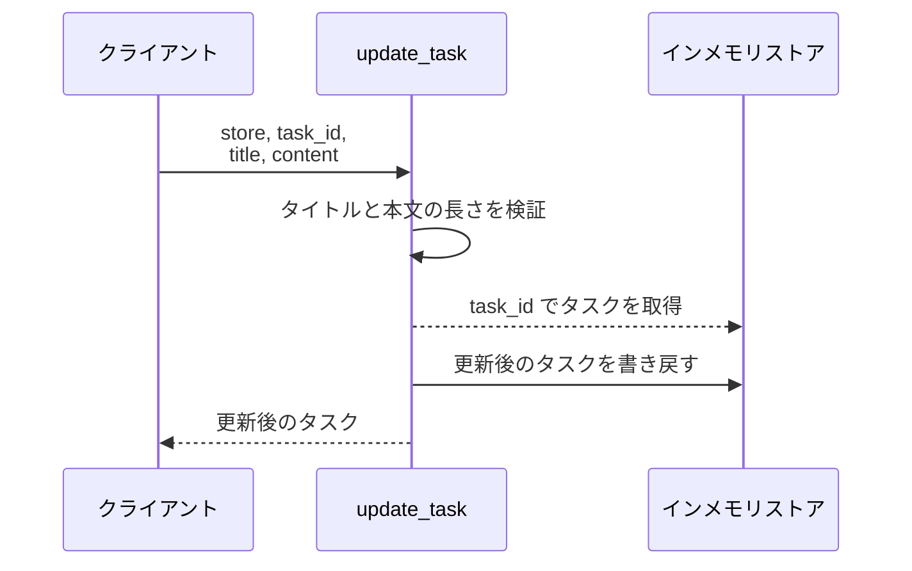
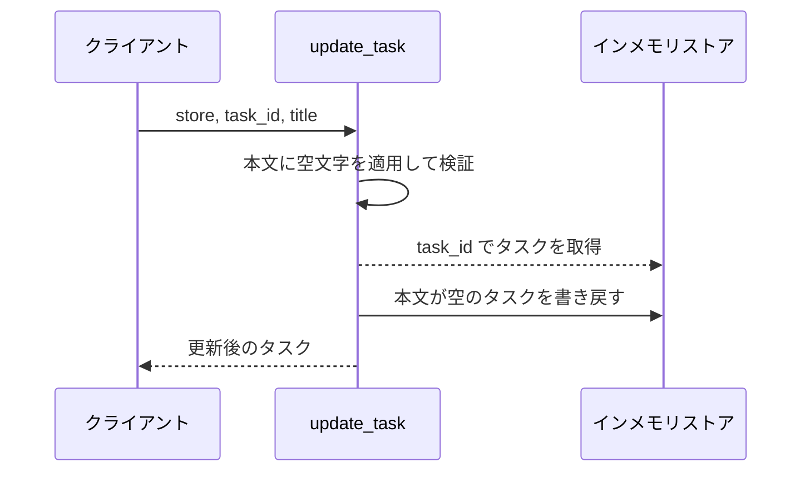
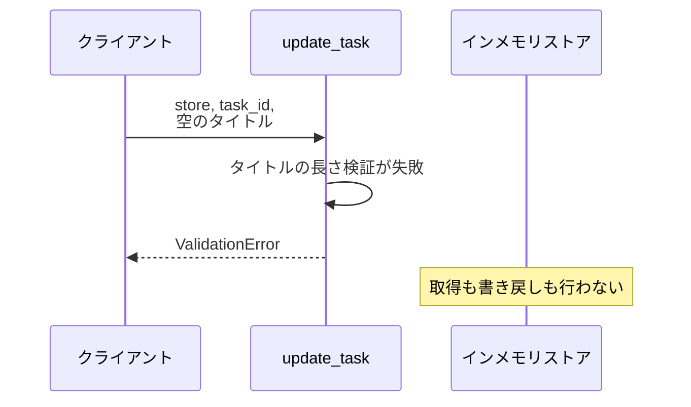
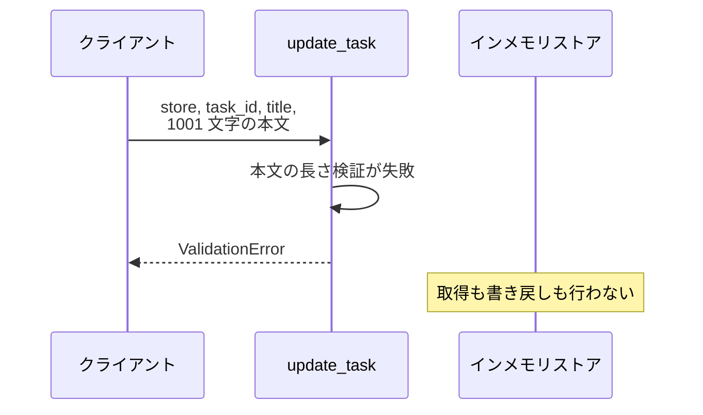
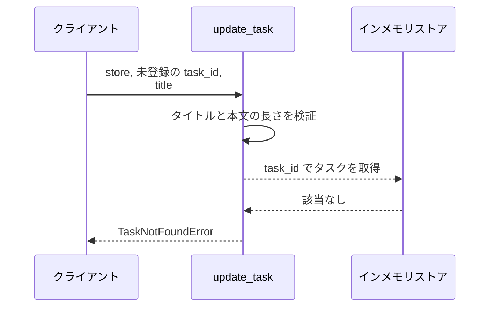

# タスク更新

操作: `update_task`（サービス層の公開関数）

登録済みタスクのタイトルと本文を受け取って検証し、ストア上のタスクを差し替えて返す。

- 対応テストファイル: -

## インターフェース

### リクエスト

| パラメータ | 型 | 必須 | デフォルト | 説明 | 制限 | 補足 |
| --- | --- | --- | --- | --- | --- | --- |
| `store` | `dict[str, Task]` | ✅ | - | 更新対象のタスクを保持するストア | - | 呼び出し元が保持する |
| `task_id` | `str` | ✅ | - | 更新対象タスクの ID | - | - |
| `title` | `str` | ✅ | - | 更新後のタイトル | 1 文字以上 100 文字以内 | - |
| `content` | `str` | - | `""` | 更新後の本文 | 1000 文字以内 | 省略すると本文が空文字で上書きされる |

リクエスト例:

```python
update_task(store, "t1", "新タイトル", "新本文")
```

### レスポンス

| フィールド | 型 | 説明 | 制限 | 補足 |
| --- | --- | --- | --- | --- |
| `id` | `str` | タスク ID | - | 更新前と同じ値 |
| `title` | `str` | 更新後のタイトル | - | - |
| `content` | `str` | 更新後の本文 | - | - |

レスポンス例:

```python
Task(id="t1", title="新タイトル", content="新本文")
```

補足:

- 戻り値と同じ内容が `store[task_id]` にも書き戻される
- 同じ引数で複数回呼んでも結果は変わらない

### 例外

| 例外 | 発生条件 | 補足 |
| --- | --- | --- |
| なし（正常終了） | 更新成功 | 戻り値はレスポンス表のとおり |
| `ValidationError` | `title` が 1 文字未満または 100 文字超 | - |
| `ValidationError` | `content` が 1000 文字超 | - |
| `TaskNotFoundError` | `task_id` が `store` に存在しない | - |

## 制約

| 項目 | 制約 | 補足 |
| --- | --- | --- |
| 認可 | 制限なし | 認証・認可の機構を持たない |
| タイムアウト | 制限なし | - |
| 検証順序 | `title` → `content` → タスクの存在 の順に検証する | 先に失敗した検証の例外だけが送出される |
| 永続化 | 引数の `store` を直接書き換える | プロセス終了で内容は失われる |

## フロー一覧

| 分類 | フロー名 | 概要 | 補足 |
| --- | --- | --- | --- |
| 正常 | 正常系 | タイトルと本文を更新して返す | - |
| 正常 | 正常系（本文の省略） | 本文を空文字で上書きして返す | - |
| 異常 | 異常系（タイトル長違反・ValidationError） | 1〜100 文字の範囲外で拒否する | - |
| 異常 | 異常系（本文長超過・ValidationError） | 1000 文字超で拒否する | - |
| 異常 | 異常系（タスク未登録・TaskNotFoundError） | 未登録の ID で拒否する | - |

## 正常系

### セットアップ

| セットアップ | 説明 | 補足 |
| --- | --- | --- |
| Mock | なし（インメモリストアを実物のまま使う） | - |
| タスク | `t1` のタスクをストアに登録済み | タイトル・本文とも更新前の値 |

### フロー



### 期待値

- 更新後のタイトル・本文を持つタスクが返る
- `store[task_id]` が更新後のタスクに置き換わっている

## 正常系（本文の省略）

### セットアップ

| セットアップ | 説明 | 補足 |
| --- | --- | --- |
| Mock | なし（インメモリストアを実物のまま使う） | - |
| タスク | `t1` のタスクをストアに登録済み | 本文に更新前の値が入っている |
| 入力 | `content` を渡さずに呼び出す | デフォルト値の適用を誘発 |

### フロー



### 期待値

- 返るタスクの本文が空文字になっている
- `store[task_id]` の本文も空文字になっている

## 異常系（タイトル長違反・ValidationError）

### セットアップ

| セットアップ | 説明 | 補足 |
| --- | --- | --- |
| Mock | なし（インメモリストアを実物のまま使う） | - |
| タスク | `t1` のタスクをストアに登録済み | - |
| 入力 | `title` に空文字を渡す | 検証失敗を決定的に誘発 |

### フロー



### 期待値

- `ValidationError` が送出される
- `store[task_id]` が更新前のまま変わっていない

## 異常系（本文長超過・ValidationError）

### セットアップ

| セットアップ | 説明 | 補足 |
| --- | --- | --- |
| Mock | なし（インメモリストアを実物のまま使う） | - |
| タスク | `t1` のタスクをストアに登録済み | - |
| 入力 | `content` に 1001 文字を渡す | 検証失敗を決定的に誘発 |

### フロー



### 期待値

- `ValidationError` が送出される
- `store[task_id]` が更新前のまま変わっていない

## 異常系（タスク未登録・TaskNotFoundError）

### セットアップ

| セットアップ | 説明 | 補足 |
| --- | --- | --- |
| Mock | なし（インメモリストアを実物のまま使う） | - |
| タスク | `t1` のタスクをストアに登録済み | - |
| 入力 | ストアに無い `task_id` を渡す | 取得失敗を決定的に誘発 |

### フロー



### 期待値

- `TaskNotFoundError` が送出される
- ストアに新しいタスクが増えていない
