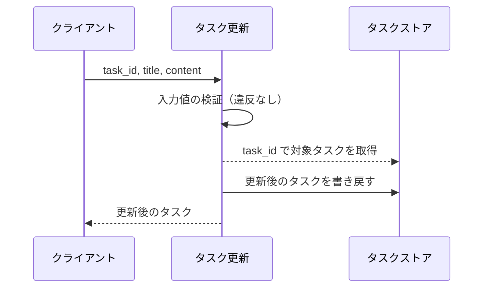
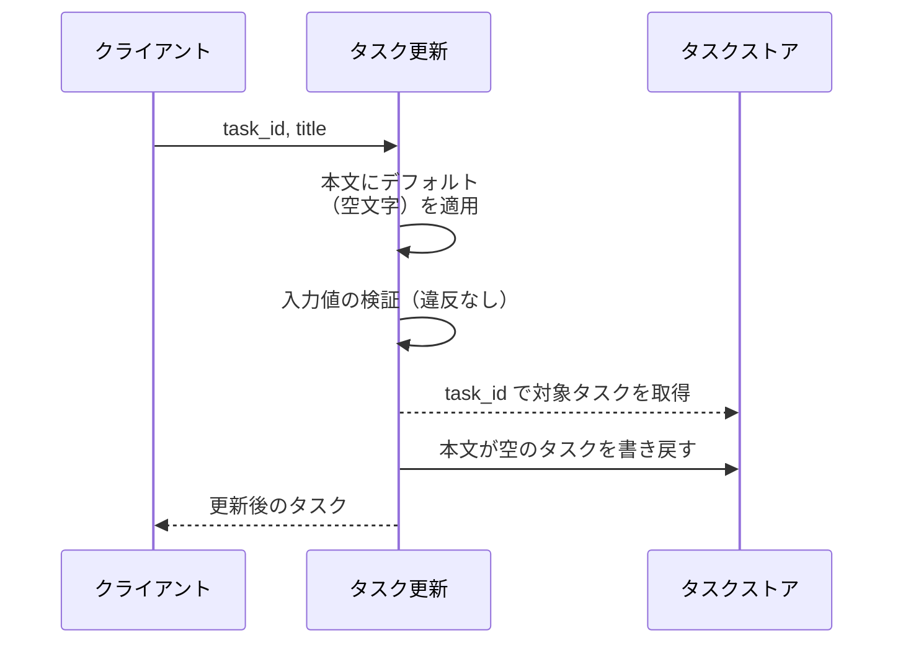
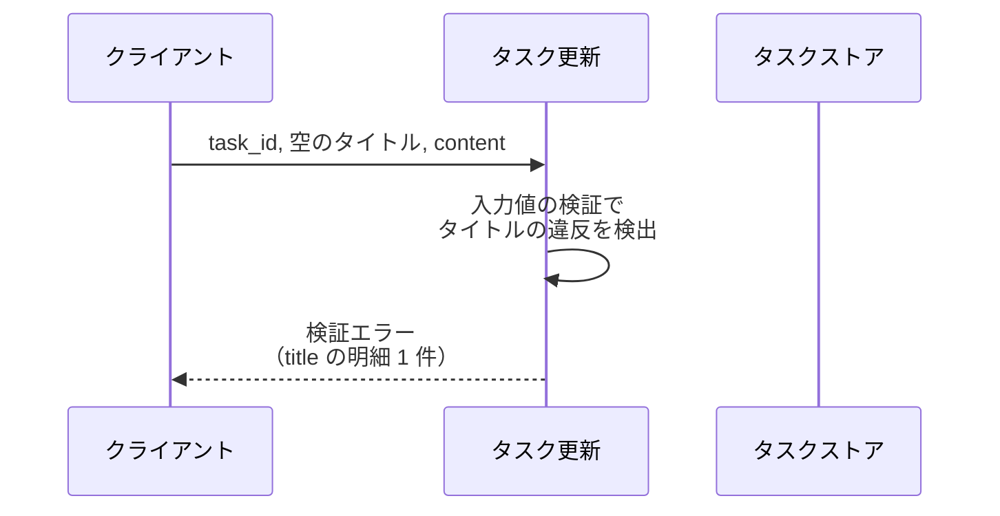
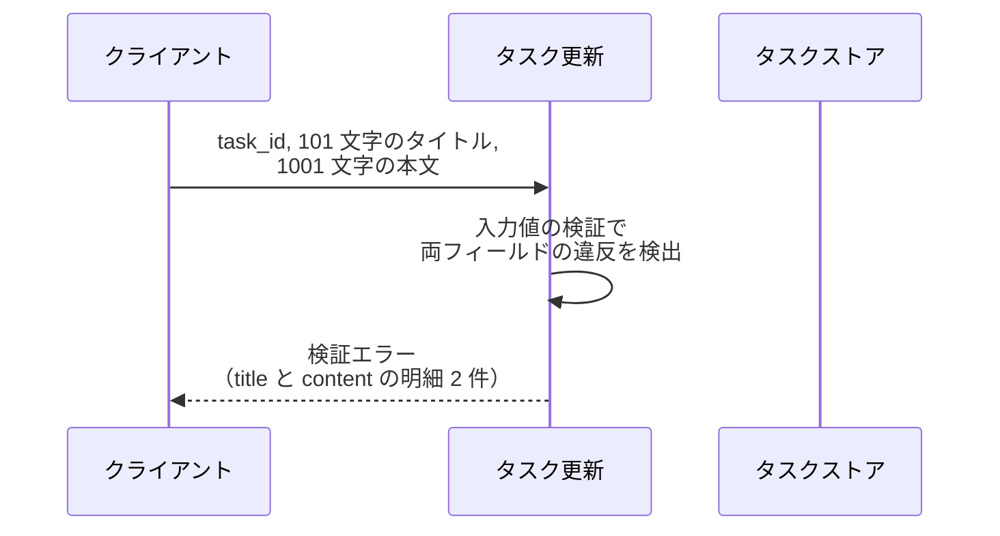
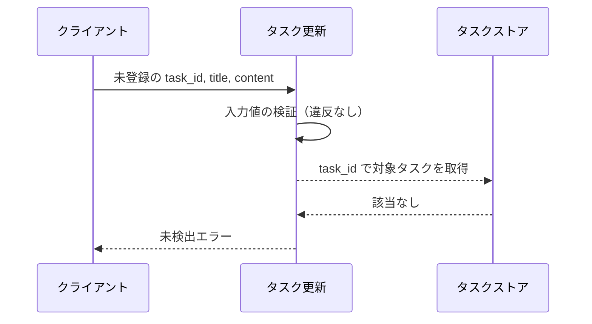

# タスク更新

操作: `update_task`（`src/tasks/service.py`）
呼び出し元: タスク編集画面（フロントエンド）

登録済みタスクのタイトルと本文を更新し、更新後のタスクを返す。

- 対応テストファイル: 未記入

## インターフェース

### リクエスト

| パラメータ | 型 | 必須 | デフォルト | 説明 | 制限 | 補足 |
| --- | --- | --- | --- | --- | --- | --- |
| `task_id` | `str` | ✅ | - | 更新対象のタスク ID | - | 既に登録済みの ID のみ |
| `title` | `str` | ✅ | - | タスク名 | 1 文字以上 100 文字以内 | 空文字は不可 |
| `content` | `str` | - | `""`（本文を空にして上書き） | タスク本文 | 1000 文字以内 | 空文字を許容 |

リクエスト例:

```json
{
  "task_id": "t1",
  "title": "決算資料の作成",
  "content": "四半期分の売上をまとめる"
}
```

### レスポンス

| フィールド | 型 | 説明 | 制限 | 補足 |
| --- | --- | --- | --- | --- |
| `task` | `Task` | 更新後のタスク | - | ストアに書き戻した値と同一 |
| `task.id` | `str` | タスク ID | - | リクエストの `task_id` と同じ値 |
| `task.title` | `str` | 更新後のタスク名 | - | - |
| `task.content` | `str` | 更新後の本文 | - | 省略時は `""` |

レスポンス例:

```json
{
  "task": {
    "id": "t1",
    "title": "決算資料の作成",
    "content": "四半期分の売上をまとめる"
  }
}
```

補足:

- 同じリクエストを繰り返しても結果は変わらない（更新は全項目の上書きで、差分加算を行わない）
- HTTP サーバーを持たない構成のためステータスコードは返さない。
  失敗は例外の送出で表し、区別は例外の型で行う（`## 異常系（{条件}）` 参照）

## 制約

| 項目 | 制約 | 補足 |
| --- | --- | --- |
| タイムアウト | 制限なし | 同一プロセス内のメモリストア操作のみで外部通信を伴わない |
| 認可 | 制限なし | 認証機構を持たないため呼び出し元を問わない |
| 応答時間 | 1 秒以内 | 非機能要件（システム要件（SA）） |
| 更新できる項目 | タイトルと本文のみ | ID は変更できない |
| 検証の打ち切り | 打ち切らず全フィールドを検証する | 違反を全件まとめて返す（フィールド直下のインライン表示に対応するため） |
| 検証と対象存在確認の順序 | 検証が先、対象タスクの取得が後 | 両方が失敗する入力では検証エラーだけが返る |

## フロー一覧

| 分類 | フロー名 | 概要 | 補足 |
| --- | --- | --- | --- |
| 正常 | 正常系 | タイトルと本文を更新して更新後のタスクを返す | - |
| 正常 | 正常系（本文の省略） | 本文を空文字で上書きする | - |
| 異常 | 異常系（タイトル未入力・検証エラー） | 空のタイトル → 検証エラーで保存しない | - |
| 異常 | 異常系（文字数超過・検証エラー） | タイトルと本文が同時に上限超過 → 違反 2 件を 1 回で返す | 全件収集の確認 |
| 異常 | 異常系（対象タスクなし・未検出エラー） | 未登録の `task_id` → 未検出エラー | - |

## 正常系

### セットアップ

| セットアップ | 説明 | 補足 |
| --- | --- | --- |
| Mock | なし（タスクストアは実物の dict を使う） | 外部依存を持たない |
| タスク | `t1` のタスクを登録済み | タイトル `旧タイトル` / 本文 `旧本文` |

### フロー



### 期待値

- 更新後のタイトルと本文を持つタスクが返る
- ストアの `t1` が更新後のタスクに置き換わっている
- タスク ID は更新前と同じ値のまま

## 正常系（本文の省略）

### セットアップ

| セットアップ | 説明 | 補足 |
| --- | --- | --- |
| Mock | なし（タスクストアは実物の dict を使う） | 外部依存を持たない |
| タスク | `t1` のタスクを登録済み | 本文 `旧本文` が入っている |
| 入力 | 本文を指定せずに送信 | デフォルト適用を決定的に誘発 |

### フロー



### 期待値

- 返るタスクの本文が `""` になっている
- ストアの `t1` の本文も `""` に置き換わっている（更新前の本文は残らない）

## 異常系（タイトル未入力・検証エラー）

### セットアップ

| セットアップ | 説明 | 補足 |
| --- | --- | --- |
| Mock | なし（タスクストアは実物の dict を使う） | 外部依存を持たない |
| タスク | `t1` のタスクを登録済み | - |
| 入力 | タイトルを空文字にして送信 | 検証失敗を決定的に誘発 |

### フロー



### 期待値

- 検証エラーが送出され、明細はタイトル 1 件だけになっている
- 明細にフィールド名 `title` と理由が入っている
- ストアの `t1` が更新前のまま変わっていない

エラー明細例:

```json
{
  "errors": [
    { "field": "title", "message": "タイトルは 1 文字以上 100 文字以内で入力してください" }
  ]
}
```

## 異常系（文字数超過・検証エラー）

### セットアップ

| セットアップ | 説明 | 補足 |
| --- | --- | --- |
| Mock | なし（タスクストアは実物の dict を使う） | 外部依存を持たない |
| タスク | `t1` のタスクを登録済み | - |
| 入力 | タイトル 101 文字 + 本文 1001 文字で送信 | 2 フィールド同時の違反を決定的に誘発 |

### フロー



### 期待値

- 検証エラーが送出され、明細が 2 件（`title` と `content`）になっている
- 先頭の違反で打ち切られず、両フィールド分がまとめて返る
- ストアの `t1` が更新前のまま変わっていない

エラー明細例:

```json
{
  "errors": [
    { "field": "title", "message": "タイトルは 1 文字以上 100 文字以内で入力してください" },
    { "field": "content", "message": "本文は 1000 文字以内で入力してください" }
  ]
}
```

## 異常系（対象タスクなし・未検出エラー）

### セットアップ

| セットアップ | 説明 | 補足 |
| --- | --- | --- |
| Mock | なし（タスクストアは実物の dict を使う） | 外部依存を持たない |
| タスク | `t1` のタスクを登録済み | - |
| 入力 | 未登録の `task_id` に有効なタイトルを添えて送信 | 検証を通過させて未検出を決定的に誘発 |

### フロー



### 期待値

- 未検出エラーが送出される
- ストアに新しいタスクが作られていない（更新は新規作成を兼ねない）
- ストアの `t1` が更新前のまま変わっていない
