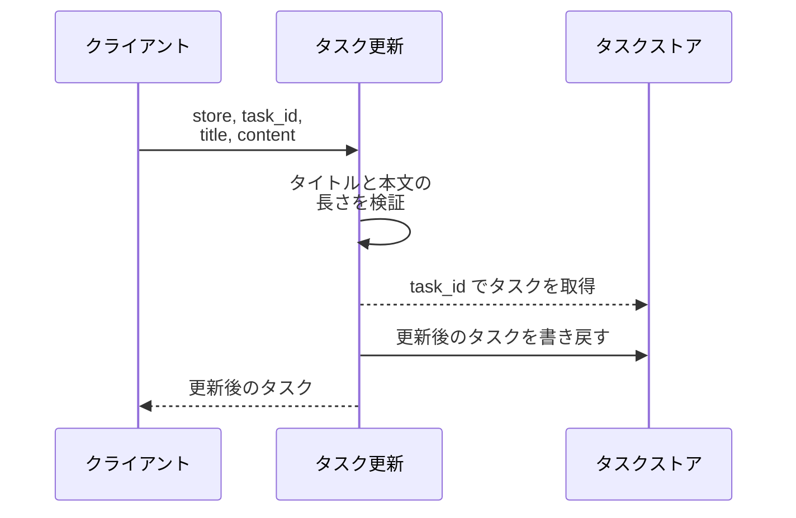
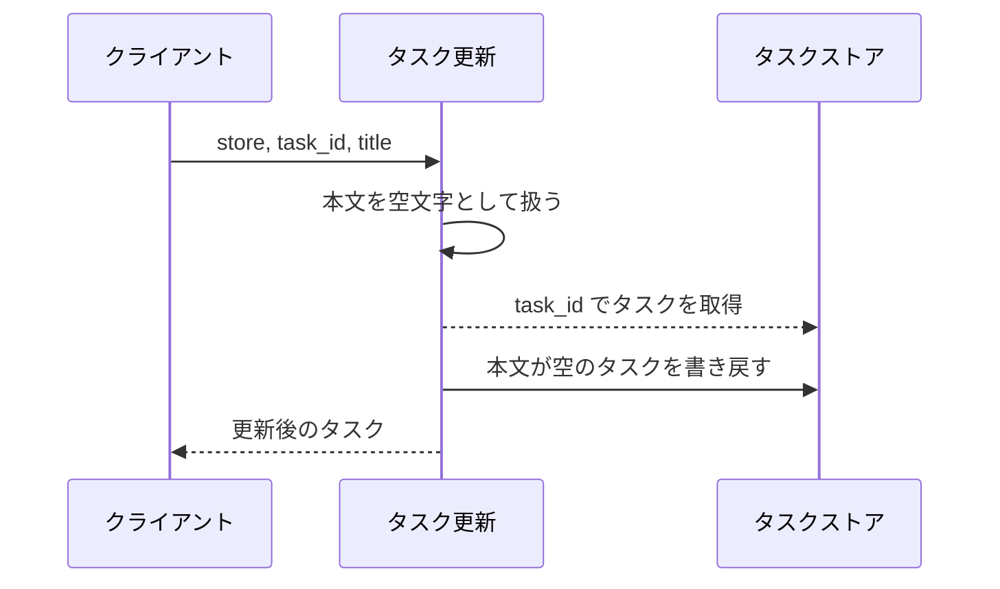
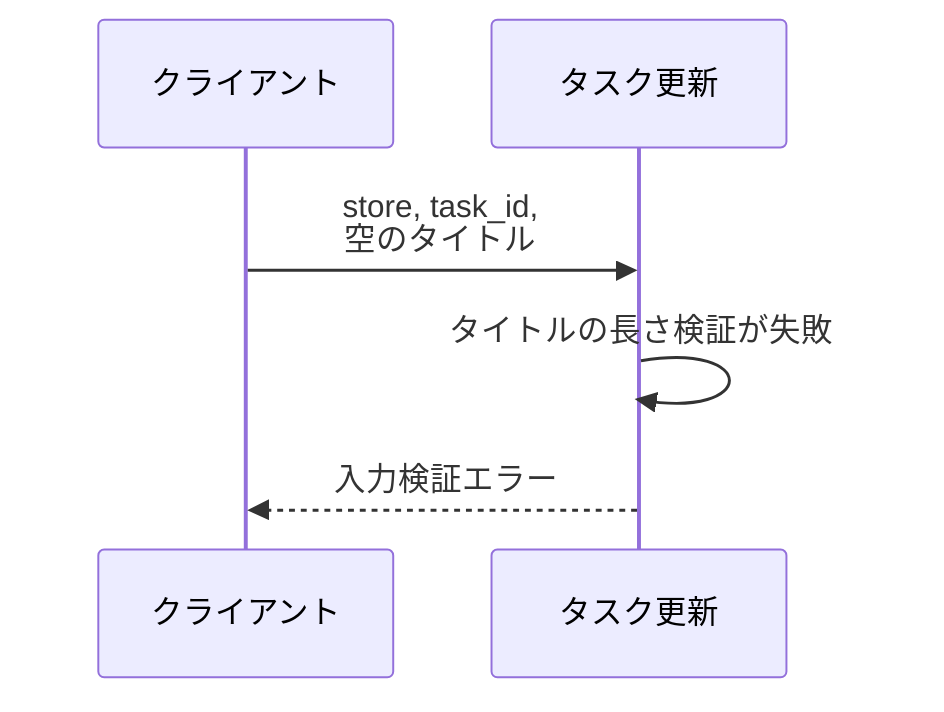
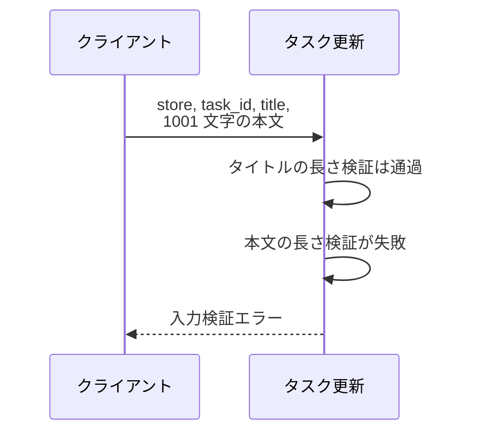
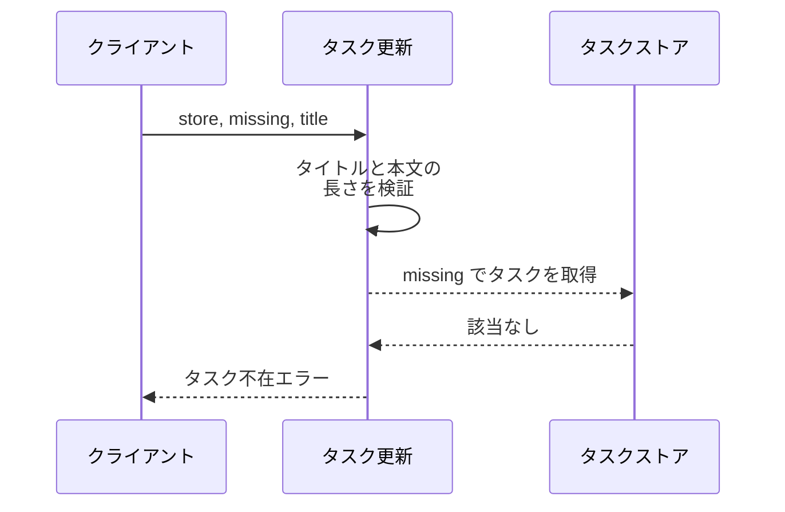

# タスク更新

エンドポイント: なし（HTTP サーバーを持たないため `src/tasks/service.py` の `update_task` をバックエンドの境界とする）

登録済みタスクのタイトルと本文を更新し、更新後のタスクを返す操作。

- 対応テストファイル: なし（`テスト/テスト実行方法.md` の「結合テスト（バック）」が `なし` のため）

## インターフェース

### リクエスト

| パラメータ | 型 | 必須 | デフォルト | 説明 | 制限 | 補足 |
| --- | --- | --- | --- | --- | --- | --- |
| `store` | `dict[str, Task]` | ✅ | - | 更新対象を保持するタスクストア | - | 呼び出し側が保持するインメモリの辞書。キーはタスク ID |
| `task_id` | `str` | ✅ | - | 更新対象のタスク ID | - | `store` のキーと一致する値 |
| `title` | `str` | ✅ | - | 更新後のタイトル | 1 文字以上 100 文字以内 | - |
| `content` | `str` | - | `""` | 更新後の本文 | 1000 文字以内 | 省略すると空文字で上書きする |

リクエスト例:

```python
update_task(store, "t1", "新タイトル", "新本文")
```

### レスポンス

| フィールド | 型 | 説明 | 制限 | 補足 |
| --- | --- | --- | --- | --- |
| `task` | `Task` | 更新後のタスク | - | 同じ値が `store[task_id]` にも書き戻される |
| `task.id` | `str` | タスク ID | - | 更新前と同じ値を保つ |
| `task.title` | `str` | 更新後のタイトル | - | - |
| `task.content` | `str` | 更新後の本文 | - | 省略時は空文字 |

レスポンス例:

```python
Task(id="t1", title="新タイトル", content="新本文")
```

補足:

- 同じ引数で複数回呼んでも結果は変わらない（冪等）

## 制約

| 項目 | 制約 | 補足 |
| --- | --- | --- |
| タイムアウト | 制限なし | インメモリの辞書操作のみで外部通信を伴わない |
| 認可 | 制限なし | 認証・認可の機構を持たない |
| 同時更新 | 制限なし | 排他制御を持たず後勝ちになる |
| 更新できる項目 | タイトルと本文のみ | `id` は更新対象にしない |

## フロー一覧

| 分類 | フロー名 | 概要 | 補足 |
| --- | --- | --- | --- |
| 正常 | 正常系 | タイトルと本文を更新して更新後のタスクを返す | シナリオ「タスク編集」の正常シナリオに対応 |
| 正常 | 正常系（本文を省略） | 本文を空文字で上書きして返す | - |
| 異常 | 異常系（タイトル長違反） | タイトルの長さが範囲外で入力検証エラー | シナリオ「タスク編集」の異常シナリオに対応 |
| 異常 | 異常系（本文長違反） | 本文が上限超過で入力検証エラー | - |
| 異常 | 異常系（対象タスク不在） | 未登録の ID を指定してタスク不在エラー | - |

## 正常系

### セットアップ

| セットアップ | 説明 | 補足 |
| --- | --- | --- |
| Mock | なし | インメモリのタスクストアを実体のまま使う |
| タスク | `t1`（タイトル `旧タイトル` / 本文 `旧本文`）を 1 件登録済み | - |

### フロー



### 期待値

- タイトルと本文が入力値に置き換わったタスクが返る
- タスクストアの `t1` も返り値と同じ内容に置き換わっている
- タスク ID は更新前と同じ

## 正常系（本文を省略）

### セットアップ

| セットアップ | 説明 | 補足 |
| --- | --- | --- |
| Mock | なし | インメモリのタスクストアを実体のまま使う |
| タスク | `t1`（タイトル `旧タイトル` / 本文 `旧本文`）を 1 件登録済み | - |
| 入力 | `content` を渡さずに送信 | デフォルト値の適用を決定的に誘発 |

### フロー



### 期待値

- 返るタスクの本文が空文字になっている
- タスクストアの `t1` の本文も空文字に置き換わっている

## 異常系（タイトル長違反）

### セットアップ

| セットアップ | 説明 | 補足 |
| --- | --- | --- |
| Mock | なし | インメモリのタスクストアを実体のまま使う |
| タスク | `t1`（タイトル `旧タイトル` / 本文 `旧本文`）を 1 件登録済み | - |
| 入力 | タイトルを空文字にして送信 | 検証失敗を決定的に誘発 |

### フロー



### 期待値

- 入力検証エラーが送出される
- タスクストアの `t1` は更新前の内容のまま変化していない

## 異常系（本文長違反）

### セットアップ

| セットアップ | 説明 | 補足 |
| --- | --- | --- |
| Mock | なし | インメモリのタスクストアを実体のまま使う |
| タスク | `t1`（タイトル `旧タイトル` / 本文 `旧本文`）を 1 件登録済み | - |
| 入力 | 本文を 1001 文字にして送信 | 検証失敗を決定的に誘発 |

### フロー



### 期待値

- 入力検証エラーが送出される
- タスクストアの `t1` は更新前の内容のまま変化していない

## 異常系（対象タスク不在）

### セットアップ

| セットアップ | 説明 | 補足 |
| --- | --- | --- |
| Mock | なし | インメモリのタスクストアを実体のまま使う |
| タスク | `t1`（タイトル `旧タイトル` / 本文 `旧本文`）を 1 件登録済み | - |
| 入力 | 未登録の `missing` を `task_id` に指定して送信 | 取得失敗を決定的に誘発 |

### フロー



### 期待値

- タスク不在エラーが送出される
- タスクストアに `missing` のタスクは追加されていない
- タスクストアの `t1` は更新前の内容のまま変化していない
