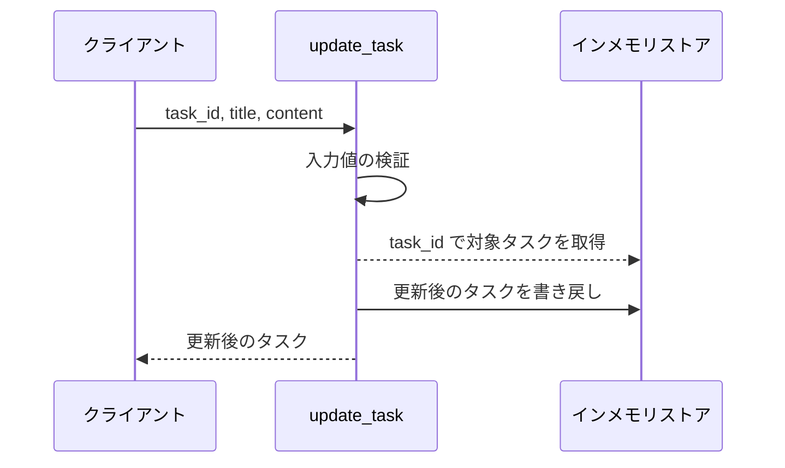
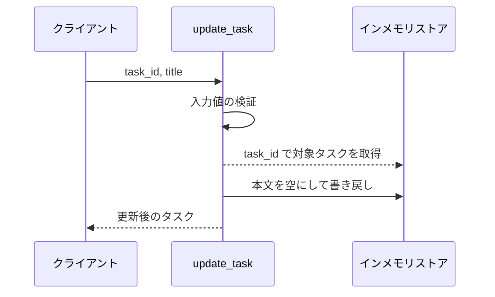
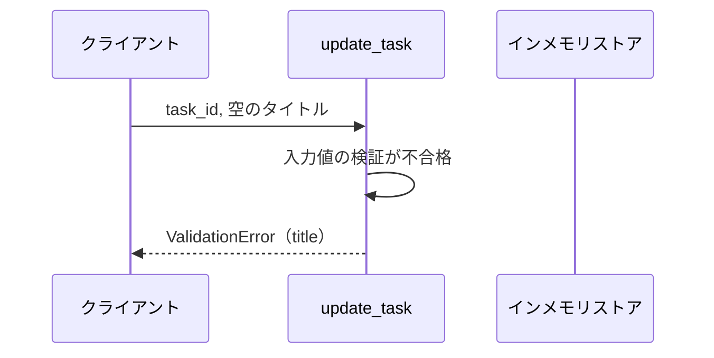
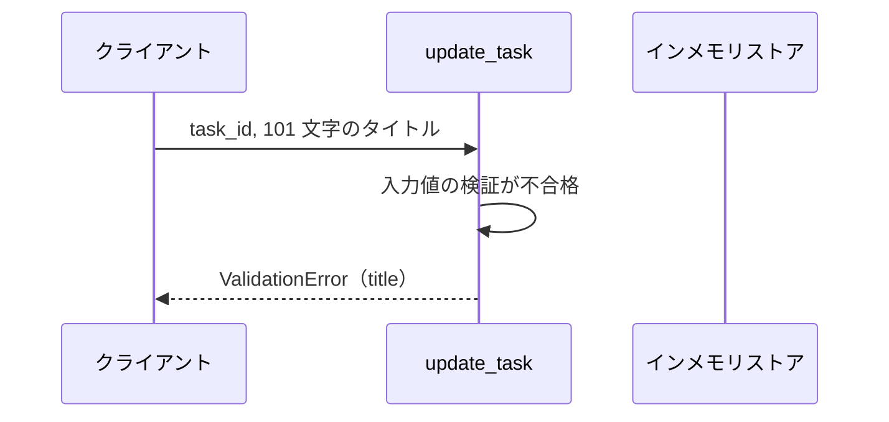
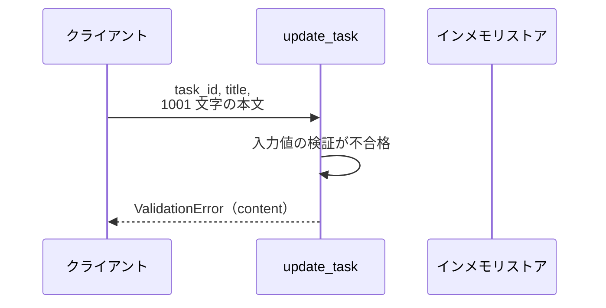
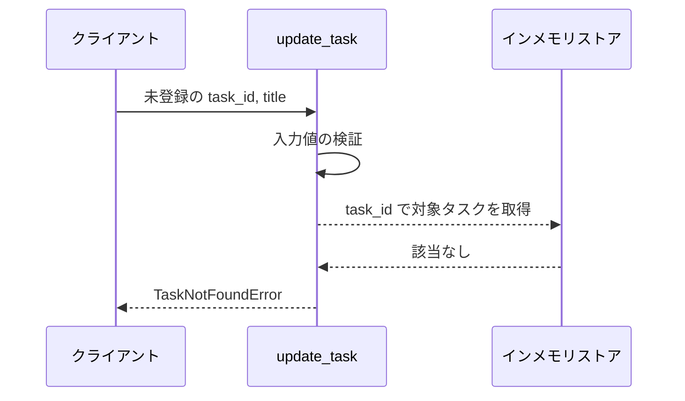

# タスク更新

操作: `update_task`（サービス層の公開関数）

登録済みタスクのタイトルと本文を更新し、更新後のタスクを返す。

- 対応テストファイル: -

## インターフェース

### リクエスト

| パラメータ | 型 | 必須 | デフォルト | 説明 | 制限 | 補足 |
| --- | --- | --- | --- | --- | --- | --- |
| `task_id` | `str` | ✅ | - | 更新対象のタスク ID | - | 未登録の ID は異常系 |
| `title` | `str` | ✅ | - | タスク名 | 1 文字以上 100 文字以内 | 空文字は不可 |
| `content` | `str` | - | `""`（本文を空にする） | タスク本文 | 1000 文字以内 | 省略時は既存本文を空にする |

リクエスト例:

```json
{
  "task_id": "t1",
  "title": "決算資料の作成",
  "content": "四半期分の売上をまとめる"
}
```

### レスポンス

| フィールド | 型 | 説明 | 制限 | 補足 |
| --- | --- | --- | --- | --- |
| `task` | `Task` | 更新後のタスク | - | 不変オブジェクト |
| `task.id` | `str` | タスク ID | - | リクエストの `task_id` と一致 |
| `task.title` | `str` | 更新後のタスク名 | - | - |
| `task.content` | `str` | 更新後の本文 | - | 省略時は空文字 |

レスポンス例:

```json
{
  "task": {
    "id": "t1",
    "title": "決算資料の作成",
    "content": "四半期分の売上をまとめる"
  }
}
```

**補足:**
- 同じリクエストを複数回実行しても結果は変わらない（冪等）
- 返すタスクはストアに保持されているものと同じ値を持つ別インスタンス

### 例外

| 例外 | 発生条件 | 補足 |
| --- | --- | --- |
| なし（正常終了） | 更新成功 | 戻り値はレスポンス表のとおり |
| `ValidationError` | `title` が空文字 | `field` に `title` を持つ |
| `ValidationError` | `title` が 100 文字を超える | `field` に `title` を持つ |
| `ValidationError` | `content` が 1000 文字を超える | `field` に `content` を持つ |
| `TaskNotFoundError` | `task_id` のタスクが未登録 | ストアは変更しない |

## 制約

| 項目 | 制約 | 補足 |
| --- | --- | --- |
| タイムアウト | 1 秒以内に応答する | 非機能要件（更新は 1 秒以内に応答する） |
| 認可 | 制限なし | 呼び出し元の認証・権限は本操作では検証しない |
| 更新の範囲 | `title` と `content` の全置換 | 指定フィールドのみを更新する部分更新は行わない |
| 同時実行 | 制限なし | 排他制御を行わず、後着の更新が先着の更新を上書きする |

## フロー一覧

| 分類 | フロー名 | 概要 | 補足 |
| --- | --- | --- | --- |
| 正常 | 正常系 | タイトルと本文を更新して更新後のタスクを返す | - |
| 正常 | 正常系（本文の省略） | 本文を空にして更新する | - |
| 異常 | 異常系（タイトルが空・ValidationError） | 空のタイトルを弾いて更新しない | - |
| 異常 | 異常系（タイトル超過・ValidationError） | 101 文字のタイトルを弾いて更新しない | - |
| 異常 | 異常系（本文超過・ValidationError） | 1001 文字の本文を弾いて更新しない | - |
| 異常 | 異常系（タスク未登録・TaskNotFoundError） | 未登録の ID を弾いて更新しない | - |

## 正常系

### セットアップ

| セットアップ | 説明 | 補足 |
| --- | --- | --- |
| Mock | インメモリストアを空の dict で用意 | 実 DB は使わない |
| タスク | `t1` のタスクを登録済み | タイトル・本文とも値あり |

### フロー



### 期待値

- 更新後のタスクが返り、`title` と `content` がリクエストの値になっている
- ストアの `t1` も同じ値に置き換わっている

## 正常系（本文の省略）

### セットアップ

| セットアップ | 説明 | 補足 |
| --- | --- | --- |
| Mock | インメモリストアを空の dict で用意 | 実 DB は使わない |
| タスク | `t1` のタスクを登録済み | 本文に値が入っている |
| 入力 | `content` を省略して呼び出す | 全置換の挙動を決定的に誘発 |

### フロー



### 期待値

- 返るタスクの `content` が空文字になっている
- ストアの `t1` の本文も空文字に置き換わっている

## 異常系（タイトルが空・ValidationError）

### セットアップ

| セットアップ | 説明 | 補足 |
| --- | --- | --- |
| Mock | インメモリストアを空の dict で用意 | 実 DB は使わない |
| タスク | `t1` のタスクを登録済み | - |
| 入力 | `title` に空文字を渡す | 検証失敗を決定的に誘発 |

### フロー



### 期待値

- `ValidationError` が送出され、`field` が `title` になっている
- ストアの `t1` は更新前のまま

## 異常系（タイトル超過・ValidationError）

### セットアップ

| セットアップ | 説明 | 補足 |
| --- | --- | --- |
| Mock | インメモリストアを空の dict で用意 | 実 DB は使わない |
| タスク | `t1` のタスクを登録済み | - |
| 入力 | `title` に 101 文字を渡す | 上限超過を決定的に誘発 |

### フロー



### 期待値

- `ValidationError` が送出され、`field` が `title` になっている
- ストアの `t1` は更新前のまま

## 異常系（本文超過・ValidationError）

### セットアップ

| セットアップ | 説明 | 補足 |
| --- | --- | --- |
| Mock | インメモリストアを空の dict で用意 | 実 DB は使わない |
| タスク | `t1` のタスクを登録済み | - |
| 入力 | `content` に 1001 文字を渡す | 上限超過を決定的に誘発 |

### フロー



### 期待値

- `ValidationError` が送出され、`field` が `content` になっている
- ストアの `t1` は更新前のまま

## 異常系（タスク未登録・TaskNotFoundError）

### セットアップ

| セットアップ | 説明 | 補足 |
| --- | --- | --- |
| Mock | インメモリストアを空の dict で用意 | 実 DB は使わない |
| タスク | `t1` のタスクを登録済み | - |
| 入力 | 未登録の `task_id` を渡す | 取得失敗を決定的に誘発 |

### フロー



### 期待値

- `TaskNotFoundError` が送出される
- ストアに新しいタスクは追加されず、`t1` も更新前のまま
