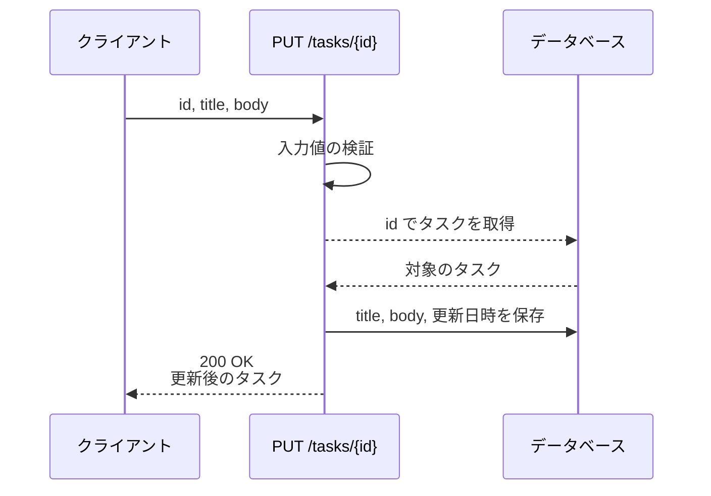
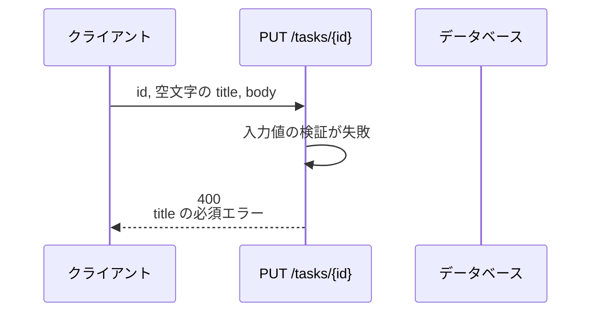
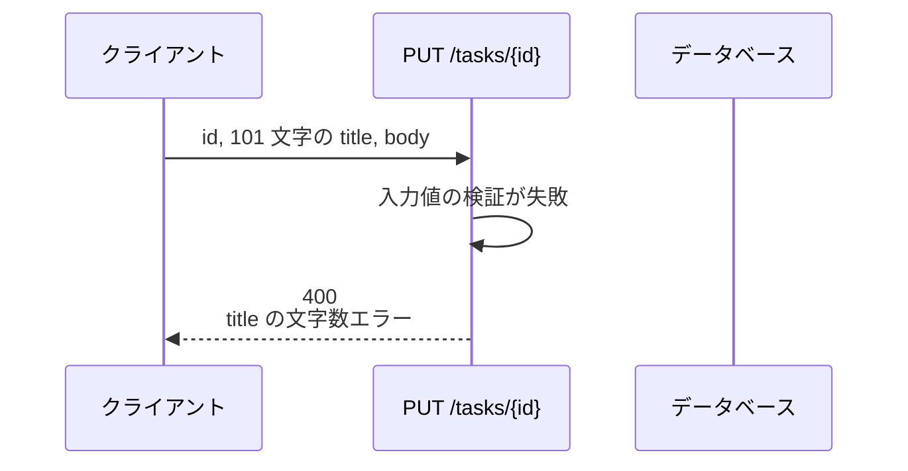
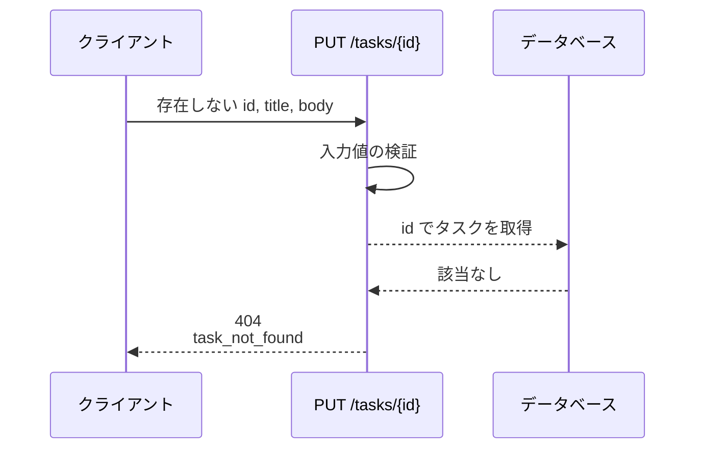

# タスク更新

エンドポイント: PUT /tasks/{id}

タスクのタイトル・本文を検証したうえで更新し、更新後のタスクを返す。
検証に失敗した場合はフィールド単位のエラー内容を返し、タスクは更新しない。

- 対応テストファイル: 未定（テスト作成後に記入）

## インターフェース

### リクエスト

| パラメータ | 型 | 必須 | デフォルト | 説明 | 制限 | 補足 |
| --- | --- | --- | --- | --- | --- | --- |
| `id` | string | ✅ | - | 更新対象のタスク ID | - | パスパラメータ（UUID） |
| `title` | string | ✅ | - | タスク名 | 1 文字以上 100 文字以内 | 空文字・空白のみは不可 |
| `body` | string | ✅ | - | タスク本文 | 制限なし | 空文字は許容 |

リクエスト例:

```json
{
  "title": "決算資料の作成",
  "body": "四半期分の売上を集計してレビューを依頼する"
}
```

### レスポンス

| フィールド | 型 | 説明 | 制限 | 補足 |
| --- | --- | --- | --- | --- |
| `task` | object | 更新後のタスク | - | - |
| `task.id` | string | タスク ID | - | UUID |
| `task.title` | string | 更新後のタスク名 | - | - |
| `task.body` | string | 更新後のタスク本文 | - | - |
| `task.updatedAt` | string | 更新日時 | - | ISO 8601（UTC） |

レスポンス例:

```json
{
  "task": {
    "id": "3f2b1c88-6b4a-4e51-9a0c-2d7f1e5b8c40",
    "title": "決算資料の作成",
    "body": "四半期分の売上を集計してレビューを依頼する",
    "updatedAt": "2026-07-31T04:12:33+00:00"
  }
}
```

### ステータスコード

| ステータスコード | 発生条件 | 補足 |
| --- | --- | --- |
| `200` | 更新成功 | - |
| `400` | リクエストのバリデーション失敗 | フィールド単位のエラーを返す |
| `404` | 対象タスクが存在しない | - |
| `500` | DB 更新失敗 | - |

## 制約

| 項目 | 制約 | 補足 |
| --- | --- | --- |
| タイムアウト | 応答は 1 秒以内 | #1250 の非機能要件 |
| 認可 | 制限なし | 認証・認可は本サブシステムのスコープ外 |
| レート制限 | 制限なし | - |
| 更新対象フィールド | `title` と `body` のみ | 既存カラムのみを更新する（DB スキーマ変更なし） |
| 検証の実行順 | 全フィールドを検証してからまとめて返す | 最初の 1 件で打ち切らない |

## フロー一覧

| 分類 | フロー名 | 概要 | 補足 |
| --- | --- | --- | --- |
| 正常 | 正常系 | タイトル・本文を更新して更新後のタスクを返す | - |
| 異常 | 異常系（タスク名が空・400） | 検証失敗 → フィールド単位のエラーを返す | - |
| 異常 | 異常系（タスク名が 100 文字超・400） | 検証失敗 → フィールド単位のエラーを返す | - |
| 異常 | 異常系（対象タスクが存在しない・404） | 取得結果が空 → 404 を返す | - |

## 正常系

### セットアップ

| セットアップ | 説明 | 補足 |
| --- | --- | --- |
| Mock | データベースを DB stub に差し替え | - |
| タスク | 更新対象のタスクを 1 件登録済み | `id` は既知の UUID |

### フロー



### 期待値

- `200 OK` + 更新後のタスクが返る
- tasks の該当レコードの `title` / `body` がリクエスト値に更新されている
- 該当レコードの更新日時が更新されている

## 異常系（タスク名が空・400）

### セットアップ

| セットアップ | 説明 | 補足 |
| --- | --- | --- |
| Mock | データベースを DB stub に差し替え | - |
| タスク | 更新対象のタスクを 1 件登録済み | - |
| 入力 | `title` を空文字にして送信 | 検証失敗を決定的に誘発 |

### フロー



### 期待値

- `400` + `title` を指すフィールド単位のエラーが返る
- tasks の該当レコードは更新されていない

## 異常系（タスク名が 100 文字超・400）

### セットアップ

| セットアップ | 説明 | 補足 |
| --- | --- | --- |
| Mock | データベースを DB stub に差し替え | - |
| タスク | 更新対象のタスクを 1 件登録済み | - |
| 入力 | 101 文字の `title` を送信 | 上限超過を決定的に誘発 |

### フロー



### 期待値

- `400` + `title` を指すフィールド単位のエラーが返る
- tasks の該当レコードは更新されていない

## 異常系（対象タスクが存在しない・404）

### セットアップ

| セットアップ | 説明 | 補足 |
| --- | --- | --- |
| Mock | データベースを DB stub に差し替え | - |
| タスク | 対象 ID のタスクを登録しない | 取得結果が空になる状態を作る |
| 入力 | 存在しない `id` を指定して送信 | 未存在を決定的に誘発 |

### フロー



### 期待値

- `404` + `task_not_found` が返る
- tasks のレコードは追加も更新もされていない
