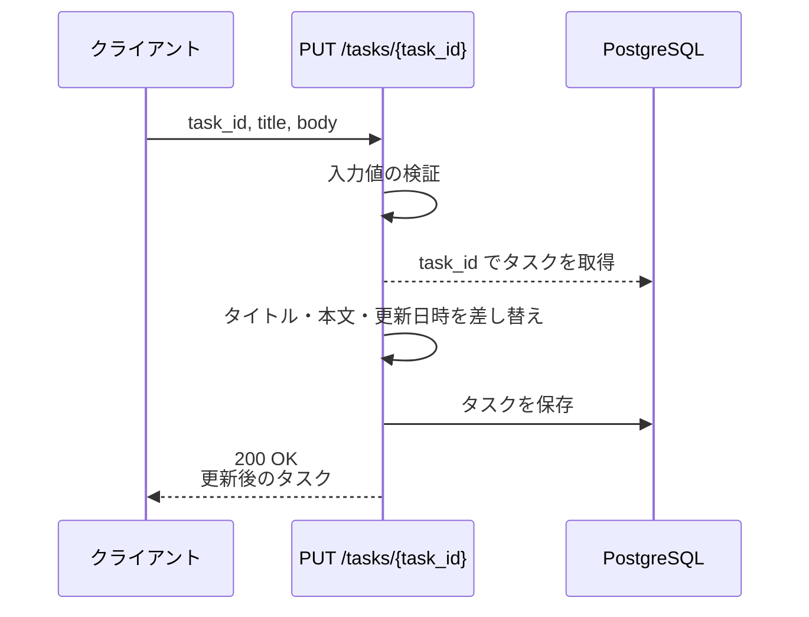
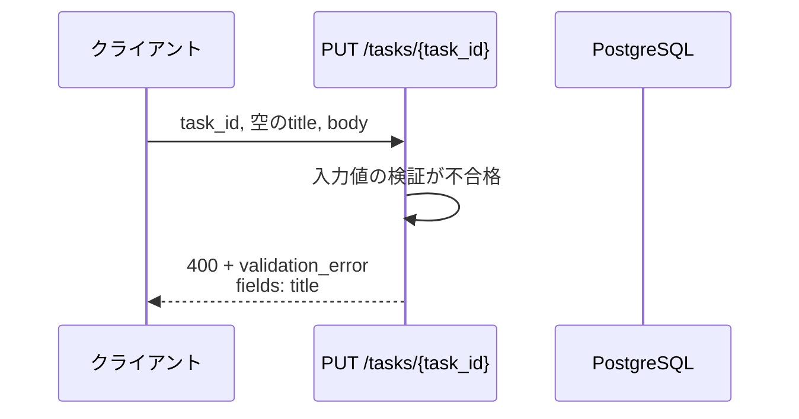
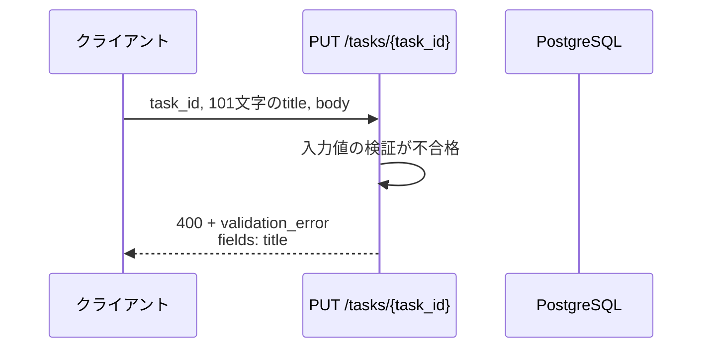
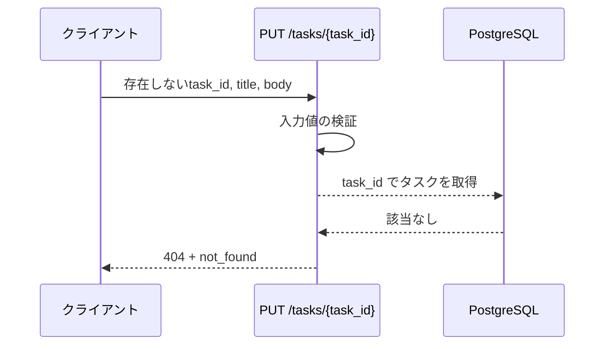
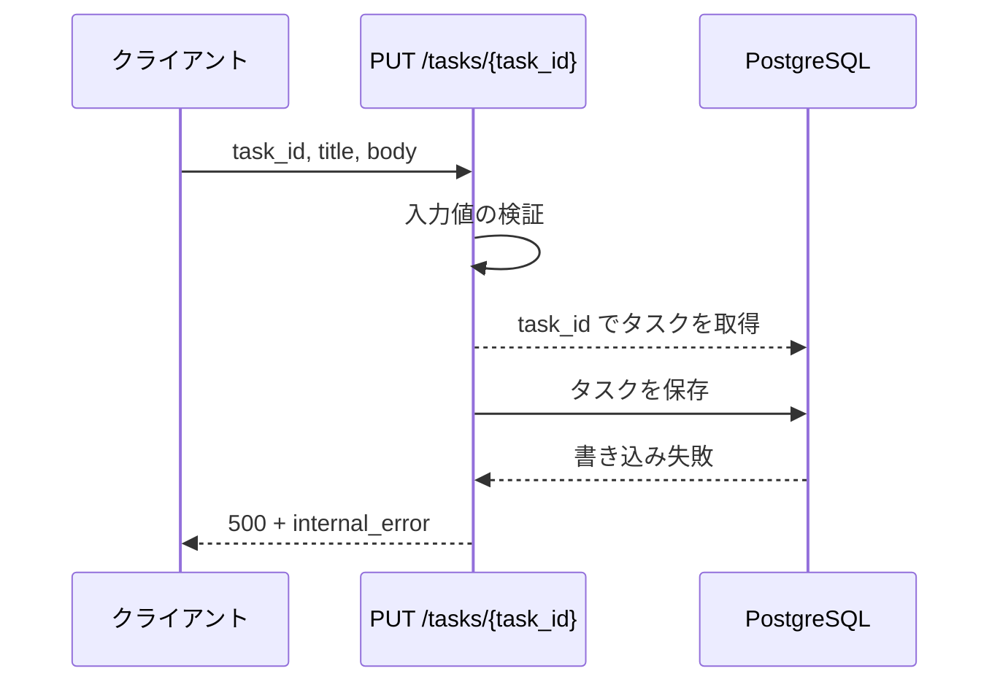

# タスク更新

エンドポイント: PUT /tasks/{task_id}

タスクのタイトル・本文を検証したうえで更新し、更新後のタスクを返す。

- 対応テストファイル: 未記入（テストレビュー時に記入）

## インターフェース

### リクエスト

| パラメータ | 型 | 必須 | デフォルト | 説明 | 制限 | 補足 |
| --- | --- | --- | --- | --- | --- | --- |
| `task_id` | string | ✅ | - | 更新対象のタスク ID | UUID 形式 | パスパラメータ |
| `title` | string | ✅ | - | タスクのタイトル | 1〜100 文字（空文字・空白のみ不可） | - |
| `body` | string \| null | - | `null`（本文を空にする） | タスクの本文 | 制限なし | 省略時は本文を消す（部分更新ではない） |

リクエスト例:

```json
{
  "title": "週次レポート作成",
  "body": "第 3 四半期分をまとめる"
}
```

### レスポンス

| フィールド | 型 | 説明 | 制限 | 補足 |
| --- | --- | --- | --- | --- |
| `id` | string | タスク ID | - | UUID |
| `title` | string | 更新後のタイトル | - | - |
| `body` | string \| null | 更新後の本文 | - | 本文なしは `null` |
| `updated_at` | string | 更新日時（ISO 8601・UTC） | - | 更新のたびに現在時刻へ更新される |

レスポンス例:

```json
{
  "id": "018f8a3c-7b21-7c4e-9f10-2a5d6e7f8091",
  "title": "週次レポート作成",
  "body": "第 3 四半期分をまとめる",
  "updated_at": "2026-08-01T06:30:00Z"
}
```

エラーレスポンス:

| フィールド | 型 | 説明 | 制限 | 補足 |
| --- | --- | --- | --- | --- |
| `error` | `"validation_error"` \| `"not_found"` \| `"internal_error"` | エラー種別 | - | - |
| `message` | string | エラーの概要 | - | 画面のトースト用 |
| `fields` | object[] | フィールド単位のエラー | - | `validation_error` のときのみ含む |
| `fields[].field` | string | 対象フィールド名 | - | リクエストのパラメータ名と一致 |
| `fields[].message` | string | 当該フィールドのエラー内容 | - | 画面のインライン表示用 |

エラーレスポンス例:

```json
{
  "error": "validation_error",
  "message": "入力内容を確認してください",
  "fields": [
    { "field": "title", "message": "タスク名を入力してください" }
  ]
}
```

補足:

- 同じリクエストを再送しても結果は同じになる（全置換のため冪等）

### ステータスコード

| ステータスコード | 発生条件 | 補足 |
| --- | --- | --- |
| `200` | 更新成功 | - |
| `400` | タイトルの検証に失敗 | `fields` に対象フィールドを載せる |
| `404` | 対象タスクが存在しない | - |
| `500` | DB 書き込み失敗 | - |

## 制約

| 項目 | 制約 | 補足 |
| --- | --- | --- |
| タイムアウト | 1 秒以内に応答する | #1439 の非機能要件 |
| 認可 | 制限なし | 認証機構を持たないため、誰でも任意のタスクを更新できる |
| レート制限 | 制限なし | - |
| リクエストボディサイズ | 制限なし | 本文の長さに上限を設けないため |

## フロー一覧

| 分類 | フロー名 | 概要 | 補足 |
| --- | --- | --- | --- |
| 正常 | 正常系 | タイトル・本文を更新して更新後のタスクを返す | - |
| 異常 | 異常系（タイトル空・400） | 空文字のタイトルを検証で弾く | - |
| 異常 | 異常系（タイトル 100 文字超・400） | 上限超過のタイトルを検証で弾く | - |
| 異常 | 異常系（タスク未存在・404） | 対象タスクが無い | - |
| 異常 | 異常系（DB 書き込み失敗・500） | 更新の書き込みに失敗 | 監視対象 |

## 正常系

### セットアップ

| セットアップ | 説明 | 補足 |
| --- | --- | --- |
| Mock | `PostgreSQL` を DB stub に差し替え | - |
| タスク | 更新対象のタスクを 1 件登録済み | タイトル `古いタイトル` / 本文 `古い本文` |
| 入力 | タイトル `週次レポート作成` / 本文 `第 3 四半期分をまとめる` | - |

### フロー



### 期待値

- `200 OK` + 更新後の `id` / `title` / `body` / `updated_at` が返る
- tasks テーブルの当該レコードのタイトル・本文が入力値になっている
- 当該レコードの `updated_at` が更新前より新しくなっている

## 異常系（タイトル空・400）

### セットアップ

| セットアップ | 説明 | 補足 |
| --- | --- | --- |
| Mock | `PostgreSQL` を DB stub に差し替え | - |
| タスク | 更新対象のタスクを 1 件登録済み | - |
| 入力 | タイトルを空文字にして送信 | 検証失敗を決定的に誘発 |

### フロー



### 期待値

- `400` + `error: validation_error` が返る
- `fields` に `field: title` の要素が 1 件含まれる
- tasks テーブルの当該レコードは更新されていない
- DB への取得・保存が 1 度も行われていない

## 異常系（タイトル 100 文字超・400）

### セットアップ

| セットアップ | 説明 | 補足 |
| --- | --- | --- |
| Mock | `PostgreSQL` を DB stub に差し替え | - |
| タスク | 更新対象のタスクを 1 件登録済み | - |
| 入力 | 101 文字のタイトルで送信 | 上限超過を決定的に誘発 |

### フロー



### 期待値

- `400` + `error: validation_error` が返る
- `fields` に `field: title` の要素が 1 件含まれる
- tasks テーブルの当該レコードは更新されていない

## 異常系（タスク未存在・404）

### セットアップ

| セットアップ | 説明 | 補足 |
| --- | --- | --- |
| Mock | `PostgreSQL` を DB stub に差し替え | 取得が該当なしを返す |
| 入力 | 存在しない `task_id` を指定して送信 | 未存在を決定的に誘発 |

### フロー



### 期待値

- `404` + `error: not_found` が返る
- DB への保存が行われていない

## 異常系（DB 書き込み失敗・500）

### セットアップ

| セットアップ | 説明 | 補足 |
| --- | --- | --- |
| Mock | `PostgreSQL` を DB stub に差し替え | 保存時に例外を送出する |
| タスク | 更新対象のタスクを 1 件登録済み | - |
| 入力 | 検証を通るタイトル・本文で送信 | 書き込み時点まで到達させる |

### フロー



### 期待値

- `500` + `error: internal_error` が返る
- レスポンスボディに DB の例外メッセージが含まれない
