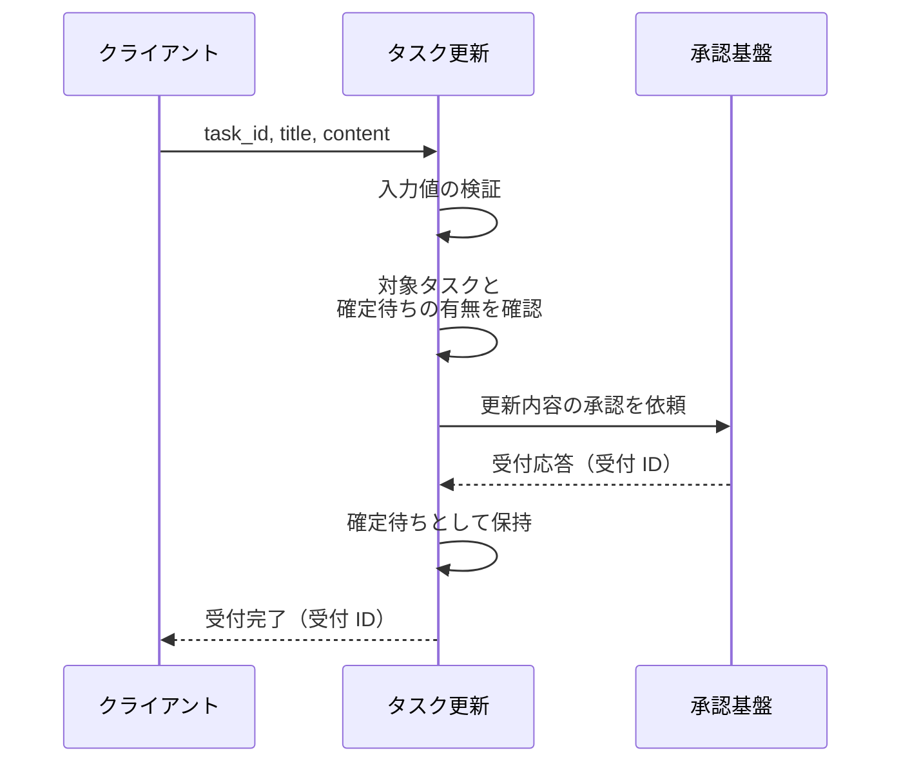
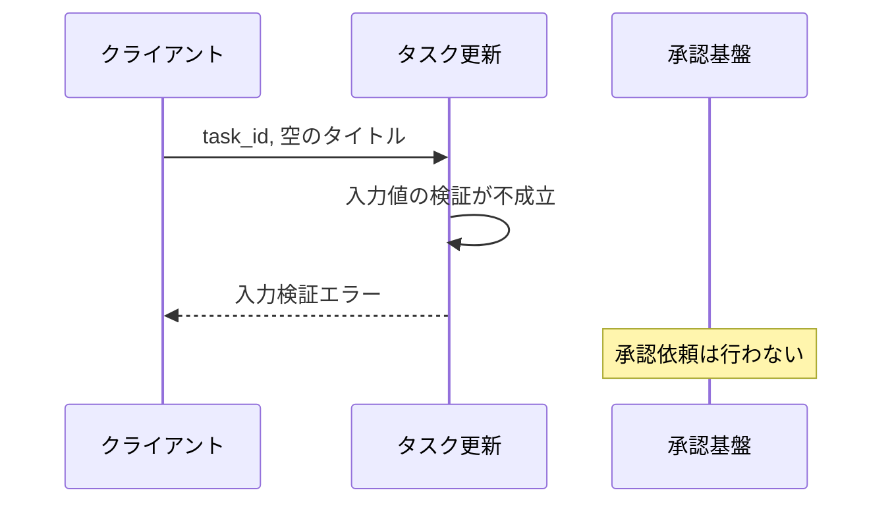
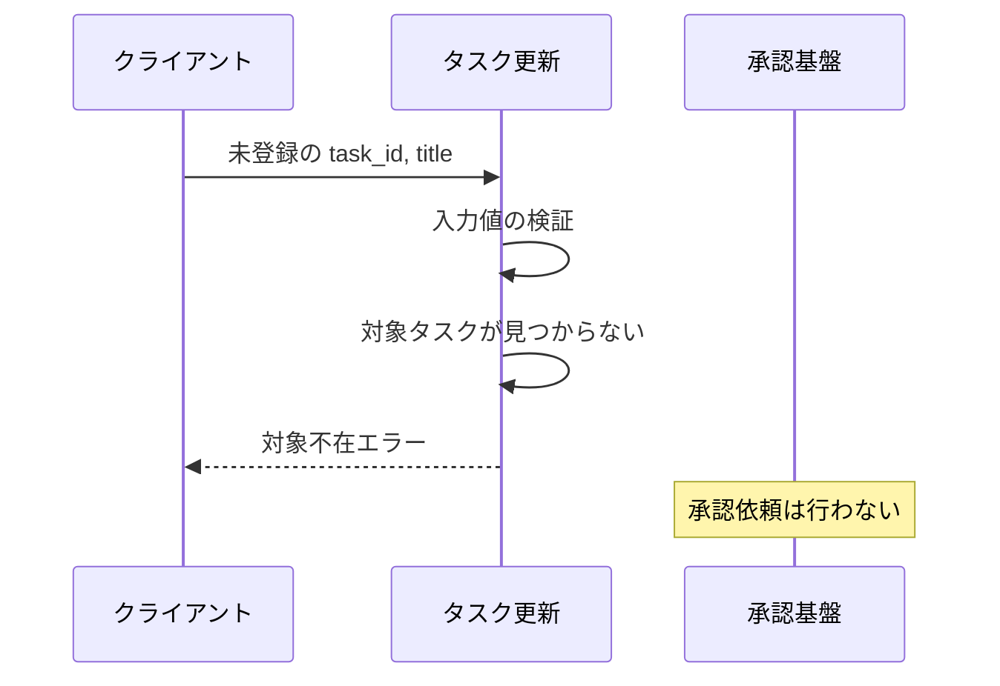
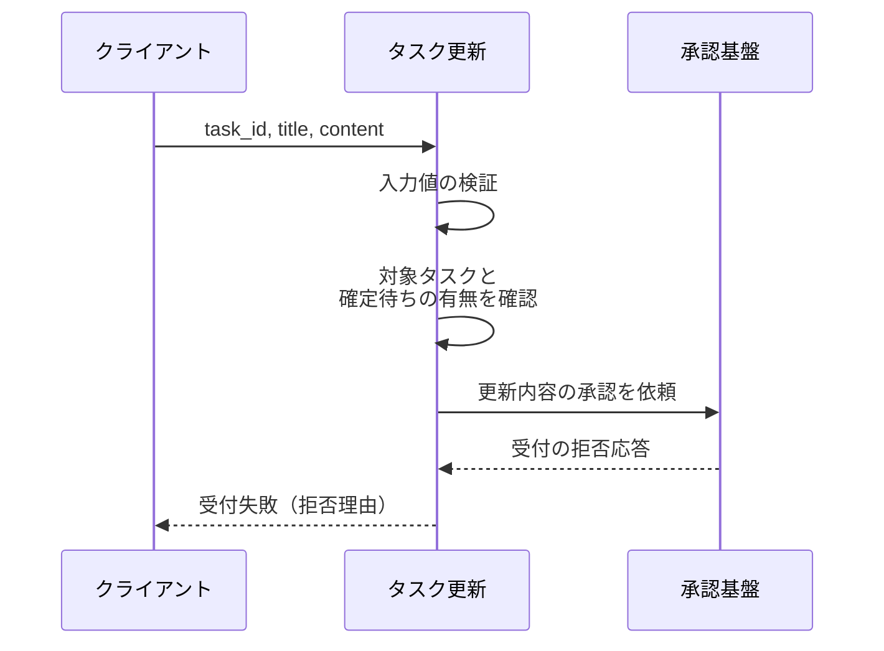

# タスク更新

操作: タスク更新

登録済みタスクのタイトルと本文の更新を、承認基盤への受付をもって受け付ける。
確定は承認基盤からの通知で行うため、本操作では確定を待たない。

- 対応テストファイル: `tests/integration/tasks/test_タスク更新.py`

## インターフェース

### リクエスト

| パラメータ | 型 | 必須 | デフォルト | 説明 | 制限 | 補足 |
| --- | --- | --- | --- | --- | --- | --- |
| `task_id` | `str` | ✅ | - | 更新対象のタスク ID | - | - |
| `title` | `str` | ✅ | - | 更新後のタイトル | 1 文字以上 100 文字以内 | - |
| `content` | `str` | - | `""`（本文を空にして更新） | 更新後の本文 | 1000 文字以内 | - |

リクエスト例:

```json
{
  "task_id": "t1",
  "title": "新タイトル",
  "content": "新本文"
}
```

### レスポンス

| フィールド | 型 | 説明 | 制限 | 補足 |
| --- | --- | --- | --- | --- |
| `acceptance` | `object` | 承認基盤が受け付けた更新の控え | - | 子フィールドは下の行で展開 |
| `acceptance.id` | `str` | 承認基盤が採番した受付 ID | - | 確定通知との突合キー |
| `acceptance.task_id` | `str` | 受け付けた対象のタスク ID | - | - |
| `acceptance.title` | `str` | 確定待ちのタイトル | - | 確定するまでタスク本体には反映しない |
| `acceptance.content` | `str` | 確定待ちの本文 | - | 確定するまでタスク本体には反映しない |

レスポンス例:

```json
{
  "acceptance": {
    "id": "ap_0001",
    "task_id": "t1",
    "title": "新タイトル",
    "content": "新本文"
  }
}
```

**補足:**

- 応答した時点でタスク本体の内容は更新前のまま。
  一覧では確定待ちとして見え、確定通知を受けて初めて内容が入れ替わる

## 制約

| 項目 | 制約 | 補足 |
| --- | --- | --- |
| 認可 | 制限なし | 本プロジェクトに認証機構がない |
| タイムアウト | 制限なし | 承認基盤は Mock 前提。実接続時に `外部API/承認基盤.md` の値で見直す |
| 同一タスクの多重受付 | 確定待ちがある間は新たな受付を行わない | 違反時は 異常系（確定待ちが既に存在） |
| 受付の取り消し | 手段を設けない | 受付後は確定通知を待つ |
| 入力検証の順序 | 入力値の検証を承認依頼より先に行う | 検証で落ちる更新を承認基盤へ送らない |

## フロー一覧

| 分類 | フロー名 | 概要 | 補足 |
| --- | --- | --- | --- |
| 正常 | 正常系 | 検証を通した更新を承認基盤へ受け付けさせ、確定待ちとして保持する | - |
| 異常 | 異常系（入力検証失敗） | タイトルが制限を外れる入力を承認依頼の前に弾く | - |
| 異常 | 異常系（対象タスクが存在しない） | 未登録の `task_id` を承認依頼の前に弾く | - |
| 異常 | 異常系（承認基盤が受付を拒否） | 受付の拒否応答を受付失敗として返す | 単一 UC シナリオの異常シナリオに対応 |
| 異常 | 異常系（確定待ちが既に存在） | 確定前の更新が残っている間の受付を拒む | - |

## 正常系

### セットアップ

| セットアップ | 説明 | 補足 |
| --- | --- | --- |
| Mock | 承認基盤が受付 ID `ap_0001` の受付応答を返す | 確定通知は本フローでは送らない |
| タスク | `t1` を「旧タイトル / 旧本文」で登録済み | 確定待ちなし |

### フロー



### 期待値

- 受付 ID `ap_0001` を含む受付完了が返る
- `t1` は確定待ちを持ち、確定待ちのタイトルと本文が送信値と一致している
- `t1` 本体のタイトルと本文は「旧タイトル / 旧本文」のまま変わっていない

## 異常系（入力検証失敗）

### セットアップ

| セットアップ | 説明 | 補足 |
| --- | --- | --- |
| Mock | 承認基盤が受付応答を返す | 呼ばれないことの確認に使う |
| タスク | `t1` を「旧タイトル / 旧本文」で登録済み | 確定待ちなし |
| 入力 | タイトルを空にして送信 | 検証失敗を決定的に誘発 |

### フロー



### 期待値

- 入力検証エラーが返る
- 承認基盤への承認依頼が 1 度も行われていない
- `t1` は確定待ちを持たず、本体のタイトルと本文も変わっていない

## 異常系（対象タスクが存在しない）

### セットアップ

| セットアップ | 説明 | 補足 |
| --- | --- | --- |
| Mock | 承認基盤が受付応答を返す | 呼ばれないことの確認に使う |
| タスク | `t1` のみ登録済み | - |
| 入力 | 未登録の `task_id` を指定して送信 | 対象不在を決定的に誘発 |

### フロー



### 期待値

- 対象不在エラーが返る
- 承認基盤への承認依頼が 1 度も行われていない
- `t1` は確定待ちを持たず、本体のタイトルと本文も変わっていない

## 異常系（承認基盤が受付を拒否）

### セットアップ

| セットアップ | 説明 | 補足 |
| --- | --- | --- |
| Mock | 承認基盤が受付の拒否応答を返す | 受付失敗を決定的に誘発 |
| タスク | `t1` を「旧タイトル / 旧本文」で登録済み | 確定待ちなし |

### フロー



### 期待値

- 拒否理由を含む受付失敗が返る
- `t1` は確定待ちを持たず、本体のタイトルと本文も変わっていない

## 異常系（確定待ちが既に存在）

### セットアップ

| セットアップ | 説明 | 補足 |
| --- | --- | --- |
| Mock | 承認基盤が受付応答を返す | 呼ばれないことの確認に使う |
| タスク | `t1` が受付 ID `ap_0001` の確定待ちを持つ | 多重受付を決定的に誘発 |

### フロー


### 期待値

- 多重受付エラーが返る
- 承認基盤への承認依頼が 1 度も行われていない
- `t1` の確定待ちは受付 ID `ap_0001` のまま置き換わっていない
