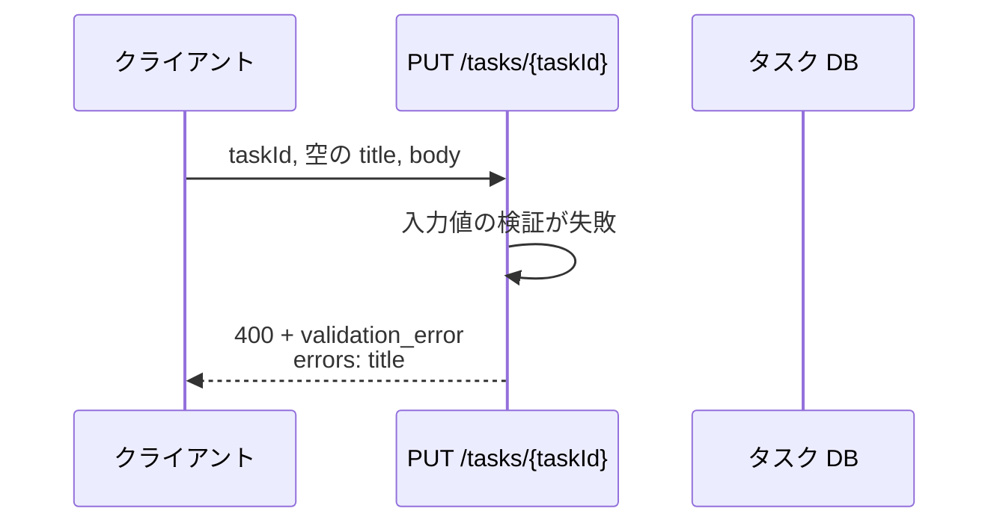
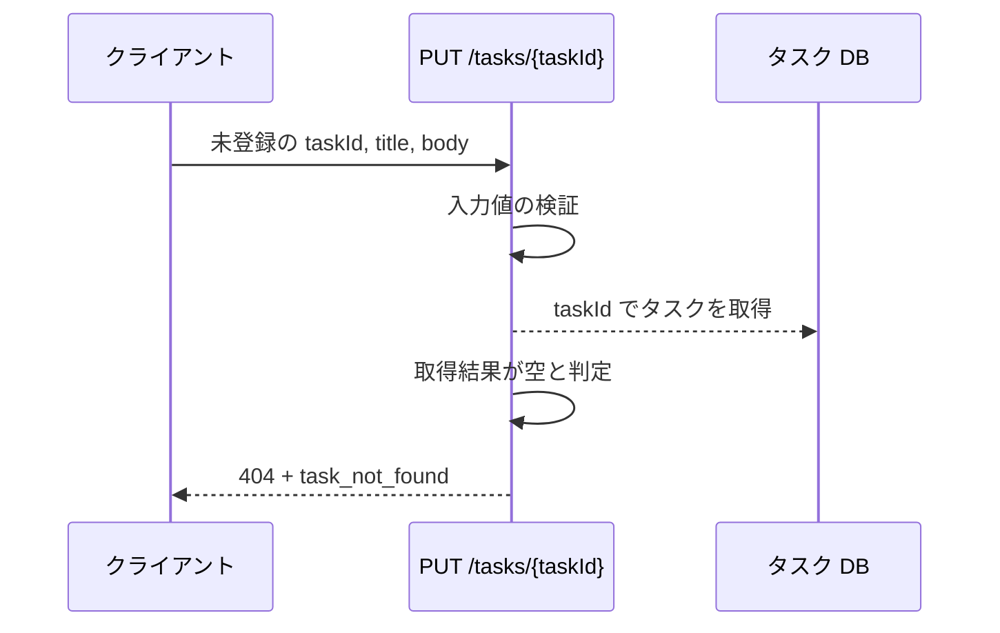
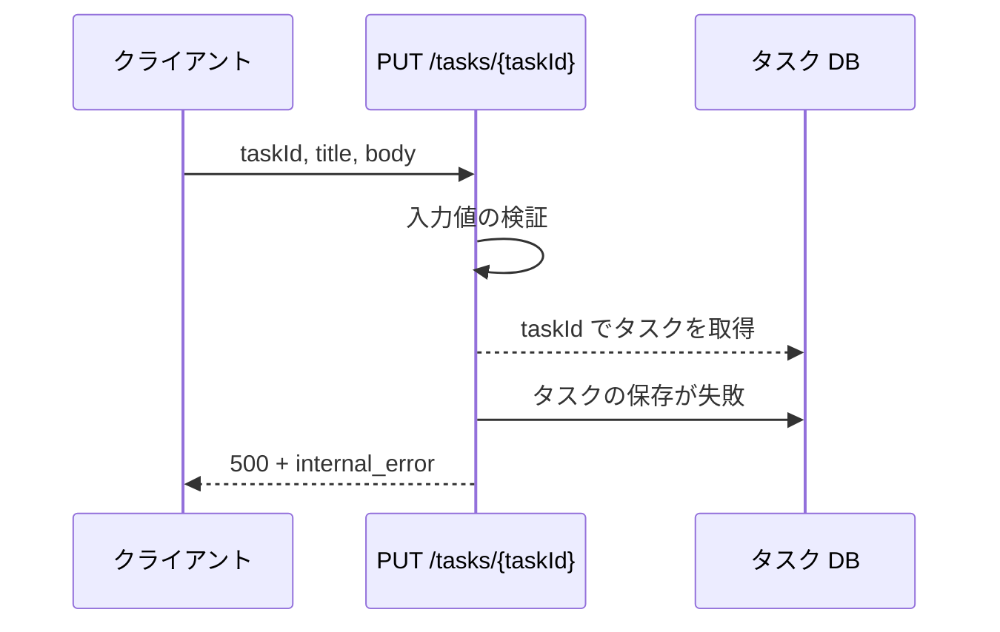

# タスク更新

エンドポイント: PUT /tasks/{taskId}

一覧から選んだタスクのタイトルと本文を更新し、更新後のタスクを返す。

- 対応テストファイル: `-`（テストレビュー完了時に記入）

## インターフェース

### リクエスト

| パラメータ | 型 | 必須 | デフォルト | 説明 | 制限 | 補足 |
| --- | --- | --- | --- | --- | --- | --- |
| `taskId` | `str` | ✅ | - | 更新対象のタスク ID | - | パスパラメータ |
| `title` | `str` | ✅ | - | タスク名 | 1 文字以上 100 文字以内 | 前後の空白を除去してから文字数を数える |
| `body` | `str` | ✅ | - | タスク本文 | 制限なし | 空文字を許容する |

リクエスト例:

```json
{
  "title": "決算資料の作成",
  "body": "四半期の売上をまとめる"
}
```

### レスポンス

| フィールド | 型 | 説明 | 制限 | 補足 |
| --- | --- | --- | --- | --- |
| `task` | `object` | 更新後のタスク | - | - |
| `task.id` | `str` | タスク ID | - | リクエストの `taskId` と同じ値 |
| `task.title` | `str` | 更新後のタスク名 | - | 前後の空白を除去した値 |
| `task.body` | `str` | 更新後の本文 | - | - |
| `task.updatedAt` | `str` | 更新日時（ISO 8601） | - | UTC タイムゾーン付き |

レスポンス例:

```json
{
  "task": {
    "id": "task_01",
    "title": "決算資料の作成",
    "body": "四半期の売上をまとめる",
    "updatedAt": "2026-08-06T06:20:00+00:00"
  }
}
```

エラーレスポンス:

| フィールド | 型 | 説明 | 制限 | 補足 |
| --- | --- | --- | --- | --- |
| `code` | `"validation_error"` \| `"task_not_found"` \| `"internal_error"` | エラー種別 | - | ステータスコード表の発生条件と 1:1 |
| `errors` | `object[]` | フィールド単位の検証エラー | - | `validation_error` のときだけ 1 件以上入る |
| `errors[].field` | `"title"` \| `"body"` | エラーが起きた入力欄 | - | リクエストのパラメータ名と一致させる |
| `errors[].message` | `str` | 入力欄の直下に出す文言 | - | 日本語 |

エラーレスポンス例:

```json
{
  "code": "validation_error",
  "errors": [
    { "field": "title", "message": "タスク名を入力してください" }
  ]
}
```

### ステータスコード

| ステータスコード | 発生条件 | 補足 |
| --- | --- | --- |
| `200` | 更新成功 | - |
| `400` | リクエストのバリデーション失敗 | `errors` にフィールド単位のエラーを返す |
| `404` | 対象のタスクが存在しない | - |
| `500` | タスク DB への書き込み失敗 | - |

## 制約

| 項目 | 制約 | 補足 |
| --- | --- | --- |
| タイムアウト | 制限なし | 非機能要件の応答目標は 1 秒以内 |
| 認可 | 制限なし | 認証・所有者チェックは本サブシステムのスコープ外 |
| レート制限 | 制限なし | - |
| 更新対象の項目 | タイトルと本文のみ | 状態・期限など他の項目は本操作では変更しない |
| 検証の順序 | 入力値の検証を対象タスクの取得より先に行う | 入力不正と対象不在が同時に成立する場合は 400 を返す |

## フロー一覧

| 分類 | フロー名 | 概要 | 補足 |
| --- | --- | --- | --- |
| 正常 | 正常系 | タイトルと本文を更新して更新後のタスクを返す | - |
| 異常 | 異常系（タイトルが空・400） | 検証失敗 → `title` のエラーを返す | 単一 UC シナリオの異常シナリオに対応 |
| 異常 | 異常系（タイトルが 100 文字超・400） | 検証失敗 → `title` のエラーを返す | - |
| 異常 | 異常系（タスクが存在しない・404） | 対象が取得できず 404 を返す | - |
| 異常 | 異常系（タスク DB 書き込み失敗・500） | 保存に失敗して 500 を返す | - |

## 正常系

### セットアップ

| セットアップ | 説明 | 補足 |
| --- | --- | --- |
| Mock | タスク DB を DB stub に差し替え | - |
| タスク | `task_01` のタスクを登録済み | タイトル・本文とも更新前の値が入っている |

### フロー


### 期待値

- `200 OK` + 更新後のタスクが返る
- タスク DB の対象タスクのタイトルと本文が送信値に更新されている
- 更新後のタスクの `updatedAt` が保存時刻になっている

## 異常系（タイトルが空・400）

### セットアップ

| セットアップ | 説明 | 補足 |
| --- | --- | --- |
| Mock | タスク DB を DB stub に差し替え | - |
| タスク | `task_01` のタスクを登録済み | - |
| 入力 | `title` に空文字を指定して送信 | 検証失敗を決定的に誘発 |

### フロー



### 期待値

- `400` + `code` が `validation_error` のボディが返る
- `errors` に `field` が `title` のエラーが 1 件含まれる
- タスク DB の対象タスクは更新前のままになっている

## 異常系（タイトルが 100 文字超・400）

### セットアップ

| セットアップ | 説明 | 補足 |
| --- | --- | --- |
| Mock | タスク DB を DB stub に差し替え | - |
| タスク | `task_01` のタスクを登録済み | - |
| 入力 | `title` に 101 文字の文字列を指定して送信 | 検証失敗を決定的に誘発 |

### フロー


### 期待値

- `400` + `code` が `validation_error` のボディが返る
- `errors` に `field` が `title` のエラーが 1 件含まれる
- タスク DB の対象タスクは更新前のままになっている

## 異常系（タスクが存在しない・404）

### セットアップ

| セットアップ | 説明 | 補足 |
| --- | --- | --- |
| Mock | タスク DB を DB stub に差し替え | 取得結果を空にする |
| 入力 | 登録されていない `taskId` を指定して送信 | 対象不在を決定的に誘発 |

### フロー



### 期待値

- `404` + `code` が `task_not_found` のボディが返る
- タスク DB への保存は行われていない

## 異常系（タスク DB 書き込み失敗・500）

### セットアップ

| セットアップ | 説明 | 補足 |
| --- | --- | --- |
| Mock | タスク DB を DB stub に差し替え | 保存時に書き込みエラーを返す |
| タスク | `task_01` のタスクを登録済み | - |

### フロー



### 期待値

- `500` + `code` が `internal_error` のボディが返る
- タスク DB の対象タスクは更新前のままになっている
