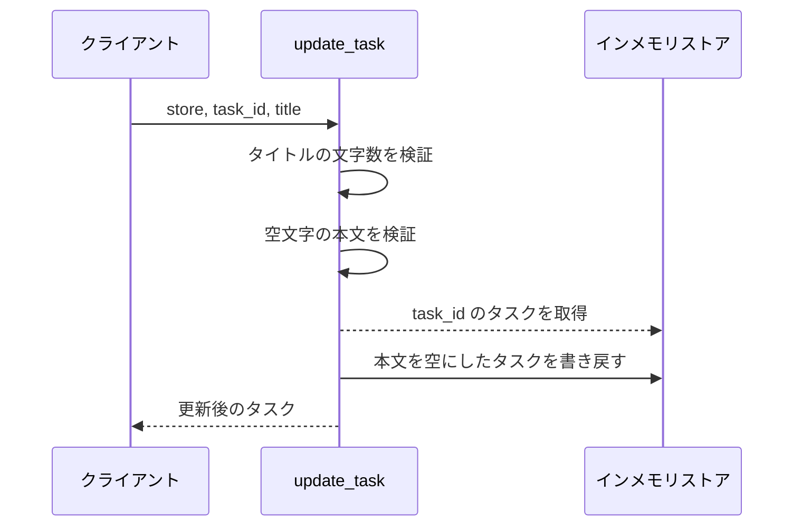
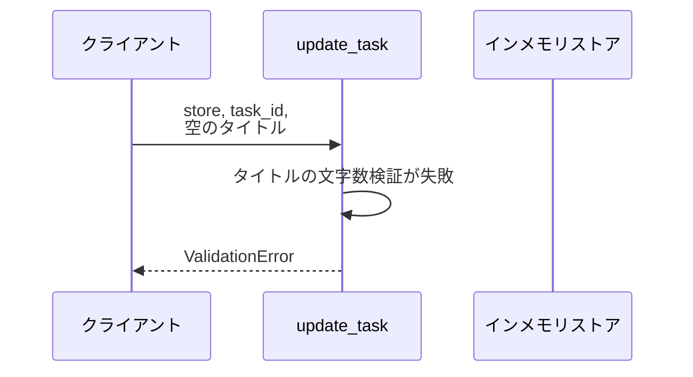
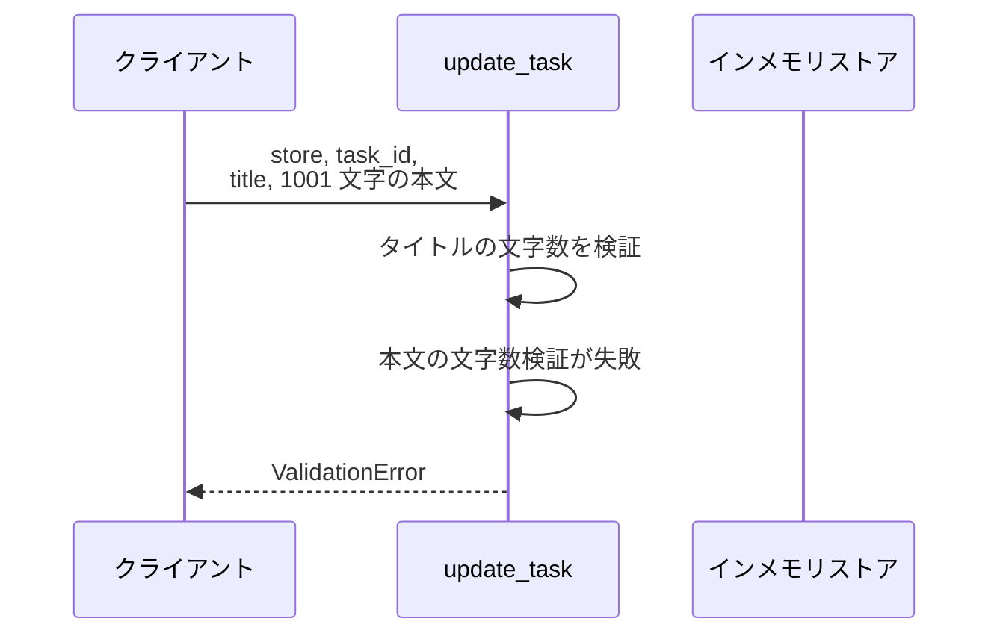
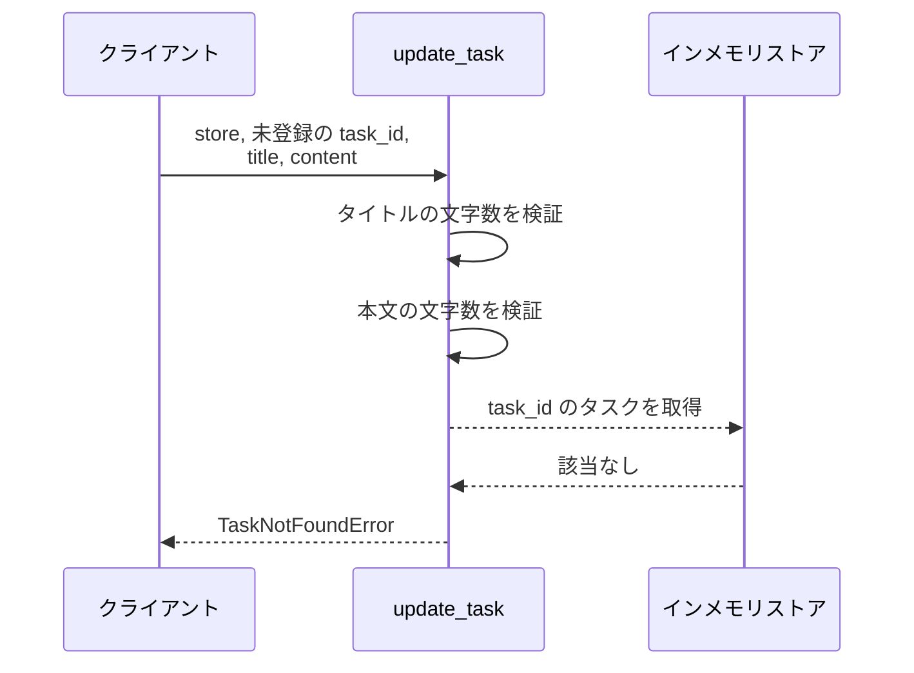

# タスク更新

操作: `update_task`（サービス層の公開関数）

登録済みタスクのタイトルと本文を検証したうえで差し替え、更新後のタスクを返す。

- 対応テストファイル: なし（結合テストは設けない）

## インターフェース

### リクエスト

| パラメータ | 型 | 必須 | デフォルト | 説明 | 制限 | 補足 |
| --- | --- | --- | --- | --- | --- | --- |
| `store` | `dict[str, Task]` | ✅ | - | タスクの保管先 | - | キーはタスク ID |
| `task_id` | `str` | ✅ | - | 更新対象のタスク ID | - | - |
| `title` | `str` | ✅ | - | 更新後のタイトル | 1 文字以上 100 文字以内 | - |
| `content` | `str` | - | `""` | 更新後の本文 | 1000 文字以内 | - |

リクエスト例:

```python
update_task(store, "t1", "新タイトル", "新本文")
```

### レスポンス

| フィールド | 型 | 説明 | 制限 | 補足 |
| --- | --- | --- | --- | --- |
| `id` | `str` | タスク ID | - | 更新前と同じ値 |
| `title` | `str` | 更新後のタイトル | - | - |
| `content` | `str` | 更新後の本文 | - | `content` を省略した場合は空文字 |

レスポンス例:

```python
Task(id="t1", title="新タイトル", content="新本文")
```

### 例外

| 例外 | 発生条件 | 補足 |
| --- | --- | --- |
| なし（正常終了） | 更新成功 | 戻り値は レスポンス表のとおり |
| `ValidationError` | タイトルが 1 文字未満 or 100 文字超 | - |
| `ValidationError` | 本文が 1000 文字超 | - |
| `TaskNotFoundError` | `task_id` のタスクが `store` に存在しない | - |

## 制約

| 項目 | 制約 | 補足 |
| --- | --- | --- |
| タイムアウト | 制限なし | インメモリ操作だけで待ちが発生しない |
| 認可 | 制限なし | 呼び出し元の認証・認可は本操作の対象外 |
| 同時実行 | 制限なし | 単一プロセスのインメモリストアを前提にする |

## フロー一覧

| 分類 | フロー名 | 概要 | 補足 |
| --- | --- | --- | --- |
| 正常 | 正常系 | タイトルと本文を更新して返す | - |
| 正常 | 正常系（本文の省略） | 本文を空文字にして更新する | - |
| 異常 | 異常系（タイトル長違反・ValidationError） | 検証で弾いてストアを変更しない | - |
| 異常 | 異常系（本文長違反・ValidationError） | 検証で弾いてストアを変更しない | - |
| 異常 | 異常系（タスク未登録・TaskNotFoundError） | 対象が無いのでストアを変更しない | - |

## 正常系

### セットアップ

| セットアップ | 説明 | 補足 |
| --- | --- | --- |
| Mock | なし | 外部依存を持たない |
| タスク | `t1` のタスクを 1 件登録済み | タイトル・本文とも更新前の値 |

### フロー


### 期待値

- 戻り値のタイトルと本文が入力値と一致する
- ストアの `t1` が更新後の内容になっている

## 正常系（本文の省略）

### セットアップ

| セットアップ | 説明 | 補足 |
| --- | --- | --- |
| Mock | なし | 外部依存を持たない |
| タスク | `t1` のタスクを 1 件登録済み | 本文は更新前の値が入っている |
| 入力 | `content` を省略して呼び出す | 省略時の分岐を決定的に誘発 |

### フロー



### 期待値

- 戻り値の本文が空文字になっている
- ストアの `t1` の本文も空文字になっている

## 異常系（タイトル長違反・ValidationError）

### セットアップ

| セットアップ | 説明 | 補足 |
| --- | --- | --- |
| Mock | なし | 外部依存を持たない |
| タスク | `t1` のタスクを 1 件登録済み | - |
| 入力 | タイトルを空文字にして呼び出す | 検証失敗を決定的に誘発 |

### フロー



### 期待値

- `ValidationError` が送出される
- ストアの `t1` は更新前のままになっている

## 異常系（本文長違反・ValidationError）

### セットアップ

| セットアップ | 説明 | 補足 |
| --- | --- | --- |
| Mock | なし | 外部依存を持たない |
| タスク | `t1` のタスクを 1 件登録済み | - |
| 入力 | 本文を 1001 文字にして呼び出す | 検証失敗を決定的に誘発 |

### フロー



### 期待値

- `ValidationError` が送出される
- ストアの `t1` は更新前のままになっている

## 異常系（タスク未登録・TaskNotFoundError）

### セットアップ

| セットアップ | 説明 | 補足 |
| --- | --- | --- |
| Mock | なし | 外部依存を持たない |
| タスク | `t1` のタスクを 1 件登録済み | - |
| 入力 | 未登録の `task_id` で呼び出す | 取得失敗を決定的に誘発 |

### フロー



### 期待値

- `TaskNotFoundError` が送出される
- ストアに新しいキーは追加されず、`t1` も更新前のままになっている
