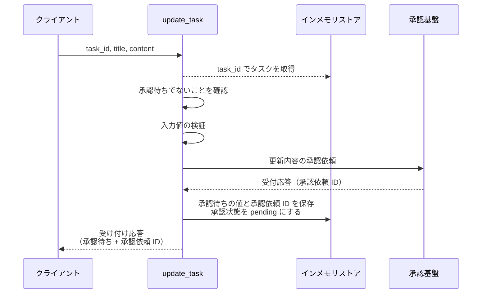
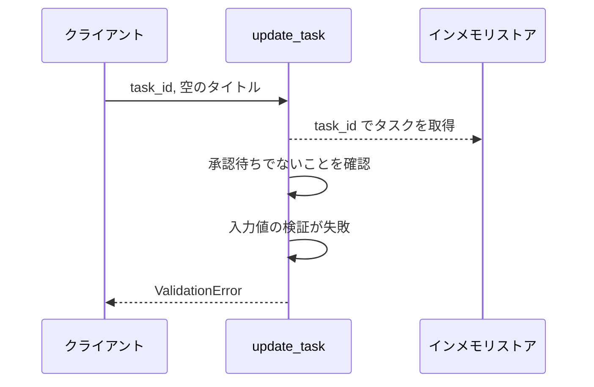
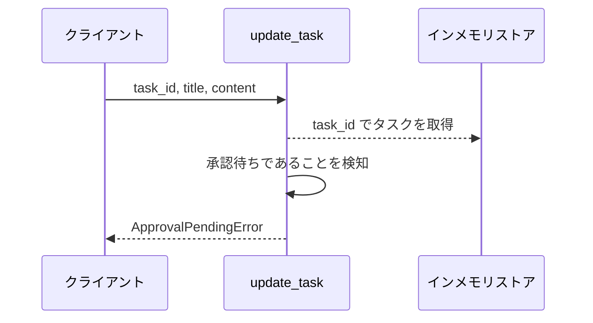
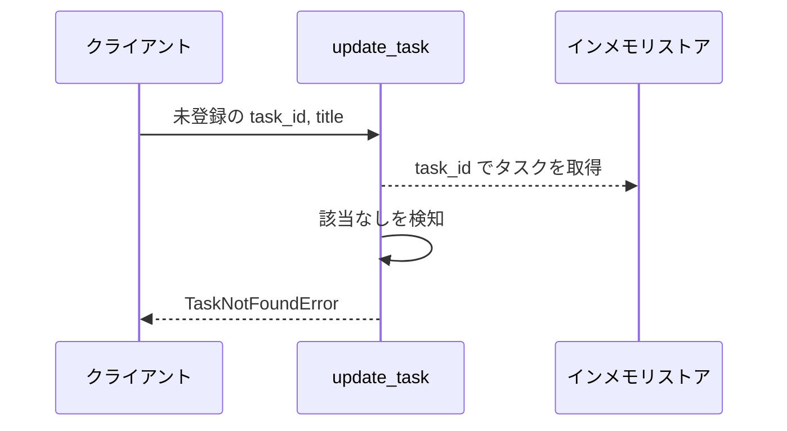
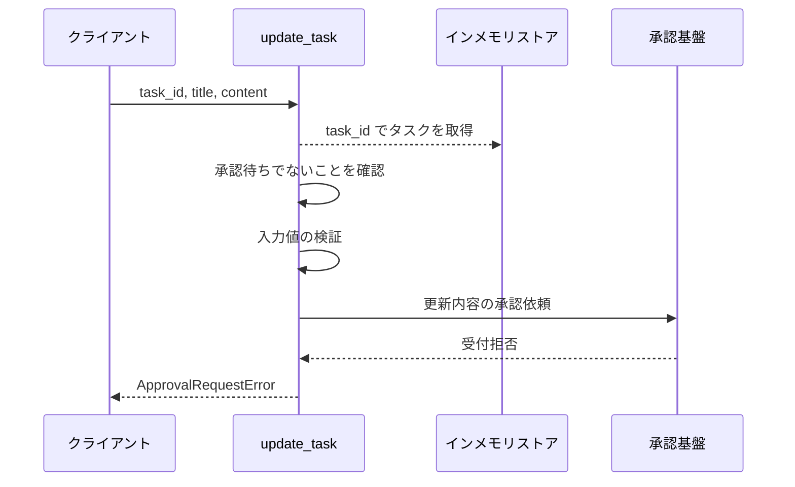

# タスク更新

操作: `update_task`（サービス層の公開関数）

タスクの更新内容を受け取り、承認基盤へ承認依頼を送って承認待ちとして受け付ける。
戻り値に承認結果は含めない。

- 対応テストファイル: 未定（テストレビュー完了時に記入）

## インターフェース

### リクエスト

| パラメータ | 型 | 必須 | デフォルト | 説明 | 制限 | 補足 |
| --- | --- | --- | --- | --- | --- | --- |
| `task_id` | `str` | ✅ | - | 更新対象のタスク ID | - | - |
| `title` | `str` | ✅ | - | 編集後のタイトル | 1 文字以上 100 文字以内 | - |
| `content` | `str` | - | `""` | 編集後の本文 | 1000 文字以内 | - |

リクエスト例:

```json
{
  "task_id": "t1",
  "title": "新タイトル",
  "content": "新本文"
}
```

### レスポンス

| フィールド | 型 | 説明 | 制限 | 補足 |
| --- | --- | --- | --- | --- |
| `task_id` | `str` | 受け付けたタスクの ID | - | - |
| `approval_state` | `"pending"` | 受け付け後の承認状態 | - | 受け付けが成功した時点では必ず承認待ち |
| `approval_request_id` | `str` | 承認基盤が発番した承認依頼の識別子 | - | 承認結果反映が対象タスクを引くときの相関キー |

レスポンス例:

```json
{
  "task_id": "t1",
  "approval_state": "pending",
  "approval_request_id": "ap_001"
}
```

### 例外

| 例外 | 発生条件 | 補足 |
| --- | --- | --- |
| なし（正常終了） | 承認依頼が受け付けられた | 戻り値は レスポンス表のとおり |
| `TaskNotFoundError` | 指定 ID のタスクが存在しない | - |
| `ApprovalPendingError` | 対象タスクの承認状態が `pending` | 承認基盤へ承認依頼を送らない |
| `ValidationError` | タイトル / 本文が制限を満たさない | 承認基盤へ承認依頼を送らない |
| `ApprovalRequestError` | 承認基盤が承認依頼を受け付けられない | 承認基盤連携の例外をそのまま伝播する |

## 制約

| 項目 | 制約 | 補足 |
| --- | --- | --- |
| タイムアウト | 制限なし | 承認待ちの滞留に上限を設けない決定に合わせる |
| 認可 | 制限なし | 利用者を識別する仕組みを持たない |
| 承認依頼の多重度 | 1 タスクにつき承認待ちの承認依頼は 1 件まで | 違反時は 異常系（承認待ち・ApprovalPendingError） |

## フロー一覧

| 分類 | フロー名 | 概要 | 補足 |
| --- | --- | --- | --- |
| 正常 | 正常系 | 承認依頼を送り承認待ちとして受け付ける | - |
| 異常 | 異常系（タイトルが空・ValidationError） | 入力検証で弾き承認依頼を送らない | - |
| 異常 | 異常系（承認待ち・ApprovalPendingError） | 二重の承認依頼を防ぐ | - |
| 異常 | 異常系（タスク未登録・TaskNotFoundError） | 対象タスクが存在しない | - |
| 異常 | 異常系（承認依頼の失敗・ApprovalRequestError） | 承認基盤が受け付けを拒否する | - |

## 正常系

### セットアップ

| セットアップ | 説明 | 補足 |
| --- | --- | --- |
| Mock | 承認基盤を受付応答だけ返すスタブに差し替え | 承認結果は返さない |
| タスク | 承認状態が `none` のタスクを 1 件登録済み | 編集前の内容を保持 |

### フロー



### 期待値

- 承認依頼 ID を含む受け付け応答が返り、承認状態が `pending` になっている
- 対象タスクのタイトル / 本文は編集前の値のまま残っている
- 対象タスクの承認待ちのタイトル / 本文に編集後の値が入っている
- 承認基盤へ承認依頼が 1 回だけ送られている

## 異常系（タイトルが空・ValidationError）

### セットアップ

| セットアップ | 説明 | 補足 |
| --- | --- | --- |
| Mock | 承認基盤を受付応答だけ返すスタブに差し替え | 呼ばれないことを確認するため置く |
| タスク | 承認状態が `none` のタスクを 1 件登録済み | - |
| 入力 | タイトルを空文字にして呼び出す | 検証失敗を決定的に誘発 |

### フロー



### 期待値

- `ValidationError` が送出される
- 対象タスクのタイトル / 本文と承認状態が呼び出し前のまま変わっていない
- 承認基盤へ承認依頼が送られていない

## 異常系（承認待ち・ApprovalPendingError）

### セットアップ

| セットアップ | 説明 | 補足 |
| --- | --- | --- |
| Mock | 承認基盤を結果を返さないスタブに差し替え | 承認待ちの状態を保持 |
| タスク | 承認状態が `pending` のタスクを 1 件登録済み | 承認待ちの値と承認依頼 ID を保持 |

### フロー



### 期待値

- `ApprovalPendingError` が送出される
- 対象タスクの承認待ちの値と承認依頼 ID が呼び出し前のまま変わっていない
- 承認基盤へ 2 件目の承認依頼が送られていない

## 異常系（タスク未登録・TaskNotFoundError）

### セットアップ

| セットアップ | 説明 | 補足 |
| --- | --- | --- |
| Mock | 承認基盤を受付応答だけ返すスタブに差し替え | 呼ばれないことを確認するため置く |
| 入力 | 登録されていない task_id で呼び出す | 取得失敗を決定的に誘発 |

### フロー



### 期待値

- `TaskNotFoundError` が送出される
- ストアの内容が呼び出し前のまま変わっていない
- 承認基盤へ承認依頼が送られていない

## 異常系（承認依頼の失敗・ApprovalRequestError）

### セットアップ

| セットアップ | 説明 | 補足 |
| --- | --- | --- |
| Mock | 承認基盤を `ApprovalRequestError` を送出するスタブに差し替え | 受付拒否を決定的に誘発 |
| タスク | 承認状態が `none` のタスクを 1 件登録済み | - |

### フロー



### 期待値

- `ApprovalRequestError` が送出される
- 対象タスクの承認状態が `none` のまま変わっていない
- 対象タスクの承認待ちの値と承認依頼 ID が設定されていない
