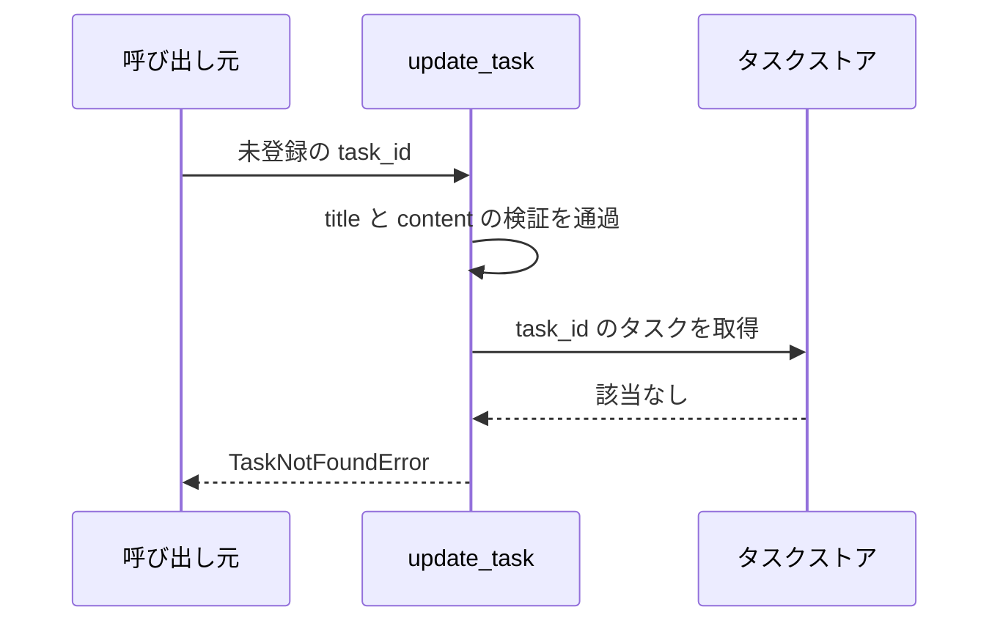

# タスク更新

呼び出し口: `tasks.service.update_task`（サービス層の公開関数）

登録済みタスクのタイトルと本文を更新して、更新後のタスクを返す。
バックエンドは HTTP を公開しておらず、サブシステムの外側（単一UCシナリオの「タスク更新リクエスト」）はこの関数呼び出しで受ける。

## インターフェース

### リクエスト

| パラメータ | 型 | 必須 | デフォルト | 説明 | 制限 | 補足 |
| --- | --- | --- | --- | --- | --- | --- |
| `store` | `dict[str, Task]` | ✅ | - | タスク ID をキーにしたインメモリのストア | - | 呼び出し側が保持する。破壊的に更新される |
| `task_id` | `str` | ✅ | - | 更新対象のタスク ID | `store` に登録済みであること | - |
| `title` | `str` | ✅ | - | 更新後のタスク名 | 1 文字以上 100 文字以内 | 空文字は拒否 |
| `content` | `str` | - | `""` | 更新後の本文 | 1000 文字以内 | 省略時は空文字で上書きする |

### レスポンス

| フィールド | 型 | 説明 | 制限 | 補足 |
| --- | --- | --- | --- | --- |
| `id` | `str` | タスク ID | - | リクエストの `task_id` と同じ値 |
| `title` | `str` | 更新後のタスク名 | 1 文字以上 100 文字以内 | - |
| `content` | `str` | 更新後の本文 | 1000 文字以内 | - |

### エラー

| エラー | 発生条件 | 補足 |
| --- | --- | --- |
| `ValidationError` | `title` が 0 文字 or 101 文字以上 | ストアは変更しない |
| `ValidationError` | `content` が 1001 文字以上 | ストアは変更しない |
| `TaskNotFoundError` | `task_id` が `store` に無い | ストアは変更しない |

## 制約

| 項目 | 制約 | 補足 |
| --- | --- | --- |
| 認可 | なし | 利用者の概念を持たない |
| 永続化 | プロセス内のみ | インメモリストアのため再起動で失われる |
| 同時実行 | 考慮しない | 単一プロセスの逐次呼び出し前提 |

## フロー一覧

| 分類 | フロー名 | 概要 | 補足 |
| --- | --- | --- | --- |
| 正常 | 正常系 | タイトルと本文を更新して返す | - |
| 異常 | 異常系（タイトルが空） | タイトルの検証に失敗する | 単一UCシナリオの異常シナリオに対応 |
| 異常 | 異常系（タスク不明） | 未登録の `task_id` を指定する | - |

## 正常系

### セットアップ

| セットアップ | 説明 | 補足 |
| --- | --- | --- |
| Mock | なし（インメモリのストアを実物のまま使う） | - |
| タスク | `t1` のタスクを 1 件登録済み | - |

### フロー

### 期待値

- 更新後のタイトルと本文を持つタスクが返る
- ストアの該当タスクが更新後の値になっている

## 異常系（タイトルが空）

### セットアップ

| セットアップ | 説明 | 補足 |
| --- | --- | --- |
| Mock | なし（インメモリのストアを実物のまま使う） | - |
| 入力 | `title` に空文字を指定 | 検証失敗を決定的に誘発 |

### フロー

### 期待値

- `ValidationError` が送出される
- ストアが変更されていない

## 異常系（タスク不明）

### セットアップ

| セットアップ | 説明 | 補足 |
| --- | --- | --- |
| Mock | なし（インメモリのストアを実物のまま使う） | - |
| 入力 | 未登録の `task_id` を指定 | 取得失敗を決定的に誘発 |

### フロー

### 期待値

- `TaskNotFoundError` が送出される
- ストアが変更されていない
