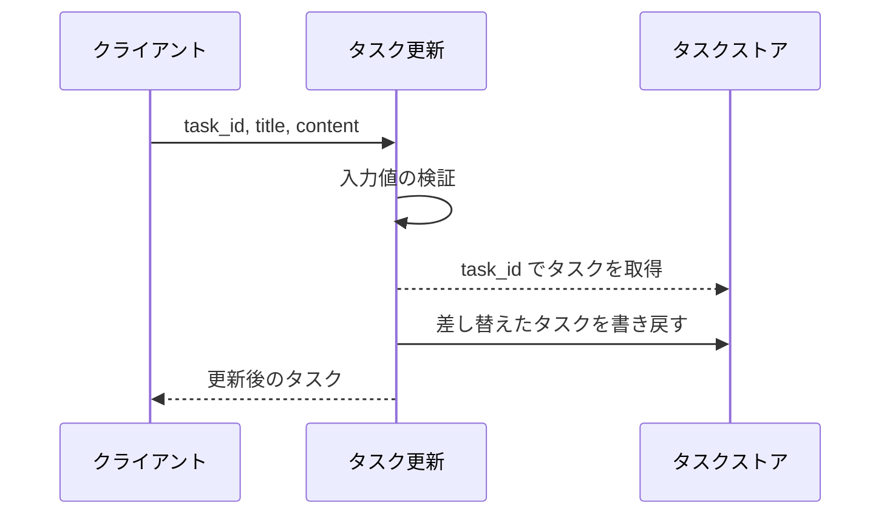
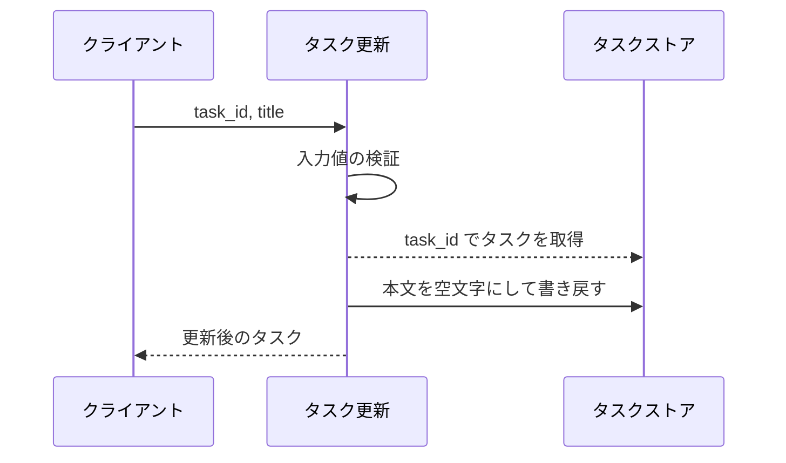
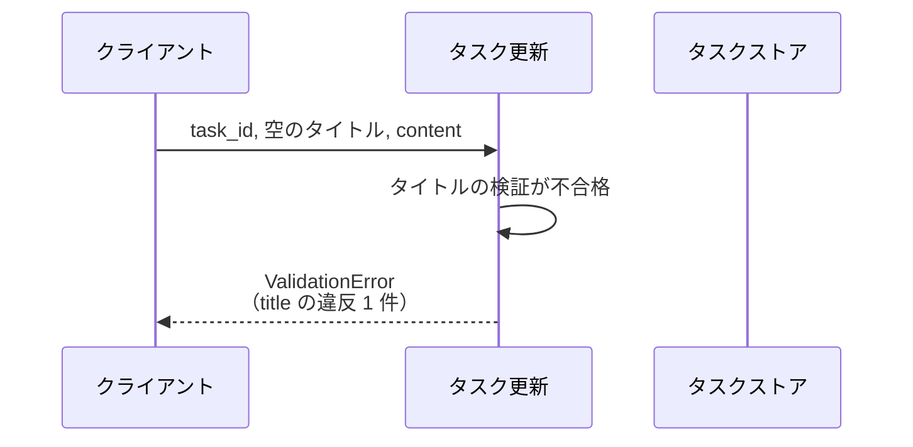
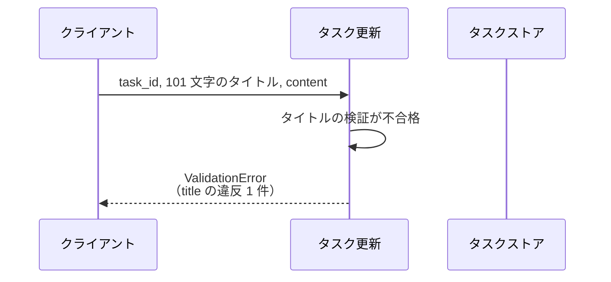
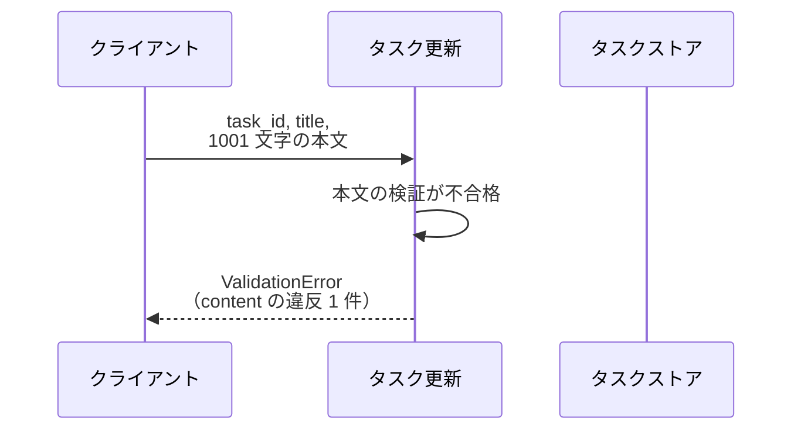
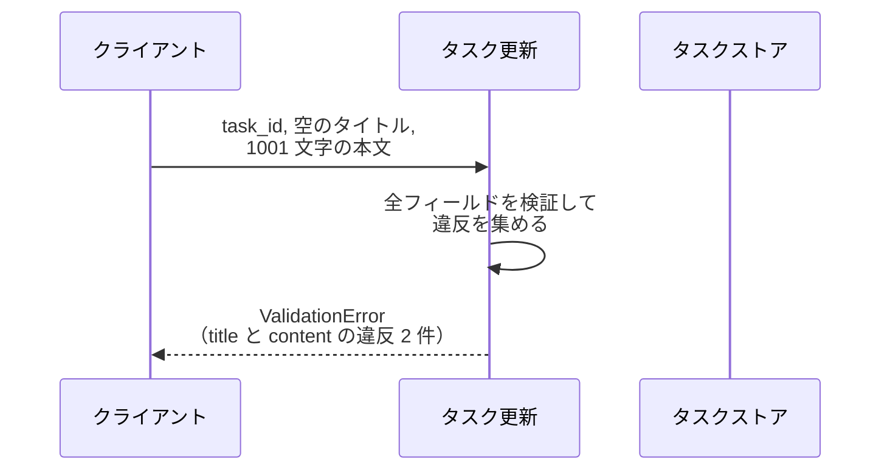
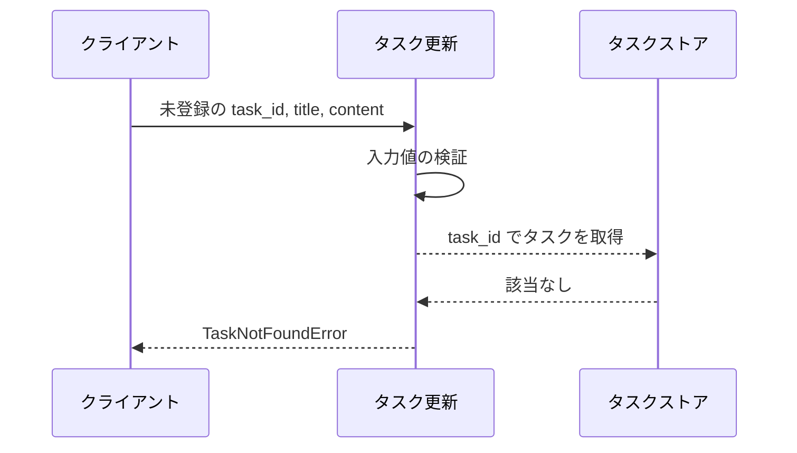

# タスク更新

エンドポイント: なし（HTTP 層は未実装のため、サービス層の公開操作をバックエンドの境界として扱う）

登録済みタスクのタイトルと本文を更新し、更新後のタスクを返す。

- 対応テストファイル: `tests/integration/tasks/test_タスク更新.py`

## インターフェース

### リクエスト

| パラメータ | 型 | 必須 | デフォルト | 説明 | 制限 | 補足 |
| --- | --- | --- | --- | --- | --- | --- |
| `task_id` | `str` | ✅ | - | 更新対象のタスク ID | - | - |
| `title` | `str` | ✅ | - | 更新後のタスク名 | 1 文字以上 100 文字以内 | - |
| `content` | `str` | - | `""`（本文を空にして更新） | 更新後の本文 | 1000 文字以内 | - |

リクエスト例:

```json
{
  "task_id": "t1",
  "title": "決算資料の作成",
  "content": "Q2 分の売上をまとめる"
}
```

### レスポンス

| フィールド | 型 | 説明 | 制限 | 補足 |
| --- | --- | --- | --- | --- |
| `task` | object | 更新後のタスク | - | - |
| `task.id` | `str` | タスク ID | - | リクエストの `task_id` と同じ値 |
| `task.title` | `str` | 更新後のタスク名 | - | - |
| `task.content` | `str` | 更新後の本文 | - | - |

レスポンス例:

```json
{
  "task": {
    "id": "t1",
    "title": "決算資料の作成",
    "content": "Q2 分の売上をまとめる"
  }
}
```

補足:

- 同じリクエストを繰り返しても結果は変わらない（更新は全項目の置き換えのため冪等）
- エラー時はレスポンスを返さず、下の エラー 表の例外を送出する

### エラー

| エラー | 発生条件 | 補足 |
| --- | --- | --- |
| `ValidationError` | `title` / `content` のいずれかが制限を満たさない | 違反したフィールドを `errors` に全件持つ |
| `TaskNotFoundError` | `task_id` のタスクが存在しない | - |

## 制約

| 項目 | 制約 | 補足 |
| --- | --- | --- |
| 応答時間 | 1 秒以内 | システム要件（SA）の非機能要件 |
| タイムアウト | 制限なし | インメモリのタスクストアだけを触るため下流の待ちが発生しない |
| 認可 | 制限なし（呼び出し元を問わない） | 認証・認可は本サブシステムのスコープ外 |
| 更新範囲 | `title` と `content` を毎回まとめて置き換える | 片方だけの部分更新はできない |
| 検証の対象 | リクエストのフィールドのみ | タスク間の重複チェックなど横断的な検証は行わない |

## フロー一覧

| 分類 | フロー名 | 概要 | 補足 |
| --- | --- | --- | --- |
| 正常 | 正常系 | タイトルと本文を更新して更新後のタスクを返す | - |
| 正常 | 正常系（本文を省略） | 本文を省略した更新で本文が空文字になる | - |
| 異常 | 異常系（タイトルが空・ValidationError） | 未入力のタイトルを検証で弾く | - |
| 異常 | 異常系（タイトルが上限超過・ValidationError） | 101 文字のタイトルを検証で弾く | - |
| 異常 | 異常系（本文が上限超過・ValidationError） | 1001 文字の本文を検証で弾く | - |
| 異常 | 異常系（タイトルと本文が同時に違反・ValidationError） | 違反したフィールドを全件まとめて返す | - |
| 異常 | 異常系（対象タスクが存在しない・TaskNotFoundError） | 未登録の ID を弾く | - |

## 正常系

### セットアップ

| セットアップ | 説明 | 補足 |
| --- | --- | --- |
| Mock | なし（インメモリのタスクストアを実データで操作） | 外部 DB / 外部 API を使わない |
| タスク | `t1`（タイトル `"旧タイトル"` / 本文 `"旧本文"`）を登録済み | - |

### フロー



### 期待値

- 更新後のタスクが返り、`title` と `content` がリクエストの値になっている
- タスクストアの `t1` も更新後の値に置き換わっている
- `id` は更新前と同じ値のまま変わっていない

## 正常系（本文を省略）

### セットアップ

| セットアップ | 説明 | 補足 |
| --- | --- | --- |
| Mock | なし（インメモリのタスクストアを実データで操作） | - |
| タスク | `t1`（タイトル `"旧タイトル"` / 本文 `"旧本文"`）を登録済み | - |
| 入力 | `content` を指定せずに送信 | デフォルト適用を決定的に誘発 |

### フロー



### 期待値

- 更新後のタスクの `content` が `""` になっている
- タスクストアの `t1` の本文も `""` に置き換わっている

## 異常系（タイトルが空・ValidationError）

### セットアップ

| セットアップ | 説明 | 補足 |
| --- | --- | --- |
| Mock | なし（インメモリのタスクストアを実データで操作） | - |
| タスク | `t1`（タイトル `"旧タイトル"` / 本文 `"旧本文"`）を登録済み | - |
| 入力 | `title` を `""` にして送信 | 検証失敗を決定的に誘発 |

### フロー



### 期待値

- `ValidationError` が送出され、`errors` に `title` のフィールドエラーが 1 件だけ含まれる
- タスクストアの `t1` は更新前の値のまま変わっていない

## 異常系（タイトルが上限超過・ValidationError）

### セットアップ

| セットアップ | 説明 | 補足 |
| --- | --- | --- |
| Mock | なし（インメモリのタスクストアを実データで操作） | - |
| タスク | `t1`（タイトル `"旧タイトル"` / 本文 `"旧本文"`）を登録済み | - |
| 入力 | `title` を 101 文字にして送信 | 検証失敗を決定的に誘発 |

### フロー



### 期待値

- `ValidationError` が送出され、`errors` に `title` のフィールドエラーが 1 件だけ含まれる
- タスクストアの `t1` は更新前の値のまま変わっていない

## 異常系（本文が上限超過・ValidationError）

### セットアップ

| セットアップ | 説明 | 補足 |
| --- | --- | --- |
| Mock | なし（インメモリのタスクストアを実データで操作） | - |
| タスク | `t1`（タイトル `"旧タイトル"` / 本文 `"旧本文"`）を登録済み | - |
| 入力 | `content` を 1001 文字にして送信 | 検証失敗を決定的に誘発 |

### フロー



### 期待値

- `ValidationError` が送出され、`errors` に `content` のフィールドエラーが 1 件だけ含まれる
- タスクストアの `t1` は更新前の値のまま変わっていない

## 異常系（タイトルと本文が同時に違反・ValidationError）

### セットアップ

| セットアップ | 説明 | 補足 |
| --- | --- | --- |
| Mock | なし（インメモリのタスクストアを実データで操作） | - |
| タスク | `t1`（タイトル `"旧タイトル"` / 本文 `"旧本文"`）を登録済み | - |
| 入力 | `title` を `""`・`content` を 1001 文字にして送信 | 複数フィールドの違反を決定的に誘発 |

### フロー



### 期待値

- `ValidationError` が送出され、`errors` に `title` と `content` のフィールドエラーが 2 件とも含まれる
- タスクストアの `t1` は更新前の値のまま変わっていない

## 異常系（対象タスクが存在しない・TaskNotFoundError）

### セットアップ

| セットアップ | 説明 | 補足 |
| --- | --- | --- |
| Mock | なし（インメモリのタスクストアを実データで操作） | - |
| タスク | `t1`（タイトル `"旧タイトル"` / 本文 `"旧本文"`）を登録済み | - |
| 入力 | ストアに存在しない `task_id` を送信 | 取得失敗を決定的に誘発 |

### フロー



### 期待値

- `TaskNotFoundError` が送出される
- タスクストアに新しいタスクは追加されず、`t1` も更新前の値のまま変わっていない
