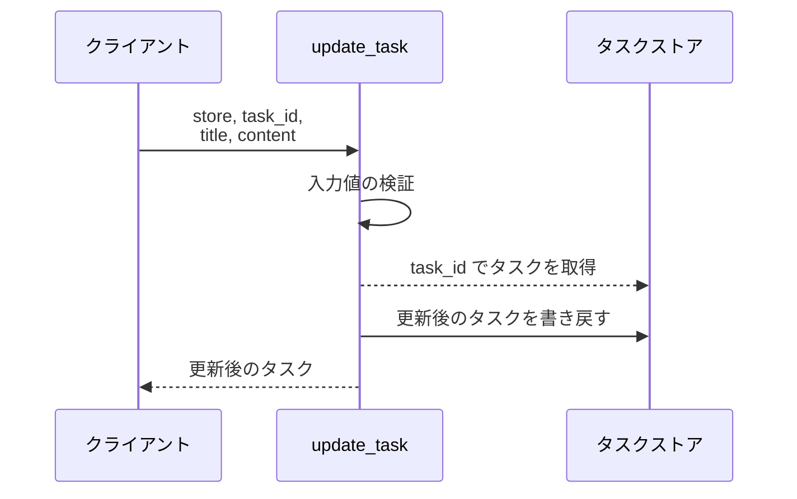
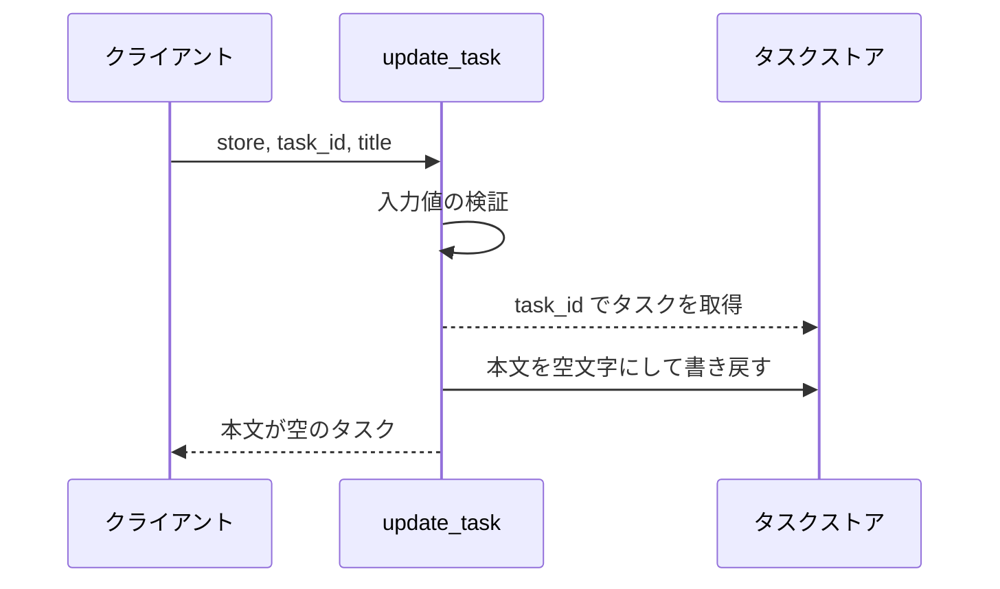
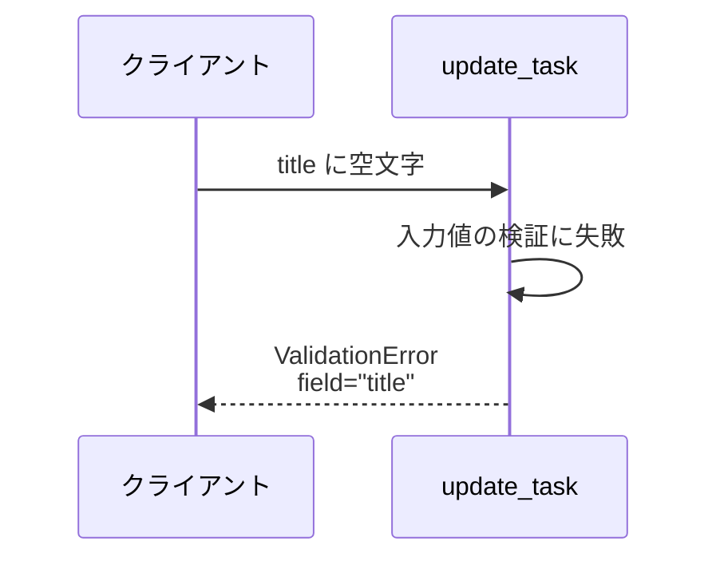
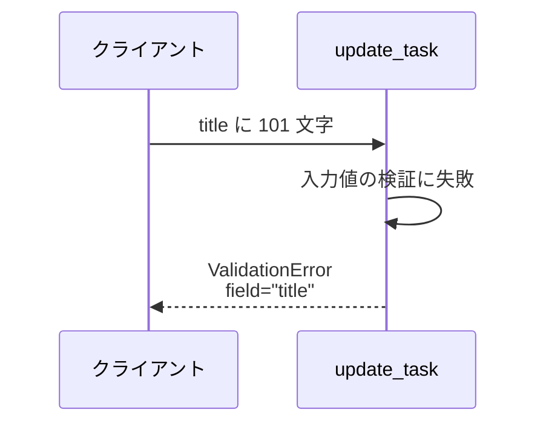
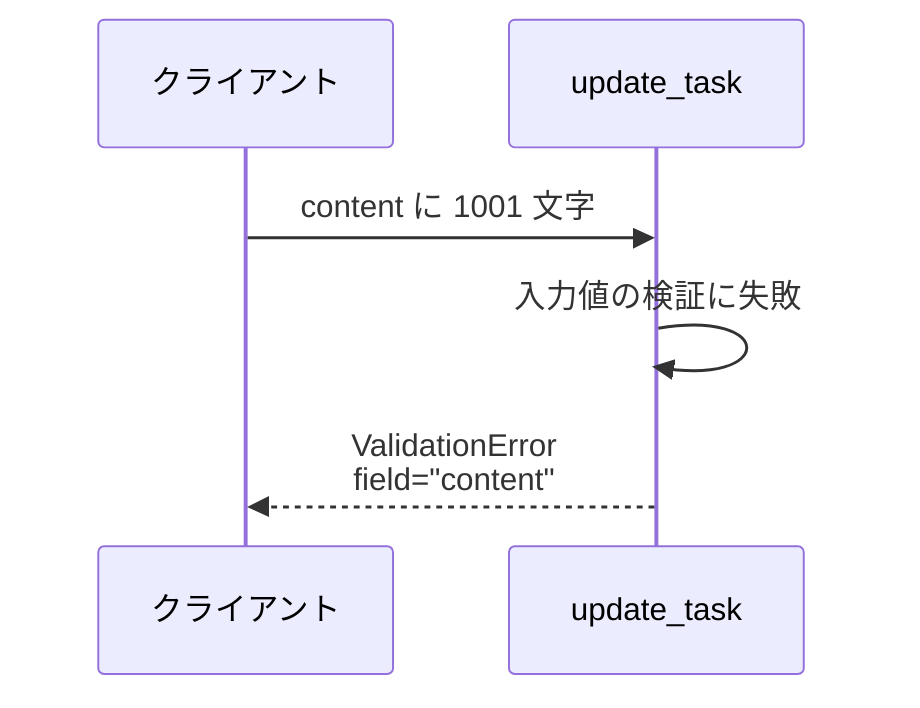
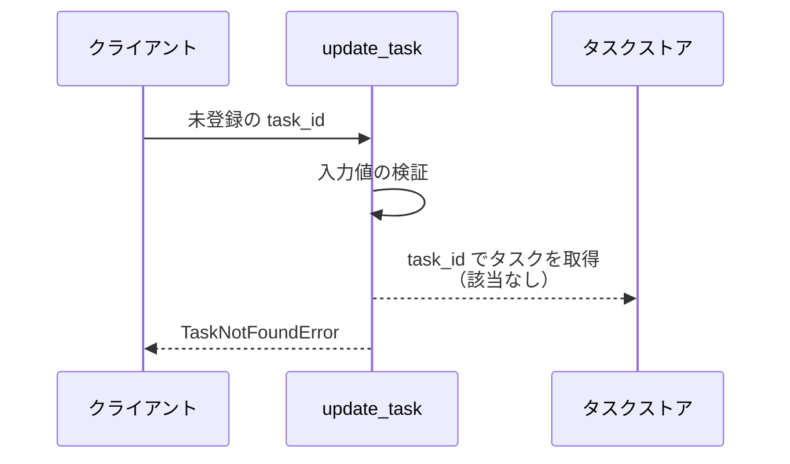

# タスク更新

操作: `update_task`（サービス層の公開関数）

登録済みタスクのタイトルと本文を更新して、更新後のタスクを返す。

- 対応テストファイル: `tests/integration/tasks/test_タスク更新.py`

## インターフェース

### リクエスト

| パラメータ | 型 | 必須 | デフォルト | 説明 | 制限 | 補足 |
| --- | --- | --- | --- | --- | --- | --- |
| `store` | `dict[str, Task]` | ✅ | - | 更新対象を保持するタスクストア | - | 呼び出し元が注入する |
| `task_id` | `str` | ✅ | - | 更新対象のタスク ID | - | `store` のキー |
| `title` | `str` | ✅ | - | タスク名 | 1 文字以上 100 文字以内 | - |
| `content` | `str` | - | `""` | 本文 | 1000 文字以内 | 省略時は空文字で上書きする |

リクエスト例:

```python
update_task(store, "t1", "新タイトル", "新本文")
```

### レスポンス

| フィールド | 型 | 説明 | 制限 | 補足 |
| --- | --- | --- | --- | --- |
| `id` | `str` | タスク ID | - | 入力の `task_id` と同じ |
| `title` | `str` | 更新後のタスク名 | - | - |
| `content` | `str` | 更新後の本文 | - | - |

レスポンス例:

```python
Task(id="t1", title="新タイトル", content="新本文")
```

補足:

- 同じ引数で 2 回呼んでも結果は変わらない（全置換のため冪等）

### エラー

| エラー | 発生条件 | 補足 |
| --- | --- | --- |
| なし（正常終了） | 更新成功 | 戻り値は レスポンス表のとおり |
| `ValidationError` | `title` が 0 文字 or 101 文字以上 | `field` は `"title"` |
| `ValidationError` | `content` が 1001 文字以上 | `field` は `"content"` |
| `TaskNotFoundError` | `task_id` が `store` に存在しない | ストアは変更されない |

## 制約

| 項目 | 制約 | 補足 |
| --- | --- | --- |
| タイムアウト | 制限なし | インメモリのストアのみを触るため |
| 認可 | なし | サンドボックス用の最小実装 |
| 更新方式 | 全置換 | 省略した `content` は空文字で上書きされる |
| 検証順序 | 入力値の検証 → 対象タスクの取得 | 未登録 ID と入力不正が同時に起きた場合は `ValidationError` が出る |
| 部分更新 | 対応しない | 呼び出し元が更新後の全項目を渡す |

## フロー一覧

| 分類 | フロー名 | 概要 | 補足 |
| --- | --- | --- | --- |
| 正常 | 正常系 | タイトルと本文を更新して返す | - |
| 正常 | 正常系（本文を省略） | 本文を空文字で上書きして返す | - |
| 異常 | 異常系（タイトルが空・ValidationError） | タイトルの下限違反 | - |
| 異常 | 異常系（タイトル超過・ValidationError） | タイトルの上限違反 | - |
| 異常 | 異常系（本文超過・ValidationError） | 本文の上限違反 | - |
| 異常 | 異常系（タスク不明・TaskNotFoundError） | 未登録の ID を指定 | - |

## 正常系

### セットアップ

| セットアップ | 説明 | 補足 |
| --- | --- | --- |
| Mock | なし（インメモリのタスクストアを実物のまま使う） | - |
| タスク | `t1` のタスクを登録済み | タイトル・本文とも更新前の値 |

### フロー



### 期待値

- 更新後のタイトルと本文を持つタスクが返る
- ストアの `t1` が更新後の値になっている

## 正常系（本文を省略）

### セットアップ

| セットアップ | 説明 | 補足 |
| --- | --- | --- |
| Mock | なし（インメモリのタスクストアを実物のまま使う） | - |
| タスク | `t1` のタスクを本文ありで登録済み | 上書きされることを観測するため |
| 入力 | `content` を渡さずに呼ぶ | デフォルト値の分岐を決定的に誘発 |

### フロー



### 期待値

- 返るタスクの本文が空文字になっている
- ストアの `t1` の本文も空文字になっている

## 異常系（タイトルが空・ValidationError）

### セットアップ

| セットアップ | 説明 | 補足 |
| --- | --- | --- |
| Mock | なし（インメモリのタスクストアを実物のまま使う） | - |
| タスク | `t1` のタスクを登録済み | - |
| 入力 | `title` に空文字を指定 | 下限違反を決定的に誘発 |

### フロー



### 期待値

- `ValidationError` が送出され、`field` が `"title"` になっている
- ストアの `t1` が更新前の値のまま

## 異常系（タイトル超過・ValidationError）

### セットアップ

| セットアップ | 説明 | 補足 |
| --- | --- | --- |
| Mock | なし（インメモリのタスクストアを実物のまま使う） | - |
| タスク | `t1` のタスクを登録済み | - |
| 入力 | `title` に 101 文字を指定 | 上限違反を決定的に誘発 |

### フロー



### 期待値

- `ValidationError` が送出され、`field` が `"title"` になっている
- ストアの `t1` が更新前の値のまま

## 異常系（本文超過・ValidationError）

### セットアップ

| セットアップ | 説明 | 補足 |
| --- | --- | --- |
| Mock | なし（インメモリのタスクストアを実物のまま使う） | - |
| タスク | `t1` のタスクを登録済み | - |
| 入力 | `content` に 1001 文字を指定 | 上限違反を決定的に誘発 |

### フロー



### 期待値

- `ValidationError` が送出され、`field` が `"content"` になっている
- ストアの `t1` が更新前の値のまま

## 異常系（タスク不明・TaskNotFoundError）

### セットアップ

| セットアップ | 説明 | 補足 |
| --- | --- | --- |
| Mock | なし（インメモリのタスクストアを実物のまま使う） | - |
| タスク | `t1` のタスクを登録済み | - |
| 入力 | `store` に無い `task_id` を指定 | 取得失敗を決定的に誘発 |

### フロー



### 期待値

- `TaskNotFoundError` が送出される
- ストアに新しいキーが増えておらず、`t1` も更新前の値のまま
