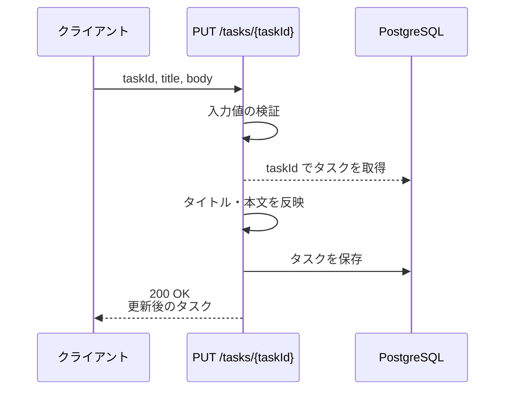
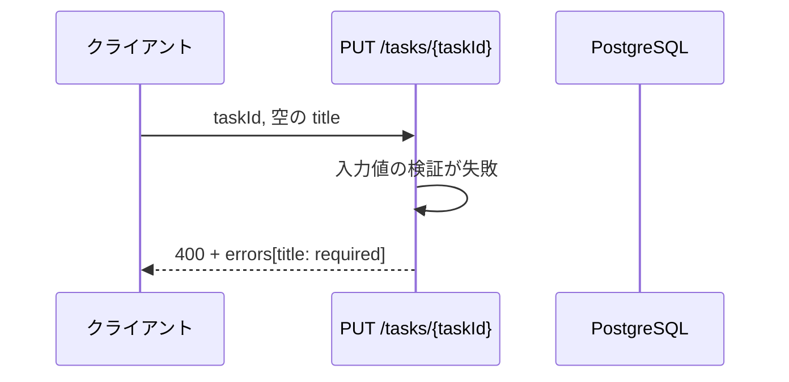
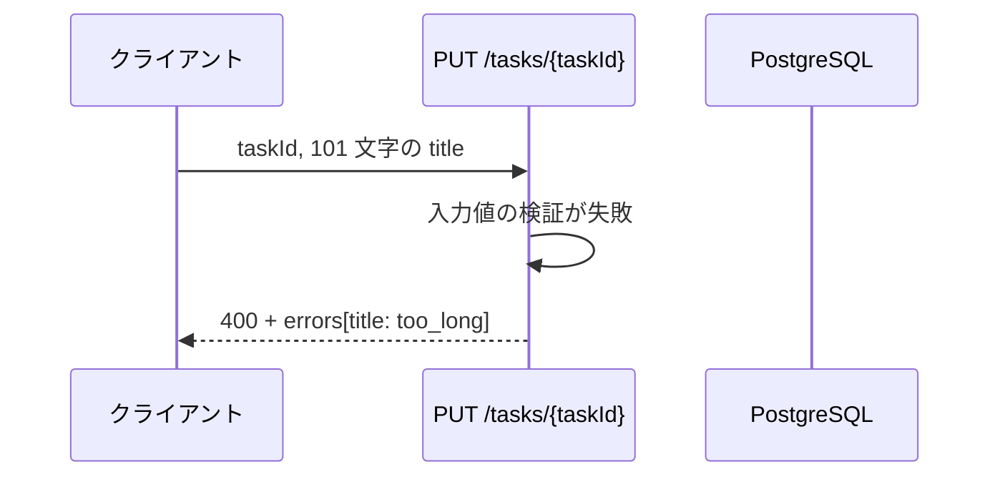
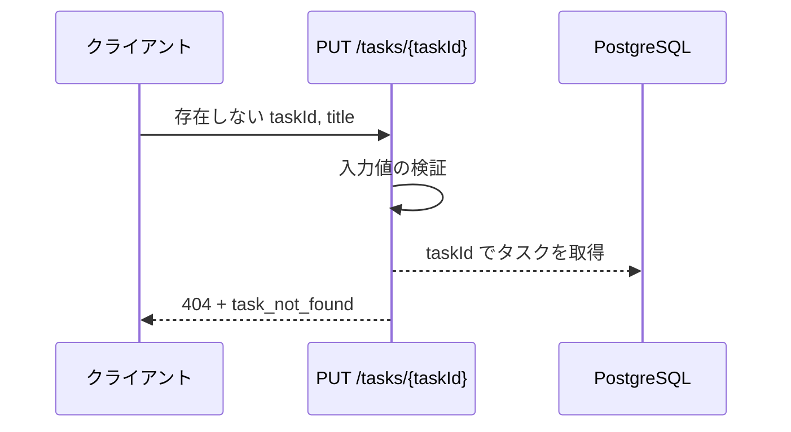
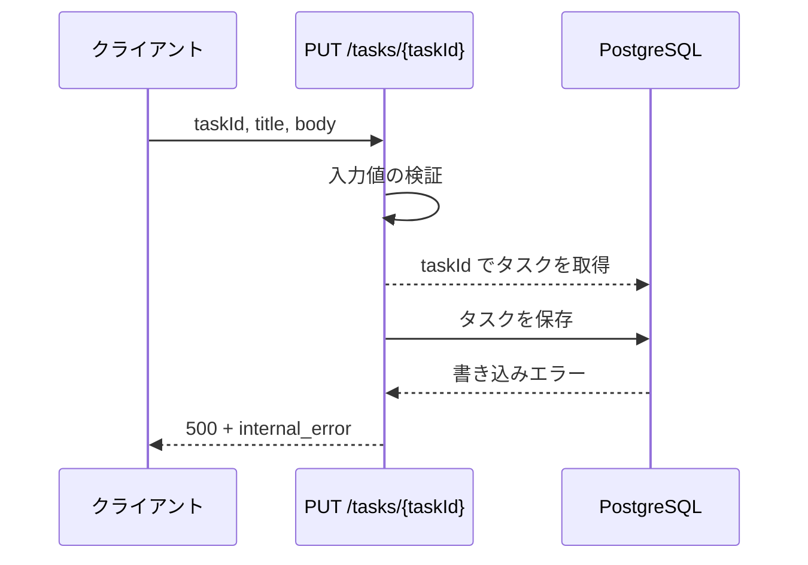

# タスク更新

エンドポイント: PUT /tasks/{taskId}

既存タスクのタイトル・本文を検証したうえで更新する。

- 対応テストファイル: 未記入

## インターフェース

### リクエスト

| パラメータ | 型 | 必須 | デフォルト | 説明 | 制限 | 補足 |
| --- | --- | --- | --- | --- | --- | --- |
| `taskId` | `str` | ✅ | - | 更新対象のタスク ID | - | パスパラメータ |
| `title` | `str` | ✅ | - | タスク名 | 前後の空白を除いて 1 文字以上 100 文字以内 | - |
| `body` | `str` | - | 変更なし（現在値を保持） | タスク本文 | 制限なし | - |

リクエスト例:

```json
{
  "title": "決算資料の作成",
  "body": "第 4 四半期分をまとめる"
}
```

### レスポンス

| フィールド | 型 | 説明 | 制限 | 補足 |
| --- | --- | --- | --- | --- |
| `task` | `object` | 更新後のタスク | - | - |
| `task.id` | `str` | タスク ID | - | リクエストの `taskId` と一致 |
| `task.title` | `str` | 更新後のタスク名 | - | 前後の空白を除いた値 |
| `task.body` | `str` | 更新後のタスク本文 | - | - |
| `task.updatedAt` | `str` | 更新日時（ISO 8601） | - | UTC・タイムゾーン付き |

レスポンス例:

```json
{
  "task": {
    "id": "3f2b1c88-2a17-4c0e-9f1e-6d2b7a5c0e11",
    "title": "決算資料の作成",
    "body": "第 4 四半期分をまとめる",
    "updatedAt": "2026-08-05T02:14:33+00:00"
  }
}
```

検証エラー時のレスポンス例:

```json
{
  "errors": [
    { "field": "title", "code": "required", "message": "タスク名を入力してください" }
  ]
}
```

補足:

- 同じリクエストを繰り返し送っても結果は変わらない（`updatedAt` のみ更新される冪等な操作）。

### ステータスコード

| ステータスコード | 発生条件 | 補足 |
| --- | --- | --- |
| `200` | 更新成功 | - |
| `400` | リクエストのバリデーション失敗 | フィールド単位のエラーを返す |
| `404` | 対象のタスクが存在しない | - |
| `500` | DB 更新失敗 | - |

## 制約

| 項目 | 制約 | 補足 |
| --- | --- | --- |
| タイムアウト | 1 秒以内に応答する | 非機能要件（SA）に対応 |
| 認可 | 制限なし | 認証・認可は SA のスコープ外 |
| レート制限 | 制限なし | - |
| 更新対象カラム | `title` / `body` のみ | DB スキーマの変更は SA のスコープ外 |

## フロー一覧

| 分類 | フロー名 | 概要 | 補足 |
| --- | --- | --- | --- |
| 正常 | 正常系 | タイトル・本文を検証して更新 | - |
| 異常 | 異常系（タスク名が空・400） | 検証失敗 → フィールド単位のエラーを返却 | 単一 UC シナリオの異常シナリオに対応 |
| 異常 | 異常系（タスク名が 100 文字超・400） | 検証失敗 → フィールド単位のエラーを返却 | - |
| 異常 | 異常系（タスク未存在・404） | 対象が見つからず更新せず終了 | - |
| 異常 | 異常系（DB 更新失敗・500） | 保存時の DB 例外 → 500 返却 | 監視対象 |

## 正常系

### セットアップ

| セットアップ | 説明 | 補足 |
| --- | --- | --- |
| Mock | `PostgreSQL` を DB stub に差し替え | - |
| タスク | 更新対象のタスクを 1 件登録済み | 単一 UC シナリオのセットアップに対応 |

### フロー



### 期待値

- `200 OK` + 更新後のタスクが返る
- tasks テーブルの当該行の `title` / `body` がリクエスト値になっている
- 当該行の `updated_at` が更新前より後の時刻になっている

## 異常系（タスク名が空・400）

### セットアップ

| セットアップ | 説明 | 補足 |
| --- | --- | --- |
| Mock | `PostgreSQL` を DB stub に差し替え | - |
| タスク | 更新対象のタスクを 1 件登録済み | - |
| 入力 | `title` を空文字にして送信 | 検証失敗を決定的に誘発 |

### フロー



### 期待値

- `400` + `errors` に `field: "title"` / `code: "required"` の 1 件が返る
- tasks テーブルの当該行は更新されていない

## 異常系（タスク名が 100 文字超・400）

### セットアップ

| セットアップ | 説明 | 補足 |
| --- | --- | --- |
| Mock | `PostgreSQL` を DB stub に差し替え | - |
| タスク | 更新対象のタスクを 1 件登録済み | - |
| 入力 | 101 文字の `title` で送信 | 検証失敗を決定的に誘発 |

### フロー



### 期待値

- `400` + `errors` に `field: "title"` / `code: "too_long"` の 1 件が返る
- tasks テーブルの当該行は更新されていない

## 異常系（タスク未存在・404）

### セットアップ

| セットアップ | 説明 | 補足 |
| --- | --- | --- |
| Mock | `PostgreSQL` を DB stub に差し替え | - |
| タスク | 対象 ID のタスクを登録しない | 取得失敗を決定的に誘発 |

### フロー



### 期待値

- `404` + `task_not_found` が返る
- tasks テーブルに新しい行は作成されていない

## 異常系（DB 更新失敗・500）

### セットアップ

| セットアップ | 説明 | 補足 |
| --- | --- | --- |
| Mock | `PostgreSQL` を DB stub に差し替え、保存時に例外を返す | 保存失敗を決定的に誘発 |
| タスク | 更新対象のタスクを 1 件登録済み | - |

### フロー



### 期待値

- `500` + `internal_error` が返る
- tasks テーブルの当該行は更新されていない
