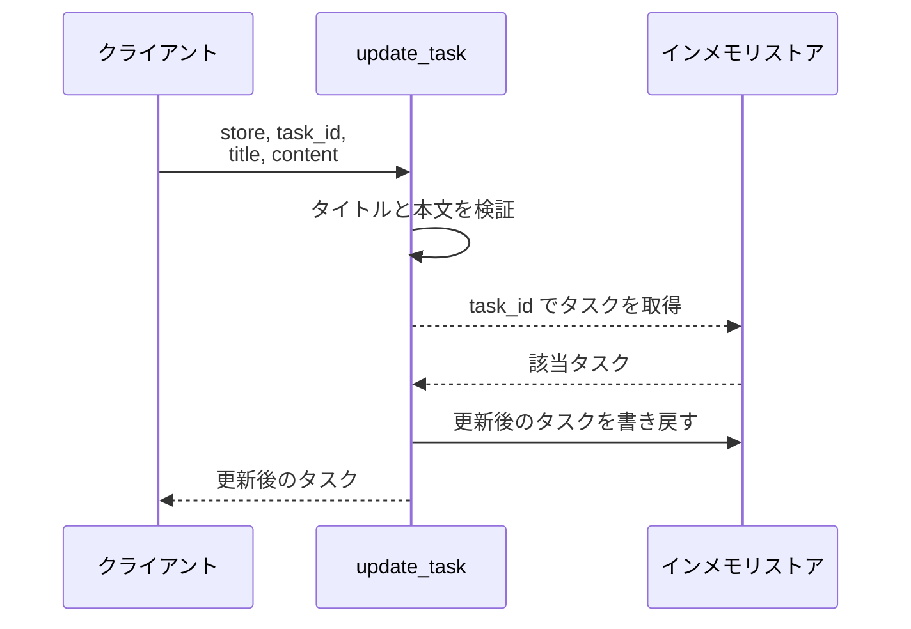
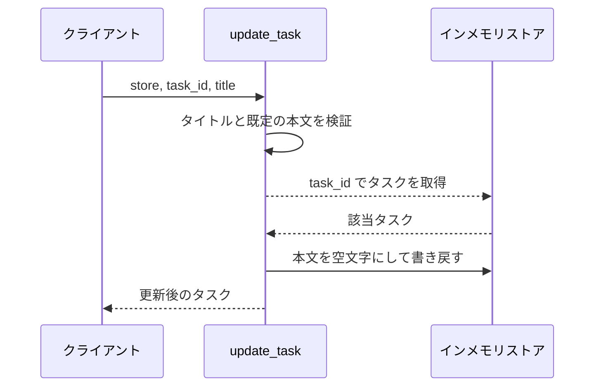
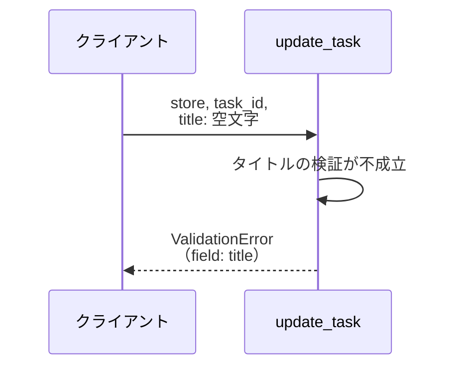
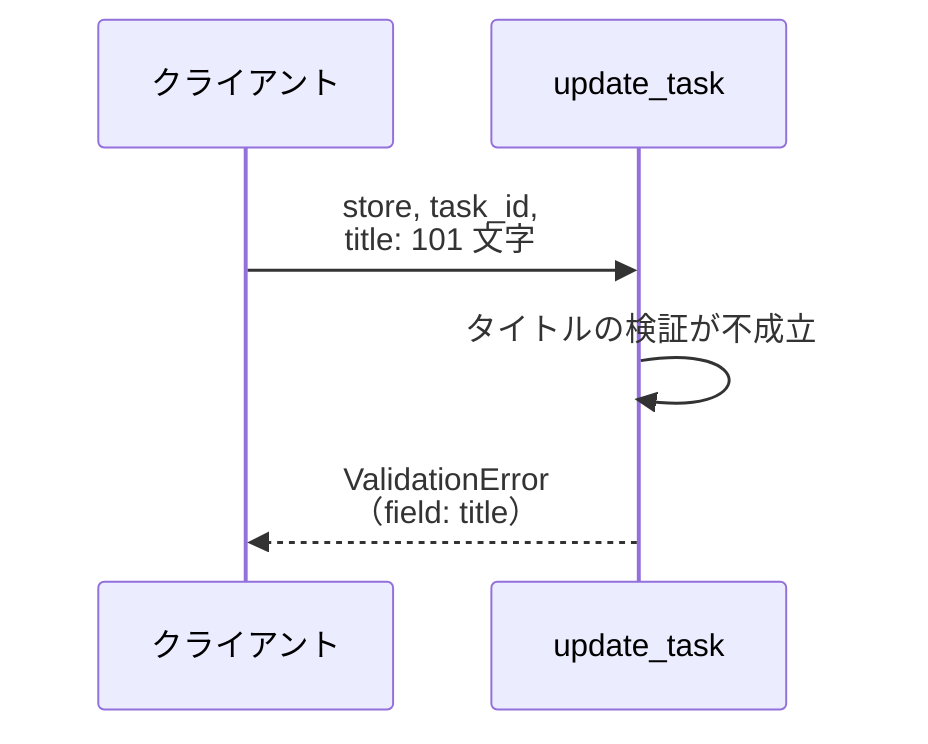
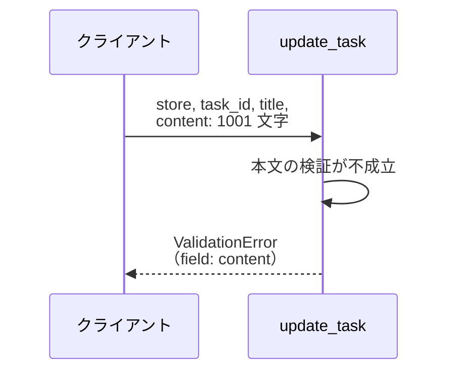
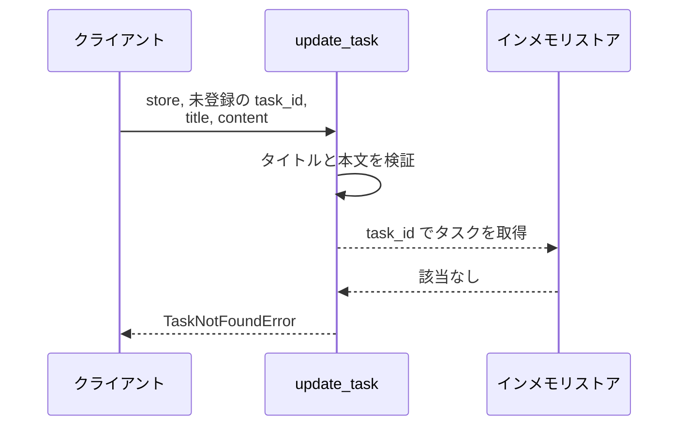

# タスク更新

操作: `update_task`（サービス層の公開関数）

登録済みタスクのタイトルと本文を検証したうえで更新し、更新後のタスクを返す。

- 対応テストファイル: -

## インターフェース

### リクエスト

| パラメータ | 型 | 必須 | デフォルト | 説明 | 制限 | 補足 |
| --- | --- | --- | --- | --- | --- | --- |
| `store` | `dict[str, Task]` | ✅ | - | 更新対象を保持するインメモリストア | - | 呼び出し元が保持する |
| `task_id` | `str` | ✅ | - | 更新対象のタスク ID | - | ストアのキーと一致すること |
| `title` | `str` | ✅ | - | 更新後のタスク名 | 1〜100 文字 | 空文字不可 |
| `content` | `str` | - | `""` | 更新後の本文 | 1000 文字以内 | 空文字可 |

リクエスト例:

```python
update_task(store, "t1", "新タイトル", "新本文")
```

### レスポンス

| フィールド | 型 | 説明 | 制限 | 補足 |
| --- | --- | --- | --- | --- |
| `task` | `Task` | 更新後のタスク | - | 同じ値がストアにも書き戻される |
| `task.id` | `str` | タスク ID | - | 引数の `task_id` と一致する |
| `task.title` | `str` | 更新後のタスク名 | - | 引数の `title` と一致する |
| `task.content` | `str` | 更新後の本文 | - | 引数を省略した場合は空文字 |

レスポンス例:

```python
Task(id="t1", title="新タイトル", content="新本文")
```

### 例外

| 例外 | 発生条件 | 補足 |
| --- | --- | --- |
| なし（正常終了） | 更新成功 | 戻り値はレスポンス表のとおり |
| `ValidationError` | `title` が空文字 | `field` に `"title"` を持つ |
| `ValidationError` | `title` が 100 文字を超える | `field` に `"title"` を持つ |
| `ValidationError` | `content` が 1000 文字を超える | `field` に `"content"` を持つ |
| `TaskNotFoundError` | `task_id` がストアに存在しない | `field` は持たない |

## 制約

| 項目 | 制約 | 補足 |
| --- | --- | --- |
| 応答時間 | 1 秒以内 | - |
| 認可 | 制限なし | 呼び出し元を限定しない |
| 同時実行 | 制限なし | 単一プロセス・単一スレッドで動作する |
| 一度に更新できるタスク | 1 件 | 一括更新は提供しない |

## フロー一覧

| 分類 | フロー名 | 概要 | 補足 |
| --- | --- | --- | --- |
| 正常 | 正常系 | タイトルと本文を更新し、更新後のタスクを返す | - |
| 正常 | 正常系（本文を省略） | 本文を空文字で上書きして更新する | - |
| 異常 | 異常系（タイトルが空・ValidationError） | 入力検証で弾き、ストアを変更しない | - |
| 異常 | 異常系（タイトル超過・ValidationError） | 101 文字のタイトルを弾く | - |
| 異常 | 異常系（本文超過・ValidationError） | 1001 文字の本文を弾く | - |
| 異常 | 異常系（タスク未登録・TaskNotFoundError） | 存在確認で弾き、ストアを変更しない | - |

## 正常系

### セットアップ

| セットアップ | 説明 | 補足 |
| --- | --- | --- |
| Mock | なし（インメモリストアをそのまま使う） | 外部依存を持たない |
| タスク | `t1` のタスクを登録済み | タイトル・本文とも既存値が入っている |

### フロー



### 期待値

- 引数の `title` と `content` を持つタスクが返る
- ストアの `t1` が更新後の値に置き換わっている

## 正常系（本文を省略）

### セットアップ

| セットアップ | 説明 | 補足 |
| --- | --- | --- |
| Mock | なし（インメモリストアをそのまま使う） | 外部依存を持たない |
| タスク | `t1` のタスクを登録済み | 本文に既存値が入っている |
| 入力 | `content` を渡さずに呼び出す | 既定値の適用を決定的に誘発 |

### フロー



### 期待値

- 返るタスクの本文が空文字になっている
- ストアの `t1` の本文も空文字に置き換わっている

## 異常系（タイトルが空・ValidationError）

### セットアップ

| セットアップ | 説明 | 補足 |
| --- | --- | --- |
| Mock | なし（インメモリストアをそのまま使う） | 外部依存を持たない |
| タスク | `t1` のタスクを登録済み | - |
| 入力 | `title` に空文字を渡す | 検証失敗を決定的に誘発 |

### フロー



### 期待値

- `ValidationError` が送出され、`field` が `"title"` になっている
- ストアの `t1` が更新前の値のまま変わっていない

## 異常系（タイトル超過・ValidationError）

### セットアップ

| セットアップ | 説明 | 補足 |
| --- | --- | --- |
| Mock | なし（インメモリストアをそのまま使う） | 外部依存を持たない |
| タスク | `t1` のタスクを登録済み | - |
| 入力 | `title` に 101 文字を渡す | 上限超過を決定的に誘発 |

### フロー



### 期待値

- `ValidationError` が送出され、`field` が `"title"` になっている
- ストアの `t1` が更新前の値のまま変わっていない

## 異常系（本文超過・ValidationError）

### セットアップ

| セットアップ | 説明 | 補足 |
| --- | --- | --- |
| Mock | なし（インメモリストアをそのまま使う） | 外部依存を持たない |
| タスク | `t1` のタスクを登録済み | - |
| 入力 | `title` は正しい値、`content` に 1001 文字を渡す | 本文だけの超過を決定的に誘発 |

### フロー



### 期待値

- `ValidationError` が送出され、`field` が `"content"` になっている
- ストアの `t1` が更新前の値のまま変わっていない

## 異常系（タスク未登録・TaskNotFoundError）

### セットアップ

| セットアップ | 説明 | 補足 |
| --- | --- | --- |
| Mock | なし（インメモリストアをそのまま使う） | 外部依存を持たない |
| タスク | `t1` のタスクを登録済み | - |
| 入力 | 未登録の `task_id` と正しい入力値を渡す | 存在確認の失敗を決定的に誘発 |

### フロー



### 期待値

- `TaskNotFoundError` が送出される
- ストアに新しいキーが増えておらず、`t1` も更新前の値のまま変わっていない
