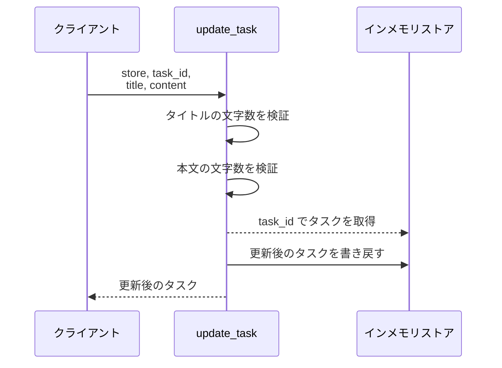
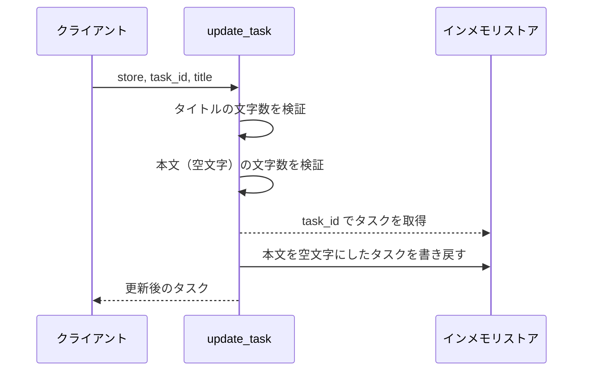
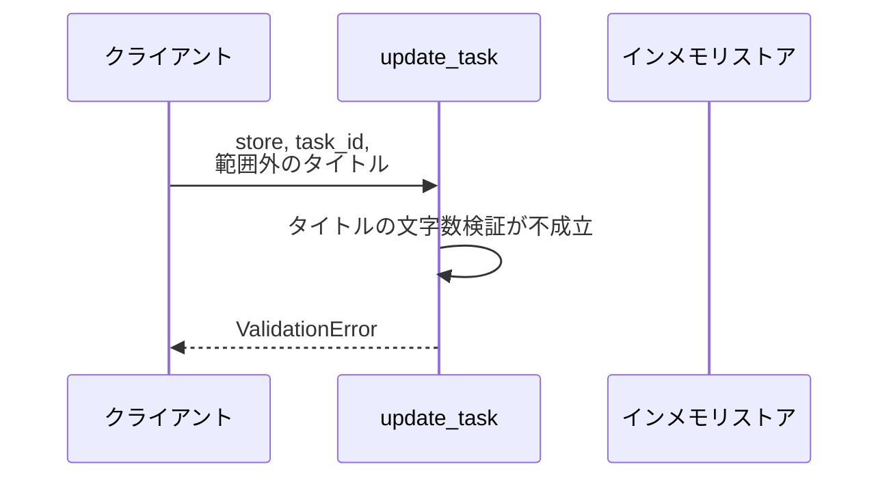
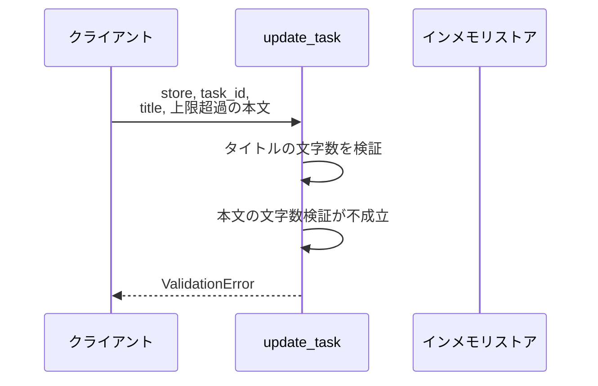
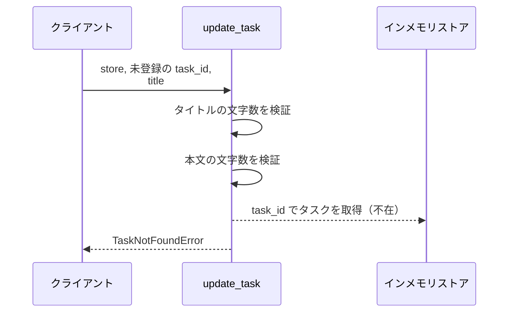

# タスク更新

操作: `update_task`（サービス層の公開関数）

登録済みタスクのタイトルと本文を受け取って更新し、更新後のタスクを返す。

- 対応テストファイル: なし（本プロジェクトは結合テストを持たない）

## インターフェース

### リクエスト

| パラメータ | 型 | 必須 | デフォルト | 説明 | 制限 | 補足 |
| --- | --- | --- | --- | --- | --- | --- |
| `store` | `dict[str, Task]` | ✅ | - | タスクを保持するインメモリストア | - | キーはタスク ID |
| `task_id` | `str` | ✅ | - | 更新対象のタスク ID | - | - |
| `title` | `str` | ✅ | - | 更新後のタイトル | 1 文字以上 100 文字以内 | - |
| `content` | `str` | - | `""` | 更新後の本文 | 1000 文字以内 | 省略すると空文字で上書きする |

リクエスト例:

```python
update_task(store, "t1", "新タイトル", "新本文")
```

### レスポンス

| フィールド | 型 | 説明 | 制限 | 補足 |
| --- | --- | --- | --- | --- |
| 戻り値 | `Task` | 更新後のタスク | - | 同じ値が `store[task_id]` にも書き戻される |
| 戻り値`.id` | `str` | タスク ID | - | 引数の `task_id` と一致する |
| 戻り値`.title` | `str` | 更新後のタイトル | - | - |
| 戻り値`.content` | `str` | 更新後の本文 | - | - |

レスポンス例:

```python
Task(id="t1", title="新タイトル", content="新本文")
```

### 例外

| 例外 | 発生条件 | 補足 |
| --- | --- | --- |
| なし（正常終了） | 更新成功 | 戻り値はレスポンス表のとおり |
| `ValidationError` | `title` が 1 文字未満 or 100 文字超過 | - |
| `ValidationError` | `content` が 1000 文字超過 | - |
| `TaskNotFoundError` | `task_id` が `store` に存在しない | - |

## 制約

| 項目 | 制約 | 補足 |
| --- | --- | --- |
| タイムアウト | 制限なし | インメモリ操作のみで待ちが発生しない |
| 認可 | 制限なし | 認証・認可は本プロジェクトのスコープ外 |
| 検証順序 | タイトル → 本文 → タスク存在確認 の順で判定する | 複数違反があっても先に判定したものだけを返す |
| 同時実行 | 制限なし | 単一プロセスのインメモリストアを前提とする |
| 副作用 | 例外を送出する場合は `store` を変更しない | 部分更新を作らない |

## フロー一覧

| 分類 | フロー名 | 概要 | 補足 |
| --- | --- | --- | --- |
| 正常 | 正常系 | タイトルと本文を更新して返す | - |
| 正常 | 正常系（本文を省略） | 本文を空文字で上書きして返す | - |
| 異常 | 異常系（タイトル長違反・ValidationError） | タイトルの文字数が範囲外で拒否する | - |
| 異常 | 異常系（本文長超過・ValidationError） | 本文が上限超過で拒否する | - |
| 異常 | 異常系（対象タスク不在・TaskNotFoundError） | 未登録の ID で拒否する | - |

## 正常系

### セットアップ

| セットアップ | 説明 | 補足 |
| --- | --- | --- |
| Mock | なし | ストアは実体のインメモリ dict を使う |
| タスク | `t1`（タイトル `旧タイトル` / 本文 `旧本文`）を登録済み | - |
| 入力 | タイトルと本文の両方を指定して呼ぶ | - |

### フロー



### 期待値

- 戻り値の `title` / `content` が入力値と一致する
- `store[task_id]` が戻り値と同じタスクに置き換わっている
- 戻り値の `id` が引数の `task_id` と一致する

## 正常系（本文を省略）

### セットアップ

| セットアップ | 説明 | 補足 |
| --- | --- | --- |
| Mock | なし | ストアは実体のインメモリ dict を使う |
| タスク | `t1`（タイトル `旧タイトル` / 本文 `旧本文`）を登録済み | - |
| 入力 | 本文を渡さずに呼ぶ | デフォルト値の分岐を決定的に誘発 |

### フロー



### 期待値

- 戻り値の `content` が空文字になっている
- `store[task_id]` の `content` も空文字になっている

## 異常系（タイトル長違反・ValidationError）

### セットアップ

| セットアップ | 説明 | 補足 |
| --- | --- | --- |
| Mock | なし | ストアは実体のインメモリ dict を使う |
| タスク | `t1`（タイトル `旧タイトル` / 本文 `旧本文`）を登録済み | - |
| 入力 | 空文字のタイトル、または 101 文字のタイトルで呼ぶ | 検証失敗を決定的に誘発 |

### フロー



### 期待値

- `ValidationError` が送出される
- `store[task_id]` が更新前のタイトル・本文のままである

## 異常系（本文長超過・ValidationError）

### セットアップ

| セットアップ | 説明 | 補足 |
| --- | --- | --- |
| Mock | なし | ストアは実体のインメモリ dict を使う |
| タスク | `t1`（タイトル `旧タイトル` / 本文 `旧本文`）を登録済み | - |
| 入力 | 有効なタイトルと 1001 文字の本文で呼ぶ | 検証失敗を決定的に誘発 |

### フロー



### 期待値

- `ValidationError` が送出される
- `store[task_id]` が更新前のタイトル・本文のままである

## 異常系（対象タスク不在・TaskNotFoundError）

### セットアップ

| セットアップ | 説明 | 補足 |
| --- | --- | --- |
| Mock | なし | ストアは実体のインメモリ dict を使う |
| タスク | `t1`（タイトル `旧タイトル` / 本文 `旧本文`）を登録済み | - |
| 入力 | `store` に無い ID と有効なタイトルで呼ぶ | 取得失敗を決定的に誘発 |

### フロー



### 期待値

- `TaskNotFoundError` が送出される
- `store` に新しいキーが追加されていない
- 既存の `store["t1"]` が更新前のタイトル・本文のままである
