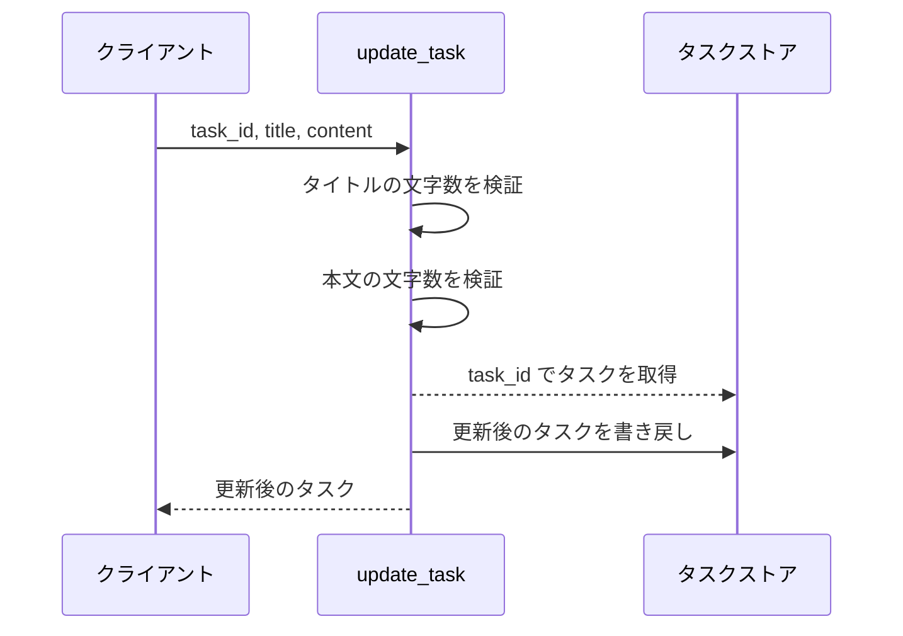
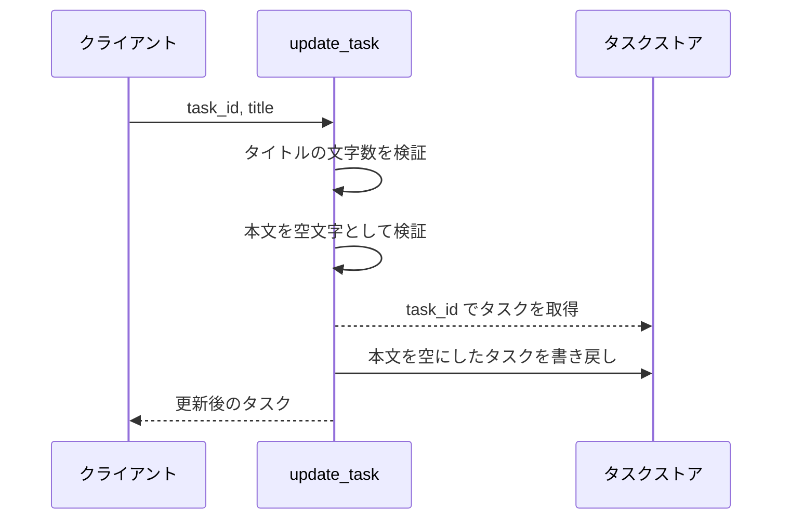
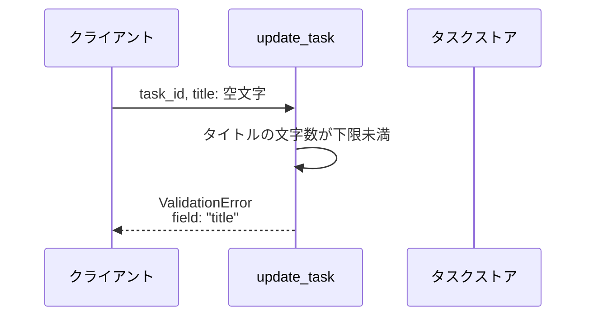
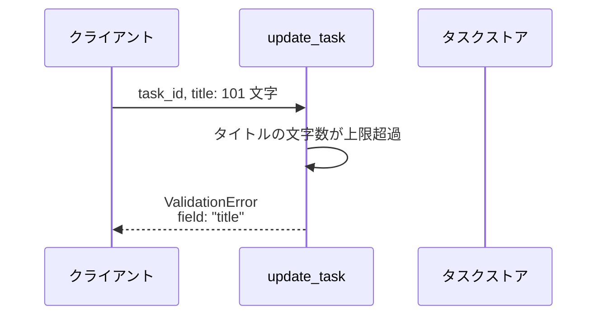
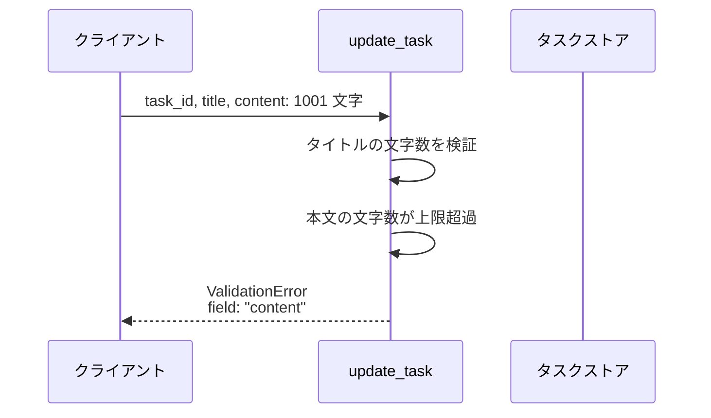
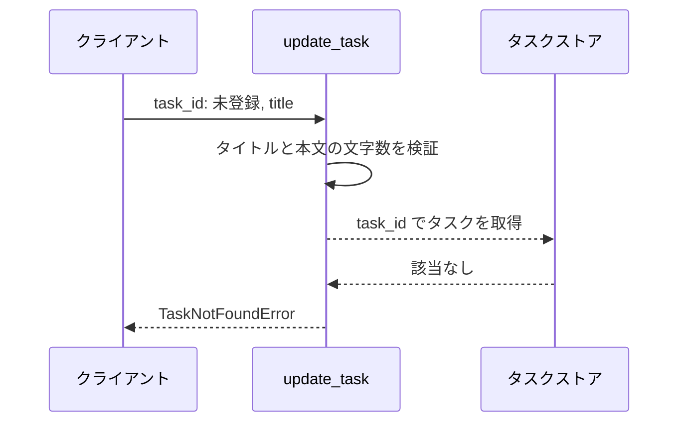

# タスク編集

操作: `update_task`（サービス層の公開関数）

登録済みタスクのタイトルと本文を検証したうえで更新し、更新後のタスクを返す。

- 対応テストファイル: なし（本プロジェクトはサブシステム結合テストを持たない）

## インターフェース

### リクエスト

| パラメータ | 型 | 必須 | デフォルト | 説明 | 制限 | 補足 |
| --- | --- | --- | --- | --- | --- | --- |
| `store` | `dict[str, Task]` | ✅ | - | タスクの保管先 | - | 呼び出し側が保持するインメモリの辞書 |
| `task_id` | `str` | ✅ | - | 更新対象のタスク ID | - | `store` のキー |
| `title` | `str` | ✅ | - | 更新後のタスク名 | 1 文字以上 100 文字以内 | - |
| `content` | `str` | - | `""`（本文を空にする） | 更新後の本文 | 1000 文字以内 | - |

リクエスト例:

```python
update_task(store, "t1", "新タイトル", "新本文")
```

### レスポンス

| フィールド | 型 | 説明 | 制限 | 補足 |
| --- | --- | --- | --- | --- |
| 戻り値 | `Task` | 更新後のタスク | - | `store` に書き戻したものと同一のインスタンス |
| `Task.id` | `str` | タスク ID | - | 引数の `task_id` と一致する |
| `Task.title` | `str` | 更新後のタスク名 | - | 引数の `title` と一致する |
| `Task.content` | `str` | 更新後の本文 | - | 引数の `content` と一致する |

レスポンス例:

```python
Task(id="t1", title="新タイトル", content="新本文")
```

### エラー

| エラー | 発生条件 | 補足 |
| --- | --- | --- |
| なし（正常終了） | 検証を通過して更新に成功 | 戻り値はレスポンス表のとおり |
| `ValidationError` | `title` が 1 文字未満 | `field` が `"title"` |
| `ValidationError` | `title` が 100 文字超 | `field` が `"title"` |
| `ValidationError` | `content` が 1000 文字超 | `field` が `"content"` |
| `TaskNotFoundError` | `task_id` が `store` に存在しない | `field` を持たない（入力値の検証ではないため） |

## 制約

| 項目 | 制約 | 補足 |
| --- | --- | --- |
| タイムアウト | 制限なし | インメモリ操作のみで外部通信を行わない |
| 認可 | 制限なし | サービス層は呼び出し元を認証しない |
| 検証の打ち切り | 最初に違反したフィールドで打ち切る | 複数フィールドが同時に違反しても送出する `ValidationError` は 1 件 |
| 検証の順序 | `title` → `content` → タスクの存在 | 打ち切り位置がこの順で決まる |
| 部分更新 | 不可（`title` と `content` を毎回まとめて上書きする） | `content` の省略は「本文を空にする」の意味になる |

## フロー一覧

| 分類 | フロー名 | 概要 | 補足 |
| --- | --- | --- | --- |
| 正常 | 正常系 | タイトルと本文を更新して更新後のタスクを返す | - |
| 正常 | 正常系（本文の省略時） | 本文を省略すると空文字で上書きする | - |
| 異常 | 異常系（タイトルが空・ValidationError） | 下限違反を検出して更新しない | - |
| 異常 | 異常系（タイトル超過・ValidationError） | 上限違反を検出して更新しない | - |
| 異常 | 異常系（本文超過・ValidationError） | 本文の上限違反を検出して更新しない | - |
| 異常 | 異常系（タスク未登録・TaskNotFoundError） | 対象が無いことを検出して更新しない | - |

## 正常系

### セットアップ

| セットアップ | 説明 | 補足 |
| --- | --- | --- |
| Mock | なし（インメモリの辞書をそのまま使う） | 外部依存を持たない |
| タスク | `t1` を `旧タイトル` / `旧本文` で登録済み | 更新前後の差が出る値にする |

### フロー



### 期待値

- 戻り値の `title` / `content` が引数で渡した値と一致している
- ストアの `t1` が更新後のタスクに置き換わっている

## 正常系（本文の省略時）

### セットアップ

| セットアップ | 説明 | 補足 |
| --- | --- | --- |
| Mock | なし（インメモリの辞書をそのまま使う） | 外部依存を持たない |
| タスク | `t1` を `旧タイトル` / `旧本文` で登録済み | 本文が空になったことを判別できる値にする |
| 入力 | `content` を渡さずに呼び出す | デフォルト適用を決定的に誘発 |

### フロー



### 期待値

- 戻り値の `content` が `""` になっている
- ストアの `t1` の本文も `""` に置き換わっている

## 異常系（タイトルが空・ValidationError）

### セットアップ

| セットアップ | 説明 | 補足 |
| --- | --- | --- |
| Mock | なし（インメモリの辞書をそのまま使う） | 外部依存を持たない |
| タスク | `t1` を `旧タイトル` / `旧本文` で登録済み | 更新されていないことを確認する対象 |
| 入力 | `title` に空文字を渡す | 下限違反を決定的に誘発 |

### フロー



### 期待値

- `ValidationError` が送出され、`field` が `"title"` になっている
- ストアの `t1` は更新前のタイトルと本文のまま

## 異常系（タイトル超過・ValidationError）

### セットアップ

| セットアップ | 説明 | 補足 |
| --- | --- | --- |
| Mock | なし（インメモリの辞書をそのまま使う） | 外部依存を持たない |
| タスク | `t1` を `旧タイトル` / `旧本文` で登録済み | 更新されていないことを確認する対象 |
| 入力 | `title` に 101 文字を渡す | 上限違反を決定的に誘発 |

### フロー



### 期待値

- `ValidationError` が送出され、`field` が `"title"` になっている
- ストアの `t1` は更新前のタイトルと本文のまま

## 異常系（本文超過・ValidationError）

### セットアップ

| セットアップ | 説明 | 補足 |
| --- | --- | --- |
| Mock | なし（インメモリの辞書をそのまま使う） | 外部依存を持たない |
| タスク | `t1` を `旧タイトル` / `旧本文` で登録済み | 更新されていないことを確認する対象 |
| 入力 | `title` は正常値・`content` に 1001 文字を渡す | 本文だけの上限違反を決定的に誘発 |

### フロー



### 期待値

- `ValidationError` が送出され、`field` が `"content"` になっている
- ストアの `t1` は更新前のタイトルと本文のまま

## 異常系（タスク未登録・TaskNotFoundError）

### セットアップ

| セットアップ | 説明 | 補足 |
| --- | --- | --- |
| Mock | なし（インメモリの辞書をそのまま使う） | 外部依存を持たない |
| タスク | `t1` を `旧タイトル` / `旧本文` で登録済み | 他のタスクが巻き込まれないことを確認する対象 |
| 入力 | ストアに無い `task_id` を渡す | 未検出を決定的に誘発 |

### フロー



### 期待値

- `TaskNotFoundError` が送出される
- ストアの `t1` は更新前のタイトルと本文のまま
