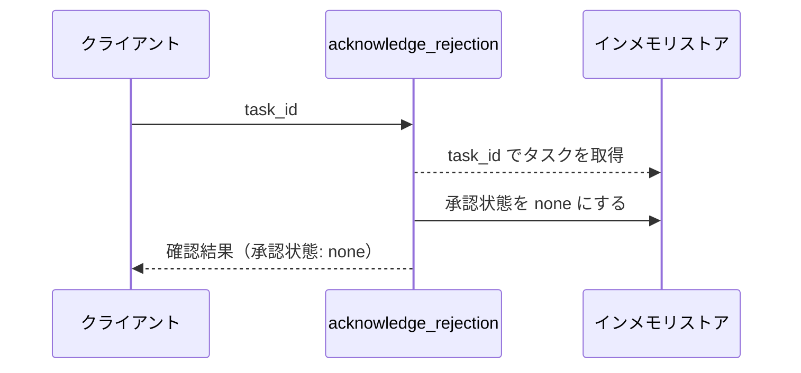
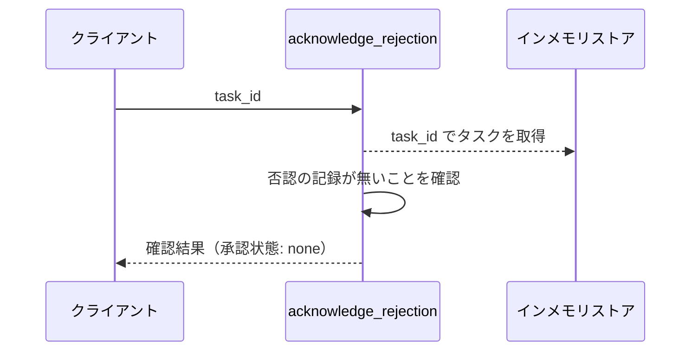
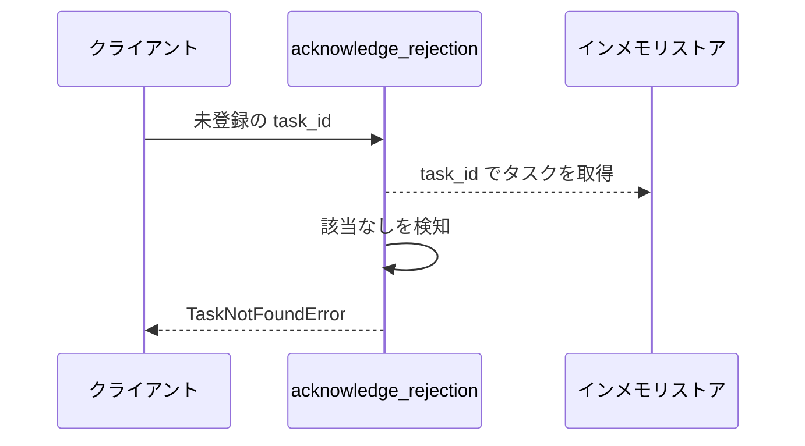

# 否認確認

操作: `acknowledge_rejection`（サービス層の公開関数）

否認の確認を受け付け、否認の記録を消して再び編集できる状態へ戻す。

- 対応テストファイル: 未定（テストレビュー完了時に記入）

## インターフェース

### リクエスト

| パラメータ | 型 | 必須 | デフォルト | 説明 | 制限 | 補足 |
| --- | --- | --- | --- | --- | --- | --- |
| `task_id` | `str` | ✅ | - | 否認の記録を消すタスクの ID | - | - |

リクエスト例:

```json
{
  "task_id": "t1"
}
```

### レスポンス

| フィールド | 型 | 説明 | 制限 | 補足 |
| --- | --- | --- | --- | --- |
| `task_id` | `str` | 対象のタスク ID | - | - |
| `approval_state` | `"none"` | 確認後の承認状態 | - | 否認の記録が無い場合も `none` を返す |

レスポンス例:

```json
{
  "task_id": "t1",
  "approval_state": "none"
}
```

### 例外

| 例外 | 発生条件 | 補足 |
| --- | --- | --- |
| なし（正常終了） | 否認の記録を消した / 消す対象が無かった | 戻り値は レスポンス表のとおり |
| `TaskNotFoundError` | 指定 ID のタスクが存在しない | - |

## 制約

| 項目 | 制約 | 補足 |
| --- | --- | --- |
| 認可 | 制限なし | 利用者を識別する仕組みを持たない |
| 冪等性 | 同じタスクへ何度呼んでも結果が変わらない | 否認の記録が無い状態で呼んでも例外にしない |
| 対象の状態 | 承認状態が `pending` のタスクには効果を持たない | 承認待ちの値と承認依頼 ID を保ったまま `pending` を維持する |

## フロー一覧

| 分類 | フロー名 | 概要 | 補足 |
| --- | --- | --- | --- |
| 正常 | 正常系 | 否認の記録を消して編集できる状態へ戻す | - |
| 正常 | 正常系（否認の記録が無い） | 何も変えずに現在の状態を返す | - |
| 異常 | 異常系（タスク未登録・TaskNotFoundError） | 対象タスクが存在しない | - |

## 正常系

### セットアップ

| セットアップ | 説明 | 補足 |
| --- | --- | --- |
| Mock | なし | 外部依存を持たない |
| タスク | 承認状態が `rejected` のタスクを 1 件登録済み | 否認の記録を保持 |

### フロー



### 期待値

- 対象タスクの承認状態が `none` になっている
- 対象タスクのタイトル / 本文が編集前の値のまま残っている

## 正常系（否認の記録が無い）

### セットアップ

| セットアップ | 説明 | 補足 |
| --- | --- | --- |
| Mock | なし | 外部依存を持たない |
| タスク | 承認状態が `none` のタスクを 1 件登録済み | 消す対象が無い状態を作る |

### フロー



### 期待値

- 承認状態 `none` の確認結果が返る
- 対象タスクの内容が呼び出し前のまま変わっていない

## 異常系（タスク未登録・TaskNotFoundError）

### セットアップ

| セットアップ | 説明 | 補足 |
| --- | --- | --- |
| Mock | なし | 外部依存を持たない |
| 入力 | 登録されていない task_id で呼び出す | 取得失敗を決定的に誘発 |

### フロー



### 期待値

- `TaskNotFoundError` が送出される
- ストアの内容が呼び出し前のまま変わっていない
