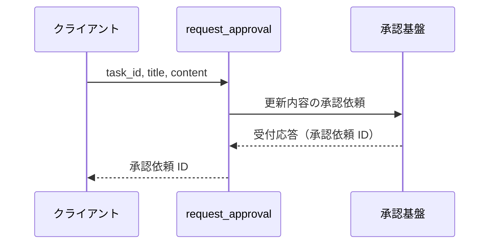
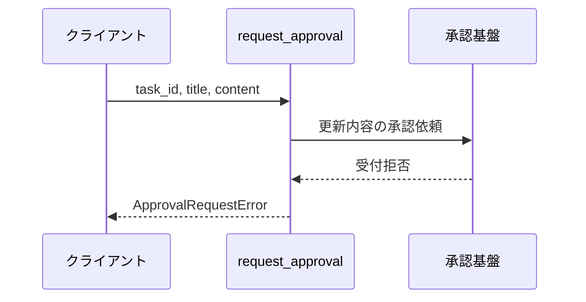

# 承認基盤連携

操作: `request_approval`（外部システム境界の関数）

更新内容の承認依頼を承認基盤へ送り、受付応答として承認依頼 ID を受け取る。
承認結果はこの操作では受け取らず、承認結果反映が別途受け取る。

- 対応テストファイル: 未定（テストレビュー完了時に記入）

## インターフェース

### リクエスト

| パラメータ | 型 | 必須 | デフォルト | 説明 | 制限 | 補足 |
| --- | --- | --- | --- | --- | --- | --- |
| `task_id` | `str` | ✅ | - | 承認対象のタスク ID | - | - |
| `title` | `str` | ✅ | - | 承認を求める編集後のタイトル | 1 文字以上 100 文字以内 | 検証済みの値を渡す |
| `content` | `str` | ✅ | - | 承認を求める編集後の本文 | 1000 文字以内 | 検証済みの値を渡す |

リクエスト例:

```json
{
  "task_id": "t1",
  "title": "新タイトル",
  "content": "新本文"
}
```

### レスポンス

| フィールド | 型 | 説明 | 制限 | 補足 |
| --- | --- | --- | --- | --- |
| `approval_request_id` | `str` | 承認基盤が発番した承認依頼の識別子 | - | 承認結果反映が対象タスクを引くときの相関キー |

レスポンス例:

```json
{
  "approval_request_id": "ap_001"
}
```

### 例外

| 例外 | 発生条件 | 補足 |
| --- | --- | --- |
| なし（正常終了） | 承認依頼が受け付けられた | 戻り値は レスポンス表のとおり |
| `ApprovalRequestError` | 承認基盤が受け付けを拒否した / 承認基盤へ到達できない | 原因例外を `from` で連鎖 |

## 制約

| 項目 | 制約 | 補足 |
| --- | --- | --- |
| タイムアウト | 制限なし | 受付応答が返るまで待つ |
| リトライ | 行わない | 受付拒否はそのまま呼び出し元へ伝播する |
| 認可 | 制限なし | 承認基盤の認証情報を持たない |

## フロー一覧

| 分類 | フロー名 | 概要 | 補足 |
| --- | --- | --- | --- |
| 正常 | 正常系 | 承認依頼を送って承認依頼 ID を受け取る | - |
| 異常 | 異常系（受付拒否・ApprovalRequestError） | 承認基盤が受け付けを拒否する | - |

## 正常系

### セットアップ

| セットアップ | 説明 | 補足 |
| --- | --- | --- |
| Mock | 承認基盤を承認依頼 ID を返すスタブに差し替え | 承認結果は返さない |

### フロー



### 期待値

- 承認依頼 ID が返る
- 承認基盤へ承認依頼が 1 回だけ送られている

## 異常系（受付拒否・ApprovalRequestError）

### セットアップ

| セットアップ | 説明 | 補足 |
| --- | --- | --- |
| Mock | 承認基盤を受付拒否を返すスタブに差し替え | 受付拒否を決定的に誘発 |

### フロー



### 期待値

- `ApprovalRequestError` が送出される
- 承認依頼 ID が返らない
