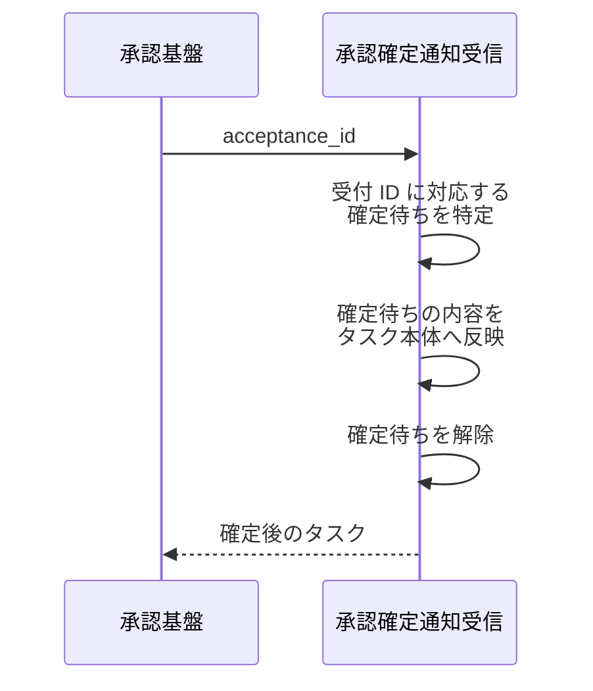
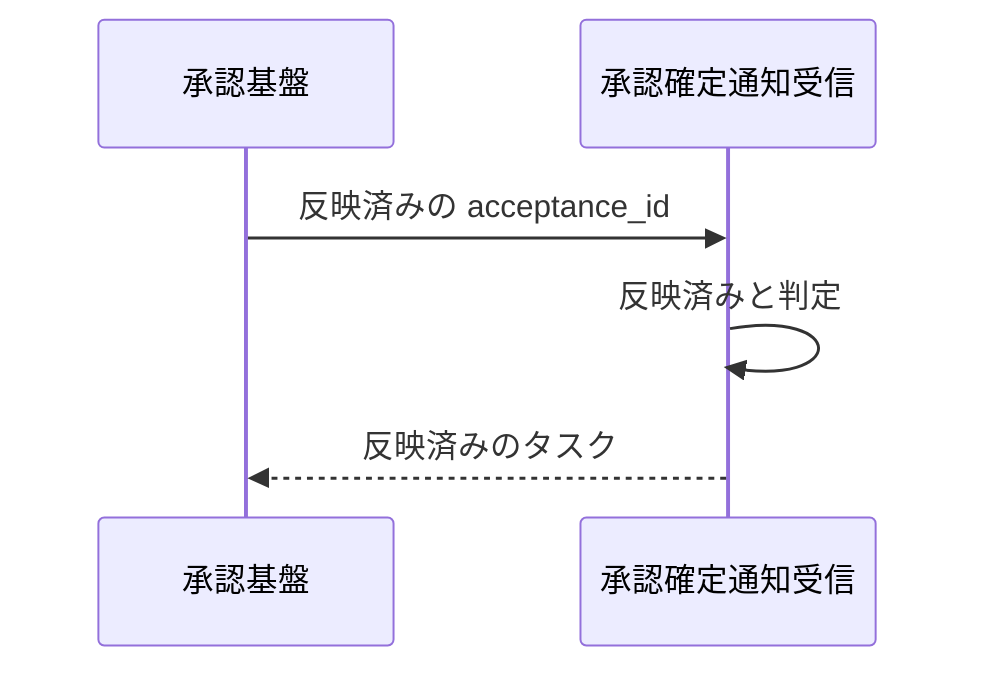
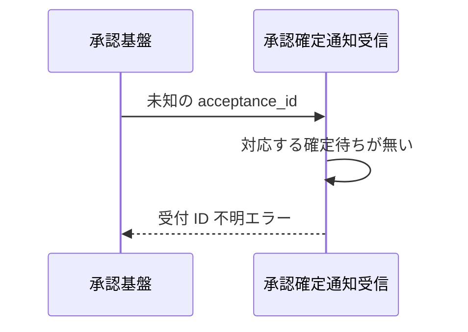

# 承認確定通知受信

操作: 承認確定通知受信

承認基盤が確定を通知してくる受け口。
受付 ID に対応する確定待ちの内容をタスク本体へ反映する。

- 対応テストファイル: `tests/integration/tasks/test_承認確定通知受信.py`

## インターフェース

### リクエスト

| パラメータ | 型 | 必須 | デフォルト | 説明 | 制限 | 補足 |
| --- | --- | --- | --- | --- | --- | --- |
| `acceptance_id` | `str` | ✅ | - | 受付時に承認基盤が採番した受付 ID | - | タスク更新の応答で返した値 |

リクエスト例:

```json
{
  "acceptance_id": "ap_0001"
}
```

### レスポンス

| フィールド | 型 | 説明 | 制限 | 補足 |
| --- | --- | --- | --- | --- |
| `task` | `object` | 確定を反映した後のタスク | - | 子フィールドは下の行で展開 |
| `task.id` | `str` | タスク ID | - | - |
| `task.title` | `str` | 確定したタイトル | - | 確定待ちの内容が入る |
| `task.content` | `str` | 確定した本文 | - | 確定待ちの内容が入る |
| `task.awaiting_confirmation` | `bool` | 確定待ちの更新を持つか | - | 確定を反映した後は `false` |

レスポンス例:

```json
{
  "task": {
    "id": "t1",
    "title": "新タイトル",
    "content": "新本文",
    "awaiting_confirmation": false
  }
}
```

**補足:**

- 同じ受付 ID で何度通知されても、反映は 1 度だけ行われる。
  2 回目以降は反映済みのタスクをそのまま返す

## 制約

| 項目 | 制約 | 補足 |
| --- | --- | --- |
| 通知の受信方式 | 承認基盤からの通知呼び出しを受け取る | 承認基盤への照会は行わない |
| 冪等性 | 同一の受付 ID による再通知は反映を繰り返さない | 重複した通知の配信に備える |
| 認可 | 制限なし | 本プロジェクトに認証機構がない |
| 受け付ける通知の種別 | 確定の通知のみ | 却下の通知は本 subsystem のシステム要件に無い |
| 通知の順序 | 受付より後に届くことを前提にする | 受付前に届いた通知は未知の受付 ID として扱う |

## フロー一覧

| 分類 | フロー名 | 概要 | 補足 |
| --- | --- | --- | --- |
| 正常 | 正常系 | 確定待ちの内容をタスク本体へ反映する | 単一 UC シナリオの確定通知に対応 |
| 正常 | 正常系（同一受付 ID の再通知） | 反映済みの通知を重ねて受けても状態を変えない | - |
| 異常 | 異常系（未知の受付 ID） | 対応する確定待ちが無い通知を弾く | - |

## 正常系

### セットアップ

| セットアップ | 説明 | 補足 |
| --- | --- | --- |
| Mock | なし | 通知を受ける側のため承認基盤を呼ばない |
| タスク | `t1` を「旧タイトル / 旧本文」で登録済み | - |
| タスク | `t1` が受付 ID `ap_0001` で「新タイトル / 新本文」の確定待ちを持つ | 確定の反映を決定的に誘発 |

### フロー



### 期待値

- `t1` のタイトルと本文が「新タイトル / 新本文」になっている
- `t1` の `awaiting_confirmation` が `false` になっている

## 正常系（同一受付 ID の再通知）

### セットアップ

| セットアップ | 説明 | 補足 |
| --- | --- | --- |
| Mock | なし | 通知を受ける側のため承認基盤を呼ばない |
| タスク | `t1` が受付 ID `ap_0001` の確定を反映済み | 再通知を決定的に誘発 |
| 入力 | 受付 ID `ap_0001` で再度通知する | - |

### フロー



### 期待値

- `t1` のタイトルと本文が 1 回目の確定時から変わっていない
- `t1` の `awaiting_confirmation` が `false` のままになっている

## 異常系（未知の受付 ID）

### セットアップ

| セットアップ | 説明 | 補足 |
| --- | --- | --- |
| Mock | なし | 通知を受ける側のため承認基盤を呼ばない |
| タスク | `t1` を「旧タイトル / 旧本文」で登録済み | 確定待ちなし |
| 入力 | 受付したことのない受付 ID で通知する | 受付 ID 不明を決定的に誘発 |

### フロー



### 期待値

- 受付 ID 不明エラーが返る
- `t1` のタイトルと本文が変わっていない
