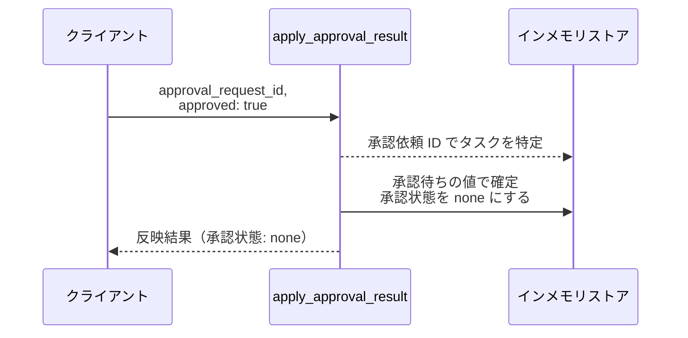
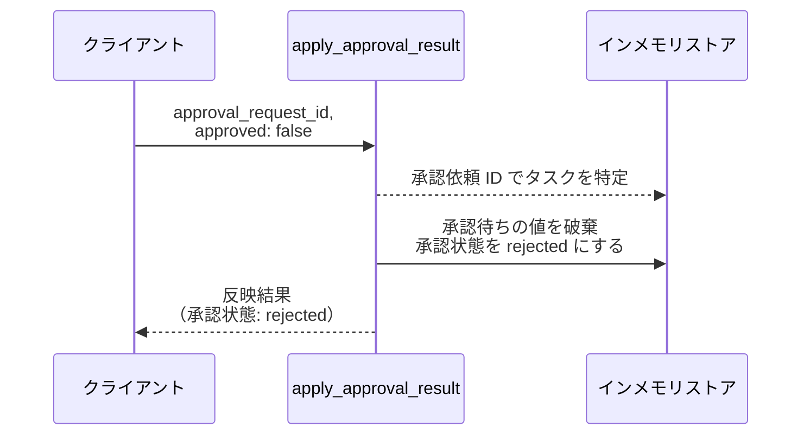
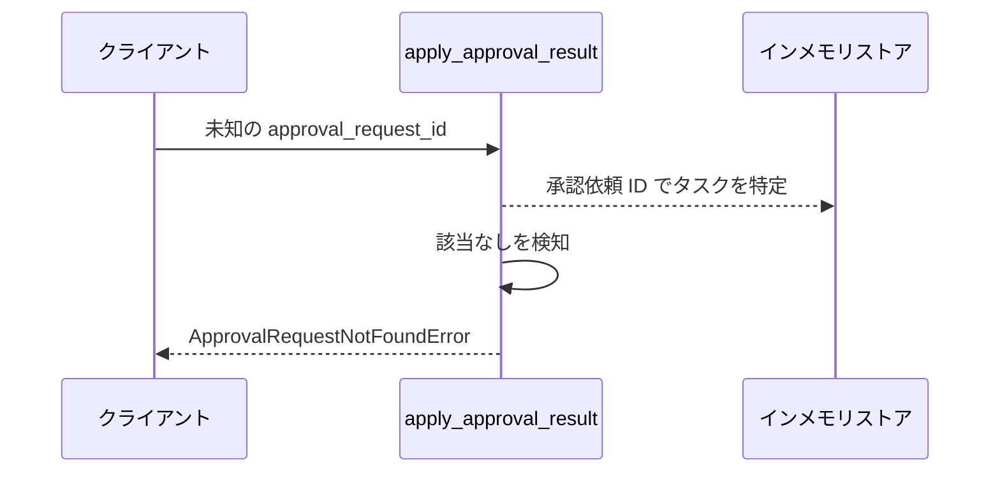

# 承認結果反映

操作: `apply_approval_result`（サービス層の公開関数）

承認基盤から返った承認 / 否認を受け取り、対象タスクへ反映する。
承認基盤側のアダプタが結果を受け取った時点で本操作を呼ぶ。

- 対応テストファイル: 未定（テストレビュー完了時に記入）

## インターフェース

### リクエスト

| パラメータ | 型 | 必須 | デフォルト | 説明 | 制限 | 補足 |
| --- | --- | --- | --- | --- | --- | --- |
| `approval_request_id` | `str` | ✅ | - | 承認基盤が発番した承認依頼の識別子 | - | タスク更新の受け付け時に保存した値と突き合わせる |
| `approved` | `bool` | ✅ | - | 承認なら `True`、否認なら `False` | - | - |

リクエスト例:

```json
{
  "approval_request_id": "ap_001",
  "approved": true
}
```

### レスポンス

| フィールド | 型 | 説明 | 制限 | 補足 |
| --- | --- | --- | --- | --- |
| `task_id` | `str` | 反映先のタスク ID | - | - |
| `approval_state` | `"none"` \| `"rejected"` | 反映後の承認状態 | - | 承認なら `none`、否認なら `rejected` |

レスポンス例:

```json
{
  "task_id": "t1",
  "approval_state": "none"
}
```

### 例外

| 例外 | 発生条件 | 補足 |
| --- | --- | --- |
| なし（正常終了） | 承認結果の反映成功 | 戻り値は レスポンス表のとおり |
| `ApprovalRequestNotFoundError` | 承認依頼 ID に一致する承認待ちのタスクが無い | 既に反映済みの承認依頼 ID を再度受け取った場合を含む |

## 制約

| 項目 | 制約 | 補足 |
| --- | --- | --- |
| タイムアウト | 制限なし | 承認待ちの滞留に上限を設けない決定に合わせる |
| 認可 | 制限なし | 承認基盤からの呼び出しを認証しない |
| 再送 | 同じ承認依頼 ID の 2 回目以降は反映しない | 1 回目で承認依頼 ID が消えるため 異常系（承認依頼が見つからない・ApprovalRequestNotFoundError） |

## フロー一覧

| 分類 | フロー名 | 概要 | 補足 |
| --- | --- | --- | --- |
| 正常 | 正常系 | 承認を受けて承認待ちの値で確定する | - |
| 正常 | 正常系（否認） | 否認を受けて編集前へ戻し否認を記録する | - |
| 異常 | 異常系（承認依頼が見つからない・ApprovalRequestNotFoundError） | 承認依頼 ID に一致するタスクが無い | - |

## 正常系

### セットアップ

| セットアップ | 説明 | 補足 |
| --- | --- | --- |
| Mock | なし | 承認基盤からの入力を引数で与える |
| タスク | 承認状態が `pending` のタスクを 1 件登録済み | 承認待ちの値と承認依頼 ID を保持 |
| 入力 | 保持している承認依頼 ID + `approved: true` | 承認を決定的に誘発 |

### フロー



### 期待値

- 対象タスクのタイトル / 本文が編集後の値になっている
- 対象タスクの承認状態が `none` になっている
- 対象タスクの承認待ちの値と承認依頼 ID が消えている

## 正常系（否認）

### セットアップ

| セットアップ | 説明 | 補足 |
| --- | --- | --- |
| Mock | なし | 承認基盤からの入力を引数で与える |
| タスク | 承認状態が `pending` のタスクを 1 件登録済み | 承認待ちの値と承認依頼 ID を保持 |
| 入力 | 保持している承認依頼 ID + `approved: false` | 否認を決定的に誘発 |

### フロー



### 期待値

- 対象タスクのタイトル / 本文が編集前の値のまま残っている
- 対象タスクの承認状態が `rejected` になっている
- 対象タスクの承認待ちの値と承認依頼 ID が消えている

## 異常系（承認依頼が見つからない・ApprovalRequestNotFoundError）

### セットアップ

| セットアップ | 説明 | 補足 |
| --- | --- | --- |
| Mock | なし | 承認基盤からの入力を引数で与える |
| タスク | 承認状態が `none` のタスクを 1 件登録済み | 承認依頼 ID を持たない |
| 入力 | どのタスクにも紐づかない承認依頼 ID | 特定失敗を決定的に誘発 |

### フロー



### 期待値

- `ApprovalRequestNotFoundError` が送出される
- ストアの内容が呼び出し前のまま変わっていない
