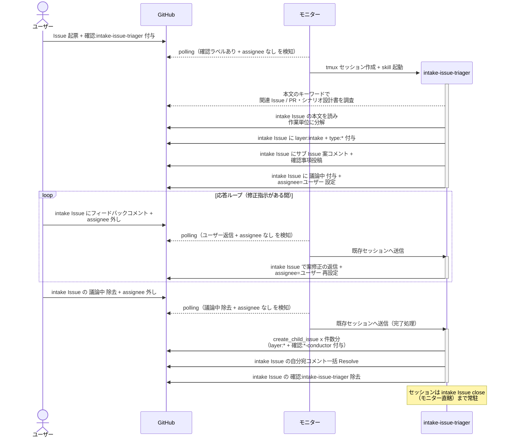

# Issue分解と子起票

ユーザーが起票した Issue を intake-issue-triager が作業単位に分解し、ユーザー承認を経て epic / story / subsystem / chore の Sub-issue を作成する単一ユースケース。

対応エージェント: `intake-issue-triager`

- 対応テストファイル: `tests/e2e/test_Issue分解と子起票.py`

## 正常シナリオ

### セットアップ

| セットアップ | 説明 | 補足 |
| --- | --- | --- |
| Mock | なし（実環境で実行） | - |
| intake Issue | ユーザー起票の Issue に `確認:intake-issue-triager` 付与済み | 本文はユーザーが書いたまま |
| assignee | 未設定 | エージェント起動条件 |
| モニター | 対象リポを polling 中 | - |

### フロー

### 期待値

- 承認された案と同数の Sub-issue が親 Issue に紐づいて存在する（`layer:epic` なら `確認:epic-conductor`、chore なら `確認:quick-implementer` が付与）
- intake Issue の本文がユーザー起票時のまま書き換わっていない
- intake Issue に `layer:intake` + `type:*` が残り、`確認:*` は除去済み
- 自分宛コメントが全て Resolve 済み

### 補足

- ユーザーがフィードバックコメント + assignee 外しのみで返した場合は応答ループ（案修正 → 再待機）。
  案はコメント上で管理し本文には書かない
- intake Issue のクローズはこの UC の責務外（全 Sub-issue closed を モニターが検知して close）

## 異常シナリオ

なし
