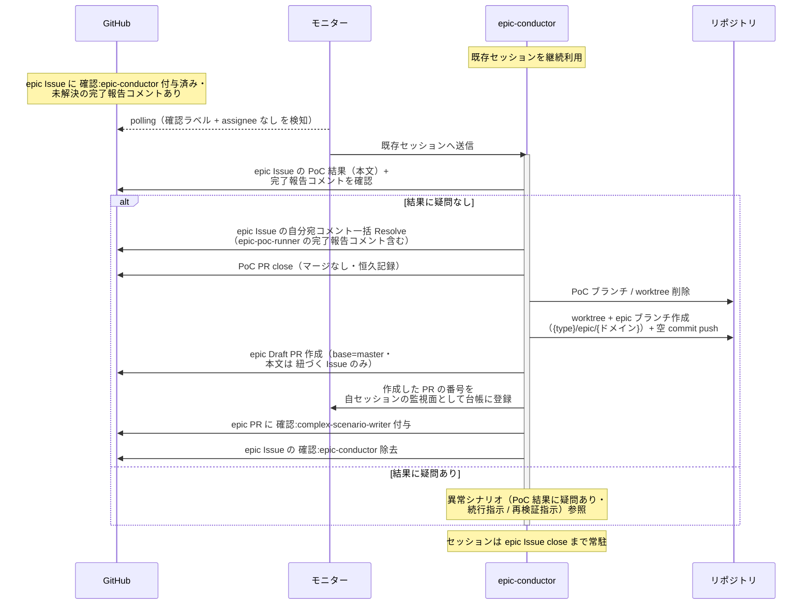
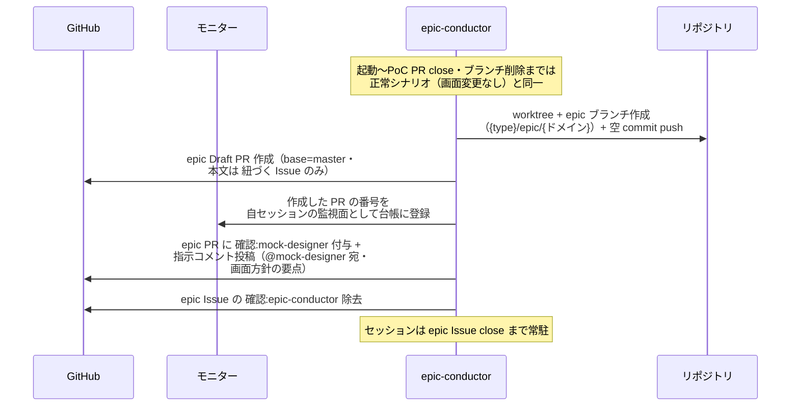
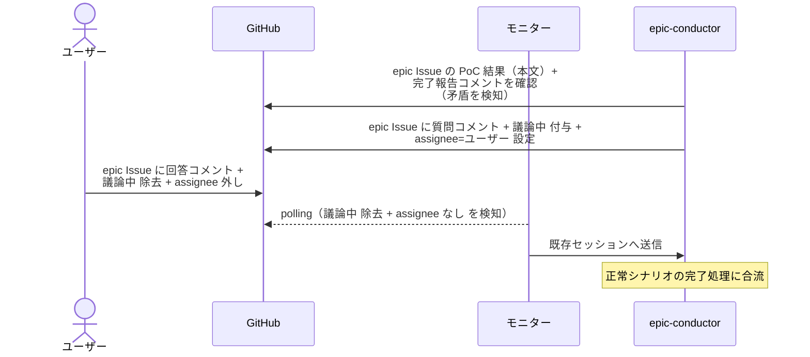
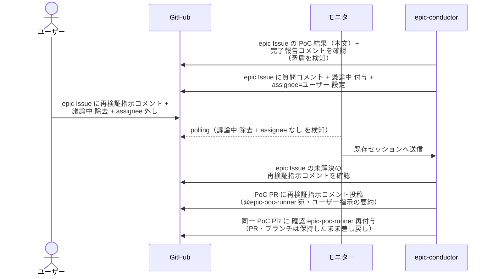

# PoC結果確認

epic-conductor（復帰呼び出し）が epic-poc-runner の検証結果を確認し、問題なければ epic Draft PR を作成して次フェーズに引き継ぐ単一ユースケース。
PoC を指示した本人が結果を確認してから次へ進める（epic-poc-runner が勝手に次フェーズへ飛ばさない）。

対応エージェント: `epic-conductor`（epic-poc-runner の完了報告コメントで復帰）

## 正常シナリオ（画面変更なし）

### セットアップ

| セットアップ | 説明 | 補足 |
| --- | --- | --- |
| Mock | なし（実環境で実行） | - |
| PoC 完了 | PoC 結果が epic Issue 本文に記録済み・PoC PR は open | - |
| epic Issue | `確認:epic-conductor` 付与済み + epic-poc-runner の完了報告コメント（自分宛・未解決）あり | - |
| ユーザー回答 | 要件確定で画面変更なしと回答済み | 分岐を決定的に誘発 |
| assignee | 未設定 | エージェント起動条件 |

### フロー

### 期待値

- epic Issue の自分宛コメント（epic-poc-runner の完了報告コメント含む）が全て Resolve 済み
- PoC PR（複数あれば全て）が closed（マージなし）、PoC ブランチ / worktree が削除済み
- epic Draft PR（base=master・本文は `## 紐づく Issue` のみ）が作成され、`確認:complex-scenario-writer` が付与されている
- 作成した PR の番号が自セッションの監視面（モニターの台帳）に登録されている
- `確認:epic-conductor` が除去されている

### 補足

- 疑問がなければユーザー承認は不要（AI 間のクッション確認として動く）

## 正常シナリオ（画面変更あり）

### セットアップ

| セットアップ | 説明 | 補足 |
| --- | --- | --- |
| Mock | なし（実環境で実行） | - |
| 正常シナリオ（画面変更なし）と同一の起動・確認経過 | PoC 完了・完了報告コメントあり・結果に疑問なし | - |
| ユーザー回答 | 要件確定で画面の新規作成 / レイアウト変更ありと回答済み | 分岐を決定的に誘発 |

### フロー

### 期待値

- epic Draft PR（base=master・本文は `## 紐づく Issue` のみ）が作成され、`確認:mock-designer` と指示コメント（@mock-designer 宛・未解決）が付与・投稿されている
- 作成した PR の番号が自セッションの監視面（モニターの台帳）に登録されている

## 異常シナリオ（PoC 結果に疑問あり・続行指示）

### セットアップ

| セットアップ | 説明 | 補足 |
| --- | --- | --- |
| Mock | なし（実環境で実行） | - |
| PoC 完了 | PoC 結果が epic Issue 本文に記録済み・PoC PR は open | - |
| 完了報告コメント | 本文の `## PoC 結果` と矛盾する内容を仕込む | 例: 実測値が成功条件未達なのに「成立」と結論 |
| epic Issue | `確認:epic-conductor` 付与済み | - |
| assignee | 未設定 | エージェント起動条件 |

### フロー

### 期待値

- 質問コメントとユーザーの回答が epic Issue に記録され、自分宛コメントが Resolve 済み
- epic Draft PR（base=master・本文は `## 紐づく Issue` のみ）が作成され、`確認:complex-scenario-writer` が付与されている
- 作成した PR の番号が自セッションの監視面（モニターの台帳）に登録されている
- `確認:epic-conductor` が除去されている

## 異常シナリオ（PoC 結果に疑問あり・再検証指示）

### セットアップ

| セットアップ | 説明 | 補足 |
| --- | --- | --- |
| Mock | なし（実環境で実行） | - |
| PoC 完了 | PoC 結果が epic Issue 本文に記録済み・PoC PR は open | - |
| 完了報告コメント | 本文の `## PoC 結果` と矛盾する内容を仕込む | 例: 実測値が成功条件未達なのに「成立」と結論 |
| epic Issue | `確認:epic-conductor` 付与済み | - |
| assignee | 未設定 | エージェント起動条件 |

### フロー

### 期待値

- 質問コメントとユーザーの再検証指示が epic Issue に記録されている
- **同一 PoC PR** に `確認:epic-poc-runner` が再付与され、再検証指示コメント（@epic-poc-runner 宛・未解決）が投稿されている（PoC PR は 1 件のまま増えていない）
- PoC PR・ブランチが open / 存在したまま
- epic Draft PR が作成されていない
