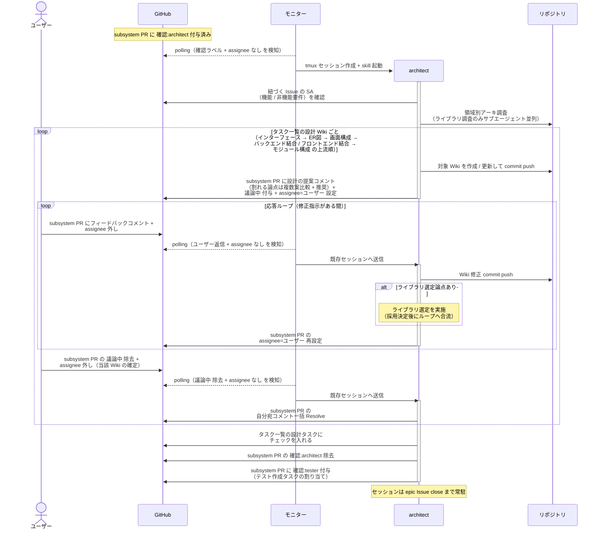
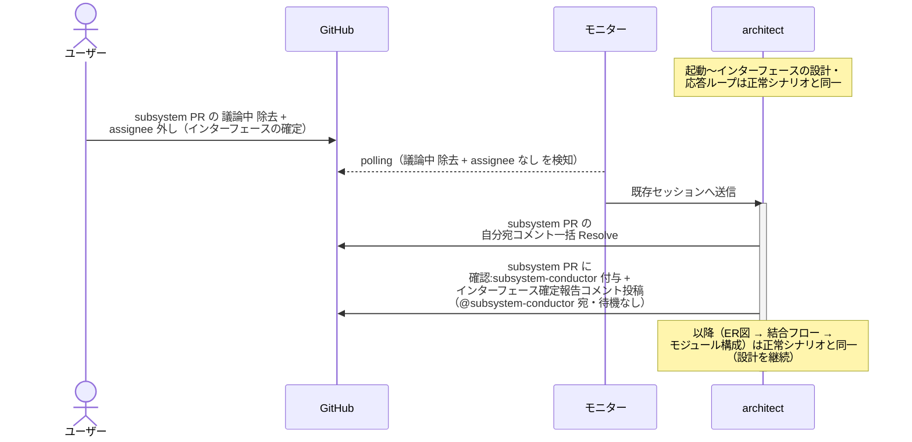
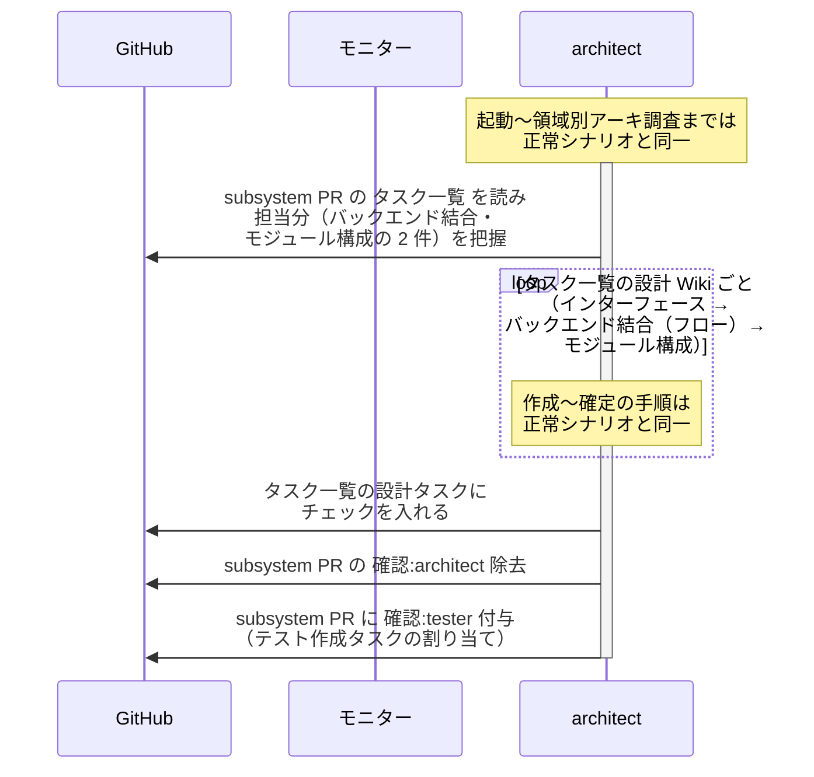
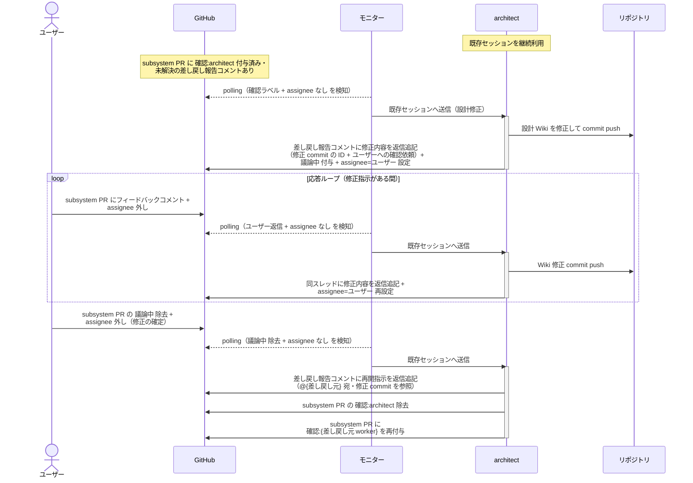

# SS設計

architect が設計 Wiki（インターフェース → ER図 → 画面構成 → バックエンド結合 / フロントエンド結合（フロー）→ モジュール構成）をタスク一覧の上流順に 1 ページずつ作成し、応答ループでユーザーと確定させる単一ユースケース。
BE / FE の設計 Wiki とも architect が担当する（画面ありの subsystem は epic の全体UI設計で確定した画面方向性を前提にフロントエンド結合を書く）。
後続 subsystem が本 subsystem のインターフェースに依存する場合は、インターフェース確定時に subsystem-conductor へインターフェース確定報告を投稿する（待機なし・設計は継続）。
ライブラリ選定で必要なら PoC（カテゴリ A〜E）も本 UC 内で実施する。
全 Wiki 確定後は内部パイプラインの指揮役として tester にタスクを割り当てる。
配下 worker（tester / implementer）から設計の差し戻しを受けた場合も本 UC で設計 Wiki を修正して差し戻し元に返す。

対応エージェント: `architect`

## 正常シナリオ

### セットアップ

| セットアップ | 説明 | 補足 |
| --- | --- | --- |
| Mock | なし（実環境で実行） | - |
| subsystem Draft PR | `確認:architect` 付与済み・`## タスク一覧` 承認済み | - |
| subsystem Issue | SA 確定済み | 設計の元ネタ |
| assignee | PR に未設定 | エージェント起動条件 |

### フロー

### 期待値

- タスク一覧の担当分の設計 Wiki（`設計図/ER図/{分類}.md` / `設計図/画面構成/{画面名}.md` / `設計図/バックエンド結合/{論理名}.md` / `設計図/フロントエンド結合/{論理名}.md` / `設計図/モジュール構成/{サブシステム}/{分類}.md`）が上流順に 1 ページずつ確定され、subsystem ブランチに commit されている
- `## タスク一覧` の設計タスクがチェック済み
- subsystem PR に `確認:tester` が付与され、`確認:architect` が除去されている
- 自分宛コメントが全て Resolve 済み

## 正常シナリオ（後続 subsystem へのインターフェース確定報告）

### セットアップ

| セットアップ | 説明 | 補足 |
| --- | --- | --- |
| Mock | なし（実環境で実行） | - |
| subsystem Draft PR | `確認:architect` 付与済み・`## タスク一覧` 承認済み | 先行 subsystem（例: BE） |
| 親 story Issue | 本文の依存順に `未起票` の後続 subsystem（例: FE）あり | 報告を誘発 |
| assignee | PR に未設定 | エージェント起動条件 |

### フロー

### 期待値

- `設計図/バックエンド結合/{論理名}.md` の `## インターフェース` が確定され、subsystem ブランチに commit されている
- subsystem PR に `確認:subsystem-conductor` + インターフェース確定報告コメント（@subsystem-conductor 宛・未解決）が付与・投稿されている
- subsystem PR の `確認:architect` は保持されている（設計続行中）

## 正常シナリオ（タスク一覧に ER図 なし）

### セットアップ

| セットアップ | 説明 | 補足 |
| --- | --- | --- |
| Mock | なし（実環境で実行） | - |
| subsystem Draft PR | `確認:architect` 付与済み・`## タスク一覧` 承認済み | - |
| タスク一覧 | 設計タスクが バックエンド結合・モジュール構成 のみ | DB 変更を伴わない subsystem。分岐を決定的に誘発 |
| assignee | PR に未設定 | エージェント起動条件 |

### フロー

### 期待値

- バックエンド結合（インターフェース + フロー）→ モジュール構成 の 2 ページだけが確定・commit されている
- `設計図/ER図/` 配下への commit が存在しない（タスク一覧にない Wiki は作成されない）
- subsystem PR に `確認:tester` が付与され、`確認:architect` が除去されている

## 正常シナリオ（差し戻しからの設計修正）

### セットアップ

| セットアップ | 説明 | 補足 |
| --- | --- | --- |
| Mock | なし（実環境で実行） | - |
| subsystem PR | `確認:architect` 付与済み + tester / implementer の差し戻し報告コメント（設計の見直し・自分宛・未解決）あり | - |
| assignee | PR に未設定 | エージェント起動条件 |

### フロー

### 期待値

- 設計 Wiki の修正 commit が subsystem ブランチに積まれている（修正はユーザー承認済み）
- 差し戻し報告コメントのスレッドに修正内容（修正 commit の ID）と再開指示（@{差し戻し元} 宛）が返信追記されている（スレッドは未解決のまま = 差し戻し元 worker が処理時に Resolve する）
- subsystem PR に `確認:{差し戻し元 worker}`（例: `確認:tester`）が付与され、`確認:architect` が除去されている

## 異常シナリオ

なし
