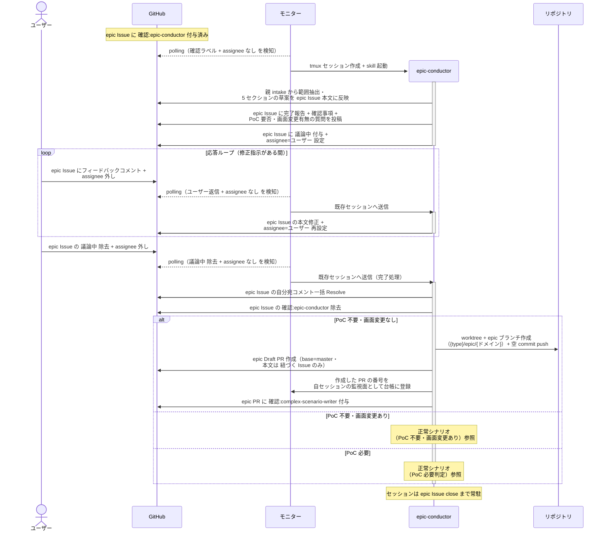
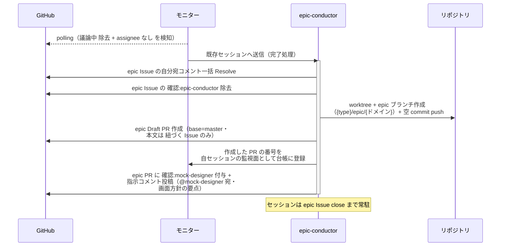
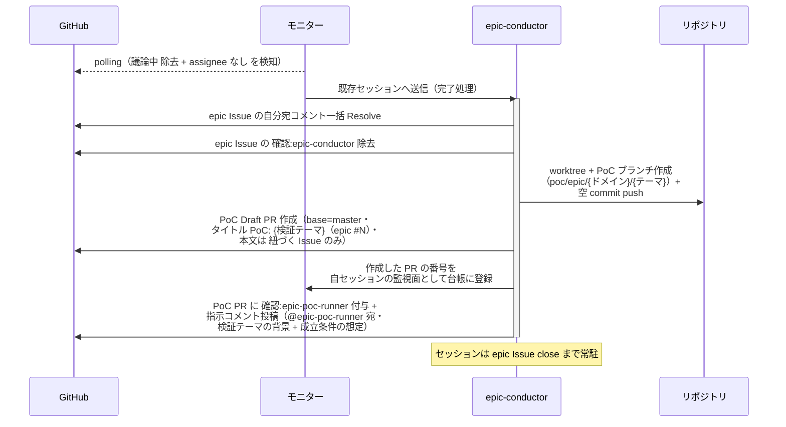

# epic要件確定

epic-conductor が epic Issue の本文（前提条件 / 概要 / 背景 / ユースケース一覧 / 横断要件）を確定し、実現可能性 PoC の要否と画面変更（新規作成 / レイアウト変更）の有無を判定する単一ユースケース。

対応エージェント: `epic-conductor`（初回呼び出し）

- 対応テストファイル: `tests/e2e/単一ユースケース/test_epic要件確定.py`

## 正常シナリオ（PoC 不要・画面変更なし）

### セットアップ

| セットアップ | 説明 | 補足 |
| --- | --- | --- |
| Mock | なし（実環境で実行） | - |
| epic Issue | `layer:epic` + `確認:epic-conductor` 付きで存在 | 親 intake Issue と Sub-issue リンク済み・本文は空 |
| assignee | 未設定 | エージェント起動条件 |
| モニター | polling 中 | - |
| ユーザー回答 | 応答ループで PoC 不要・画面変更なしと回答する | 分岐を決定的に誘発（テストではユーザー役が固定回答） |

### フロー

### 期待値

- epic Issue 本文に `## 前提条件` / `## 概要` / `## 背景` / `## ユースケース一覧` / `## 横断要件` が揃っている
- ユースケース一覧の `対応 story` 列が全行 `未起票`
- `確認:epic-conductor` が除去され、epic Draft PR（本文は `## 紐づく Issue` のみ）が作成されて `確認:complex-scenario-writer` が付与されている
- 作成した PR の番号が自セッションの監視面（モニターの台帳）に登録されている
- 自分宛コメントが全て Resolve 済み

### 補足

- フィードバックループは Issue 側の応答ループ（本文修正 → 再待機）で回す

## 正常シナリオ（PoC 不要・画面変更あり）

### セットアップ

| セットアップ | 説明 | 補足 |
| --- | --- | --- |
| Mock | なし（実環境で実行） | - |
| 応答ループまで完了 | 5 セクション確定済み・`議論中` 除去済み（正常シナリオ（PoC 不要・画面変更なし）と同一の経過） | - |
| ユーザー回答 | PoC 不要・画面の新規作成 / レイアウト変更ありと回答済み | 分岐を決定的に誘発 |

### フロー

### 期待値

- epic Draft PR（base=master・本文は `## 紐づく Issue` のみ）が作成され、`確認:mock-designer` と指示コメント（@mock-designer 宛・未解決）が付与・投稿されている
- 作成した PR の番号が自セッションの監視面（モニターの台帳）に登録されている

## 正常シナリオ（PoC 必要判定）

### セットアップ

| セットアップ | 説明 | 補足 |
| --- | --- | --- |
| Mock | なし（実環境で実行） | - |
| 正常シナリオの応答ループまで完了 | 5 セクション確定済み・`議論中` 除去済み | - |
| PoC 要否 | epic の成立が前例のない技術機構に依存し、ユーザーが PoC 必要と回答済み | 例: 未検証のプロトコル連携・性能が成立条件 |

### フロー

### 期待値

- PoC Draft PR（base=master・タイトル `PoC: {検証テーマ}（epic #N）`・本文は `## 紐づく Issue` のみ）が作成され、`確認:epic-poc-runner` と指示コメント（@epic-poc-runner 宛・未解決）が付与・投稿されている
- 作成した PR の番号が自セッションの監視面（モニターの台帳）に登録されている
- epic Draft PR は作成されない

## 異常シナリオ

なし
