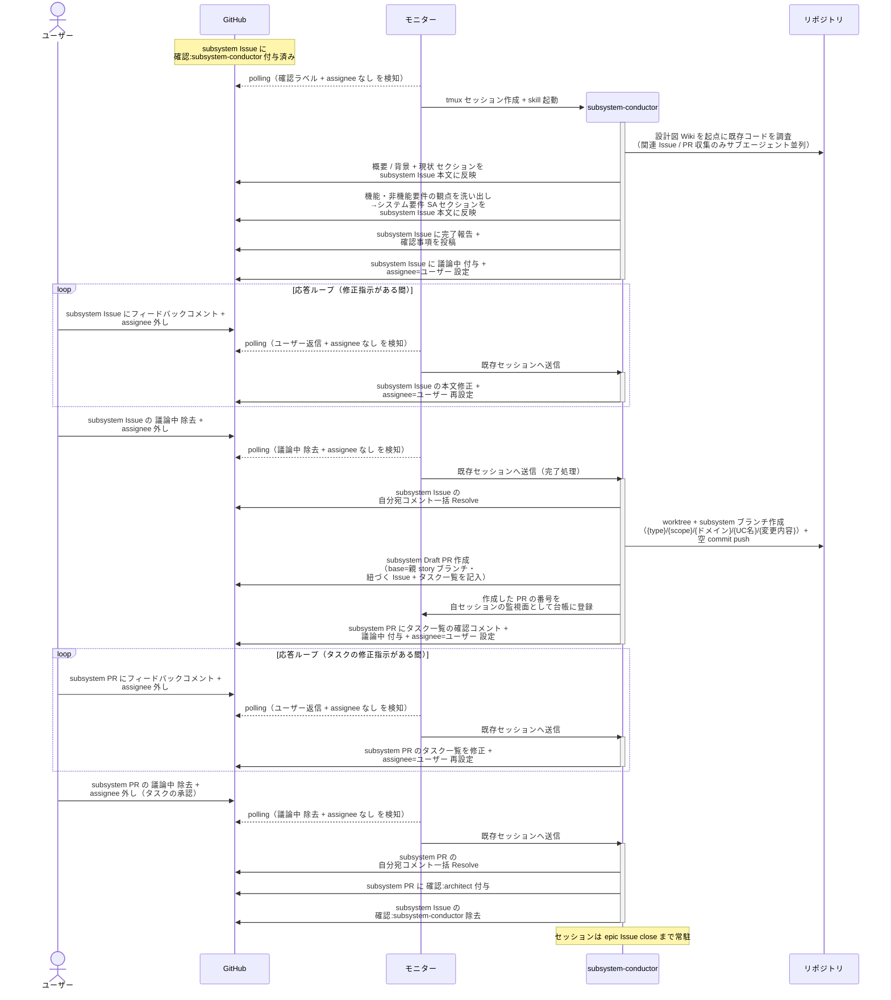

# subsystem要件確定

subsystem-conductor が subsystem Issue の本文整形 + 現状調査（既存コード・関連テスト・関連 Issue/PR・再現ログ）+ システム要件（機能 / 非機能 / スコープ外）確定を行い、完了時に subsystem Draft PR を作成して architect に設計を引き渡す単一ユースケース。

対応エージェント: `subsystem-conductor`

## 正常シナリオ

### セットアップ

| セットアップ | 説明 | 補足 |
| --- | --- | --- |
| Mock | なし（実環境で実行） | - |
| subsystem Issue | `layer:subsystem` + `確認:subsystem-conductor` 付きで存在 | 親 story と Sub-issue リンク済み・本文は空 |
| 親 story Issue | ユースケース要件 + 単一 UC シナリオ確定済み | 担当範囲の元ネタ |
| assignee | 未設定 | エージェント起動条件 |

### フロー

### 期待値

- 本文に `## 現状`（関連実装コード / 関連テスト / 関連 Issue/PR / 関連ドキュメント）と `## システム要件（SA）`（機能要件 / 非機能要件 / スコープ外）が揃っている
- バグ Issue の場合は `### 再現手順` と `### 既存テスト実行結果` も記録されている
- subsystem Draft PR（base=親 story ブランチ）が作成され、本文に `## 紐づく Issue` と `## タスク一覧`（Wiki 修正・実装・テスト実行の To Do）が記入されている
- 作成した PR の番号が自セッションの監視面（モニターの台帳）に登録されている
- タスク一覧の確認コメントが投稿されている
- subsystem PR に `確認:architect` が付与され、`確認:subsystem-conductor` が除去されている

### 補足

- 関連 Issue / PR の収集は `related-issue-finder` / `related-pr-finder` サブエージェントを並列起動（コードベース調査・要件観点の洗い出しはメインエージェントが直接実施）

## 異常シナリオ

なし
