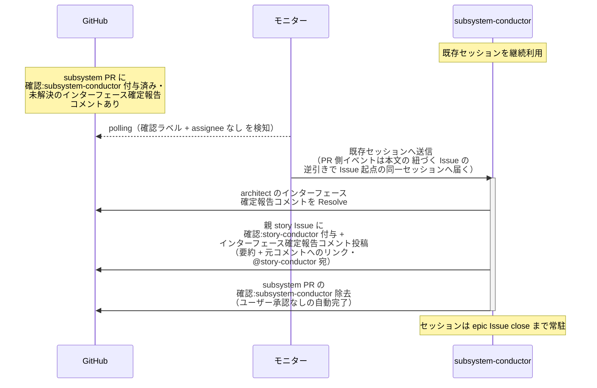

# インターフェース確定の中継

subsystem-conductor（復帰呼び出し）が architect のインターフェース確定報告を受けて、親 story Issue の story-conductor へ中継する単一ユースケース。
後続 subsystem が本 subsystem のインターフェースに依存する場合のみ発生し、story-conductor はこの報告を受けて後続 subsystem を起票する（先行 subsystem の設計・実装と後続が並走する）。

対応エージェント: `subsystem-conductor`（architect のインターフェース確定報告コメントで復帰）

## 正常シナリオ

### セットアップ

| セットアップ | 説明 | 補足 |
| --- | --- | --- |
| Mock | なし（実環境で実行） | - |
| subsystem PR | `確認:subsystem-conductor` 付与済み + architect のインターフェース確定報告コメント（自分宛・未解決）あり | `確認:architect` は保持されたまま（設計続行中） |
| 親 story Issue | 本文の依存順に `未起票` の後続 subsystem が残っている | - |
| assignee | PR に未設定 | エージェント起動条件 |

### フロー

### 期待値

- architect のインターフェース確定報告コメントが Resolve 済み
- 親 story Issue に `確認:story-conductor` + インターフェース確定報告コメント（@story-conductor 宛・未解決）が付与・投稿されている
- subsystem PR の `確認:subsystem-conductor` が除去されている（`確認:architect` は保持されたまま）

## 異常シナリオ

なし
