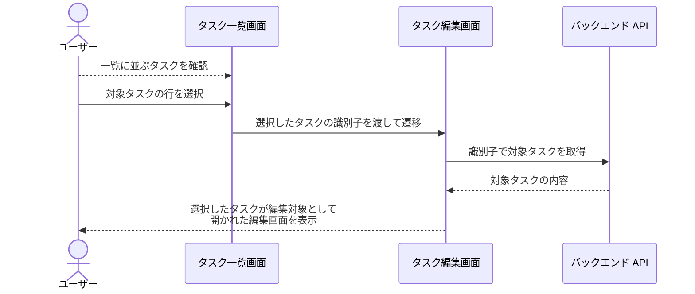
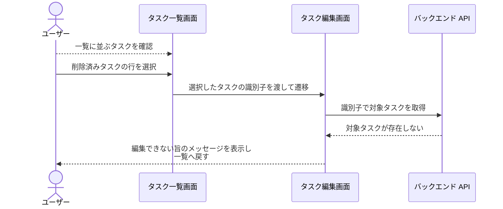

# タスク一覧から編集画面へ遷移

タスク一覧画面を見ているユーザーが、一覧上の任意のタスクの行を選択して、そのタスクの編集画面へ遷移する単一ユースケース。
編集画面そのものの入力・保存と、編集画面から一覧へ戻る導線は本ユースケースの範囲外。

- 対応テストファイル: `tests/e2e/単一ユースケース/test_タスク一覧から編集画面へ遷移.py`

## 正常シナリオ

### セットアップ

| セットアップ | 説明 | 補足 |
| --- | --- | --- |
| Mock | なし（実環境で実行） | - |
| タスク | 一覧に表示されるタスクを 2 件登録済み | 「任意の 1 件」を選べる状態にする |

### フロー

### 期待値

- 編集画面が表示され、一覧で選択したタスクのタイトルと本文が編集対象として入っている
- 一覧画面に編集ボタン等の要素が追加されておらず、遷移導線の追加前とレイアウトが同じ

## 異常シナリオ（選択したタスクが削除済み）

### セットアップ

| セットアップ | 説明 | 補足 |
| --- | --- | --- |
| Mock | なし（実環境で実行） | - |
| タスク | 一覧に表示されるタスクを 1 件登録済み | 一覧を表示した後に削除して、遷移できない状態を決定的に誘発 |

### フロー

### 期待値

- 編集できない旨のメッセージが表示されている
- タスク一覧画面が表示されており、編集対象が空の編集画面は開かれていない
