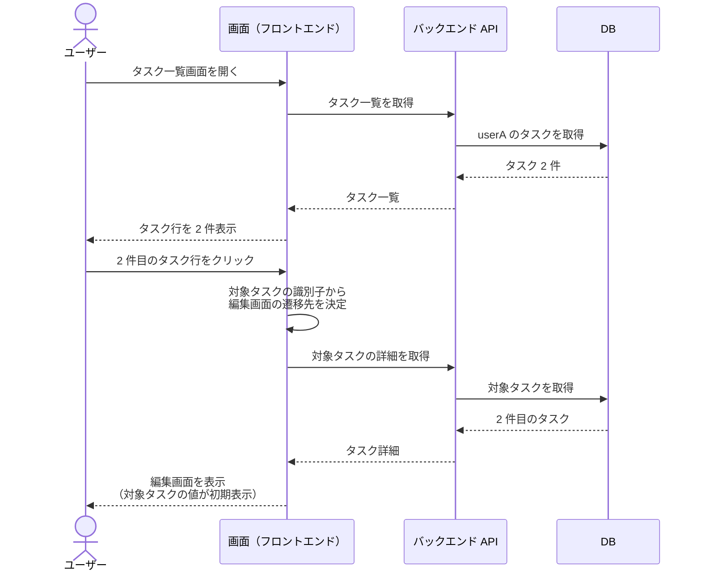
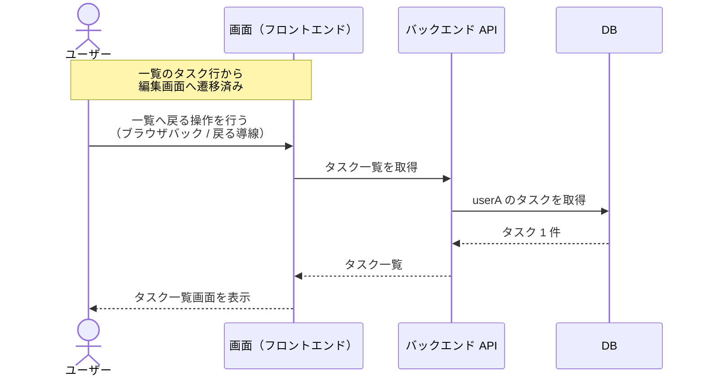
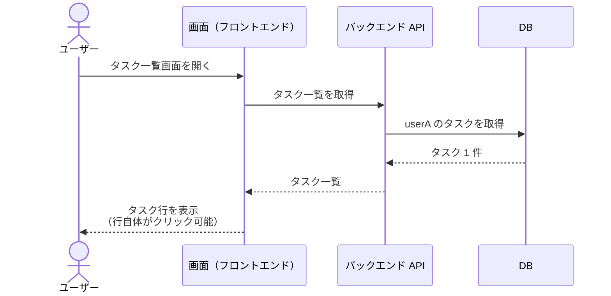
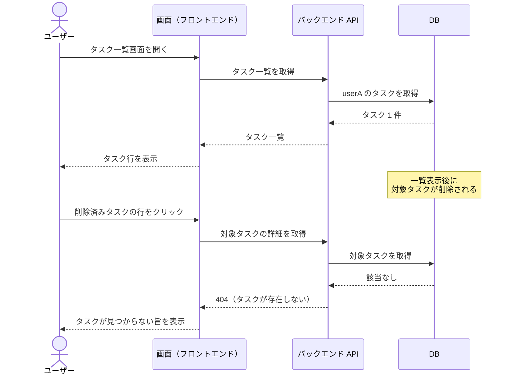

# タスク一覧画面から編集画面への遷移導線の追加

タスク一覧画面を見ているユーザーが、一覧上の任意のタスク行から、そのタスクの編集画面へ遷移する単一ユースケース。
親 epic #1068 のユースケース「タスク一覧画面から編集画面への遷移」に対応する。
遷移先の編集画面そのものは兄弟 story #1069 の担当で、本シナリオは一覧から編集画面へ到達する導線と、そこから一覧へ戻る動きを対象にする。

- 対応テストファイル: `tests/e2e/test_task_list_to_edit_navigation.py`
- 本 story での確認範囲は、一覧の表示と、行選択による編集画面への遷移の決定（画面識別子・タスク識別子・URL・引き渡す初期表示値）まで。
  編集画面の描画は兄弟 story #1069 の担当のため本 story には存在しない。
- 画面は Python の画面層として実装しており、ブラウザを操作する E2E ではない。
  シナリオ本文の `バックエンド API` / `404（タスクが存在しない）` はサービス関数とタスクが見つからない旨を表す例外、`ログイン中ユーザー A` / `userA が所有する` は認証・所有者の概念がなくテストデータの作成主体、と読み替える。
- 遷移先の URL は暫定形式 `/task-edit/{タスク識別子}`（パーセントエンコード）。
  形式は兄弟 story #1069 で確定する。

## 正常シナリオ（一覧の行から編集画面へ遷移）

### セットアップ

| セットアップ | 説明 | 補足 |
| --- | --- | --- |
| Mock | なし（実環境で実行） | - |
| `createUser` | ログイン中ユーザー A | - |
| `createTask` | userA が所有する 1 件目のタスク | `title: 買い物リストの作成` |
| `createTask` | userA が所有する 2 件目のタスク | `title: 週次レポートの提出` |

### フロー

### 期待値

- 編集画面に遷移しており、遷移先の URL に 2 件目のタスクの識別子が含まれている
- 編集画面のタイトル・本文の初期値が 2 件目のタスクの値になっている
- DB のタスクレコードはどちらも変更されていない（遷移だけで更新は発生しない）

### 補足

- 一覧に表示されている全タスク行が導線の対象で確定している（編集対象外のタスクは設けない）。
  1 件目の行をクリックした場合も同じ流れで 1 件目の編集画面へ遷移する。
- 「どのタスクを編集するか」の受け渡し方式（URL パス / クエリ / 画面状態）は subsystem 設計で確定する。
  本シナリオは「編集画面が対象タスクを一意に特定できている」ことだけを見る。

## 正常シナリオ（編集画面から一覧へ戻る）

### セットアップ

| セットアップ | 説明 | 補足 |
| --- | --- | --- |
| Mock | なし（実環境で実行） | - |
| `createUser` | ログイン中ユーザー A | - |
| `createTask` | userA が所有するタスク | `title: 週次レポートの提出` |

### フロー

### 期待値

- タスク一覧画面が表示されている
- 一覧に対象タスクの行が遷移前と同じ内容で表示されている
- DB のタスクレコードが変更されていない

### 補足

- 「一覧へ戻る操作」自体は編集画面側の実装で、本 story には存在しない。
  一覧を表示し直したときに遷移前と同じ内容が得られることをもって確認する。

## 正常シナリオ（導線追加後も一覧のレイアウトが変わらない）

### セットアップ

| セットアップ | 説明 | 補足 |
| --- | --- | --- |
| Mock | なし（実環境で実行） | - |
| `createUser` | ログイン中ユーザー A | - |
| `createTask` | userA が所有するタスク | `title: 週次レポートの提出` |

### フロー

### 期待値

- タスク行に編集ボタン・リンクアイコン等の新しい要素が増えていない
- タスク行に表示されている項目が導線追加前と同じ構成になっている
- タスク行がクリック可能な要素として扱われている

### 補足

- 親 Issue #1068 の制約「一覧画面のレイアウトは変えない」を満たしていることの確認シナリオ。
- 導線は新しい要素の追加ではなく、既存の行要素をクリック可能にすることで実現する。

## 異常シナリオ（一覧表示後に削除されたタスクの行をクリック）

### セットアップ

| セットアップ | 説明 | 補足 |
| --- | --- | --- |
| Mock | なし（実環境で実行） | - |
| `createUser` | ログイン中ユーザー A | - |
| `createTask` | userA が所有するタスク | 一覧表示後に削除する対象 |

### フロー

### 期待値

- 編集フォームが表示されず、タスクが見つからない旨の表示になっている
- DB に対象タスクのレコードが存在しない

### 補足

- 一覧の表示内容と実データがずれた状態で導線を踏んだときの振る舞いを確認するシナリオ。
- 見つからない旨の表示形式（専用画面 / 一覧へ戻してメッセージ表示）は subsystem 設計で確定する。
