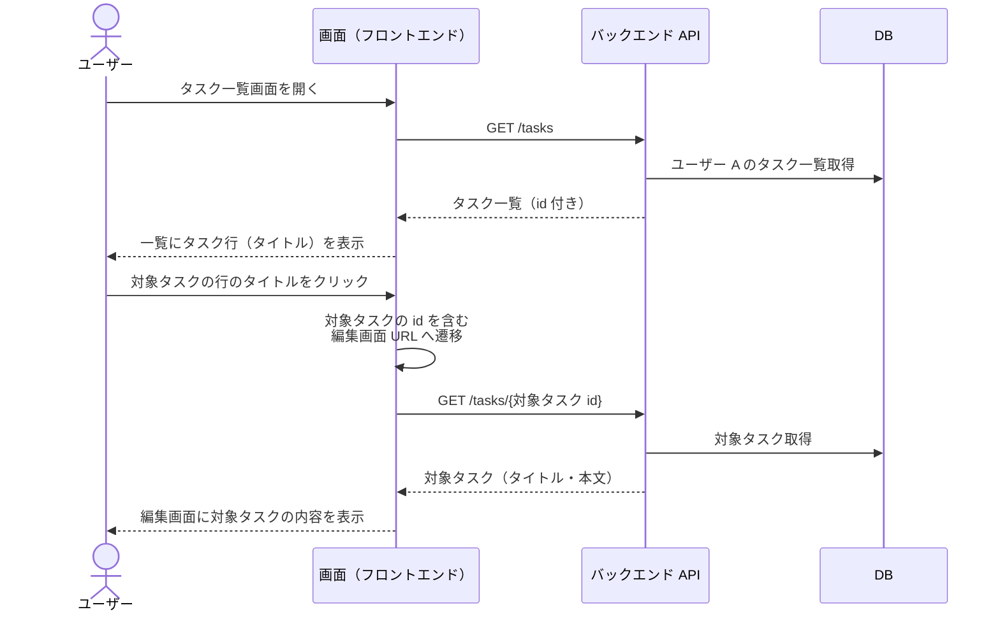
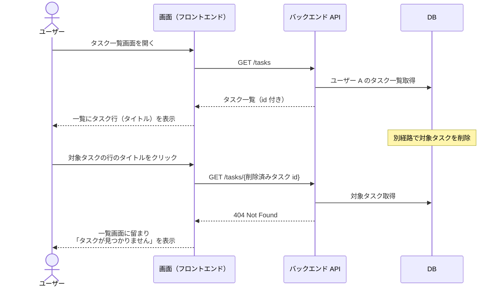
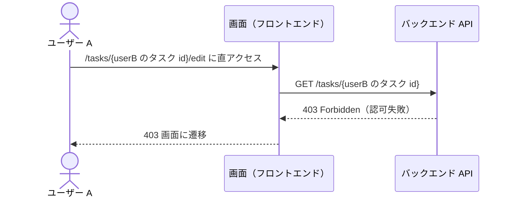

# タスク一覧画面から編集画面への遷移導線の追加

タスク一覧画面を開いているユーザーが、一覧上の任意のタスクを選び、そのタスクの編集画面へ遷移する単一ユースケース。
既存の一覧レイアウトは変更せず、既存のタスク行（タイトル）をクリックする導線だけを追加する。

- 対応テストファイル: `tests/e2e/単一ユースケース/task_list_to_edit_navigation.spec.ts`

## 正常シナリオ

### セットアップ

| セットアップ | 説明 | 補足 |
| --- | --- | --- |
| Mock | なし（実環境で実行） | - |
| `createUser` | ログイン中ユーザー A | - |
| `createTask` | userA が所有する遷移対象タスク | `title: 対象タスク` |
| `createTask` | userA が所有する非対象タスク | 一覧に複数行ある状態で対象行だけを選べることの確認用 |

### フロー

### 期待値

- URL が対象タスクを一意に特定する編集画面 URL（`/tasks/{対象タスク id}/edit`）になっている
- 編集画面に、選んだ対象タスクのタイトル・本文が表示されている（非対象タスクの内容ではない）
- 一覧画面の表示項目・列構成・行の並びが導線追加前と変わっていない

### 補足

- セッション Cookie は全リクエストに含まれる前提。
- 遷移先 URL の具体形（`/tasks/{id}/edit`）は #595 の編集画面側で確定する仕様に合わせる。
  本シナリオでは「対象タスクを一意に特定できる URL であること」を検証点とし、パス形式が確定した時点で本文の URL 表記を追従させる。
- 編集画面に表示される内容そのものの正しさ（フォーム項目・バリデーション等）は #595 の担当。
  本シナリオは「選んだタスクの内容が表示されている」ところまでを見る。

## 異常シナリオ（一覧表示後に対象タスクが削除されている）

一覧を開いたまま別経路で対象タスクが削除され、古い一覧の行から遷移を試みるケース。
一覧が持つ id が実在しなくなっても、導線が編集画面を開ききってしまわないことを確認する。

### セットアップ

| セットアップ | 説明 | 補足 |
| --- | --- | --- |
| Mock | なし（実環境で実行） | - |
| `createUser` | ログイン中ユーザー A | - |
| `createTask` | userA が所有する遷移対象タスク | 一覧表示後に削除する |

### フロー

### 期待値

- 編集画面が表示されず、一覧画面に留まっている
- 「タスクが見つかりません」の通知が表示されている
- 一覧から削除済みタスクの行が消えている

## 異常シナリオ（他ユーザーのタスクの編集画面 URL に直アクセス）

遷移先がタスク id を含む推測可能な URL になるため、一覧の導線を経由しない直アクセスで他ユーザーのタスクを開けないことを確認する。

### セットアップ

| セットアップ | 説明 | 補足 |
| --- | --- | --- |
| Mock | なし（実環境で実行） | - |
| `createUser` | ログイン中ユーザー A | - |
| `createUser` | 他人ユーザー B | - |
| `createTask` | userB が所有するタスク | ユーザー A の一覧には現れない |

### フロー

### 期待値

- 403 画面が表示されている
- userB のタスクのタイトル・本文が画面上に一切表示されていない
