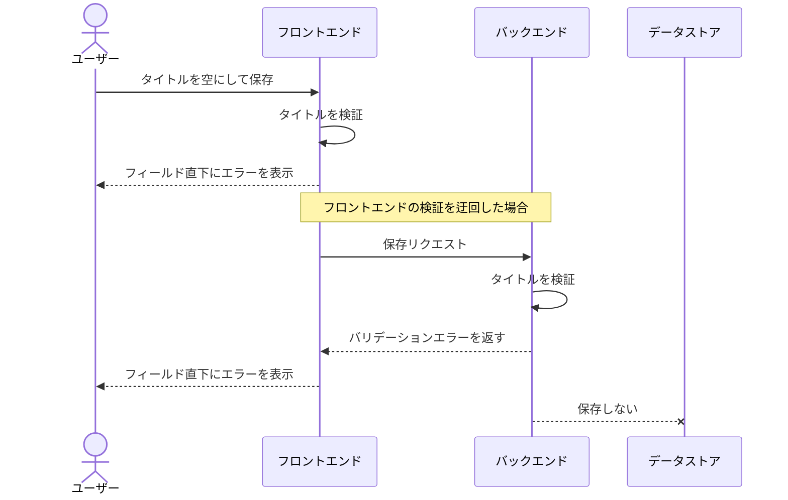

# タスク編集

現状の実装から起こした単一 UC。
タイトルの検証はフロントエンドとバックエンドの両方で行う（エスカレーションの決定に基づく）。

## 正常シナリオ

### 期待値

- 一覧に編集後のタイトルと本文が表示されている
- バックエンドの検証を通過した内容だけが保存されている

## 異常シナリオ（タイトルが不正）

フロントエンドの検証を迂回してリクエストが届いた場合でも、バックエンドがタイトルを検証して保存を拒否する。

### セットアップ

- 編集対象のタスクが 1 件存在する
- ユーザーがそのタスクの編集画面を開いている

### フロー

### 期待値

- バックエンドがバリデーションエラーを返す
- タスクの内容が更新されていない
- 一覧に編集前のタイトルと本文が表示されている
