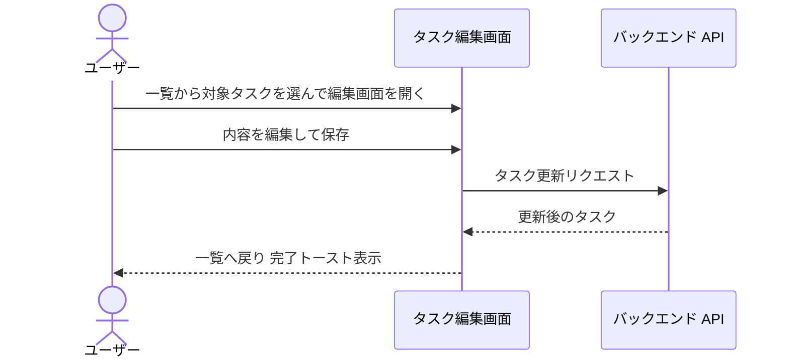
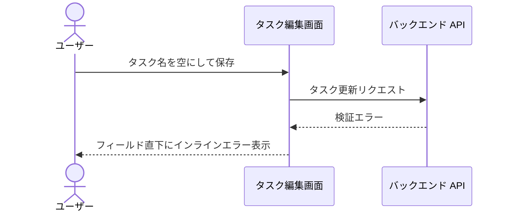

# タスク編集

一覧から選択したタスクの内容を編集して保存する単一ユースケース。

## 正常シナリオ

### セットアップ

| セットアップ | 説明 | 補足 |
| --- | --- | --- |
| Mock | なし（実環境で実行） | - |
| タスク | 編集対象のタスクを 1 件登録済み | - |

### フロー

### 期待値

- 一覧に編集後の内容が表示されている

## 異常シナリオ（タスク名が空）

### セットアップ

| セットアップ | 説明 | 補足 |
| --- | --- | --- |
| Mock | なし（実環境で実行） | - |
| 入力 | タスク名を空にして保存 | 検証失敗を決定的に誘発 |

### フロー

### 期待値

- インラインエラーが表示され、保存されていない
