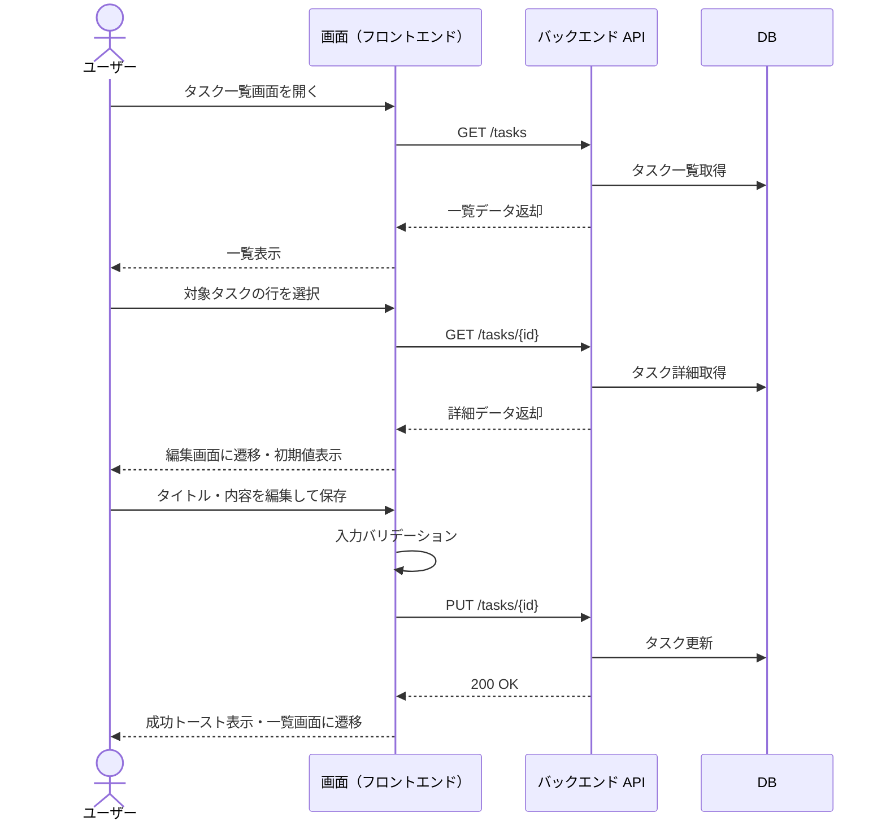
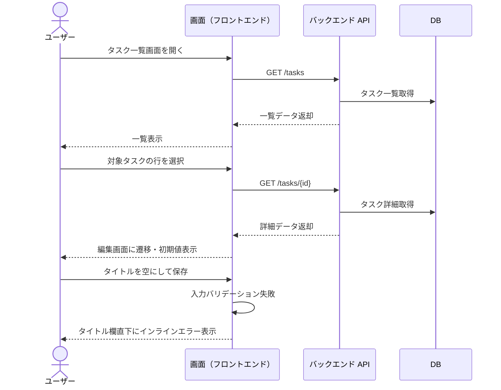

# タスク編集

ログイン中ユーザーが一覧からタスクを選択し、内容を編集して保存する単一ユースケース。

- 対応テストファイル: `tests/e2e/単一ユースケース/task_edit.spec.ts`

## 正常シナリオ

### セットアップ

| セットアップ | 説明 | 補足 |
| --- | --- | --- |
| Mock | なし（実環境で実行） | - |
| `createUser` | ログイン中ユーザー A | - |
| `createTask` | userA が所有する編集対象タスク | `title: "元タイトル"` |

### フロー

### 期待値

- 一覧画面に編集後のタイトル・内容が反映されている
- DB の該当タスクレコードが編集後の値になっている
- 成功トーストが 3 秒間表示された後に消える

## 異常シナリオ（タイトル未入力での保存試行）

### セットアップ

| セットアップ | 説明 | 補足 |
| --- | --- | --- |
| Mock | なし（実環境で実行） | - |
| `createUser` | ログイン中ユーザー A | - |
| `createTask` | userA が所有する編集対象タスク | `title: "元タイトル"` |

### フロー

### 期待値

- タイトル欄直下にインラインエラーが表示されている
- 編集画面のまま留まり、一覧画面に遷移していない
- DB の該当タスクレコードの `title` が編集前の値のまま
