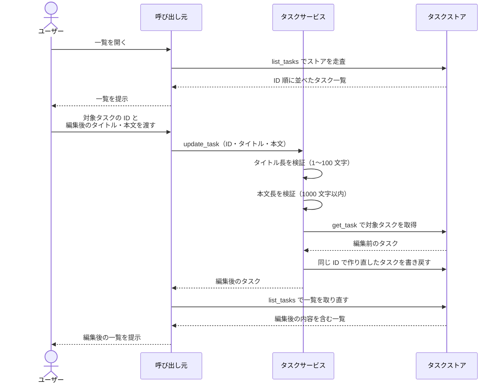
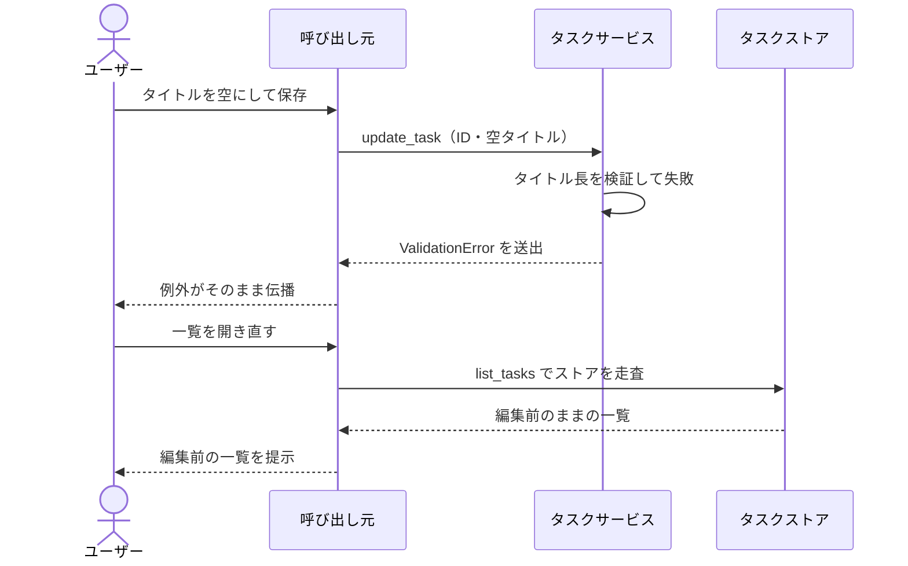
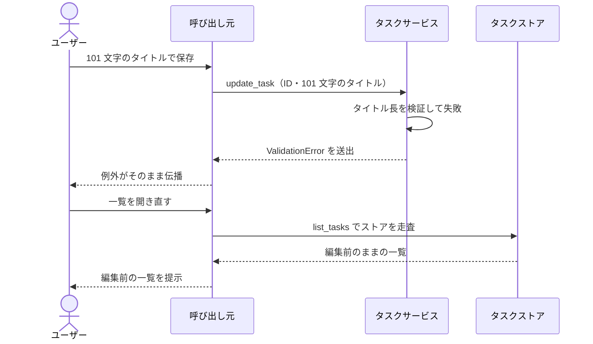
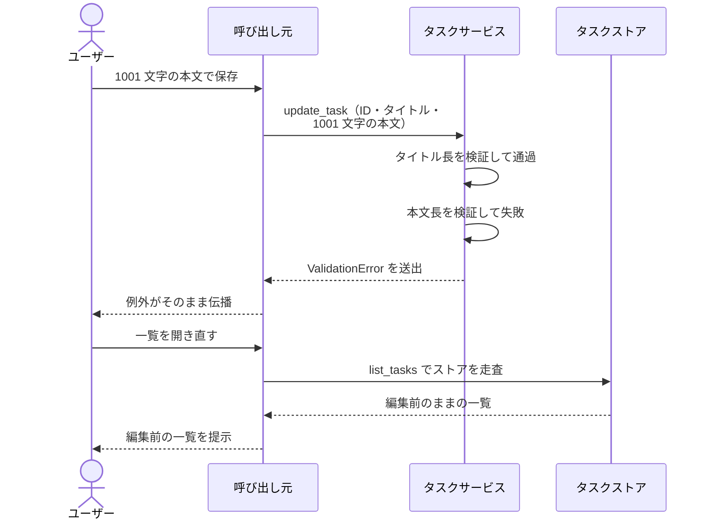
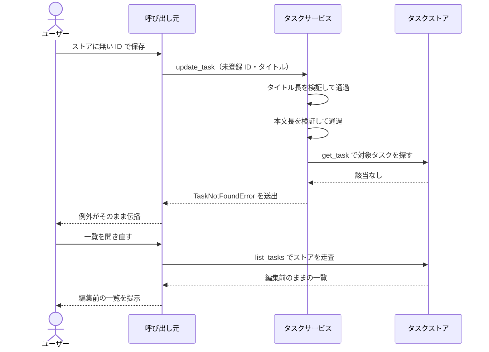

# タスク編集

登録済みタスクのタイトルと本文を書き換えて保存する単一ユースケース。

- 対応テストファイル: `tests/e2e/単一ユースケース/test_タスク編集.py`

## 正常シナリオ

### セットアップ

| セットアップ | 説明 | 補足 |
| --- | --- | --- |
| Mock | なし（実環境で実行） | - |
| タスクストア | 編集対象のタスクを 1 件登録済みのストア | `Task(id="t1", title="旧タイトル", content="旧本文")` |

### フロー

### 期待値

- `update_task` の戻り値のタイトルと本文が編集後の値になっている
- `list_tasks` の結果に編集後のタイトルと本文が並んでいる
- 編集後のタスクの ID が編集前と同じ

## 異常シナリオ（タイトルが空）

### セットアップ

| セットアップ | 説明 | 補足 |
| --- | --- | --- |
| Mock | なし（実環境で実行） | - |
| タスクストア | 編集対象のタスクを 1 件登録済みのストア | `Task(id="t1", title="旧タイトル", content="旧本文")` |
| 入力 | タイトルを空にして保存 | `title=""`（下限 1 文字を下回らせて検証失敗を誘発） |

### フロー

### 期待値

- `ValidationError` が送出される
- `list_tasks` の結果が編集前のタイトルと本文のまま

## 異常シナリオ（タイトルが上限超過）

### セットアップ

| セットアップ | 説明 | 補足 |
| --- | --- | --- |
| Mock | なし（実環境で実行） | - |
| タスクストア | 編集対象のタスクを 1 件登録済みのストア | `Task(id="t1", title="旧タイトル", content="旧本文")` |
| 入力 | 101 文字のタイトルで保存 | 上限 100 文字を 1 文字超えさせて検証失敗を誘発 |

### フロー

### 期待値

- `ValidationError` が送出される
- `list_tasks` の結果が編集前のタイトルと本文のまま

## 異常シナリオ（本文が上限超過）

### セットアップ

| セットアップ | 説明 | 補足 |
| --- | --- | --- |
| Mock | なし（実環境で実行） | - |
| タスクストア | 編集対象のタスクを 1 件登録済みのストア | `Task(id="t1", title="旧タイトル", content="旧本文")` |
| 入力 | タイトルは妥当・本文を 1001 文字にして保存 | 上限 1000 文字を 1 文字超えさせて検証失敗を誘発 |

### フロー

### 期待値

- `ValidationError` が送出される
- `list_tasks` の結果が編集前のタイトルと本文のまま

## 異常シナリオ（対象タスクが存在しない）

### セットアップ

| セットアップ | 説明 | 補足 |
| --- | --- | --- |
| Mock | なし（実環境で実行） | - |
| タスクストア | 編集対象のタスクを 1 件登録済みのストア | `Task(id="t1", title="旧タイトル", content="旧本文")` |
| 入力 | ストアに無い ID・妥当なタイトルで保存 | `task_id="missing"`（検証を通過させて存在確認まで到達させる） |

### フロー

### 期待値

- `TaskNotFoundError` が送出される
- `list_tasks` の結果が編集前のタイトルと本文のまま
