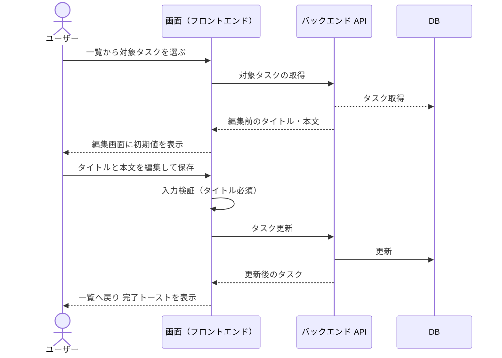
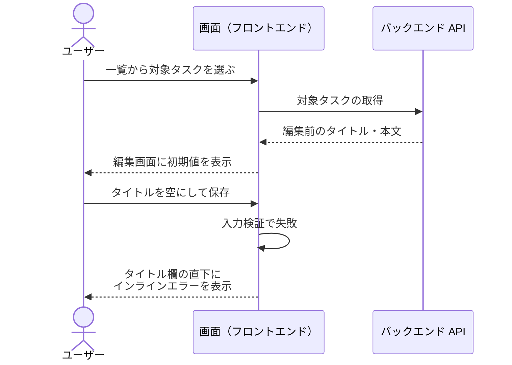

# タスク編集

一覧から選んだタスクの内容を編集して保存する単一ユースケース。

- 対応テストファイル: `tests/e2e/単一ユースケース/test_タスク編集.py`

## 正常シナリオ

### セットアップ

| セットアップ | 説明 | 補足 |
| --- | --- | --- |
| Mock | なし（実環境で実行） | - |
| タスク | 一覧に表示される編集対象のタスクを 1 件登録済み | タイトル・本文とも初期値あり |

### フロー

### 期待値

- 一覧に編集後のタイトルと本文が表示されている
- 完了トーストが表示されている
- 保存されたタスクのタイトル・本文が編集後の値になっている

## 異常シナリオ（タイトルが空）

### セットアップ

| セットアップ | 説明 | 補足 |
| --- | --- | --- |
| Mock | なし（実環境で実行） | - |
| タスク | 一覧に表示される編集対象のタスクを 1 件登録済み | - |
| 入力 | タイトルを空にして保存 | 検証失敗を決定的に誘発 |

### フロー

### 期待値

- タイトル欄の直下にインラインエラーが表示されている
- 一覧のタスクが編集前のタイトル・本文のまま変わっていない
