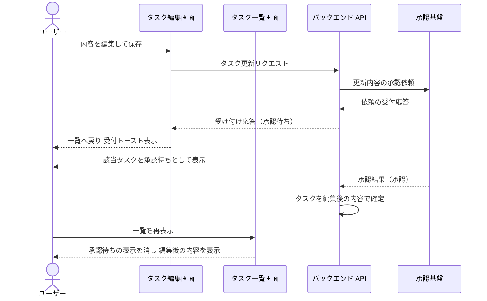
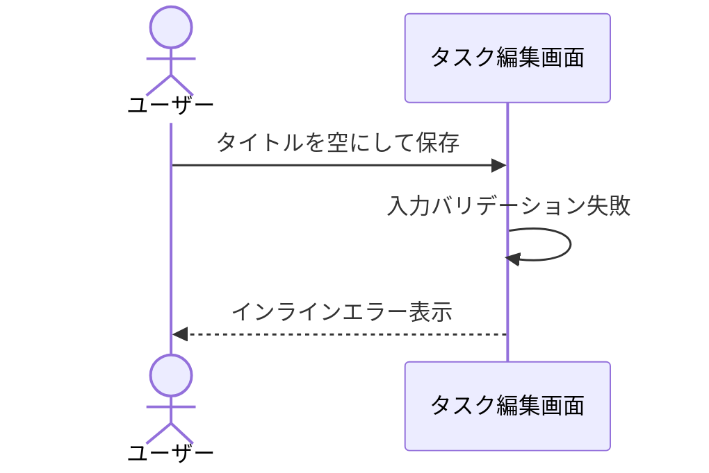
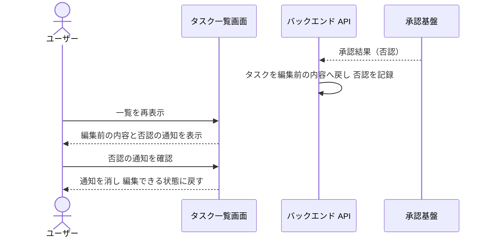
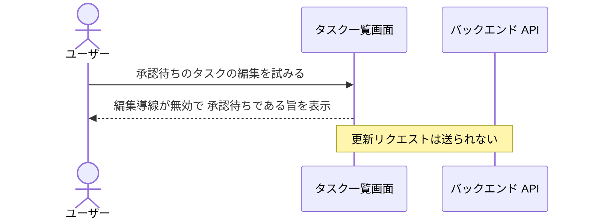

# タスク編集

一覧から選択したタスクの内容を編集して保存する単一ユースケース。
保存操作は更新の受け付けで完了し、外部の承認基盤から結果が返った時点で内容が確定する。

## 正常シナリオ

### セットアップ

| セットアップ | 説明 | 補足 |
| --- | --- | --- |
| Mock | 承認基盤（承認結果を任意のタイミングで返すスタブ） | 非同期の応答を決定的に起こすため |
| タスク | 編集対象のタスクを 1 件登録済み | 承認済みの状態 |

### フロー

### 期待値

- 保存直後の一覧に、編集後の内容が承認待ちとして表示されている
- 承認待ちの間は該当タスクの編集導線が無効になっている
- 承認結果が返った後の一覧では承認待ちの表示が消え、編集後の内容が確定して表示されている

## 異常シナリオ（タイトルが空）

### セットアップ

| セットアップ | 説明 | 補足 |
| --- | --- | --- |
| Mock | なし（実環境で実行） | - |
| 入力 | タイトルを空にして保存 | 検証失敗を決定的に誘発 |

### フロー

### 期待値

- インラインエラーが表示され、保存されていない

## 異常シナリオ（承認が否認される）

### セットアップ

| セットアップ | 説明 | 補足 |
| --- | --- | --- |
| Mock | 承認基盤（否認の結果を返すスタブ） | 否認を決定的に誘発 |
| タスク | 編集対象のタスクを 1 件登録済み | 承認済みの状態 |
| 操作 | 内容を編集して保存済み | 承認待ちの状態から開始 |

### フロー

### 期待値

- 一覧の該当タスクが編集前の内容に戻っている
- 一覧の該当タスクに否認の通知が表示されている
- 通知を確認すると通知が消え、該当タスクを再び編集できる

## 異常シナリオ（承認待ちのタスクを再度編集）

### セットアップ

| セットアップ | 説明 | 補足 |
| --- | --- | --- |
| Mock | 承認基盤（結果を返さないスタブ） | 承認待ちの状態を保持 |
| タスク | 編集対象のタスクを 1 件登録済み | 承認済みの状態 |
| 操作 | 内容を編集して保存済み | 承認待ちの状態から開始 |

### フロー

### 期待値

- 編集導線が無効で、承認待ちである旨が表示される
- 承認基盤へ二重の承認依頼が送られていない
