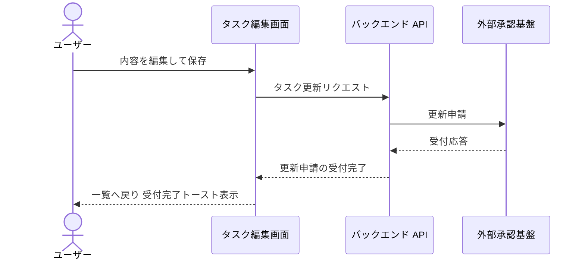
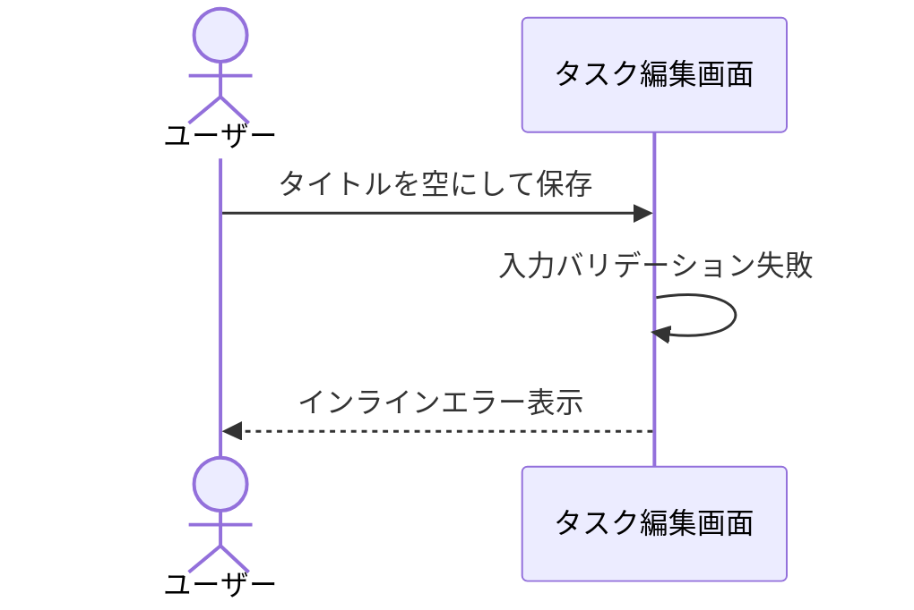
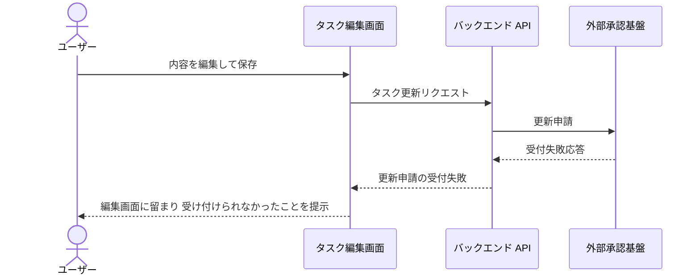

# タスク編集

一覧から選択したタスクの内容を編集して更新申請する単一ユースケース。
更新の確定は外部承認基盤から非同期で返るため、更新申請の受付完了までを本ユースケースの範囲とする。

## 正常シナリオ

### セットアップ

| セットアップ | 説明 | 補足 |
| --- | --- | --- |
| Mock | 外部承認基盤（申請の受付応答のみ返す） | 承認結果の非同期通知は本ユースケースのスコープ外のため Mock でも扱わない |
| タスク | 編集対象のタスクを 1 件登録済み | - |

### フロー

### 期待値

- 編集画面から一覧へ戻っている
- 一覧の対象タスクが更新申請の受付済みとして表示されている

## 異常シナリオ（タイトルが空）

### セットアップ

| セットアップ | 説明 | 補足 |
| --- | --- | --- |
| Mock | なし（実環境で実行） | - |
| 入力 | タイトルを空にして保存 | 検証失敗を決定的に誘発 |

### フロー

### 期待値

- インラインエラーが表示され、保存されていない

## 異常シナリオ（更新申請が受け付けられない）

外部承認基盤が更新申請を受け付けられなかった場合のシナリオ。
承認基盤が応答しない場合と受付を拒否する場合は、ユーザーから見た結末が同じためケースを分けない。

### セットアップ

| セットアップ | 説明 | 補足 |
| --- | --- | --- |
| Mock | 外部承認基盤（申請の受付に失敗する応答を返す） | 正常シナリオの受付応答に対して、本シナリオでは受付失敗を返す設定にする |
| タスク | 編集対象のタスクを 1 件登録済み | - |

### フロー

### 期待値

- 編集画面に留まっている
- 更新申請を受け付けられなかったことが分かる表示がある
- 再試行の導線がある
