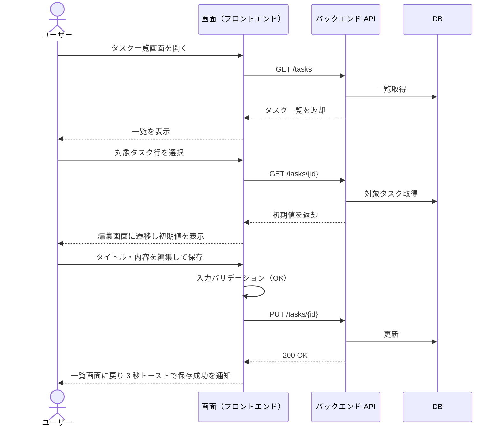
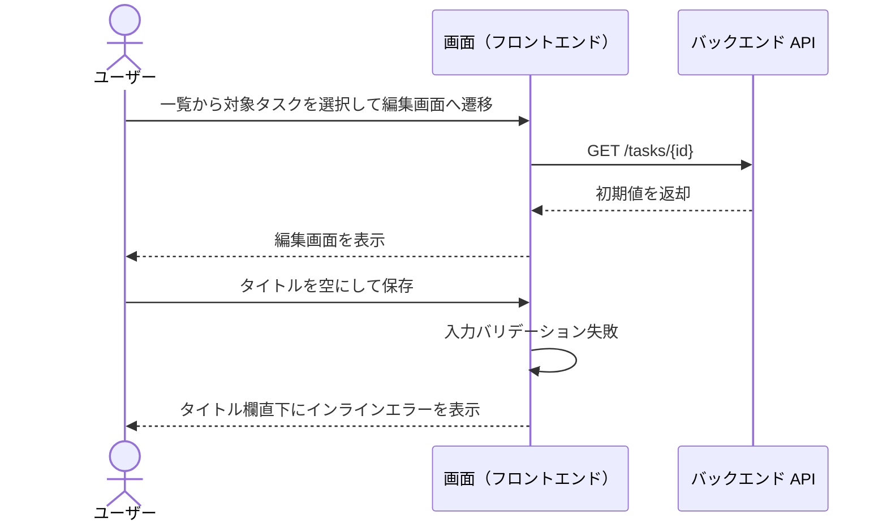
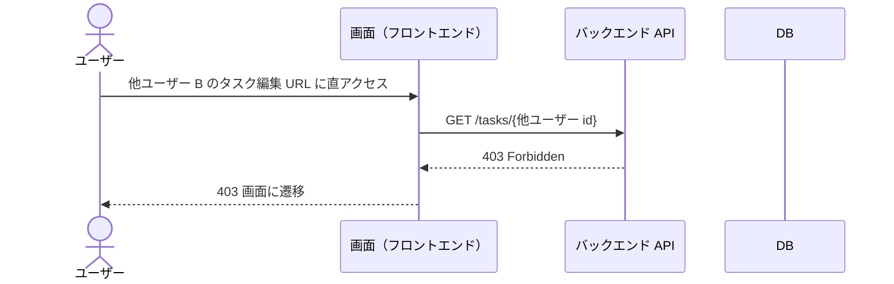

# タスク編集

ログイン中ユーザーが一覧からタスクを選択し、内容を編集して保存する単一ユースケース。

- 対応テストファイル: `tests/e2e/単一ユースケース/タスク編集.spec.ts`

## 正常シナリオ

### セットアップ

| セットアップ | 説明 | 補足 |
| --- | --- | --- |
| Mock | なし（実環境で実行） | - |
| `createUser` | ログイン中ユーザー A | - |
| `createTask` | userA が所有する編集対象タスク | `title: 旧タイトル` |

### フロー

### 期待値

- 一覧画面の対象行が編集後の内容で表示されている
- DB の該当タスクレコードが編集後の値になっている
- 保存成功トーストが表示され、3 秒後に自動的に消える

## 異常シナリオ（必須フィールド未入力）

### セットアップ

| セットアップ | 説明 | 補足 |
| --- | --- | --- |
| Mock | なし（実環境で実行） | - |
| `createUser` | ログイン中ユーザー A | - |
| `createTask` | userA が所有する編集対象タスク | `title: 旧タイトル` |

### フロー

### 期待値

- タイトルフィールド直下にインラインエラー（必須メッセージ）が表示されている
- 保存 API（PUT /tasks/｛id｝）は呼ばれていない
- DB の該当タスクレコードが編集前の値のまま
- 保存成功トーストは表示されない

## 異常シナリオ（他ユーザー所有タスクの編集を試みる）

### セットアップ

| セットアップ | 説明 | 補足 |
| --- | --- | --- |
| Mock | なし（実環境で実行） | - |
| `createUser` | ログイン中ユーザー A | - |
| `createUser` | 他人ユーザー B | - |
| `createTask` | userB が所有するタスク | 編集対象外 |

### フロー

### 期待値

- 403 画面が表示されている
- DB の userB 所有タスクレコードが変更されていない
