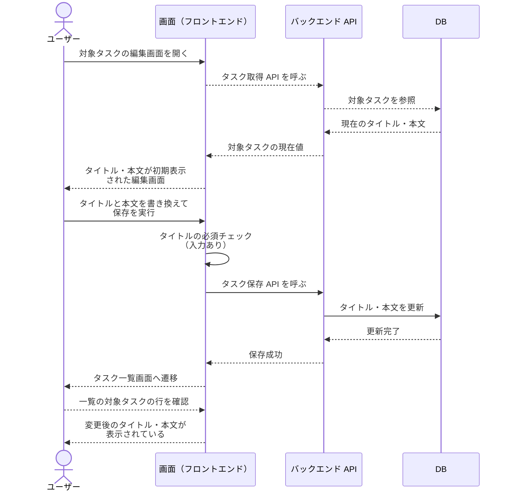
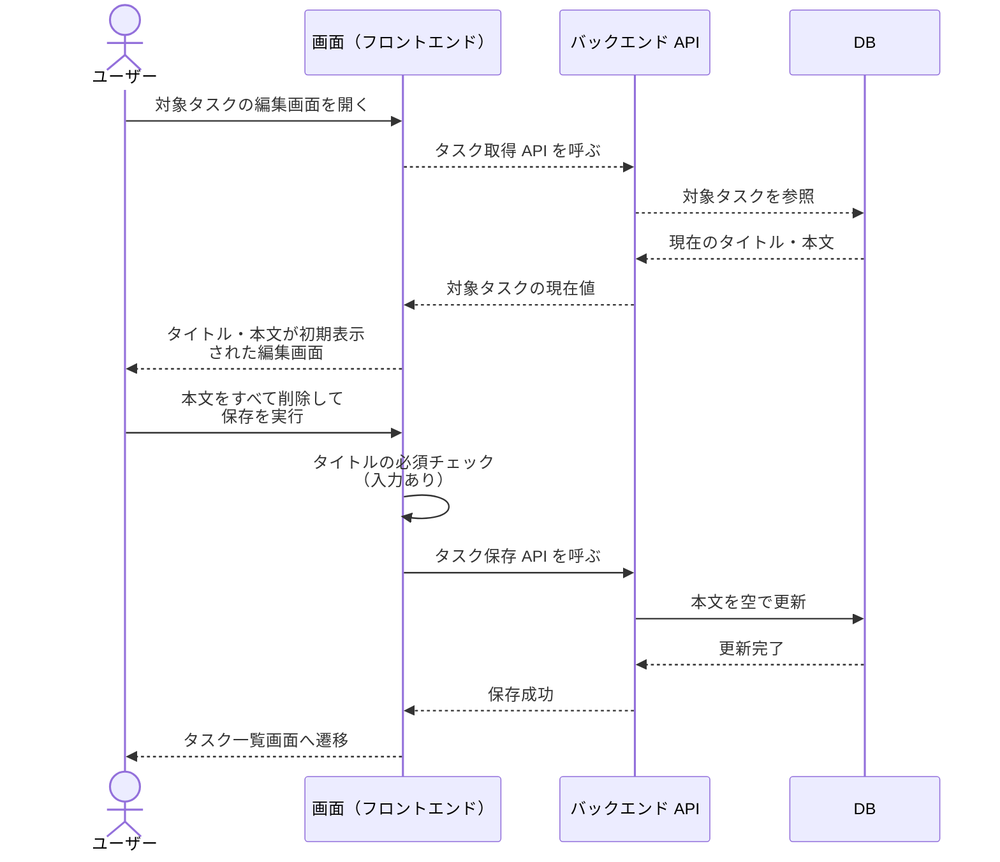
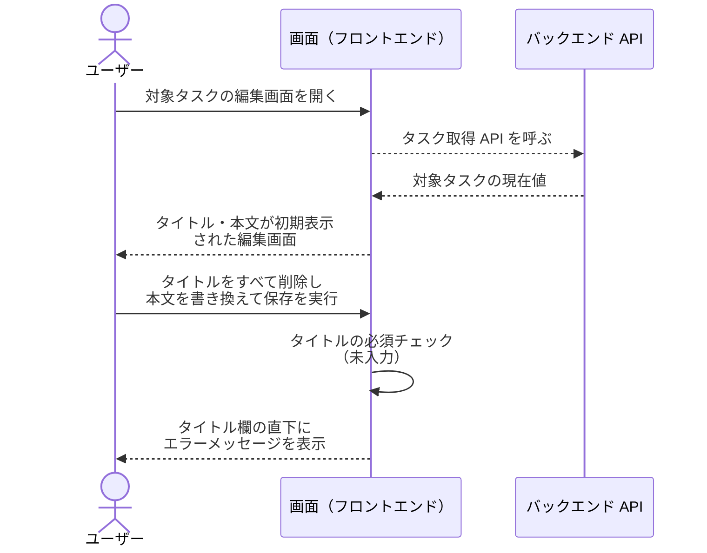

# タスク編集

タスク一覧画面から遷移した編集画面で、既存タスクのタイトル・本文を変更して保存し、タスク一覧画面へ戻る単一ユースケース。

- 対応テストファイル: `tests/e2e/tasks/test_task_edit.py`

## 正常シナリオ

### セットアップ

| セットアップ | 説明 | 補足 |
| --- | --- | --- |
| Mock | なし（実環境で実行） | - |
| `createUser` | ログイン中ユーザー A | - |
| `createTask` | userA が所有する編集対象のタスク | タイトル・本文とも初期値を入れておく |

### フロー

### 期待値

- タスク一覧画面が表示されている
- タスク一覧画面の対象タスクの行に、変更後のタイトル・本文が表示されている
- 対象タスクのタイトル・本文が変更後の値で永続化されている
- 対象タスクのタイトル・本文以外の項目は編集前の値のまま変わっていない

### 補足

- 編集画面の入力欄はタイトル・本文の 2 つだけで、他の項目を変更する手段は画面上に存在しない。
- 一覧画面から編集画面への遷移導線は #1070 の担当のため、本シナリオでは対象タスクの編集画面を開いた状態を起点として扱う。
- 保存後の戻り先となる一覧画面は、#1079（別 story・別ブランチ系列）の成果物が本 story の系列に入らないため、#1085 が最小構成で自前実装する。
  一覧の行に変更後のタイトル・本文が表示されることは、その最小構成の一覧画面で確認する。
- 保存が完了して一覧画面へ戻るまでの間に保存完了のトーストが一時表示される（採用モック `a-single-column` の挙動）。
  表示の有無は本シナリオの期待値には含めない。

## 正常シナリオ（本文を空にして保存）

### セットアップ

| セットアップ | 説明 | 補足 |
| --- | --- | --- |
| Mock | なし（実環境で実行） | - |
| `createUser` | ログイン中ユーザー A | - |
| `createTask` | userA が所有する編集対象のタスク | 本文に初期値を入れておく |

### フロー

### 期待値

- タスク一覧画面が表示されている
- 対象タスクの本文が空で永続化されている
- 対象タスクのタイトルは編集前の値のまま変わっていない

## 異常シナリオ（タイトル未入力）

### セットアップ

| セットアップ | 説明 | 補足 |
| --- | --- | --- |
| Mock | なし（実環境で実行） | - |
| `createUser` | ログイン中ユーザー A | - |
| `createTask` | userA が所有する編集対象のタスク | タイトル・本文とも初期値を入れておく |

### フロー

### 期待値

- タイトル欄の直下にエラーメッセージが表示されている
- 編集画面のままタスク一覧画面へ遷移していない
- 対象タスクのタイトル・本文が編集前の値のまま変わっていない

### 補足

- タイトルが空でも保存操作自体は実行でき、実行した時点で入力チェックが走ってインライン表示される。
  保存ボタンを非活性にする挙動は取らない。
