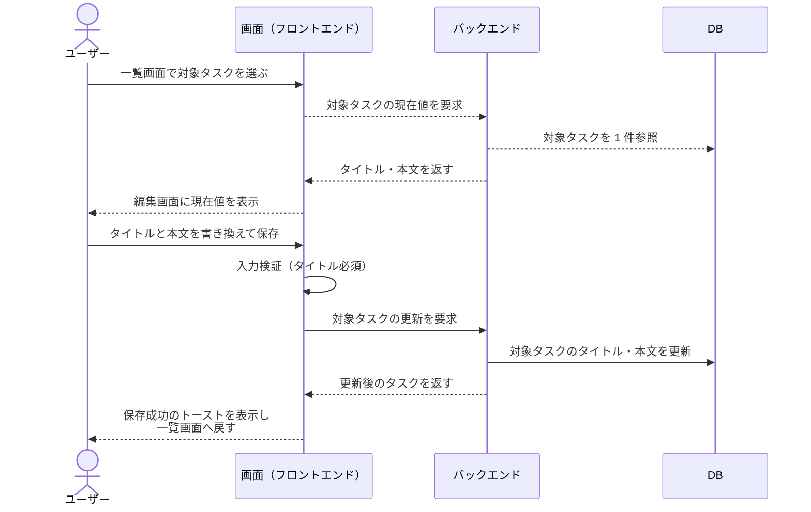
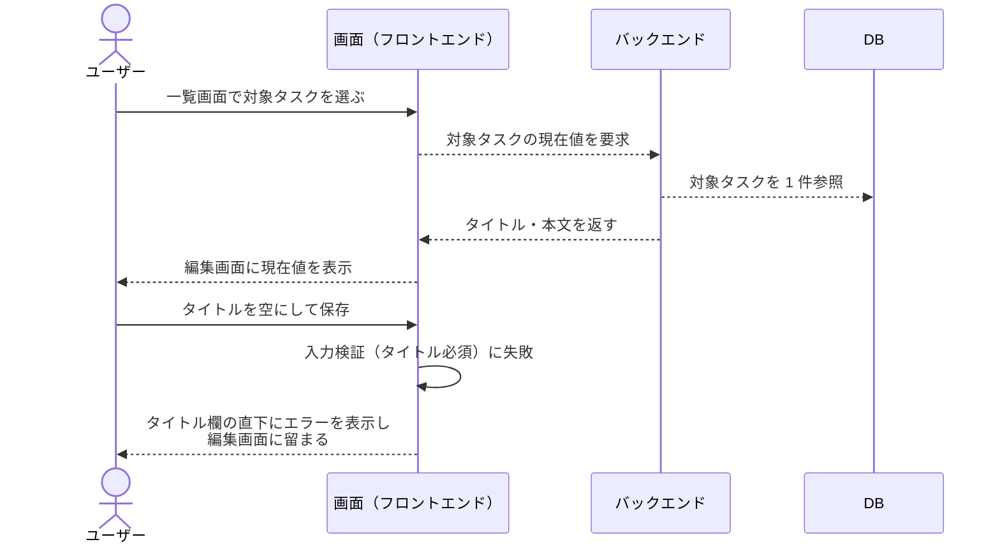

# タスク編集

現状の実装から起こした単一 UC。
一覧から選択したタスクのタイトルと本文を編集して保存する。

- 対応テストファイル: `tests/e2e/単一ユースケース/test_タスク編集.py`

## 正常シナリオ

### セットアップ

| セットアップ | 説明 | 補足 |
| --- | --- | --- |
| Mock | なし（実環境で実行） | - |
| タスク | 一覧に表示される編集対象のタスクを 1 件登録済み | タイトル・本文に編集前の値が入っている |

### フロー

### 期待値

- 一覧に編集後のタイトルと本文が表示されている
- 保存成功のトーストが表示されている
- DB の対象タスクのタイトル・本文が編集後の値になっている

## 異常シナリオ（タイトルが空）

### セットアップ

| セットアップ | 説明 | 補足 |
| --- | --- | --- |
| Mock | なし（実環境で実行） | - |
| タスク | 一覧に表示される編集対象のタスクを 1 件登録済み | タイトル・本文に編集前の値が入っている |
| 入力 | タイトルを空にして保存 | 検証失敗を決定的に誘発 |

### フロー

### 期待値

- タイトル欄の直下に入力エラーが表示され、編集画面に留まっている
- 保存成功のトーストが表示されていない
- DB の対象タスクのタイトル・本文が編集前の値のまま変わっていない
