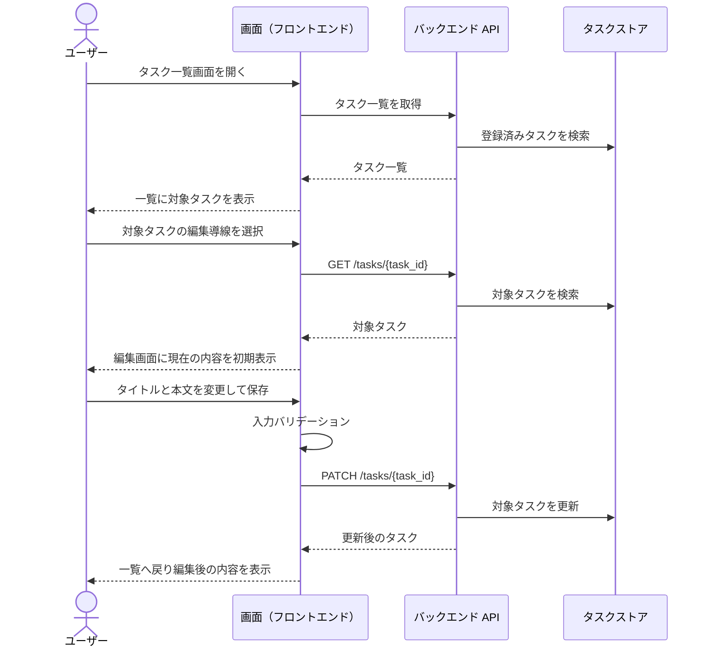
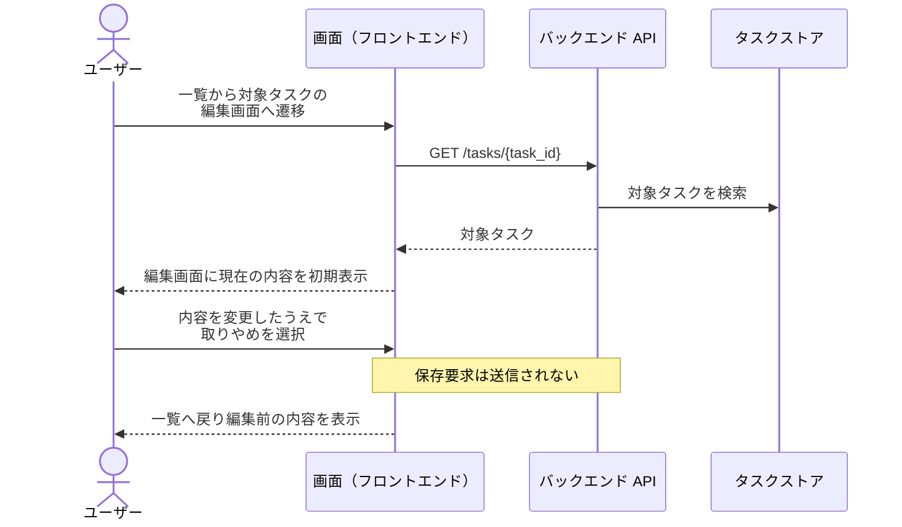
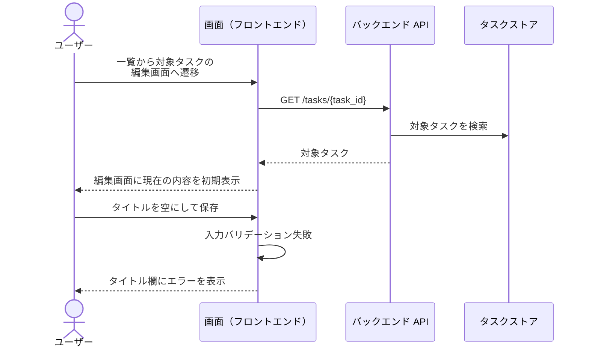
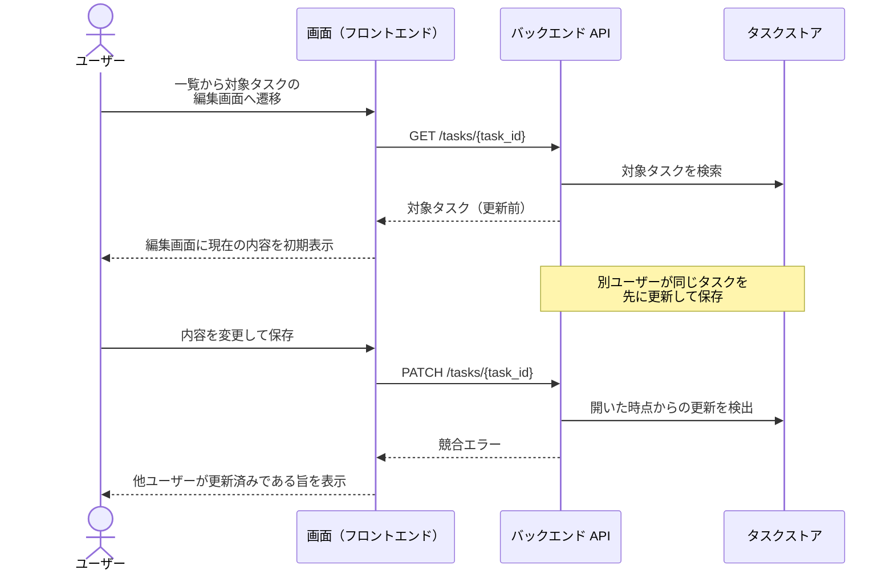

# タスク編集

タスク一覧から選んだ既存タスクの内容を編集して保存する単一ユースケース。
編集の取りやめ・入力不備・他ユーザーとの競合までを本ファイルに集約する。

- 対応テストファイル: `tests/e2e/単一ユースケース/test_task_edit.py`

## 正常シナリオ

### セットアップ

| セットアップ | 説明 | 補足 |
| --- | --- | --- |
| Mock | なし（実環境で実行） | - |
| `createTask` | 一覧に表示される編集対象のタスク | `title: 初期タイトル` / `content: 初期本文` |

### フロー

### 期待値

- 一覧画面に編集後のタイトルと本文が表示されている
- タスクストアの該当タスクが編集後の値になっている

### 補足

- 保存は既存の `PATCH /tasks/{task_id}` を利用する（epic #557 の横断要件「保存時は既存 API を利用する」）。
- 編集画面の初期表示は、一覧で選択したタスクの登録済みの値をそのまま表示する。

## 正常シナリオ（編集を取りやめる）

### セットアップ

| セットアップ | 説明 | 補足 |
| --- | --- | --- |
| Mock | なし（実環境で実行） | - |
| `createTask` | 一覧に表示される編集対象のタスク | `title: 初期タイトル` / `content: 初期本文` |

### フロー

### 期待値

- 一覧画面に編集前のタイトルと本文が表示されている
- タスクストアの該当タスクが編集前の値のままになっている

## 異常シナリオ（タイトルが空）

### セットアップ

| セットアップ | 説明 | 補足 |
| --- | --- | --- |
| Mock | なし（実環境で実行） | - |
| `createTask` | 一覧に表示される編集対象のタスク | `title: 初期タイトル` / `content: 初期本文` |
| 入力 | タイトルを空にして保存 | 検証失敗を決定的に誘発 |

### フロー

### 期待値

- タイトル入力欄にエラーが表示され、編集画面にとどまっている
- タスクストアの該当タスクが編集前の値のままになっている

### 補足

- タイトルは 1 文字以上 100 文字以内が制約（`設計図/バックエンド結合/タスク更新.py.md`）。
  代表として空文字を扱い、文字数超過は結合ドキュメント側でカバーする。

## 異常シナリオ（同時編集競合）

### セットアップ

| セットアップ | 説明 | 補足 |
| --- | --- | --- |
| Mock | なし（実環境で実行） | - |
| `createTask` | 一覧に表示される編集対象のタスク | `title: 初期タイトル` / `content: 初期本文` |
| 別ユーザーの保存 | 編集画面を開いた後、同じタスクを別ユーザーが先に更新済みにする | 競合を決定的に誘発 |

### フロー

### 期待値

- 編集画面に競合エラー（他ユーザーが更新済みである旨）が表示されている
- タスクストアの該当タスクが別ユーザーの更新内容のままで、こちらの変更は保存されていない

### 補足

- 本シナリオは複合ユースケース `タスク編集から他ユーザー編集` の異常シナリオ（同時編集競合）から参照される。
- 現行の `PATCH /tasks/{task_id}` には競合を検出する仕組みがないため、実現には更新日時等を用いた競合検出の追加が必要。
