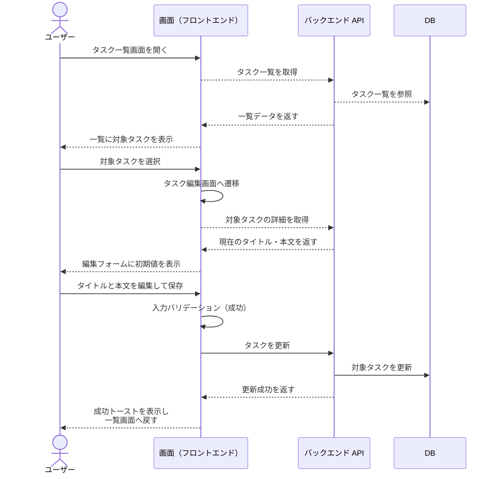
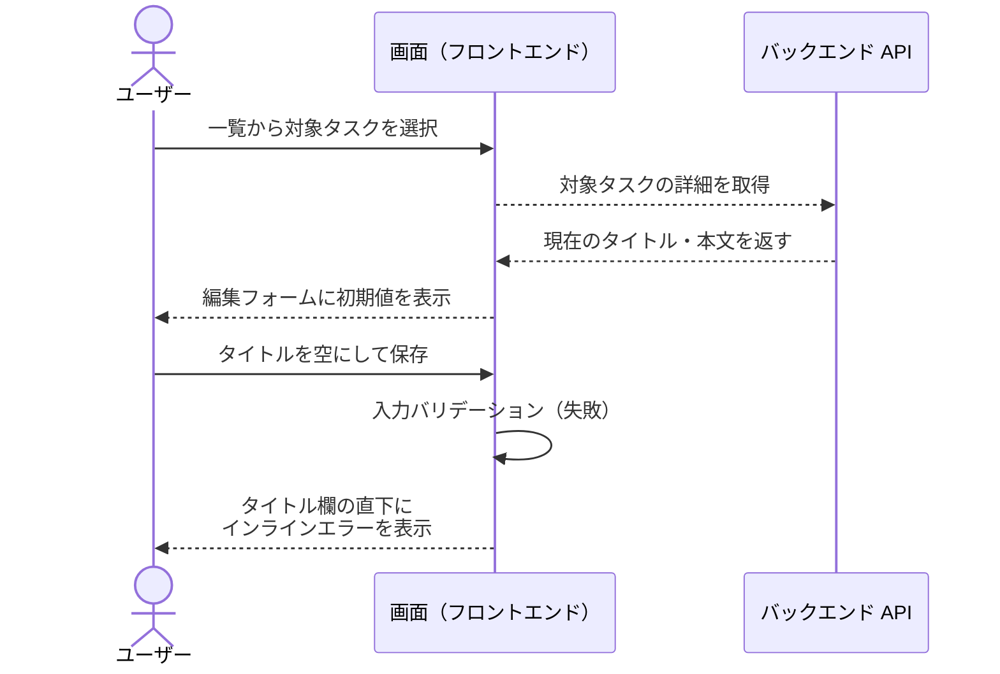

# タスク編集

ユーザーが一覧からタスクを選択し、内容を編集して保存する単一ユースケース。

- 対応テストファイル: `tests/e2e/単一ユースケース/task_edit.spec.ts`

## 正常シナリオ

### セットアップ

| セットアップ | 説明 | 補足 |
| --- | --- | --- |
| Mock | なし（実環境で実行） | - |
| `createUser` | ログイン中ユーザー A | - |
| `createTask` | userA が所有する編集対象タスク | タイトル・本文とも入力済み |

### フロー

### 期待値

- 一覧画面に編集後のタイトルと本文が表示されている
- 保存成功のトーストが表示され、3 秒後に消える
- DB の対象タスクレコードが編集後の値になっている

## 異常シナリオ（必須項目を空にして保存）

### セットアップ

| セットアップ | 説明 | 補足 |
| --- | --- | --- |
| Mock | なし（実環境で実行） | - |
| `createUser` | ログイン中ユーザー A | - |
| `createTask` | userA が所有する編集対象タスク | タイトル・本文とも入力済み |

### フロー

### 期待値

- タイトル入力欄の直下にインラインエラーが表示されている
- 編集画面にとどまり、一覧画面へ遷移していない
- DB の対象タスクレコードが編集前の値のまま
